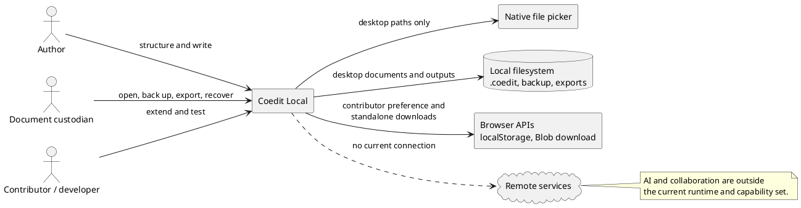
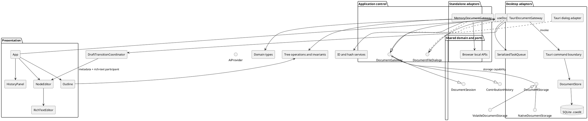
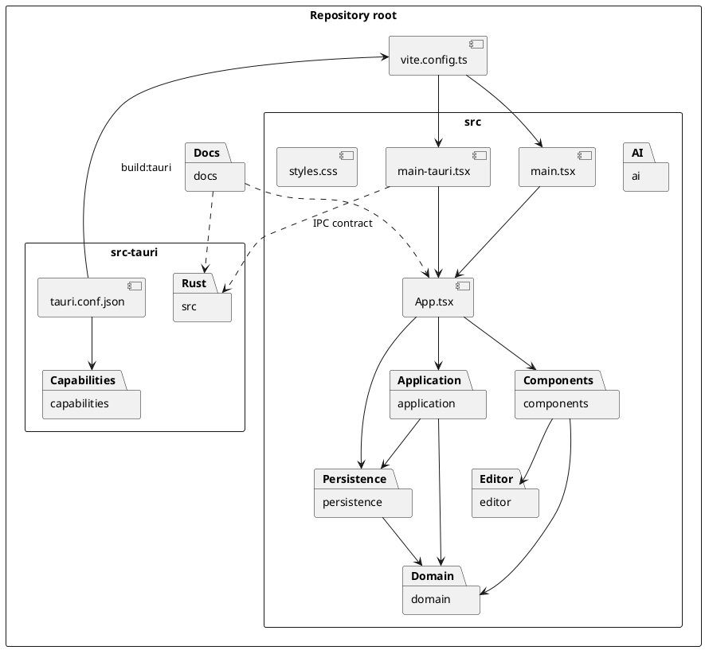
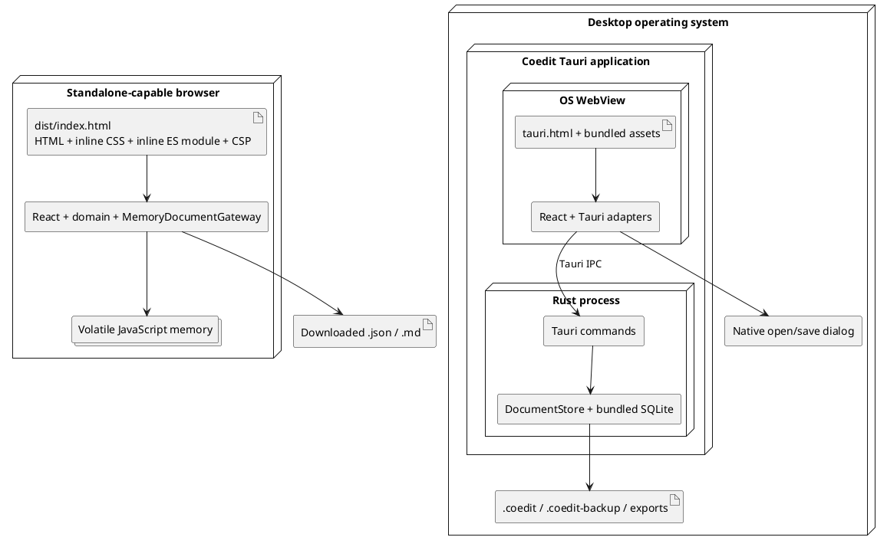

# Software architecture description

This is the RUP Software Architecture Document for the current Coedit Local implementation. It uses the 4+1 view model: logical, process, development, physical, and use-case/scenario views. Detailed class and data models live in [Frontend design](./FRONTEND_DESIGN.md) and [Persistence design](./PERSISTENCE_DESIGN.md); runtime realizations live in [Sequence diagrams](./SEQUENCE_DIAGRAMS.md).

## 1. Architectural scope

Coedit Local is a local-first hierarchical writing editor. The same React/TypeScript UI is composed with one of two persistence hosts:

- **Standalone HTML**: a self-contained, double-clickable `dist/index.html` using an in-memory TypeScript gateway. It needs neither Tauri nor a server, but its document is volatile.
- **Tauri desktop**: an installed/native application using the operating system WebView for the UI and a Rust process for SQLite persistence, file validation, backup, and export.

Tauri is an application shell, not a web backend. It packages web UI assets into a desktop program, exposes deliberately registered Rust commands over inter-process communication (IPC), and supplies native capabilities such as file dialogs. Production Coedit does not listen on `127.0.0.1`; loopback HTTP belongs only to the Vite development workflow.

### Architectural drivers

| Driver | Current architectural response |
|---|---|
| Private/offline use | No HTTP client or sync provider is registered; restrictive CSP and Tauri capabilities |
| One portable desktop document | SQLite format with a fixed application ID, schema version, current state, ledger, and snapshots |
| Attributable mutation history | All normal state changes are represented as `DocumentOperation` plus `ContributionContext` |
| Debuggable UI without native tooling | Explicit browser composition root and a single-file `file://` build |
| Cross-platform desktop source | React UI plus Tauri/Rust/rusqlite with bundled SQLite |
| Safe rich text | DOMPurify at the editor boundary and Ammonia at the desktop persistence boundary |
| Future hosts/features | Injected capability-oriented gateway/dialog ports; provider-neutral AI interface |
| Recoverable failure | SQLite full-synchronous transactions, snapshots, atomic export/copy helpers, recovery warning |
| Predictable UI lifecycle | Host-neutral application controller, serialized command queue, revision/epoch guards, and an awaitable draft-transition contract |

### System constraints

- Document format is currently version `1`; no migration framework exists.
- Only one document is held by a Tauri process at a time.
- Standalone storage lasts only for the page lifetime.
- TypeScript and Rust contracts are manually mirrored; no generated IPC schema exists.
- AI, remote synchronization, attachment workflows, and contributor management are not active features.

### Staged architecture boundary

The current hardening program is intentionally divided so current claims remain auditable:

| Pass | Scope | Status |
|---|---|---|
| 1 — standalone-first | Application controller/queue, synchronous draft freeze plus awaitable metadata/rich-text drains, discriminated storage capabilities, cursor-paged memory history, complete runtime recovery envelope, centralized export/filename/sanitizer contracts, browser hash/sanitizer fixtures | Implemented in the current worktree; standalone verification is the focus |
| 2 — Rust/Tauri parity and hardening | Rust conformance to versioned fixtures, indexed store-side cursor filtering, Rust-owned file authorization/path security, minimized permissions, versioned migrations, measured snapshot compaction, native/platform tests | Deferred; existing Tauri adapter compatibility is not proof of completion |
| 3 — dormant-feature decisions | AI, attachments, `restoreNode`, session lifecycle, contribution grouping, and generic metadata: finish, reserve, migrate, or remove explicitly | Deferred product/format decision |

No pass-2 or pass-3 item should be inferred as implemented from a type, schema table, Tauri icon, or compatibility shim.

## 2. System context



Trust boundaries and hostile-input assumptions are specified in [Security](./SECURITY.md). The `.coedit` representation and recovery policy are specified in [Document format](./DOCUMENT_FORMAT.md).

## 3. Logical view

The design is a small ports-and-adapters architecture. UI components depend on domain contracts and injected ports. Host-specific code is selected at an entry point, not detected inside shared components.



### Composition roots

| Host | HTML entry | TypeScript entry | Injected dependencies | Output |
|---|---|---|---|---|
| Standalone | [`index.html`](../index.html) | [`src/main.tsx`](../src/main.tsx) | `MemoryDocumentGateway` | one inlined `dist/index.html` |
| Tauri desktop | [`tauri.html`](../tauri.html) | [`src/main-tauri.tsx`](../src/main-tauri.tsx) | `TauriDocumentGateway`, `tauriFileDialogs` | WebView assets inside native package |

[`App`](../src/App.tsx) has no Tauri import. This is the main separation-of-concerns rule: a new host supplies adapters at a new composition root instead of adding environment detection to the UI.

### Dependency direction

```text
entry point -> App/components -> domain contracts + ports
                                  ^
                                  |
                         host adapter implementation
```

The Rust store is not imported into the TypeScript build. `TauriDocumentGateway` translates port calls into command names; the Tauri runtime serializes camel-case JSON payloads to the mirrored Rust models.

### Principal domain concepts

- A `DocumentView` is the complete materialized document state plus host path/read-only/recovery fields.
- A `DocumentNode` is a stable-ID tree node with metadata, sanitized rendered HTML, a complete Base64 Yjs state, and a soft-deletion timestamp.
- A `DocumentOperation` is a discriminated mutation command.
- A `Contribution` attributes one committed revision to a contributor and optional session/group/message, and records a resulting state hash.
- A snapshot stores a complete `DocumentState` at a revision. Restoration materializes an old snapshot into a new revision rather than removing later history.

### Principle of operation

1. The selected entry point constructs `App` with a host-specific `DocumentGateway` and, on desktop, a `DocumentFileDialogs` adapter.
2. `App` delegates document use cases and state ownership to `useDocumentController`, then renders either the no-document welcome state or a workspace from the controller's complete `DocumentView`.
3. A user interaction becomes a typed `DocumentOperation`; the controller adds contributor, application-lifetime session, grouping, and message context. Before a controlled transition can change or externalize the workspace, `DraftTransitionCoordinator` synchronously freezes the registered document-title and node-editor participants, then awaits their metadata and rich-text drains.
4. In standalone mode, the memory adapter applies the pure TypeScript mutation, hashes it, and appends in-memory contribution/snapshot records. In desktop mode, the Tauri adapter invokes a Rust command and `DocumentStore` performs the equivalent validated SQLite transaction.
5. `SerializedTaskQueue` executes document commands one at a time and continues after a rejected task. Workspace epochs, monotonically numbered history requests, and revision checks prevent late responses from replacing a newer workspace/view.
6. The gateway returns a complete new view. The controller accepts it and re-renders the outline/editor. If History is open it refreshes the first 100-entry page under the active filters; otherwise it marks history stale and fetches when the panel is next opened. `ContributionPage.nextBeforeRevision` drives exclusive-cursor loading of older entries.
7. Rich text is the special high-frequency path: Tiptap changes a Yjs document; the editor waits for 1.2 seconds of inactivity, sanitizes HTML through the centralized `coedit-rich-text-v1` policy, and emits one grouped `updateContent` operation with incremental and complete Yjs encodings. An explicit flush cancels the timer, drains updates (including updates arriving during the drain), and preserves a failed delta for retry.
8. Restore loads a stored revision but writes it as a new current revision. An accepted create/open/restore advances `editorGeneration`; `App` includes that generation in `NodeEditor`'s React key so an authoritative state replacement constructs a fresh `Y.Doc` even when the selected node ID is unchanged.
9. Export is host-specific: the browser produces safe-named downloads, including a versioned state-plus-complete-runtime-ledger recovery envelope; desktop output remains the Rust/Tauri responsibility.

This is a request/complete-view-response architecture. There is no runtime state stream, remote synchronization loop, or server-side session.

## 4. Process view

### Browser/WebView process

`useDocumentController` owns one current `DocumentView`, the selected node, the authoritative editor generation, accumulated history pages, cursor/filter/loading/error state, contributor/session context, command status/error state, workspace/request epochs, the serialized mutation queue, and the draft-transition registry. `App` retains welcome-form/profile persistence and renders the controller state. There is no router, global store, worker, event bus, background synchronization loop, or service container.

Tiptap and Yjs run in the UI process. Yjs updates are accumulated for a 1.2-second quiet period. A flush sends sanitized HTML, the merged incremental update, and the complete Yjs state as one queued `updateContent` operation. The gateway responds with a complete replacement `DocumentView`. History requests are intentionally outside the mutation queue; request/epoch guards discard stale responses and history failures have their own visible error state.

### Standalone execution

`MemoryDocumentGateway` holds current state, contributions, and revision snapshots in JavaScript memory. It applies the pure functions in [`src/domain/tree.ts`](../src/domain/tree.ts), hashes state with Web Crypto, and triggers JSON/Markdown downloads through Blob URLs. Closing or reloading the page discards all gateway state.

### Desktop execution

The Tauri process owns `Mutex<Option<DocumentStore>>`. Each command locks that state, so command access and the single open SQLite connection are serialized. A normal mutation runs one SQLite transaction containing:

1. optional writing-session creation;
2. validated materialized-state mutation;
3. metadata revision/timestamp update;
4. state reload and hierarchy validation;
5. SHA-256 calculation;
6. contribution insert;
7. complete snapshot insert;
8. commit.

A failure before commit rolls the entire unit back. There is no optimistic expected-revision value in the frontend request, no second writer coordinated through the application, and no remote concurrency process.

### Concurrency and lifecycle caveats

The controller serializes gateway commands. `DraftTransitionCoordinator.begin()` freezes all registered drafts synchronously, then flushes the document title, node metadata, and rich text before controlled selection, mutation, restore, export, backup, or Close; a failed flush cancels the action and leaves the workspace mounted for retry. This closes the previously documented in-app close-before-debounce and blur-only metadata races. Accepted authoritative resets also advance the editor generation, so same-node restore remounts the editor/Yjs document. Browser `beforeunload`, process termination, forced host suspension, and arbitrary React-root teardown still cannot await JavaScript promises; those residual lifecycle and verification limits are tracked in [Known limitations](./KNOWN_LIMITATIONS.md).

## 5. Development view



| Package/file | Responsibility | Detailed artifact |
|---|---|---|
| `src/App.tsx` | Presentation composition, welcome/profile UI, and user-event translation | [Frontend design](./FRONTEND_DESIGN.md) |
| `src/application/` | `useDocumentController`, serialized command queue, history paging/guards, and draft-transition coordination | [Frontend design](./FRONTEND_DESIGN.md) |
| `src/components/` | Outline, metadata editor, history presentation | [UI and UX](./UI_UX.md) |
| `src/editor/` | Tiptap/Yjs lifecycle and encoding | [Frontend design](./FRONTEND_DESIGN.md) |
| `src/domain/` | Shared TypeScript data contracts, pure tree rules, browser hashing/IDs | [Frontend design](./FRONTEND_DESIGN.md) |
| `src/persistence/` | Gateway/dialog ports and browser/Tauri adapters | [Persistence design](./PERSISTENCE_DESIGN.md) |
| `src/ai/provider.ts` | Reserved AI proposal port; no implementation | [Contributing](./CONTRIBUTING.md) |
| `src-tauri/src/models.rs` | Rust mirror of IPC/domain types | [Persistence design](./PERSISTENCE_DESIGN.md) |
| `src-tauri/src/lib.rs` | Command registration and one-document application state | [Persistence design](./PERSISTENCE_DESIGN.md) |
| `src-tauri/src/store.rs` | Schema, validation, mutation, ledger, restore, backup/export | [Persistence design](./PERSISTENCE_DESIGN.md) |
| `vite.config.ts` | Standalone inlining and Tauri frontend build split | [Build and portability](./BUILD_AND_PORTABILITY.md) |
| `src-tauri/tauri.conf.json` | Desktop build, WebView, CSP, package metadata | [Build and portability](./BUILD_AND_PORTABILITY.md) |

The feature-level and symbol-level lookup is in [Traceability](./TRACEABILITY.md).

## 6. Physical/deployment view



### Development-only topology

`corepack pnpm tauri:dev` asks Tauri to run `corepack pnpm dev`. Vite binds `127.0.0.1:1420`; the development WebView loads that URL and gains hot reload. If a development URL is launched without the Vite process, the browser correctly reports `ERR_CONNECTION_REFUSED`. Production standalone and correctly packaged Tauri artifacts load bundled files and do not need that listener.

### Platform intent versus evidence

The source architecture targets Windows, macOS, and Linux desktop, but the repository does not contain a multi-platform CI/release matrix. The standalone artifact uses standard browser APIs and is plausibly portable, but platform behavior must be verified. iPadOS is not a supported native target: mobile filesystem/document-provider semantics, touch reordering, lifecycle handling, and packaging are unfinished. See [Build and portability](./BUILD_AND_PORTABILITY.md) for the exact matrix.

## 7. Use-case/scenario view

The architecturally significant use cases are:

| Use case | Why it exercises the architecture | Realization |
|---|---|---|
| UC-01 Create document | Selects memory versus native path/SQLite behavior | [Create sequences](./SEQUENCE_DIAGRAMS.md#create-a-standalone-document) |
| UC-02 Open portable document | Crosses every validation and compatibility boundary | [Open sequence](./SEQUENCE_DIAGRAMS.md#open-and-validate-a-desktop-document) |
| UC-03 Maintain hierarchy | Must preserve tree invariants in two implementations | [Structural mutation](./SEQUENCE_DIAGRAMS.md#apply-a-structural-or-metadata-operation) |
| UC-05 Edit developed text | Coordinates Tiptap, Yjs, sanitization, debounce, and persistence | [Text commit](./SEQUENCE_DIAGRAMS.md#rich-textyjs-commit-after-12-seconds) |
| UC-07 Restore revision | Demonstrates append-only history and snapshot materialization | [Restore sequence](./SEQUENCE_DIAGRAMS.md#restore-a-revision-as-a-compensating-contribution) |
| UC-08/09 Export/backup | Splits browser downloads from atomic desktop output | [Output sequences](./SEQUENCE_DIAGRAMS.md#export-json-or-markdown) |
| UC-10 Close | Exercises explicit draft drain and serialized backend lifecycle ordering | [Close sequence](./SEQUENCE_DIAGRAMS.md#close-with-an-explicit-draft-transition-barrier) |
| UC-11 Run standalone | Demonstrates absence of native/server dependencies | [Standalone bootstrap](./SEQUENCE_DIAGRAMS.md#standalone-bootstrap) |

Full use-case specifications are in [Vision and use cases](./RUP_VISION_AND_USE_CASES.md).

## 8. Architecture decisions embodied in code

These are descriptive decision records, not proposals.

| ID | Decision | Consequence / trade-off | Executable evidence |
|---|---|---|---|
| AD-01 | Inject host services through `AppProps` | Shared UI is browser-native; each host needs a composition root | `App.tsx`, `main.tsx`, `main-tauri.tsx` |
| AD-02 | Use a single-file default build | Double-click debugging works without a server; build must reject external chunks/assets | `vite.config.ts::standaloneHtml` |
| AD-03 | Use Tauri IPC instead of local HTTP | No production listener or HTTP authentication surface; desktop requires native package/runtime | `tauriGateway.ts`, `src-tauri/src/lib.rs` |
| AD-04 | Keep one SQLite file per document | Easy copying/backups; large per-revision snapshots can grow the file quickly | `store.rs::initialize_schema`, `insert_snapshot` |
| AD-05 | Model mutations as tagged operations | Attribution and parity have a stable seam; adding an operation is cross-language work | `domain/types.ts`, `models.rs` |
| AD-06 | Store Yjs state plus sanitized HTML | Exact editor state and convenient export/render materialization; consistency is currently trusted, not verified | `RichTextEditor.tsx`, `store.rs::apply_sql` |
| AD-07 | Restore by compensation | Later history remains visible; restore is a new revision, not a revision-counter rewind | both gateway `restoreRevision` implementations |
| AD-08 | Sanitize at UI and persistence boundaries | The memory gateway re-sanitizes direct rich-text operations and validates JSON-compatible payloads; Rust independently applies Ammonia and byte limits | `sanitizeRichText`, memory gateway, Rust store |
| AD-09 | Deny network in base configuration | Strong offline default; AI/collaboration need explicit alternate permissions/configuration | CSPs, capabilities, empty AI composition |
| AD-10 | Manually mirror TypeScript/Rust types | Simple toolchain; contract drift must be caught by review/tests | `domain/types.ts`, `models.rs` |
| AD-11 | Put use-case state and sequencing in `useDocumentController` | Components stay declarative; mutations are serialized and stale history/view responses are rejected | `application/useDocumentController.ts`, `serializedTaskQueue.ts` |
| AD-12 | Model host storage as a discriminated capability | Standalone implements only meaningful volatile operations; UI narrows `storage.kind` instead of calling rejecting native stubs | `gateway.ts::DocumentStorage`, `VolatileDocumentStorage`, `NativeDocumentStorage` |
| AD-13 | Page history with an exclusive revision cursor | Long in-memory ledgers are incrementally reachable and filters run before pagination; no total-count query is implied | `ContributionPage`, `HistoryPanel`, memory gateway |
| AD-14 | Version browser-side protocol algorithms and fixtures | Standalone hashing/sanitization become reviewable contracts; Rust conformance remains explicit second-pass work | `fixtures/protocol/`, `hash.ts`, `sanitizeRichText.ts` |

## 9. Quality-attribute tactics

| Attribute | Current tactic | Important residual risk |
|---|---|---|
| Privacy | No provider, restrictive CSP/capability set, local storage only | Future network builds need an explicit threat model |
| Integrity | Transactions, tree validation, fixed file identity/version, integrity check | Stored hashes are not replayed or verified; direct SQLite edits are possible |
| Recoverability | Every-revision snapshots, compensating restore, backup, recovery warning, controlled-action draft drains, authoritative editor remount | Page/process exit remains unawaitable; no JSON importer or controller/editor end-to-end suite |
| Portability | Browser UI, host ports, bundled SQLite, portable document | Native macOS/Linux/iPadOS release paths are unverified/incomplete |
| Modifiability | Discriminated operations, capability-oriented gateway ports, and an application controller | Mirrored Rust behavior can drift until second-pass conformance work is complete |
| Usability | Outline/editor/history layout, keyboard navigation, visible status | Touch and accessibility coverage are partial |
| Performance | Incremental Yjs grouping, cursor-paged history, indexed sibling lookup, single connection | Complete view replacement and full snapshot per revision do not scale indefinitely; Rust history still pre-windows 100,000 rows |
| Testability | Pure tree functions, in-memory gateway, queue/draft/controller tests, and versioned hash/sanitizer fixtures | Full editor UI, Rust fixture parity, IPC, migration, failure, and multi-platform tests are sparse |

## 10. Architectural rules for new work

1. Put host selection in a composition root; keep shared UI free of Tauri globals/imports.
2. Route every accepted visible mutation through `DocumentOperation` and `ContributionContext`.
3. Put cross-component use-case sequencing, history paging, busy/error state, and lifecycle flush policy in the application controller rather than leaf components.
4. Add host-only behavior to the appropriate discriminated storage capability; do not add rejecting standalone stubs or mode checks throughout the UI.
5. Keep memory and Rust semantics intentionally aligned, and test both when an operation changes.
6. Treat TypeScript/Rust model edits as one contract change.
7. Treat schema edits as a document-format change requiring a version/migration decision.
8. Keep AI or synchronization proposals separate from accepted mutations and out of the offline build until explicitly enabled.
9. Update the related use case, sequence, tests, traceability row, security considerations, and known-limitations entry with the code.

Implementation recipes and the definition of done are in [Contributing](./CONTRIBUTING.md).
