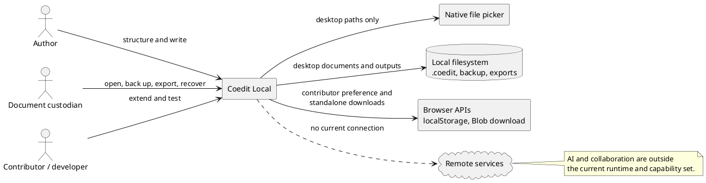
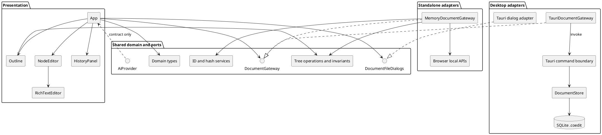
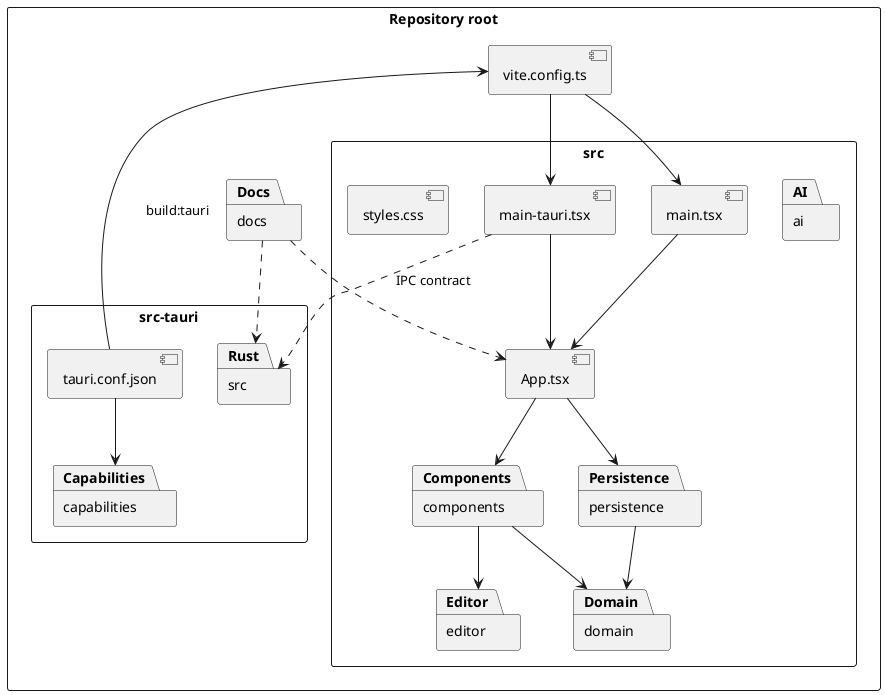
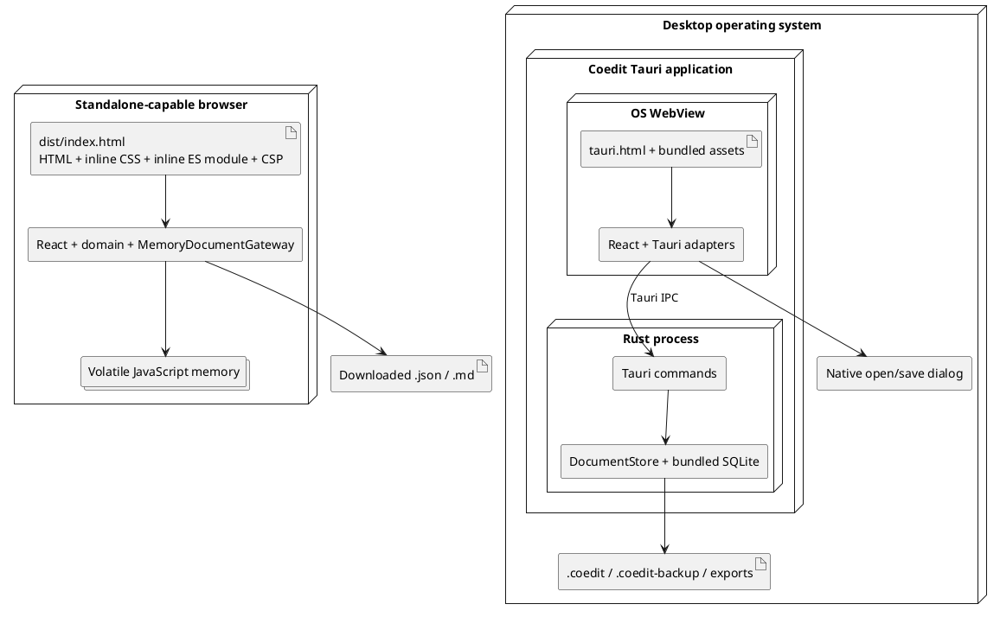

# Software architecture description

This is the RUP Software Architecture Document for the current Coedit Local implementation. It uses the 4+1 view model: logical, process, development, physical, and use-case/scenario views. Detailed class and data models live in [Frontend design](./FRONTEND_DESIGN.md) and [Persistence design](./PERSISTENCE_DESIGN.md); runtime realizations live in [Sequence diagrams](./SEQUENCE_DIAGRAMS.md).

## 1. Architectural scope

Coedit Local is a local-first hierarchical writing editor. The same React/TypeScript UI is composed with one of two persistence hosts:

- **Standalone HTML**: a self-contained, double-clickable `dist/index.html` using an in-memory TypeScript gateway. It needs neither Tauri nor a server, but its document is volatile.
- **Tauri desktop**: an installed/native application using the operating system WebView for the UI and a Rust process for SQLite persistence, file validation, backup, and export.

Tauri is an application shell, not a web backend. It packages web UI assets into a desktop program, exposes deliberately registered Rust commands over inter-process communication (IPC), and supplies native capabilities such as file dialogs. Production Coedit does not listen on `127.0.0.1`; loopback HTTP belongs only to the Vite development workflow.

### Architectural drivers

| Driver | Current architectural response |
|---|---|
| Private/offline use | No HTTP client or sync provider is registered; restrictive CSP and Tauri capabilities |
| One portable desktop document | SQLite format with a fixed application ID, schema version, current state, ledger, and snapshots |
| Attributable mutation history | All normal state changes are represented as `DocumentOperation` plus `ContributionContext` |
| Debuggable UI without native tooling | Explicit browser composition root and a single-file `file://` build |
| Cross-platform desktop source | React UI plus Tauri/Rust/rusqlite with bundled SQLite |
| Safe rich text | DOMPurify at the editor boundary and Ammonia at the desktop persistence boundary |
| Future hosts/features | Injected gateway and file-dialog ports; provider-neutral AI interface |
| Recoverable failure | SQLite full-synchronous transactions, snapshots, atomic export/copy helpers, recovery warning |

### System constraints

- Document format is currently version `1`; no migration framework exists.
- Only one document is held by a Tauri process at a time.
- Standalone storage lasts only for the page lifetime.
- TypeScript and Rust contracts are manually mirrored; no generated IPC schema exists.
- AI, remote synchronization, attachment workflows, and contributor management are not active features.

## 2. System context



Trust boundaries and hostile-input assumptions are specified in [Security](./SECURITY.md). The `.coedit` representation and recovery policy are specified in [Document format](./DOCUMENT_FORMAT.md).

## 3. Logical view

The design is a small ports-and-adapters architecture. UI components depend on domain contracts and injected ports. Host-specific code is selected at an entry point, not detected inside shared components.



### Composition roots

| Host | HTML entry | TypeScript entry | Injected dependencies | Output |
|---|---|---|---|---|
| Standalone | [`index.html`](../index.html) | [`src/main.tsx`](../src/main.tsx) | `MemoryDocumentGateway` | one inlined `dist/index.html` |
| Tauri desktop | [`tauri.html`](../tauri.html) | [`src/main-tauri.tsx`](../src/main-tauri.tsx) | `TauriDocumentGateway`, `tauriFileDialogs` | WebView assets inside native package |

[`App`](../src/App.tsx) has no Tauri import. This is the main separation-of-concerns rule: a new host supplies adapters at a new composition root instead of adding environment detection to the UI.

### Dependency direction

```text
entry point -> App/components -> domain contracts + ports
                                  ^
                                  |
                         host adapter implementation
```

The Rust store is not imported into the TypeScript build. `TauriDocumentGateway` translates port calls into command names; the Tauri runtime serializes camel-case JSON payloads to the mirrored Rust models.

### Principal domain concepts

- A `DocumentView` is the complete materialized document state plus host path/read-only/recovery fields.
- A `DocumentNode` is a stable-ID tree node with metadata, sanitized rendered HTML, a complete Base64 Yjs state, and a soft-deletion timestamp.
- A `DocumentOperation` is a discriminated mutation command.
- A `Contribution` attributes one committed revision to a contributor and optional session/group/message, and records a resulting state hash.
- A snapshot stores a complete `DocumentState` at a revision. Restoration materializes an old snapshot into a new revision rather than removing later history.

### Principle of operation

1. The selected entry point constructs `App` with a host-specific `DocumentGateway` and, on desktop, a `DocumentFileDialogs` adapter.
2. `App` renders either the no-document welcome state or a workspace from one complete `DocumentView`.
3. A user interaction becomes a typed `DocumentOperation`; `App` adds contributor, application-lifetime session, grouping, and message context.
4. In standalone mode, the memory adapter applies the pure TypeScript mutation, hashes it, and appends in-memory contribution/snapshot records. In desktop mode, the Tauri adapter invokes a Rust command and `DocumentStore` performs the equivalent validated SQLite transaction.
5. The gateway returns a complete new view. `App` replaces its view, fetches the newest 500 contributions, and re-renders the outline, editor, and optional History panel.
6. Rich text is the special high-frequency path: Tiptap changes a Yjs document; the editor waits for 1.2 seconds of inactivity, sanitizes HTML, and emits one grouped `updateContent` operation with incremental and complete Yjs encodings.
7. Restore loads a stored revision but writes it as a new current revision. Export is host-specific: browser downloads in standalone mode, atomic native file output in desktop mode.

This is a request/complete-view-response architecture. There is no runtime state stream, remote synchronization loop, or server-side session.

## 4. Process view

### Browser/WebView process

React owns one current `DocumentView`, a selected node, up to 500 loaded contributions, contributor preference, a session ID, status/error state, and the optional history panel. There is no router, global store, worker, event bus, background synchronization loop, or service container.

Tiptap and Yjs run in the UI process. Yjs updates are accumulated for a 1.2-second quiet period. A flush sends sanitized HTML, the merged incremental update, and the complete Yjs state as one `updateContent` operation. The gateway responds with a complete replacement `DocumentView`.

### Standalone execution

`MemoryDocumentGateway` holds current state, contributions, and revision snapshots in JavaScript memory. It applies the pure functions in [`src/domain/tree.ts`](../src/domain/tree.ts), hashes state with Web Crypto, and triggers JSON/Markdown downloads through Blob URLs. Closing or reloading the page discards all gateway state.

### Desktop execution

The Tauri process owns `Mutex<Option<DocumentStore>>`. Each command locks that state, so command access and the single open SQLite connection are serialized. A normal mutation runs one SQLite transaction containing:

1. optional writing-session creation;
2. validated materialized-state mutation;
3. metadata revision/timestamp update;
4. state reload and hierarchy validation;
5. SHA-256 calculation;
6. contribution insert;
7. complete snapshot insert;
8. commit.

A failure before commit rolls the entire unit back. There is no optimistic expected-revision value in the frontend request, no second writer coordinated through the application, and no remote concurrency process.

### Concurrency and lifecycle caveats

The UI's `busy` flag reduces overlapping structural commands, but it is not a full command queue. Editor input and blur commits can overlap another request. Pending editor cleanup can also race Close. These verified hazards are tracked in [Known limitations](./KNOWN_LIMITATIONS.md) and illustrated in [Sequence diagrams](./SEQUENCE_DIAGRAMS.md).

## 5. Development view



| Package/file | Responsibility | Detailed artifact |
|---|---|---|
| `src/App.tsx` | Application coordinator and use-case callbacks | [Frontend design](./FRONTEND_DESIGN.md) |
| `src/components/` | Outline, metadata editor, history presentation | [UI and UX](./UI_UX.md) |
| `src/editor/` | Tiptap/Yjs lifecycle and encoding | [Frontend design](./FRONTEND_DESIGN.md) |
| `src/domain/` | Shared TypeScript data contracts, pure tree rules, browser hashing/IDs | [Frontend design](./FRONTEND_DESIGN.md) |
| `src/persistence/` | Gateway/dialog ports and browser/Tauri adapters | [Persistence design](./PERSISTENCE_DESIGN.md) |
| `src/ai/provider.ts` | Reserved AI proposal port; no implementation | [Contributing](./CONTRIBUTING.md) |
| `src-tauri/src/models.rs` | Rust mirror of IPC/domain types | [Persistence design](./PERSISTENCE_DESIGN.md) |
| `src-tauri/src/lib.rs` | Command registration and one-document application state | [Persistence design](./PERSISTENCE_DESIGN.md) |
| `src-tauri/src/store.rs` | Schema, validation, mutation, ledger, restore, backup/export | [Persistence design](./PERSISTENCE_DESIGN.md) |
| `vite.config.ts` | Standalone inlining and Tauri frontend build split | [Build and portability](./BUILD_AND_PORTABILITY.md) |
| `src-tauri/tauri.conf.json` | Desktop build, WebView, CSP, package metadata | [Build and portability](./BUILD_AND_PORTABILITY.md) |

The feature-level and symbol-level lookup is in [Traceability](./TRACEABILITY.md).

## 6. Physical/deployment view



### Development-only topology

`corepack pnpm tauri:dev` asks Tauri to run `corepack pnpm dev`. Vite binds `127.0.0.1:1420`; the development WebView loads that URL and gains hot reload. If a development URL is launched without the Vite process, the browser correctly reports `ERR_CONNECTION_REFUSED`. Production standalone and correctly packaged Tauri artifacts load bundled files and do not need that listener.

### Platform intent versus evidence

The source architecture targets Windows, macOS, and Linux desktop, but the repository does not contain a multi-platform CI/release matrix. The standalone artifact uses standard browser APIs and is plausibly portable, but platform behavior must be verified. iPadOS is not a supported native target: mobile filesystem/document-provider semantics, touch reordering, lifecycle handling, and packaging are unfinished. See [Build and portability](./BUILD_AND_PORTABILITY.md) for the exact matrix.

## 7. Use-case/scenario view

The architecturally significant use cases are:

| Use case | Why it exercises the architecture | Realization |
|---|---|---|
| UC-01 Create document | Selects memory versus native path/SQLite behavior | [Create sequences](./SEQUENCE_DIAGRAMS.md#create-a-standalone-document) |
| UC-02 Open portable document | Crosses every validation and compatibility boundary | [Open sequence](./SEQUENCE_DIAGRAMS.md#open-and-validate-a-desktop-document) |
| UC-03 Maintain hierarchy | Must preserve tree invariants in two implementations | [Structural mutation](./SEQUENCE_DIAGRAMS.md#apply-a-structural-or-metadata-operation) |
| UC-05 Edit developed text | Coordinates Tiptap, Yjs, sanitization, debounce, and persistence | [Text commit](./SEQUENCE_DIAGRAMS.md#rich-textyjs-commit-after-12-seconds) |
| UC-07 Restore revision | Demonstrates append-only history and snapshot materialization | [Restore sequence](./SEQUENCE_DIAGRAMS.md#restore-a-revision-as-a-compensating-contribution) |
| UC-08/09 Export/backup | Splits browser downloads from atomic desktop output | [Output sequences](./SEQUENCE_DIAGRAMS.md#export-json-or-markdown) |
| UC-10 Close | Exposes UI/backend lifecycle ordering | [Close sequence](./SEQUENCE_DIAGRAMS.md#close-ordering-and-pending-edit-race) |
| UC-11 Run standalone | Demonstrates absence of native/server dependencies | [Standalone bootstrap](./SEQUENCE_DIAGRAMS.md#standalone-bootstrap) |

Full use-case specifications are in [Vision and use cases](./RUP_VISION_AND_USE_CASES.md).

## 8. Architecture decisions embodied in code

These are descriptive decision records, not proposals.

| ID | Decision | Consequence / trade-off | Executable evidence |
|---|---|---|---|
| AD-01 | Inject host services through `AppProps` | Shared UI is browser-native; each host needs a composition root | `App.tsx`, `main.tsx`, `main-tauri.tsx` |
| AD-02 | Use a single-file default build | Double-click debugging works without a server; build must reject external chunks/assets | `vite.config.ts::standaloneHtml` |
| AD-03 | Use Tauri IPC instead of local HTTP | No production listener or HTTP authentication surface; desktop requires native package/runtime | `tauriGateway.ts`, `src-tauri/src/lib.rs` |
| AD-04 | Keep one SQLite file per document | Easy copying/backups; large per-revision snapshots can grow the file quickly | `store.rs::initialize_schema`, `insert_snapshot` |
| AD-05 | Model mutations as tagged operations | Attribution and parity have a stable seam; adding an operation is cross-language work | `domain/types.ts`, `models.rs` |
| AD-06 | Store Yjs state plus sanitized HTML | Exact editor state and convenient export/render materialization; consistency is currently trusted, not verified | `RichTextEditor.tsx`, `store.rs::apply_sql` |
| AD-07 | Restore by compensation | Later history remains visible; restore is a new revision, not a revision-counter rewind | both gateway `restoreRevision` implementations |
| AD-08 | Sanitize at UI and desktop persistence boundaries | Defense in depth; standalone gateway does not independently enforce Rust limits | DOMPurify and Ammonia calls |
| AD-09 | Deny network in base configuration | Strong offline default; AI/collaboration need explicit alternate permissions/configuration | CSPs, capabilities, empty AI composition |
| AD-10 | Manually mirror TypeScript/Rust types | Simple toolchain; contract drift must be caught by review/tests | `domain/types.ts`, `models.rs` |

## 9. Quality-attribute tactics

| Attribute | Current tactic | Important residual risk |
|---|---|---|
| Privacy | No provider, restrictive CSP/capability set, local storage only | Future network builds need an explicit threat model |
| Integrity | Transactions, tree validation, fixed file identity/version, integrity check | Stored hashes are not replayed or verified; direct SQLite edits are possible |
| Recoverability | Every-revision snapshots, compensating restore, backup, recovery warning | Editor lifecycle races can lose unflushed input |
| Portability | Browser UI, host ports, bundled SQLite, portable document | Native macOS/Linux/iPadOS release paths are unverified/incomplete |
| Modifiability | Discriminated operations and gateway interfaces | Mirrored implementations can drift; `App` is a growing coordinator |
| Usability | Outline/editor/history layout, keyboard navigation, visible status | Touch and accessibility coverage are partial |
| Performance | Incremental Yjs grouping, indexed sibling lookup, single connection | Complete view/history refresh and full snapshot per revision do not scale indefinitely |
| Testability | Pure tree functions and in-memory gateway | UI, IPC contract, migration, failure, and multi-platform tests are sparse |

## 10. Architectural rules for new work

1. Put host selection in a composition root; keep shared UI free of Tauri globals/imports.
2. Route every accepted visible mutation through `DocumentOperation` and `ContributionContext`.
3. Keep memory and Rust semantics intentionally aligned, and test both when an operation changes.
4. Treat TypeScript/Rust model edits as one contract change.
5. Treat schema edits as a document-format change requiring a version/migration decision.
6. Keep AI or synchronization proposals separate from accepted mutations and out of the offline build until explicitly enabled.
7. Update the related use case, sequence, tests, traceability row, security considerations, and known-limitations entry with the code.

Implementation recipes and the definition of done are in [Contributing](./CONTRIBUTING.md).
