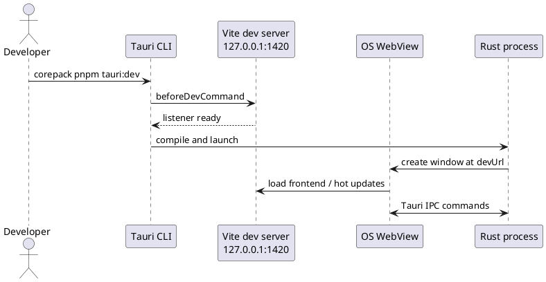
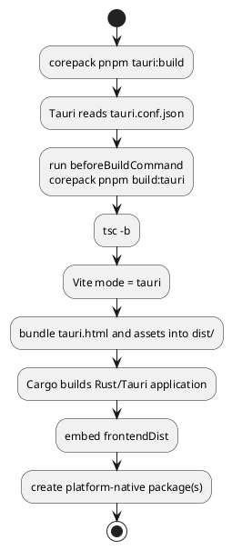

# Build, release, and portability

Coedit has two intentional frontend outputs. Choose the command by runtime, not by convenience: the default build is a serverless standalone HTML application; the Tauri build is the frontend half of a native desktop package.

## Build matrix

| Goal | Command | Entry/composition root | Expected output | Persistence |
|---|---|---|---|---|
| Browser development | `corepack pnpm dev` | `index.html` / `src/main.tsx` | Vite at `127.0.0.1:1420` | memory |
| Standalone artifact | `corepack pnpm build` | `index.html` / `src/main.tsx` | self-contained `dist/index.html` | memory |
| Tauri frontend only | `corepack pnpm build:tauri` | `tauri.html` / `src/main-tauri.tsx` | `dist/tauri.html` plus assets/maps | Tauri adapter when hosted |
| Desktop development | `corepack pnpm tauri:dev` | Tauri config starts Vite and native host | development WebView/native process | SQLite |
| Desktop release package | `corepack pnpm tauri:build` | Tauri config runs `build:tauri` and Cargo | platform-native package/binary | SQLite |

`corepack pnpm build:tauri` is normally an internal/debugging command. Opening its `tauri.html` directly in a browser will not supply Tauri IPC and is not a supported standalone runtime.

## Prerequisites

- Node.js 24
- Corepack
- Rust 1.90 and Cargo
- Platform-specific Tauri 2 build prerequisites for native work

Versions are pinned in [`package.json`](../package.json), [`pnpm-lock.yaml`](../pnpm-lock.yaml), [`src-tauri/rust-toolchain.toml`](../src-tauri/rust-toolchain.toml), [`src-tauri/Cargo.toml`](../src-tauri/Cargo.toml), and [`src-tauri/Cargo.lock`](../src-tauri/Cargo.lock). JavaScript dependency install scripts are disabled by `.npmrc`.

Install reproducibly:

```powershell
corepack pnpm install --frozen-lockfile
```

Do not routinely replace the frozen lockfile. Review both lockfiles and [third-party notices](../THIRD_PARTY_NOTICES.md) when dependencies change.

## Standalone build

Run:

```powershell
corepack pnpm build
```

The script performs `tsc -b` and then Vite's default build. [`vite.config.ts`](../vite.config.ts) selects `index.html` unless the mode is `tauri`. Its `standaloneHtml()` plugin enforces the artifact contract:

1. Rollup must produce exactly one JavaScript chunk with no static or dynamic imports.
2. Generated CSS and ordinary assets must be inlineable; unexpected external outputs fail the build.
3. The generated script and styles are embedded into `index.html`.
4. Literal `</script` sequences in generated JavaScript are escaped.
5. A SHA-256 CSP hash for the inline module is inserted into the document's final `</head>`.
6. The embedded JavaScript is syntax-checked at build time.
7. Every output except `index.html` is removed from the bundle.

The result should therefore be:

```text
dist/
└── index.html
```

### Manual acceptance

1. Confirm the build reports only `dist/index.html` as its output.
2. Double-click that file rather than the source-root `index.html`.
3. Confirm the welcome screen says standalone documents are held in memory.
4. Create a document and exercise the standalone smoke suite in [Testing](./TESTING.md).
5. Reload/close only after exporting anything worth keeping; reload is expected to lose the document.

The source-root [`index.html`](../index.html) contains a Vite source module reference and is not the distributable artifact.

### Standalone CSP

The inliner generates a policy equivalent to:

```text
default-src 'none';
script-src 'sha256-<generated digest>';
style-src 'unsafe-inline';
img-src data: blob:;
font-src data:;
connect-src 'none';
object-src 'none'; frame-src 'none';
base-uri 'none'; form-action 'none'
```

This prohibits network connections and remote subresources. The script hash changes whenever the bundle changes and must be generated rather than copied by hand.

## Tauri desktop development

Run:

```powershell
corepack pnpm tauri:dev
```

[`src-tauri/tauri.conf.json`](../src-tauri/tauri.conf.json) runs `corepack pnpm dev`, waits for `http://127.0.0.1:1420`, builds the Rust host, and opens a native window. In this one workflow the WebView intentionally depends on a loopback development server for hot reload.



Do not distribute or bookmark the `devUrl`; it has meaning only while Vite is running.

## Tauri desktop release

Run:

```powershell
corepack pnpm tauri:build
```

The Tauri CLI invokes `corepack pnpm build:tauri`, which runs TypeScript and Vite in `tauri` mode. That mode:

- uses `tauri.html` and `src/main-tauri.tsx`;
- keeps normal generated assets instead of making one HTML file;
- enables source maps;
- supplies `TauriDocumentGateway` and native file dialogs.

Tauri then builds the Rust application, embeds `frontendDist`, and produces platform packages for the configured targets. The window explicitly loads `tauri.html`.



Do not substitute `cargo build --release` for this command. A raw Cargo build does not guarantee that the correct frontend was built or embedded and can reproduce the confusing development-URL behavior that a release is supposed to eliminate.

### Desktop runtime policy

The production window policy in `tauri.conf.json` permits packaged resources and Tauri IPC, but denies ordinary remote connections, frames, and objects. [`src-tauri/capabilities/default.json`](../src-tauri/capabilities/default.json) grants only core defaults plus native open/save dialogs. A new plugin or permission is a security and architecture change, not merely a dependency addition.

## How Tauri relates to the application

Tauri supplies four things to the desktop build:

- a native executable and operating-system WebView;
- IPC between TypeScript adapters and explicitly registered Rust commands;
- native dialog integration;
- native packaging, icons, and platform metadata.

It does not own the React UI, the domain types, the in-memory gateway, or the standalone artifact. Removing Tauri-specific entry/adapters leaves a working volatile HTML5 editor. Persistent `.coedit` storage currently depends on the Rust/Tauri host.

## Portability matrix

This matrix separates architectural plausibility from verified support. Icon presence is not evidence of a working platform port.

| Target | Standalone artifact | Native/Tauri application | Current evidence and blockers |
|---|---|---|---|
| Windows | **Implemented; manually exercised** | **Primary intended desktop target** | Standalone build/double-click confirmed. Native package still needs release smoke testing per change. |
| Linux desktop | **Source-portable; unverified** | **Architecturally portable; unverified** | Requires compatible browser for standalone. Native packages depend on distro WebKit/system libraries and must be built/tested on Linux. |
| macOS desktop | **Source-portable; unverified** | **Architecturally portable; unverified** | Native packages must be built on macOS; signing/notarization and file-association behavior are not configured/documented as a release service. |
| iPadOS browser | **Experimental/unsupported** | Not applicable as desktop Tauri | `file://`/Files-app launch, Blob downloads, storage rules, touch drag/drop, and responsive layout are not validated. |
| iPadOS native | Not the standalone target | **Not implemented** | No initialized iOS project or document-provider/security-scoped file design. Current dialogs yield path strings consumed as `PathBuf`; UI is not touch-first. |

### Browser API requirements for standalone mode

The current bundle assumes support for:

- ES modules and an ES2022-level bundle;
- `crypto.subtle.digest`, `crypto.getRandomValues`, and preferably `crypto.randomUUID`;
- `structuredClone`;
- `TextEncoder`/`TextDecoder`;
- `DOMParser`, Blob/object URLs, and download anchors;
- Indexed rich-text features used by React, Tiptap, ProseMirror, and Yjs.

The configured Vite build targets include ES2022, Chrome 105, and Safari 13, but a configured transpilation target is not a tested support promise. In particular, browser behavior for cryptography and downloads on a local `file://` origin must be tested on each claimed platform.

### Linux notes

- Install the Tauri 2 prerequisites for the distribution/toolchain before building.
- Build the package on Linux rather than copying a Windows executable.
- Test native dialogs, `.coedit` paths containing Unicode/spaces, WebKit rendering, backup replacement, and application packaging for the chosen distribution formats.
- Do not infer Wayland/X11 or distribution compatibility from a successful Rust compile alone.

### macOS notes

- Build and sign on macOS with the desired deployment target.
- Verify the WebView version, native dialogs, sandbox expectations, file permissions, Unicode paths, and backup replacement semantics.
- Define signing/notarization/release credentials outside the repository before calling the package distributable.
- Test the standalone HTML independently in Safari and at least one alternate browser.

### iPadOS notes

The shared React UI can render in a browser in principle, but the current product model is not portable to iPadOS without design work:

- HTML drag-and-drop and hover-revealed row controls are weak touch interactions.
- The outline remains visible at narrow widths; there is no pane switcher.
- A browser document cannot reopen `.coedit` SQLite files.
- Blob download/import and local HTML execution differ across Files/Safari contexts.
- A native mobile host needs document-picker URI/bookmark handling rather than assuming an ordinary persistent path string.
- App suspension must explicitly flush pending editor work.

Treat iPadOS as a new host/use-case project, not a packaging checkbox.

## Troubleshooting

### `127.0.0.1 refused to connect`

Cause: the launched page or native artifact points at the development URL, but Vite is not running. This is expected for a development configuration and wrong for a release artifact.

Resolution:

- For UI-only debugging, run `corepack pnpm build` and double-click `dist/index.html`.
- For desktop development, run `corepack pnpm tauri:dev` and let Tauri start Vite.
- For a distributable desktop application, rebuild with `corepack pnpm tauri:build`; do not use a raw Cargo release as the package.

### Browser shows JavaScript source or reports module CORS errors

Confirm that you opened the generated `dist/index.html`, not the source-root HTML or `dist/tauri.html`. The successful standalone build has no `assets/index-*.js` reference. If it does, the standalone inlining contract failed and the artifact must not be distributed.

### Standalone opens but Open/SQLite backup is absent

That is by design. The standalone composition root has no native file-dialog port and no SQLite gateway. Export JSON or Markdown before closing, understanding the JSON parity limitation in [Document format](./DOCUMENT_FORMAT.md).

### Tauri frontend opens in a normal browser but commands fail

`tauri.html` and `src/main-tauri.tsx` require the Tauri IPC runtime. Use the standalone entry in a normal browser.

## Release checklist

Before calling a change releasable:

1. Use a clean dependency install with the pinned lockfiles.
2. Run the automated suites and static checks in [Testing](./TESTING.md).
3. Build and manually smoke-test `dist/index.html` by double-clicking it.
4. Build the native package with `corepack pnpm tauri:build` on each claimed operating system.
5. Create, close, reopen, restore, export, and back up a desktop document.
6. Reopen the backup (currently by copying/renaming to `.coedit`) and inspect recovery JSON/Markdown.
7. Verify no production artifact attempts to reach `127.0.0.1` or any remote host.
8. Inspect CSP and capability diffs; justify every added origin/plugin/permission.
9. Review document-format compatibility, migration needs, and recovery guidance.
10. Review dependency licenses/notices and both lockfile diffs.
11. Record platform/version evidence; do not upgrade an unverified target to supported by assumption.
12. Update [Known limitations](./KNOWN_LIMITATIONS.md) and [Traceability](./TRACEABILITY.md).

There is currently no repository CI workflow or automated multi-platform release pipeline. Until one exists, the release maintainer must record these checks manually.
