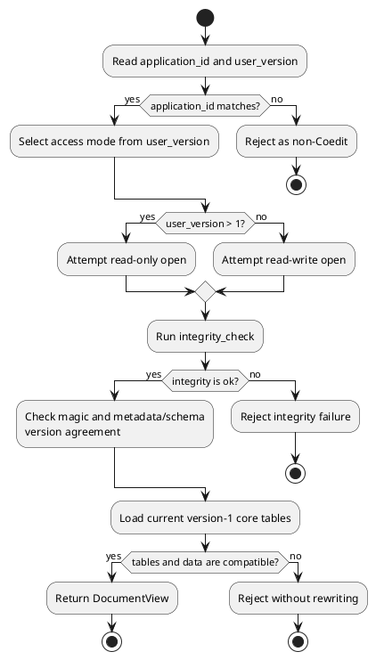

# `.coedit` document format and recovery

This document specifies format version `1` as implemented by `src-tauri/src/models.rs` and `src-tauri/src/store.rs`. It describes the durable Tauri document, not the standalone browser's in-memory representation. For implementation structure, see [Persistence design](./PERSISTENCE_DESIGN.md); for trust boundaries, see [Security](./SECURITY.md).

## Status and scope

A native Coedit document is a SQLite database normally named with the `.coedit` extension. It contains:

- the current materialized document tree;
- contributors and writing sessions;
- an operation/contribution ledger;
- a full state snapshot for every current revision;
- a reserved attachment table.

The format does not currently define encryption, signatures, an import format, network synchronization, or a migration mechanism. SQLite portability does not imply that arbitrary simultaneous editors can safely collaborate through the file.

The current source now creates fresh version-1 files with `nodes.tags_json` rather than the retired closed `nodes.kind` column. This intentionally breaks compatibility with prototype `.coedit` files created before the tag change: the project has no user documents requiring recovery, and no migration or version bump was requested. Add a migration and advance the format before treating either shape as a distributed compatibility contract.

## Identification

The application uses three identifiers:

| Identifier | Version-1 value | Location |
|---|---:|---|
| SQLite application ID | `0x434F4544` | `PRAGMA application_id` |
| SQLite schema version | `1` | `PRAGMA user_version` |
| Coedit magic marker | `coedit-local-document` | `metadata['magic']` |

On open, all three participate in validation. The metadata row `format_version` must equal `PRAGMA user_version`.

Creation requires the exact lowercase `.coedit` extension. The store's open method accepts any extension after validating the file contents, although the current native open dialog filters for `.coedit` only.

## SQLite configuration

New files are initialized with:

```sql
PRAGMA application_id = 0x434F4544;
PRAGMA user_version = 1;
PRAGMA foreign_keys = ON;
PRAGMA journal_mode = DELETE;
PRAGMA synchronous = FULL;
```

`DELETE` journal mode means a cleanly closed document is normally one database file. A transaction interrupted at the wrong time can leave a sibling `<document>-journal` file; preserve it with the original during recovery.

New and reopened connections use a five-second SQLite busy timeout. Reopened connections explicitly enable foreign keys. Creation explicitly selects `FULL` synchronous mode; the code does not reissue that PRAGMA on every later open.

All version-1 tables are SQLite `STRICT` tables.

## Schema version 1

### `metadata`

| Column | Type | Constraints |
|---|---|---|
| `key` | `TEXT` | primary key, not null |
| `value` | `TEXT` | not null |

Required rows:

| Key | Meaning |
|---|---|
| `magic` | Coedit marker, exactly `coedit-local-document` |
| `document_id` | Document UUID |
| `title` | Current document title |
| `format_version` | Decimal schema version, currently `1` |
| `revision` | Decimal current revision, beginning at `0` |
| `created_at` | UTC RFC 3339 timestamp |
| `updated_at` | UTC RFC 3339 timestamp |

Metadata is a key/value table, so numeric values are stored as decimal text and parsed by the application.

### `contributors`

| Column | Type | Constraints |
|---|---|---|
| `id` | `TEXT` | primary key, not null |
| `display_name` | `TEXT` | not null |
| `kind` | `TEXT` | one of `human`, `automation`, `ai`, `imported` |
| `created_at` | `TEXT` | not null |

Creation inserts one contributor. Version 1 has no public command for registering another contributor.

### `writing_sessions`

| Column | Type | Constraints |
|---|---|---|
| `id` | `TEXT` | primary key, not null |
| `contributor_id` | `TEXT` | foreign key to `contributors.id`, not null |
| `started_at` | `TEXT` | not null |
| `ended_at` | `TEXT` | nullable |
| `description` | `TEXT` | nullable |

A mutation whose context has a session ID uses `INSERT OR IGNORE` to create a session. Current code does not explicitly end sessions or populate their descriptions.

### `nodes`

| Column | Type | Constraints |
|---|---|---|
| `id` | `TEXT` | primary key, not null |
| `parent_id` | `TEXT` | nullable foreign key to `nodes.id` |
| `position` | `INTEGER` | not null |
| `tags_json` | `TEXT` | not null; JSON array of normalized tag strings |
| `title` | `TEXT` | not null |
| `summary` | `TEXT` | not null |
| `content_html` | `TEXT` | not null |
| `yjs_state` | `BLOB` | not null |
| `metadata_json` | `TEXT` | not null, parsed as JSON |
| `created_at` | `TEXT` | not null |
| `updated_at` | `TEXT` | not null |
| `deleted_at` | `TEXT` | nullable |

`parent_id = NULL` denotes a root. `deleted_at = NULL` denotes an active node. Soft-deleted nodes remain materialized for history and restoration behavior.

`tags_json` is an ordered JSON array used as a set. The application trims and Unicode-normalizes tags, collapses whitespace, matches duplicates case-insensitively while preserving the first display spelling, and permits at most 20 tags of at most 64 code points/256 UTF-8 bytes each. The editor's reusable vocabulary is not stored separately; it is derived from tags on active nodes, so it grows and shrinks with current document use.

`yjs_state` stores the decoded binary complete Yjs update. The API representation is base64 text. `content_html` is a separately materialized rendering; the backend does not prove that it and the Yjs state are equivalent.

The index `nodes_parent_position(parent_id, position)` supports sibling traversal. Active children are ordered by `position`; code uses ID as a deterministic tie-break where needed.

### `contributions`

| Column | Type | Constraints |
|---|---|---|
| `id` | `TEXT` | primary key, not null |
| `revision` | `INTEGER` | not null, unique |
| `contributor_id` | `TEXT` | foreign key to `contributors.id`, not null |
| `session_id` | `TEXT` | nullable; no foreign key |
| `group_id` | `TEXT` | nullable |
| `timestamp` | `TEXT` | not null |
| `operation_type` | `TEXT` | not null |
| `affected_node_ids_json` | `TEXT` | not null, JSON array |
| `payload_json` | `TEXT` | not null, JSON value |
| `base_revision` | `INTEGER` | not null |
| `resulting_hash` | `TEXT` | not null |
| `message` | `TEXT` | nullable |

The application appends contributions; the schema itself has no append-only trigger or signature. Direct SQLite modification can alter the ledger.

Normal operation types are `createNode`, `updateNode`, `updateContent`, `moveNode`, `softDeleteNode`, `restoreNode`, and `renameDocument`. Lifecycle entries additionally use `createDocument` and `restoreRevision`.

Revision `0` is `createDocument` with base revision `-1`. Each subsequent committed mutation or restore uses the previous current revision as `base_revision` and allocates current revision plus one.

The `contributions_node_time` index contains only `timestamp DESC`; affected node IDs remain JSON and are filtered in application code.

### `snapshots`

| Column | Type | Constraints |
|---|---|---|
| `revision` | `INTEGER` | primary key, not null |
| `state_json` | `TEXT` | not null, serialized `DocumentState` |
| `state_hash` | `TEXT` | not null |
| `created_at` | `TEXT` | not null |

Version 1 stores a full snapshot for every revision. The matching contribution/snapshot revision is a code-level convention; no foreign key connects the tables.

Snapshots include document metadata, all nodes, contributors, and sessions. They do not include the ledger, other snapshots, attachments, path, read-only flag, or recovery warning.

### `attachments`

| Column | Type | Constraints |
|---|---|---|
| `id` | `TEXT` | primary key, not null |
| `mime_type` | `TEXT` | not null |
| `checksum` | `TEXT` | not null, unique |
| `filename` | `TEXT` | not null |
| `content` | `BLOB` | not null |
| `created_at` | `TEXT` | not null |

This table is reserved. No frontend type, gateway method, Tauri command, store workflow, or export currently reads or writes attachments.

## Serialized state and wire representation

Rust serializes domain structs using camel-case JSON names. A `DocumentState` has this logical shape:

```text
document:       DocumentMetadata
nodes:          DocumentNode[]
contributors:   Contributor[]
sessions:       WritingSession[]
```

`DocumentView` adds non-persisted `path`, `readOnly`, and `recoveryWarning` fields. `toDocumentState()` in the browser explicitly projects those fields away before hashing or recovery export.

Node `metadata_json`, contribution affected IDs/payloads, and snapshots use JSON text. Node Yjs state is a SQLite BLOB and becomes base64 in the Tauri wire view. Timestamps generated by Rust are UTC RFC 3339 with millisecond precision.

## Structural invariants

Opening and post-mutation loading require:

- unique node IDs;
- every non-null parent ID to identify a node;
- no parent cycle;
- valid contributor kinds and normalized node tag arrays;
- parseable metadata, node metadata JSON, and stored values;
- metadata format version equal to SQLite `user_version`.

SQLite foreign keys reinforce contributor/session and node-parent references. Application logic additionally prevents moving a node into a descendant and normalizes active sibling positions after ordering changes.

## Input limits and sanitization

The Rust mutation boundary currently applies these UTF-8/encoded limits:

| Value | Limit |
|---|---:|
| Title | 4,096 bytes |
| Summary | 1,048,576 bytes |
| Serialized metadata JSON | 1,048,576 bytes |
| Content HTML | 16,777,216 bytes |
| Decoded complete Yjs state | 33,554,432 bytes |
| Encoded Yjs update string | 67,108,864 bytes |

Content HTML is sanitized with Ammonia before durable writes. Yjs update and state strings must decode as base64. Rust validates but does not apply the incremental Yjs update; the supplied complete state becomes authoritative.

The browser uses the centralized, versioned `coedit-rich-text-v1` policy in `src/editor/sanitizeRichText.ts` for paste, fallback HTML load, and commit. `fixtures/protocol/rich-text-v1.json` is executable TypeScript evidence for that policy. Rust Ammonia conformance to the same cases is not yet established and is part of the native second pass.

These mutation limits are not comprehensively reapplied to every field when loading an existing database or restoring a snapshot. Files remain untrusted input; see [Security](./SECURITY.md).

## Atomic revision rule

For a normal desktop mutation, one SQLite transaction contains:

1. optional lazy session creation;
2. materialized-node or metadata change;
3. current revision and `updated_at` update;
4. state reload and structural validation;
5. resulting-state hash calculation;
6. contribution insertion;
7. full snapshot insertion.

The transaction commits all of these or none. Restore follows the same principle while replacing the materialized nodes from an older snapshot and appending a new revision.

Creation uses a same-directory temporary database and renames it into place only after its initial transaction commits and the connection closes.

## Hash semantics and non-guarantees

The desktop hash is SHA-256 over Serde's JSON encoding of the resulting `DocumentState`. It covers current document metadata, nodes, contributors, and sessions. It does not cover ledger rows, snapshot records, attachments, or filesystem metadata.

Version 1 records hashes but does not verify them:

- open does not compare current state with the latest contribution or snapshot hash;
- open does not replay operations;
- restore does not verify the selected snapshot's `state_hash`;
- no signature, keyed MAC, or trusted external anchor authenticates hashes.

Therefore `resulting_hash` and `state_hash` are recorded checksums, not current tamper-evidence guarantees.

The standalone memory adapter names its browser algorithm `coedit-document-state-v1`:

1. project exactly `DocumentState`, excluding host/view fields;
2. sort nodes, contributors, and sessions by ID without mutating the input;
3. recursively sort object keys while preserving array order inside values;
4. serialize compact JSON, encode it as UTF-8, and calculate SHA-256.

`fixtures/protocol/document-hash-v1.json` fixes one canonical JSON string and digest, and `src/domain/hash.test.ts` verifies the TypeScript implementation. The existing Rust hash still uses Serde's normal encoding and does not consume this fixture. Cross-language equality is therefore a second-pass objective, not a format-version-1 guarantee.

## Restore semantics

Restoring revision `R` does not rewind the database:

1. read `snapshots.state_json` for `R`;
2. replace the materialized node table with its nodes;
3. restore its document title;
4. retain current document identity, format, contributors, and sessions;
5. allocate `current revision + 1`;
6. append a `restoreRevision` contribution and a full snapshot of the result.

The old contribution and snapshot rows remain. Restored HTML is sanitized and Yjs state is decoded. The transactional reload rejects missing parents and cycles. Snapshot hashes are not checked.

This is distinct from `restoreNode`: that operation undeletes one node and its ancestors, but not deleted descendants.

## Open and version compatibility



Exact current behavior:

- Version `1` opens read-write after validation.
- A version greater than `1` is attempted read-only. It succeeds only if the version-1 loader can still query and decode the expected core tables and columns.
- A version less than or equal to `1` is attempted read-write. There is no migration runner, so an older shape that differs from version 1 fails during normal queries. An older file that happens to satisfy them is not explicitly upgraded.
- An application-ID mismatch, integrity failure, missing magic, metadata/schema version mismatch, unknown enum value, malformed JSON, missing parent, or cycle rejects the open.

Forward-compatible read-only behavior is best-effort, not a promise that every future schema can be opened by version 1. Backward migration is not implemented.

## Native backup

The desktop backup command creates a byte copy of the open SQLite database while access is serialized by the application store lock:

1. run `PRAGMA optimize` if the document is writable;
2. copy to a unique temporary file in the destination directory;
3. `sync_all` the temporary file;
4. rename it into place, with a best-effort rollback when replacing an existing destination.

The UI suggests a `.coedit-backup` suffix. This is still a SQLite database with the same application ID and schema; it is not an archive format. The normal open dialog filters for `.coedit`, so to open through the current UI, preserve the original backup and make a copy whose name ends in `.coedit`.

The implementation syncs file contents but does not explicitly fsync the containing directory.

## JSON recovery export

The standalone adapter emits the explicitly identified TypeScript `RecoveryExport` shape:

```json
{
  "format": "coedit-recovery",
  "exportVersion": 2,
  "exportedAt": "UTC RFC 3339 timestamp",
  "hashAlgorithm": "coedit-document-state-v1",
  "stateHash": "lowercase SHA-256 hex",
  "state": {},
  "history": {
    "order": "revision-descending",
    "complete": true
  },
  "contributions": []
}
```

`format` distinguishes this recovery contract from unrelated JSON, and version `2` deliberately avoids claiming compatibility with the older desktop envelope that already used version `1`. `state` is the complete current `DocumentState`; host-only `DocumentView` fields are excluded. `stateHash` is the browser algorithm's hash of that state. `contributions` is newest first, and `history.complete: true` means every contribution accumulated by the currently open in-memory document is present. The internal revision-snapshot `Map` is not included.

The Rust desktop exporter still emits the older shape:

```json
{
  "exportVersion": 1,
  "exportedAt": "UTC RFC 3339 timestamp",
  "state": {},
  "contributions": []
}
```

Desktop `contributions` contains at most the newest 100,000 ledger entries because the Rust store query has a silent pre-window. It has no `format`, `hashAlgorithm`, `stateHash`, or explicit history order/completeness fields. The standalone version increment makes that incompatibility explicit; desktop schema/parity decisions remain pass-2 work.

The envelopes are human-inspectable, but the current application has no JSON import, schema-validation UI, or automated recovery-from-JSON command. Standalone completeness means complete for that page-lifetime ledger, not persistence across a prior reload or a tested round trip.

Browser and native suggested export names use `safeFilenameStem()` in `src/persistence/fileDialogs.ts`: input is NFKD-normalized, combining marks are removed, Unicode letters/numbers plus `_`/`-` are retained, other runs become hyphens, reserved Windows device names fall back to `document`, and the stem is capped at 100 Unicode code points without splitting a surrogate pair. The browser, dialog, and filesystem may still apply their own final naming policy.

## Markdown export

Markdown is lossy interchange:

- document and active node titles become headings;
- nonempty summaries become italic paragraphs;
- rich HTML is flattened to plain text;
- active children are visited depth-first in sibling order;
- heading depth is capped at level six.

It excludes deleted nodes, rich-text structure, Yjs data, arbitrary metadata, contributor/session records, revision history, hashes, snapshots, and attachments. There is no Markdown import workflow.

## Recovery procedure

If Coedit reports an integrity or format failure:

1. Stop editing. Preserve the original `.coedit` file and any sibling `-journal` file together.
2. Do not run repair tools against the only copy.
3. Duplicate the files and investigate the duplicate.
4. Try the latest `.coedit-backup`. Because the dialog filters by extension, make a separate `.coedit`-named copy for opening; do not rename away the only backup.
5. Use a prior JSON export to inspect current state and contributions. Standalone contains its complete page-lifetime ledger; desktop contains up to 100,000 recent contributions. Remember that the current application cannot import either automatically.
6. Use Markdown only to salvage readable text; it cannot restore structure or history completely.
7. Validate node structure, current revision, history, and representative rich-text content before replacing an original.

A `recoveryWarning` means a `-journal` file existed when open began. Review recent history and make a new backup before continuing substantial edits.

## Standalone versus native artifacts

| Artifact | Producer | Durable contents | Can native Coedit open it? |
|---|---|---|---|
| `.coedit` | Tauri desktop create | SQLite state, ledger, snapshots, reserved attachment table | Yes |
| `.coedit-backup` | Tauri desktop backup | Byte copy of the SQLite document | Store: yes; current dialog: not directly |
| Desktop `.json` export | Tauri desktop export | Current state plus at most 100,000 contributions | No importer |
| Desktop `.md` export | Tauri desktop export | Lossy active-tree text | No importer |
| Standalone `.json` export | Browser memory adapter | Marked `coedit-recovery` version-2 portable state/hash plus complete page-lifetime contribution ledger | No importer |
| Standalone `.md` export | Browser memory adapter | Lossy active-tree text | No importer |

## Evolution rules for contributors

Because no migrations exist, a persisted change requires deliberate format work. Before merging a schema or serialization change:

1. classify it as version-1 compatible or incompatible;
2. update Rust models, schema creation, loaders, writers, snapshots, hashes, backup/export expectations, and fixtures;
3. bump both `FORMAT_VERSION` and `PRAGMA user_version` for an incompatible format;
4. implement an explicit, transactional migration before opening older files writable;
5. define what older applications see and whether forward read-only loading remains possible;
6. add create/open/upgrade/reopen/backup/recovery tests with real fixture files;
7. update this specification, [Persistence design](./PERSISTENCE_DESIGN.md), [Testing strategy](./TESTING.md), and [Known limitations](./KNOWN_LIMITATIONS.md).

Do not reinterpret existing columns or operation payloads silently. Prefer additive fields with explicit defaults when compatibility permits.

## Current non-guarantees

Version 1 does not guarantee:

- hash verification, ledger replay, tamper evidence, or authorship authentication;
- more than 100,000 contributions in JSON recovery export or filtered history reachability beyond the newest 100,000 rows;
- import from JSON or Markdown;
- migration from any older schema;
- that every future schema opens read-only in version 1;
- cross-adapter hash equality or recovery-export schema/completeness equivalence;
- bounded database growth, because every revision has a full snapshot;
- attachment support, despite the reserved table;
- simultaneous multi-process or network collaboration;
- encryption at rest.

Track remediation ownership and user-facing workarounds in [Known limitations](./KNOWN_LIMITATIONS.md).
