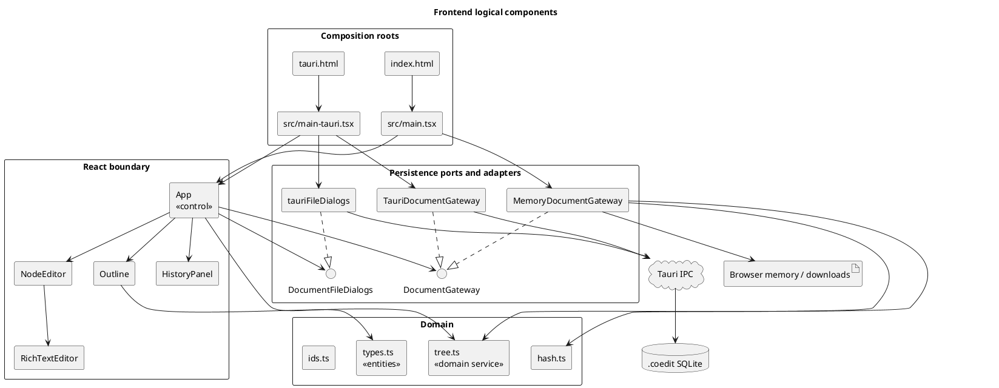
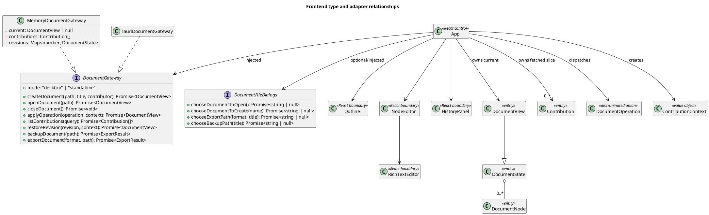

# Frontend design

This document is the implementation guide for the React/TypeScript part of Coedit Local. It describes the code as it exists now. Sections labeled **Recommendation** are proposed contribution guidance, not implemented behavior.

Related documents:

- [Documentation index](README.md)
- [Repository overview](../README.md)
- [Architecture](ARCHITECTURE.md)
- [Sequence diagrams](SEQUENCE_DIAGRAMS.md)
- [Feature-to-code traceability](TRACEABILITY.md)
- [Known limitations](KNOWN_LIMITATIONS.md)
- [UI and UX specification](UI_UX.md)

## Purpose and design boundary

The frontend owns interaction state, presentation, hierarchy commands, rich-text editing, and the browser implementation of the domain rules. It does not know how a desktop document is stored. `App` receives that behavior through the `DocumentGateway` port and receives native paths through the optional `DocumentFileDialogs` port.

There are two explicit composition roots. There is no runtime test for Tauri inside the shared UI:

| Runtime | HTML entry | TypeScript entry | Injected document gateway | Injected dialogs |
|---|---|---|---|---|
| Standalone HTML and ordinary browser development | `index.html` | `src/main.tsx` | `MemoryDocumentGateway` | None |
| Tauri desktop webview | `tauri.html` | `src/main-tauri.tsx` | `TauriDocumentGateway` | `tauriFileDialogs` |

The default production web build is transformed by `standaloneHtml()` in `vite.config.ts` into one self-contained `dist/index.html`. The Tauri build uses Vite mode `tauri`, retains normal generated assets, and starts at `tauri.html`.

## RUP design model

In RUP terms, the frontend contains boundary, control, and entity/domain elements:

- **Boundary:** HTML entry points and the components in `src/components/` and `src/editor/`.
- **Control:** `App`, gateway implementations, and the rich-text commit coordinator inside `RichTextEditor`.
- **Entity/domain:** the interfaces in `src/domain/types.ts` and tree operations in `src/domain/tree.ts`.
- **External boundary:** Tauri IPC and native dialogs, isolated behind adapters in `src/persistence/`.



## Source map

### Composition and application control

| File | Exported symbol or entry behavior | Responsibility |
|---|---|---|
| `index.html` | Loads `/src/main.tsx` | Source entry for standalone/browser builds. The generated `dist/index.html` is the double-clickable artifact. |
| `tauri.html` | Loads `/src/main-tauri.tsx` | Source entry used by the Tauri build. |
| `src/main.tsx` | Entry module | Mounts `App` under `StrictMode` with a new `MemoryDocumentGateway`. |
| `src/main-tauri.tsx` | Entry module | Mounts `App` under `StrictMode` with a new `TauriDocumentGateway` and `tauriFileDialogs`. |
| `src/App.tsx` | `App` | Owns application state and coordinates all user-visible document use cases. |
| `vite.config.ts` | Default Vite configuration; private `standaloneHtml()` plugin | Selects the composition root and creates the self-contained standalone artifact. |

### Components and editor

| File | Key symbol | Responsibility |
|---|---|---|
| `src/components/Outline.tsx` | `Outline` | Builds and presents the active node tree; selection, expansion, keyboard traversal, sibling reorder, drag-to-reparent, add, and delete. |
| `src/components/Outline.tsx` | Private `OutlineRow` | Recursive row rendering and row-level commands. |
| `src/components/NodeEditor.tsx` | `NodeEditor` | Edits node title, kind, summary, and embeds `RichTextEditor`. |
| `src/editor/RichTextEditor.tsx` | `RichTextEditor` | Tiptap/Yjs lifecycle, toolbar, sanitization, grouping, and persistence callback. |
| `src/editor/yjsEncoding.ts` | `bytesToBase64`, private `base64ToBytes`, `createYDoc` | Converts Yjs binary state to/from the string representation carried by the domain model. |
| `src/components/HistoryPanel.tsx` | `HistoryPanel` | Filters the fetched contribution list and requests revision restoration. |
| `src/styles.css` | Global style sheet | Layout, visual states, design tokens, focus indication, and the current responsive breakpoint. |

### Domain and extension contracts

| File | Key symbols | Responsibility |
|---|---|---|
| `src/domain/types.ts` | `DocumentState`, `DocumentView`, `DocumentNode`, `DocumentOperation`, `Contribution`, related interfaces and unions | Shared serialized model and operation contract. |
| `src/domain/tree.ts` | `TreeNode`, `buildTree`, private `descendantIds`, `assertValidTree`, `affectedNodeIds`, `applyOperation` | Hierarchy projection, validation, mutation, and attribution support. |
| `src/domain/hash.ts` | Private `canonicalDocumentJson`, `hashDocument` | Canonical JSON construction and browser SHA-256 hashing. |
| `src/domain/ids.ts` | `newId` | Browser-safe UUID generation. |
| `src/ai/provider.ts` | `AiRequest`, `AiProvider` | Unwired extension contract for an explicitly invoked AI proposal provider. No implementation is registered. |

### Persistence ports and adapters

| File | Key symbols | Responsibility |
|---|---|---|
| `src/persistence/gateway.ts` | `DocumentGateway` | Host-neutral document lifecycle, mutation, history, restore, backup, and export port. |
| `src/persistence/fileDialogs.ts` | `DocumentFileDialogs` | Host-neutral port for choosing native paths. |
| `src/persistence/memoryGateway.ts` | `MemoryDocumentGateway` | Volatile browser implementation with an in-memory ledger and revision snapshots. |
| `src/persistence/tauriGateway.ts` | `TauriDocumentGateway` | Thin adapter from `DocumentGateway` methods to Tauri command names. |
| `src/persistence/tauriFiles.ts` | Four private dialog functions and `tauriFileDialogs` | Tauri dialog-plugin adapter for create, open, export, and backup destinations. |

## React structure

```text
createRoot
└── App
    ├── welcome-shell                         view === null
    └── app-shell                             view !== null
        ├── topbar
        ├── warning/error banners
        └── workspace
            ├── Outline
            │   └── OutlineRow                recursive
            ├── editor-pane
            │   ├── NodeEditor                active selection
            │   │   └── RichTextEditor
            │   └── empty-editor              no active selection
            └── HistoryPanel                  historyOpen === true
```

Components are controlled through props and callbacks. There is no router, React context, external state store, or application event bus. `App` is the single application-level controller.

## Type relationships

This diagram emphasizes the frontend-facing contracts; it is not a claim that TypeScript interfaces exist at runtime.



## `App` state and control flow

`App` owns the following state:

| State | Meaning | Primary writers |
|---|---|---|
| `view: DocumentView | null` | Complete current materialized document, or welcome state when `null`. | Create, open, apply, restore, close. |
| `contributions: Contribution[]` | Latest fetched contribution slice. | `refreshHistory`; cleared on close. |
| `selectedId: string | null` | Active non-deleted node. | Outline selection, add, selection-repair effect, close. |
| `historyOpen: boolean` | Whether the history panel is rendered. | History and close buttons. |
| `busy: boolean` | A gateway action wrapped by `run()` is active. | `run()`. |
| `error: string | null` | Last error caught by `run()`. | `run()` and banner close. |
| `status: string` | Last successful lifecycle/mutation/export message. | `run()` success labels. |
| `newTitle: string` | Welcome-screen document title draft. | Welcome input. |
| `profile: Contributor` | Local contributor preference. | Initial local storage read and welcome input. |
| `sessionId` ref | One generated identifier for this mounted `App`. | Initialized once with `newId()`. |

The contributor used for an operation is selected in this order:

1. matching contributor in the open document for `profile.id`;
2. first contributor in the open document;
3. local `profile`.

The profile uses the local-storage key `coedit-local-contributor`. Read, parse, and write failures are deliberately non-fatal so the standalone `file://` artifact remains usable in restrictive browsers.

An effect repairs selection whenever the document changes: if the selected ID is absent or deleted, it selects the first active node, or `null` if none exists.

## Operation dispatch

Normal mutations follow one path:

```text
component callback
  -> App.apply(operation, message, optional groupId)
  -> App.context(message, groupId)
  -> DocumentGateway.applyOperation(operation, context)
  -> complete updated DocumentView
  -> setView(updated)
  -> DocumentGateway.listContributions({ limit: 500 })
  -> setContributions(...)
```

`context()` includes the selected contributor, the per-mount session ID, an optional group ID, and a human-readable message. `addNode()` creates the node ID before dispatch so it can select that node when the operation resolves. Content commits create a fresh group ID for each debounced editor batch.

The operation union in `src/domain/types.ts` currently contains:

- `createNode`
- `updateNode`
- `updateContent`
- `moveNode`
- `softDeleteNode`
- `restoreNode`
- `renameDocument`

`restoreNode` is supported in the domain and persistence contract but has no current UI command. Revision restoration is a separate gateway method because it restores a whole snapshot while adding a compensating contribution.

## Hierarchy projection and editing

The persisted model is a flat `DocumentNode[]` with `parentId` and `position`. `Outline` calls `buildTree()` to create recursive `TreeNode` values for rendering. Deleted nodes are excluded from that projection.

`applyOperation()` in `src/domain/tree.ts` is the in-browser reference implementation for the memory gateway. It:

- clones the state with `structuredClone`;
- rejects duplicate IDs and missing referenced nodes;
- inserts and normalizes sibling positions;
- rejects moving a node under one of its descendants;
- soft-deletes an entire descendant subtree;
- restores the named node and its ancestor chain;
- updates document/node timestamps; and
- calls `assertValidTree()` before returning.

The desktop persistence layer has its own Rust implementation. Changes to operation semantics must keep both implementations equivalent.

## Rich-text and Yjs principle of operation

`RichTextEditor` treats the complete Base64-encoded Yjs state as the persisted collaborative source and keeps sanitized HTML as a materialized representation for display/export.

1. `createYDoc(node.yjsState)` creates a `Y.Doc`.
2. If encoded state exists, `Y.applyUpdate` loads it with origin `persistence-load`.
3. Tiptap uses `StarterKit` with its own undo/redo disabled and `Collaboration` attached to Yjs field `content`.
4. If there is legacy/materialized HTML but no Yjs state, a sanitized version is loaded into Tiptap.
5. Every Yjs update except `persistence-load` is accumulated in `pendingUpdates`.
6. A new update resets a 1.2-second timer.
7. On flush, updates are merged with `Y.mergeUpdates`.
8. Current editor HTML is sanitized with DOMPurify.
9. Both the merged incremental update and `Y.encodeStateAsUpdate(document)` are Base64 encoded.
10. `onCommit(contentHtml, yjsUpdate, yjsState)` dispatches `updateContent` through `App`.

The component also attempts to flush on unmount. The toolbar currently exposes bold, italic, level-two heading, bullet list, ordered list, blockquote, undo, and redo.

`SAFE_TAGS` and `ALLOWED_ATTR` in `src/editor/RichTextEditor.tsx` define the browser-side rich-text allowlist. Paste and commit are sanitized. Desktop persistence sanitizes independently; see [Architecture](ARCHITECTURE.md) and [Known limitations](KNOWN_LIMITATIONS.md).

## Gateway behavior

### Standalone memory adapter

`MemoryDocumentGateway` maintains:

- one current `DocumentView`;
- an in-memory newest/oldest contribution ledger;
- a `Map` of full state snapshots by revision.

It uses `applyOperation()` for mutation and `hashDocument()` for SHA-256 state hashes. `listContributions()` reverses the ledger to newest-first and supports node, contributor, revision, search, and limit filters. Export uses `Blob`, `URL.createObjectURL`, and a temporary download anchor. It cannot open SQLite files, and all document state disappears when the page closes.

### Tauri adapter

`TauriDocumentGateway` is intentionally thin. Each method invokes one Rust command using `@tauri-apps/api/core`:

| Gateway method | Tauri command |
|---|---|
| `createDocument` | `create_document` |
| `openDocument` | `open_document` |
| `closeDocument` | `close_document` |
| `applyOperation` | `apply_operation` |
| `listContributions` | `list_contributions` |
| `restoreRevision` | `restore_revision` |
| `backupDocument` | `backup_document` |
| `exportDocument` | `export_document` |

Native dialogs are separate from document persistence. `App` calls `DocumentFileDialogs` only when `documentGateway.mode === "desktop"`.

## Adding or changing frontend functionality

### Add a document operation

1. Add a discriminant and payload to `DocumentOperation` in `src/domain/types.ts`.
2. Implement browser semantics in `applyOperation()` in `src/domain/tree.ts`.
3. Update `affectedNodeIds()` so history filtering and attribution are correct.
4. Add the initiating callback/control to `App` or a child component.
5. Mirror the operation in `src-tauri/src/models.rs` and `src-tauri/src/store.rs`.
6. Add domain, memory-gateway, Rust-store, and appropriate component tests.
7. Update [Traceability](TRACEABILITY.md), persisted-format documentation if applicable, and use-case/sequence documentation.

### Add a node kind

1. Extend `NodeKind` in `src/domain/types.ts`.
2. Add the label to `kinds` in `src/components/NodeEditor.tsx`.
3. Update Rust serialization/validation and any kind-sensitive exporters.
4. Add round-trip, UI, and invalid-input tests.

### Add editor formatting

1. Register/configure the Tiptap extension in `RichTextEditor.tsx`.
2. Add a toolbar command and active/disabled state.
3. Extend `SAFE_TAGS` and/or allowed attributes only as narrowly as required.
4. Make the matching Rust Ammonia policy accept the same safe representation.
5. Verify paste sanitization, persisted HTML, Yjs reload, Markdown export, and read-only display.

### Add another runtime or persistence adapter

1. Implement `DocumentGateway` without importing it into UI components.
2. Implement `DocumentFileDialogs` if that runtime can choose native paths.
3. Add a composition root analogous to `src/main.tsx` or `src/main-tauri.tsx`.
4. Give the runtime an explicit HTML/build entry rather than adding host detection to `App`.
5. Run the shared gateway contract tests plus adapter-specific failure tests.

### Add an export format

The current format type is repeated in `DocumentGateway`, `DocumentFileDialogs`, `App`, `MemoryDocumentGateway`, and `TauriDocumentGateway`. Extend all of them, add the menu action, add the Tauri command/store behavior, and document whether the format is lossless recovery or presentation-only.

### Add an AI provider

`src/ai/provider.ts` is only a contract. An implementation should be injected explicitly, initiated only by a user action, and return a proposal. Accepted changes must become ordinary attributed `DocumentOperation` values; a provider must not mutate a gateway or document directly.

## Current implementation constraints

These are observations, not recommended behavior. The consolidated risk list and remediation status belong in [Known limitations](KNOWN_LIMITATIONS.md).

- Closing the document calls `closeDocument()` before the editor unmounts, while pending rich text is flushed during unmount. A pending debounced batch can therefore reach a closed gateway.
- The editor's Y.Doc is memoized on `node.id`, not `node.yjsState`. Restoring a revision of the selected node can leave the mounted editor on its pre-restore state.
- Node and document metadata commit on blur; blur-triggered persistence can race a close action.
- `busy` disables outline mutations, but `NodeEditor` receives only `view.readOnly`, so typing can continue during an outstanding commit.
- `refreshHistory()` runs after `run()` and is not itself wrapped by its error handling. The UI fetches at most 500 contributions and filters that slice locally.
- If a local profile is not present in an opened document, `App` falls back to its first contributor for new contribution context.
- Standalone JSON export serializes the current view, not the in-memory contribution ledger or snapshot map.
- The memory adapter records session IDs in contributions but does not populate `DocumentState.sessions`.
- `hashDocument()` is typed for `DocumentState` but spreads its runtime input. Passing a `DocumentView` also includes view-only fields in the standalone hash.
- `Outline` initializes expansion state only on mount. IDs added later are not automatically expanded.
- There are currently no React component or end-to-end tests. Existing frontend tests cover tree rules and one memory-gateway attribution/restore path.

## Review checklist for frontend changes

**Recommendation:** reviewers should verify the following before merging a frontend feature:

- Shared UI modules contain no Tauri imports.
- Standalone and desktop composition roots still compile independently.
- All mutations pass through `DocumentGateway` and have contribution context.
- Browser and Rust operation semantics remain equivalent.
- Rich HTML is sanitized at both trust boundaries.
- Writable, busy, read-only, warning, error, empty, and history-open states remain coherent.
- Keyboard access and visible focus are preserved.
- The standalone build still produces exactly one self-contained HTML artifact.
- Tests and [Traceability](TRACEABILITY.md) identify the new behavior.
