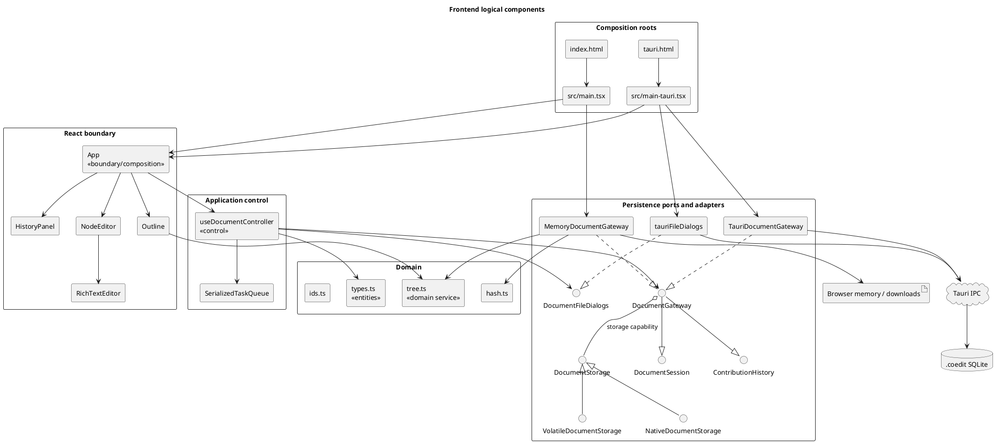

# Frontend design

This document is the implementation guide for the React/TypeScript part of Coedit Local. It describes the code as it exists now. Sections labeled **Recommendation** are proposed contribution guidance, not implemented behavior.

Related documents:

- [Documentation index](README.md)
- [Repository overview](../README.md)
- [Architecture](ARCHITECTURE.md)
- [Sequence diagrams](SEQUENCE_DIAGRAMS.md)
- [Feature-to-code traceability](TRACEABILITY.md)
- [Known limitations](KNOWN_LIMITATIONS.md)
- [UI and UX specification](UI_UX.md)
- [Proposed continuous-workspace change package](proposals/README.md)

## Purpose and design boundary

The frontend owns interaction state, presentation, hierarchy commands, rich-text editing, application-use-case sequencing, and the browser implementation of the domain rules. It does not know how a desktop document is stored. `App` passes injected host services to `useDocumentController`; that controller consumes `DocumentGateway`, optional `DocumentFileDialogs`, and the gateway's discriminated `DocumentStorage` capability.

There are two explicit composition roots. There is no runtime test for Tauri inside the shared UI:

| Runtime | HTML entry | TypeScript entry | Injected document gateway | Injected dialogs |
|---|---|---|---|---|
| Standalone HTML and ordinary browser development | `index.html` | `src/main.tsx` | `MemoryDocumentGateway` | None |
| Tauri desktop webview | `tauri.html` | `src/main-tauri.tsx` | `TauriDocumentGateway` | `tauriFileDialogs` |

The default production web build is transformed by `standaloneHtml()` in `vite.config.ts` into one self-contained `dist/index.html`. The Tauri build uses Vite mode `tauri`, retains normal generated assets, and starts at `tauri.html`.

## RUP design model

In RUP terms, the frontend contains boundary, control, and entity/domain elements:

- **Boundary:** HTML entry points and the components in `src/components/` and `src/editor/`.
- **Control:** `useDocumentController`, `SerializedTaskQueue`, gateway implementations, and the rich-text commit coordinator inside `RichTextEditor`.
- **Entity/domain:** the interfaces in `src/domain/types.ts` and tree operations in `src/domain/tree.ts`.
- **External boundary:** Tauri IPC and native dialogs, isolated behind adapters in `src/persistence/`.



## Source map

### Composition and application control

| File | Exported symbol or entry behavior | Responsibility |
|---|---|---|
| `index.html` | Loads `/src/main.tsx` | Source entry for standalone/browser builds. The generated `dist/index.html` is the double-clickable artifact. |
| `tauri.html` | Loads `/src/main-tauri.tsx` | Source entry used by the Tauri build. |
| `src/main.tsx` | Entry module | Mounts `App` under `StrictMode` with a `MemoryDocumentGateway` and its available revision-query capability. |
| `src/main-tauri.tsx` | Entry module | Mounts `App` under `StrictMode` with a `TauriDocumentGateway`, its explicitly host-deferred revision-query capability, and `tauriFileDialogs`. |
| `src/App.tsx` | `App` | Owns welcome/profile presentation, renders live versus historical controller state, and translates UI events into controller calls. |
| `src/application/useDocumentController.ts` | `useDocumentController`, `HistoryQuery` | Owns the active workspace projection, revision-request origin/epoch, authoritative editor generation, contribution paging, capability dispatch, command guards, error/status state, contributor context, queue, and draft-transition barrier. |
| `src/application/workspaceProjection.ts` | `WorkspaceProjection`, `RevisionRequestState`, live/historical context types, projection helpers, `WorkspaceMutationUnavailableError` | Explicit live/historical presentation model, retained live selection/view and one-shot editor-resume candidate, read-only historical `DocumentView` derivation, Back projection, and command-guard error. |
| `src/application/serializedTaskQueue.ts` | `SerializedTaskQueue` | Runs document commands sequentially and keeps the queue usable after a rejection. |
| `src/application/draftTransition.ts` | `DraftParticipant`, `DraftTransitionCoordinator`, `DraftTransition` | Freezes registered drafts synchronously, drains them before a controlled transition, then unfreezes in reverse order. |
| `vite.config.ts` | Default Vite configuration; private `standaloneHtml()` plugin | Selects the composition root and creates the self-contained standalone artifact. |

### Components and editor

| File | Key symbol | Responsibility |
|---|---|---|
| `src/components/Outline.tsx` | `Outline` | Builds and presents the active node tree; selection, expansion, keyboard traversal, sibling reorder, drag-to-reparent, add, and delete. |
| `src/components/Outline.tsx` | Private `OutlineRow` | Recursive row rendering and row-level commands. |
| `src/components/NodeEditor.tsx` | `NodeEditor` | Owns dirty node title/tag drafts and composes the nested tag and rich-text body participants into one controller-visible participant. |
| `src/components/HistoricalNodeView.tsx` | `HistoricalNodeView` | Renders historical title, tags, and sanitized rich text as static content without inputs, Tiptap/Yjs, timers, or draft participants. |
| `src/components/HistoricalWorkspaceBanner.tsx` | `HistoricalWorkspaceBanner` | Persistently identifies viewed/current revisions, announces historical mode, and exposes Back plus separately confirmed restore intents. |
| `src/components/TagEditor.tsx` | `TagEditor` | Editable ARIA combobox, reusable document suggestions, freeform tag creation, removable chips, keyboard/touch interaction, and pending-input flushing. |
| `src/editor/RichTextEditor.tsx` | `RichTextEditor` | Tiptap/Yjs lifecycle, toolbar, grouping, retry-preserving commit drain, and participant registration with `NodeEditor`. |
| `src/editor/sanitizeRichText.ts` | `sanitizeRichText`, `RICH_TEXT_POLICY`, allowlists | Central browser sanitization contract used for paste, fallback load, and commit. |
| `src/editor/yjsEncoding.ts` | `bytesToBase64`, private `base64ToBytes`, `createYDoc` | Converts Yjs binary state to/from the string representation carried by the domain model. |
| `src/components/HistoryPanel.tsx` | `HistoryPanel` | Debounces history filters, presents page/loading/error state, requests older pages, and exposes View/current/loading/viewed states on capable hosts; host-deferred native mode retains row-level Restore. |
| `src/styles.css` | Global style sheet | Layout, visual states, design tokens, focus indication, and the current responsive breakpoint. |

### Domain and extension contracts

| File | Key symbols | Responsibility |
|---|---|---|
| `src/domain/types.ts` | `DocumentState`, `DocumentView`, `DocumentNode`, `DocumentOperation`, `ContributionPage`, `RecoveryExport`, `ExportFormat`, related interfaces and unions | Shared serialized model, paging/recovery shapes, and operation contract. |
| `src/domain/tree.ts` | `TreeNode`, `buildTree`, private `descendantIds`, `assertValidTree`, `affectedNodeIds`, `applyOperation` | Hierarchy projection, validation, mutation, and attribution support. |
| `src/domain/json.ts` | `cloneJson`, `cloneJsonObject`, `canonicalJson`, `compareJsonStrings` | Validates/detaches JSON-only data (including strict array/property rules) and serializes it with explicit UTF-16 key ordering. |
| `src/domain/tags.ts` | `normalizeTag`, `normalizeTags`, `collectActiveTags` | Defines tag limits, canonicalization/deduplication, and the active document-local suggestion vocabulary. |
| `src/domain/hash.ts` | `DOCUMENT_HASH_ALGORITHM`, `toDocumentState`, `canonicalDocumentJson`, `hashDocument` | Explicit host-field projection, versioned canonical JSON, and browser SHA-256 hashing. |
| `src/domain/ids.ts` | `newId` | Browser-safe UUID generation. |
| `src/ai/provider.ts` | `AiRequest`, `AiProvider` | Unwired extension contract for an explicitly invoked AI proposal provider. No implementation is registered. |

### Persistence ports and adapters

| File | Key symbols | Responsibility |
|---|---|---|
| `src/persistence/gateway.ts` | `DocumentSession`, `ContributionHistory`, `DocumentRevisionQueries`, `RevisionQueryCapability`, `MaterializedRevision`, storage types, `DocumentGateway`, page helpers | Host-neutral command/history/query ports, discriminated storage and revision-query capabilities, verified-query errors, and bounded cursor-page construction. |
| `src/persistence/fileDialogs.ts` | `DocumentFileDialogs`, `safeFilenameStem` | Host-neutral native-path port and one portable filename-normalization rule shared by browser/native adapters. |
| `src/persistence/memoryGateway.ts` | `MemoryDocumentGateway` | Volatile browser implementation with an in-memory ledger, hash-bearing revision snapshots, and verified non-mutating materialization. |
| `src/persistence/tauriGateway.ts` | `TauriDocumentGateway` | Thin adapter from `DocumentGateway` methods to Tauri command names; advertises native revision queries as host-deferred. |
| `src/persistence/tauriFiles.ts` | Four private dialog functions and `tauriFileDialogs` | Tauri dialog-plugin adapter for create, open, export, and backup destinations. |

## React structure

```text
createRoot
└── App
    ├── welcome-shell                         view === null
    └── app-shell                             view !== null
        ├── topbar
        ├── compatibility/error banners
        ├── HistoricalWorkspaceBanner     workspaceProjection.kind === historical
        └── workspace
            ├── Outline
            │   └── OutlineRow                recursive
            ├── editor-pane
            │   ├── NodeEditor                active live selection
            │   │   └── RichTextEditor
            │   ├── HistoricalNodeView        active historical selection
            │   └── empty-editor              no active selection
            └── HistoryPanel                  historyOpen === true
```

Components are controlled through props and callbacks. There is no router, React context, external state store, or application event bus. `useDocumentController` is the single application-level controller; `App` is the rendering/composition boundary above it.

## Type relationships

This diagram emphasizes the frontend-facing contracts; it is not a claim that TypeScript interfaces exist at runtime.

```plantuml
@startuml
title Frontend type and adapter relationships
hide empty members

interface DocumentGateway {
  +storage: DocumentStorage
  +closeDocument(): Promise<void>
  +applyOperation(operation, context): Promise<DocumentView>
  +listContributions(query): Promise<ContributionPage>
  +restoreRevision(revision, context): Promise<DocumentView>
}

interface DocumentRevisionQueries {
  +materializeRevision(revision): Promise<MaterializedRevision>
}

interface RevisionQueryCapability

interface DocumentStorage

interface VolatileDocumentStorage {
  +kind: "volatile"
  +createDocument(title, contributor): Promise<DocumentView>
  +exportDocument(format): Promise<ExportResult>
}

interface NativeDocumentStorage {
  +kind: "native-file"
  +createDocument(path, title, contributor): Promise<DocumentView>
  +openDocument(path): Promise<DocumentView>
  +backupDocument(path): Promise<ExportResult>
  +exportDocument(format, path): Promise<ExportResult>
}

interface DocumentFileDialogs {
  +chooseDocumentToOpen(): Promise<string | null>
  +chooseDocumentToCreate(name): Promise<string | null>
  +chooseExportPath(format, title): Promise<string | null>
  +chooseBackupPath(title): Promise<string | null>
}

class MemoryDocumentGateway {
  -current: DocumentView | null
  -contributions: Contribution[]
  -revisions: Map<number, StoredRevision>
}

class TauriDocumentGateway
class useDocumentController <<React control>>
class WorkspaceProjection <<discriminated union>>
class RevisionRequestState <<discriminated union>>
class SerializedTaskQueue
class DraftTransitionCoordinator
class App <<React boundary>>
class Outline <<React boundary>>
class NodeEditor <<React boundary>>
class RichTextEditor <<React boundary>>
class HistoryPanel <<React boundary>>
class HistoricalNodeView <<React boundary>>
class HistoricalWorkspaceBanner <<React boundary>>
class DocumentView <<entity>>
class DocumentState <<entity>>
class DocumentNode <<entity>>
class Contribution <<entity>>
class ContributionPage <<value object>>
class DocumentOperation <<discriminated union>>
class ContributionContext <<value object>>

MemoryDocumentGateway ..|> DocumentGateway
MemoryDocumentGateway ..|> DocumentRevisionQueries
MemoryDocumentGateway ..|> VolatileDocumentStorage
TauriDocumentGateway ..|> DocumentGateway
TauriDocumentGateway ..|> NativeDocumentStorage
DocumentGateway o-- DocumentStorage
App --> RevisionQueryCapability : injects
RevisionQueryCapability o-- DocumentRevisionQueries : when available
DocumentStorage <|-- VolatileDocumentStorage
DocumentStorage <|-- NativeDocumentStorage
App --> useDocumentController
useDocumentController --> SerializedTaskQueue
useDocumentController --> DraftTransitionCoordinator
useDocumentController --> DocumentGateway : injected
useDocumentController --> RevisionQueryCapability : injected
useDocumentController --> WorkspaceProjection : owns
useDocumentController --> RevisionRequestState : owns
useDocumentController --> DocumentFileDialogs : optional/injected
App --> Outline
App --> NodeEditor
App --> HistoryPanel
App --> HistoricalNodeView
App --> HistoricalWorkspaceBanner
NodeEditor --> RichTextEditor
useDocumentController --> WorkspaceProjection : owns current mode
WorkspaceProjection --> DocumentView : derives displayed view
useDocumentController --> "0..*" Contribution : owns loaded pages
useDocumentController --> ContributionPage
DocumentView --|> DocumentState
DocumentState o-- "0..*" DocumentNode
useDocumentController --> DocumentOperation : dispatches
useDocumentController --> ContributionContext : creates
@enduml
```



## Application state and control flow

`App` owns only the welcome title and locally persisted contributor profile. `useDocumentController` owns the document use-case state:

| State | Meaning | Primary writers |
|---|---|---|
| `workspaceProjection: WorkspaceProjection \| null` | Source of truth for live versus historical display; `null` is welcome. Historical state retains the exact live context and has no editor owner. | create/open/apply/restore, accepted revision query, Back, close, selection. |
| returned `view: DocumentView \| null` | Derived displayed view. Live returns the accepted gateway view; historical projects the verified `DocumentState` with host path/warning and `readOnly: true`. | derived from `workspaceProjection`. |
| `revisionRequest: RevisionRequestState` | Idle or one loading revision with request ID and exact live/historical origin. | `viewRevision`, Back, create/open/restore/close, query success/failure. |
| `contributions: Contribution[]` | Loaded newest-first pages for the active filters. | first-page refresh, `loadOlderHistory`, close/query reset. |
| returned `selectedId: string \| null` | Active non-deleted node in the displayed projection; historical selection is separate from retained live selection. | projection construction and controlled selection. |
| `editorGeneration: number` | Authoritative editor-instance generation included in `NodeEditor`'s React key. | create, open, restore, close. |
| `historyOpen: boolean` | Whether the history panel is rendered. | History and close buttons. |
| `historyLoading`, `historyHasMore`, `historyStale`, `historyError` | Independent contribution-page request state. | guarded history requests and accepted-view invalidation. |
| `busyCount` / returned `busy` | Number/boolean for queued or running document commands. | `enqueue()`. |
| `transitioning: boolean` | A controlled draft freeze/drain/workspace transition is active. | `runTransition()`. |
| `error: string \| null` | Last command/draft-flush error. | `executeMutation()`, `runTransition()`, and banner close. |
| `status: string` | Last successful lifecycle/mutation/export message. | mutation/transition success labels. |
| `sessionId` ref | One generated identifier for this mounted controller. | Initialized once with `newId()`. |
| `workspaceEpoch`, `historyRequest`, `revisionRequestId` refs | Reject responses belonging to an old workspace or superseded history/revision query. | create/open/close/query/history requests and Back. |
| `historyQuery`, `historyCursor` refs | Current normalized server-side filters and exclusive revision cursor. | query change, accepted view, load older. |
| `DraftTransitionCoordinator` | Registry for the document-title and current node-editor participants. | participant effects; `runTransition()`. |

The contributor used for an operation is selected in this order:

1. matching contributor in the open document for `profile.id`;
2. first contributor in the open document;
3. local `profile`.

The profile uses the local-storage key `coedit-local-contributor`. Read, parse, and write failures are deliberately non-fatal so the standalone `file://` artifact remains usable in restrictive browsers.

`acceptView()` repairs the retained live selection whenever a returned document is accepted: it preserves the current live ID only for the same document when the node remains active; otherwise it selects the first active node or `null`. It rejects an older live revision for the same document and ignores a response from an obsolete workspace epoch. Every accepted command returns the projection to live mode. Create, open, and restore mark the response as an authoritative reset and increment `editorGeneration`, so even a restored selection with the same node ID gets a new `NodeEditor` and `Y.Doc`.

`DocumentTitleInput` and `NodeEditor` are controlled draft owners. Each keeps its dirty values across ordinary view replacements, registers a `DraftParticipant`, disables editing when frozen, and removes only successfully persisted fields from its dirty set. `NodeEditor` composes its metadata drain with the nested rich-text participant. `runTransition()` freezes all currently registered participants synchronously before its first `await`, drains them sequentially, runs the requested action, and always unfreezes in reverse order. A drain failure cancels the action and preserves the dirty state for retry; a second overlapping transition is declined.

## Operation dispatch

Normal mutations follow one path:

```text
component callback
  -> controller.applyOperation(operation, message, optional groupId)
  -> synchronously freeze registered title/node-editor drafts
  -> await metadata and rich-text drains
  -> controller.context(message, groupId)
  -> SerializedTaskQueue.enqueue(...)
  -> DocumentGateway.applyOperation(operation, context)
  -> complete updated DocumentView
  -> acceptView(updated) with epoch/revision guard
  -> if History is open: request/accept its first page with request/epoch guards
     else: mark loaded History stale until the panel opens
```

`context()` includes the selected contributor, the per-mount session ID, an optional group ID, and a human-readable message. `addNode()` creates the node ID before dispatch so it can select that node when the operation resolves. Content commits create a fresh group ID for each debounced editor batch and enter the same serialized queue. A rejected task does not poison later queue entries.

History reads are not serialized with document commands. The controller instead gives each request a monotonically increasing request number and workspace epoch. A superseded request cannot overwrite the active page. Search/node filters run in the adapter before pagination; the panel debounces query changes by 250 ms. Pages contain 100 items by default, advertise `hasMore`, and use `nextBeforeRevision` as an exclusive cursor for **Load older contributions**. The header suffixes the loaded count with `+` when more entries are reachable; it is not a total-count query.

`viewRevision()` is connected to capable-host **View** actions in `HistoryPanel`. It first narrows `RevisionQueryCapability`; an unavailable host fails before drafts are touched. An available query freezes/drains drafts, captures the exact projection origin, records a monotonic request ID plus workspace epoch, and calls `materializeRevision()`. Only the current response can enter historical mode. Failure restores the exact origin; Back invalidates loading and recovers the retained live projection without a gateway call; Close invalidates and clears both projections. A newer View supersedes an older request. `commitRawOperation`, export, and backup require an idle live projection; the guard is checked again inside the serialized mutation task. Create/open are welcome-only lifecycle intents. Historical rendering replaces `DocumentTitleInput`/`NodeEditor` with static text and `HistoricalNodeView`, while restore is available only through the separately confirmed banner action and exits historical mode only after the compensating command succeeds.

The operation union in `src/domain/types.ts` currently contains:

- `createNode`
- `updateNode`
- `updateBody`
- `moveNode`
- `softDeleteNode`
- `restoreNode`
- `renameDocument`

`restoreNode` is supported in the domain and persistence contract but has no current UI command. Revision restoration is a separate gateway method because it restores a whole snapshot while adding a compensating contribution.

## Hierarchy projection and editing

The persisted model is a flat `DocumentNode[]` with `parentId` and `position`. `Outline` calls `buildTree()` to create recursive `TreeNode` values for rendering. Deleted nodes are excluded from that projection.

`applyOperation()` in `src/domain/tree.ts` is the in-browser reference implementation for the memory gateway. It:

- validates and detaches the state with `cloneJson`;
- rejects duplicate IDs and missing referenced nodes;
- inserts and normalizes sibling positions;
- rejects moving a node under one of its descendants;
- soft-deletes an entire descendant subtree;
- restores the named node and its ancestor chain;
- updates document/node timestamps; and
- calls `assertValidTree()` before returning.

The desktop persistence layer has its own Rust implementation. Changes to operation semantics must keep both implementations equivalent.

## Rich-text and Yjs principle of operation

`RichTextEditor` treats the complete Base64-encoded Yjs state as the persisted collaborative source and keeps sanitized HTML as a materialized representation for display/export.

1. `createYDoc(node.yjsState)` creates a `Y.Doc`.
2. If encoded state exists, `Y.applyUpdate` loads it with origin `persistence-load`.
3. Tiptap uses `StarterKit` with its own undo/redo disabled and `Collaboration` attached to Yjs field `content`.
4. If there is legacy/materialized HTML but no Yjs state, a sanitized version is loaded into Tiptap.
5. Every Yjs update except `persistence-load` is accumulated in `pendingUpdates`.
6. A new update resets a 1.2-second timer.
7. On flush, the quiet-period timer is canceled and updates are merged with `Y.mergeUpdates`.
8. Current editor HTML is sanitized through `sanitizeRichText()`.
9. Both the merged incremental update and `Y.encodeStateAsUpdate(document)` are Base64 encoded.
10. `onCommit(bodyHtml, yjsUpdate, yjsState)` dispatches `updateBody` through the controller queue.
11. If updates arrive while a commit is awaiting persistence, the drain loop commits them before resolving. If persistence rejects, the merged delta is restored to the pending queue for a later explicit retry.

The component exposes its `DraftParticipant` to `NodeEditor`; the node editor combines that drain with its metadata drain and registers the aggregate with the controller. Together with the document-title participant, controlled node selection, document operations, restore, export, backup, and Close freeze new edits and await all dirty state before proceeding. `RichTextEditor` cleanup intentionally clears its timer and does not start unawaitable persistence work; browser unload/process termination therefore remains outside the guarantee. The toolbar currently exposes bold, italic, level-two heading, bullet list, ordered list, blockquote, undo, and redo.

`RICH_TEXT_POLICY`, `RICH_TEXT_ALLOWED_TAGS`, and `RICH_TEXT_ALLOWED_ATTRIBUTES` in `src/editor/sanitizeRichText.ts` define the versioned browser policy. Paste, legacy/fallback load, and commit all use the same helper. `fixtures/protocol/rich-text-v1.json` and its Vitest suite provide standalone expected outputs and idempotence evidence. Desktop persistence sanitizes independently; Rust fixture parity is deferred to the second pass.

## Gateway behavior

### Standalone memory adapter

`MemoryDocumentGateway` maintains:

- one current `DocumentView`;
- an in-memory oldest-first append ledger, projected newest-first for queries/exports;
- a `Map` of projected state snapshots and their commit-time hashes by revision.

It uses `applyOperation()` for mutation and `hashDocument()` for SHA-256 state hashes. `materializeRevision()` validates a nonnegative safe-integer key, clones and tree-validates the projected `DocumentState`, recomputes its hash, and returns it only when the stored hash matches. The query does not replace live state or mutate the ledger/snapshot map. `listContributions()` reverses the ledger to newest-first and supports node, contributor, revision, search, and limit filters. Export uses `Blob`, `URL.createObjectURL`, and a temporary download anchor. It cannot open SQLite files, and all document state disappears when the page closes.

History filters are applied to the complete in-memory ledger before page construction. The gateway returns `ContributionPage` with an exclusive revision cursor. Standalone JSON is explicitly marked `format: "coedit-recovery"`, `RecoveryExport` version 2: portable `DocumentState` plus every newest-first contribution accumulated during the current session. It intentionally excludes host-only view fields and runtime snapshot objects, and there is no importer yet. Browser filenames use the shared `safeFilenameStem()` rule.

### Tauri adapter

`TauriDocumentGateway` is intentionally thin. Each method invokes one Rust command using `@tauri-apps/api/core`:

| Gateway method | Tauri command |
|---|---|
| `createDocument` | `create_document` |
| `storage.openDocument` (`native-file`) | `open_document` |
| `closeDocument` | `close_document` |
| `applyOperation` | `apply_operation` |
| `listContributions` | `list_contributions` |
| `restoreRevision` | `restore_revision` |
| `storage.backupDocument` (`native-file`) | `backup_document` |
| `exportDocument` | `export_document` |

Native dialogs are separate from document persistence. `TauriDocumentGateway.storage` has kind `native-file`; `MemoryDocumentGateway.storage` has kind `volatile`. The controller narrows that union to derive method signatures and visible actions rather than requiring standalone methods that can only reject. Separately, each composition root passes a discriminated `RevisionQueryCapability`: memory is available, while Tauri is `host-deferred` and exposes no throwing method. `App` injects this boundary into the controller and `HistoryPanel` exposes **View** only for the available variant; host-deferred Tauri retains row-level Restore. The Tauri adapter wraps the Rust contribution array as a `ContributionPage`, but Rust filtering/hash/sanitizer parity and native verification remain second-pass work.

## Adding or changing frontend functionality

### Add a document operation

1. Add a discriminant and payload to `DocumentOperation` in `src/domain/types.ts`.
2. Implement browser semantics in `applyOperation()` in `src/domain/tree.ts`.
3. Update `affectedNodeIds()` so history filtering and attribution are correct.
4. Add the initiating callback/control to `App` or a child component and route orchestration through `useDocumentController`.
5. Mirror the operation in `src-tauri/src/models.rs` and `src-tauri/src/store.rs`.
6. Add domain, memory-gateway, Rust-store, and appropriate component tests.
7. Update [Traceability](TRACEABILITY.md), persisted-format documentation if applicable, and use-case/sequence documentation.

### Change node tags

1. Change normalization and limits in `src/domain/tags.ts` and its tests.
2. Keep `TagEditor` keyboard, IME, touch, error, and screen-reader behavior aligned with the editable combobox pattern.
3. Update Rust tag validation/serialization and SQLite `tags_json` handling.
4. Add domain, component, recovery/hash, and round-trip tests, then update the format and UX documentation.

### Add editor formatting

1. Register/configure the Tiptap extension in `RichTextEditor.tsx`.
2. Add a toolbar command and active/disabled state.
3. Extend the versioned allowlist in `sanitizeRichText.ts` only as narrowly as required, update `fixtures/protocol/rich-text-v1.json`, and decide whether the policy identifier must advance.
4. Make the matching Rust Ammonia policy accept the same safe representation.
5. Verify paste sanitization, persisted HTML, Yjs reload, Markdown export, and read-only display.

### Add another runtime or persistence adapter

1. Implement the shared `DocumentSession` and `ContributionHistory` behavior through `DocumentGateway` without importing the adapter into UI components.
2. Implement the applicable `VolatileDocumentStorage` or `NativeDocumentStorage` shape; implement `DocumentFileDialogs` separately when the host can choose paths.
3. Add a composition root analogous to `src/main.tsx` or `src/main-tauri.tsx`.
4. Give the runtime an explicit HTML/build entry rather than adding host detection to `App`.
5. Run the shared gateway contract tests plus adapter-specific failure tests.

### Add an export format

Extend the centralized `ExportFormat` union in `src/domain/types.ts`, update the controller/menu and relevant adapters/dialogs, add the Tauri command/store behavior when supported, and document whether the format is recovery, interchange, or presentation-only. Keep filename derivation in `safeFilenameStem()` rather than copying slug logic.

### Add an AI provider

`src/ai/provider.ts` is only a contract. An implementation should be injected explicitly, initiated only by a user action, and return a proposal. Accepted changes must become ordinary attributed `DocumentOperation` values; a provider must not mutate a gateway or document directly.

## Proposed workspace replacement — not implemented

The current source map, React tree, class diagram, and control flow above remain the as-built design. A resumable target design is maintained separately:

- [Continuous block-outline](proposals/CONTINUOUS_BLOCK_OUTLINE.md) replaces the `Outline` plus selected `NodeEditor` composition with `DocumentCanvas`, a pure visible-node projection, separate canvas-context/focus-region/editor-owner state, drain-before-hide controls, and one active Tiptap owner. An optional `NavigatorPanel` may render a navigation-only tree over the same live or historical `WorkspaceProjection`; it is not a second editor or presentation strategy.
- [Query-first historical views](proposals/QUERY_FIRST_HISTORY.md) now has WP-1 query capability/materialization, WP-2 explicit `WorkspaceProjection = live | historical` with origin/stale/command guards, and WP-3 View-first standalone presentation with a sanitized static historical detail, persistent banner, Back, and separately confirmed restore. Continuous-canvas contexts and native parity remain proposed.
- [Body checkpoint strategy](proposals/BODY_CHECKPOINT_STRATEGY.md) replaces the 1.2-second timer with a transaction-classifying batch coordinator, two-checkpoint FIFO backpressure, and page-aware group projection. It requires one injectable code policy containing easily modifiable `batchCharacterThreshold` and `idleTimeoutMs` values.

Proposed names and interfaces must not be added to the current source-map tables until corresponding files exist. Target navigator state separates `navigatorDockPreferredOpen`, page-session `historyDockRequestedOpen`, transient/mutually-exclusive `activeCompactAuxiliary`, `lastExplicitAuxiliary`, `navigatorSelectionId`, and `navigatorExpandedIds` from `canvasContextNodeId`, `focusRegion`, actual `editorOwnerNodeId`, the one-shot `resumeEditorNodeId` held only by a retained-live wrapper, and canvas expansion. Effective Navigator/History rendering is derived from layout plus requested/active state; only effective History visibility drives its initial/refresh queries, hidden changes mark the page stale, and a monotonic `historyDataGeneration` prevents an older in-flight response from clearing that state. `NavigatorPanel` may select/reveal a block and explicitly transfer focus through the same controlled draft boundary, but must not mount Tiptap, expose metadata/body editors, dispatch structural mutations, or write its browser preference into document state. Restore must never mount a resumed editor until its required ancestry is expanded and it is visible. Implementation should follow the delivery slices and acceptance criteria in the proposal index rather than attempting a single document-wide ProseMirror rewrite.

## Current implementation constraints

These are observations, not recommended behavior. The consolidated risk list and remediation status belong in [Known limitations](KNOWN_LIMITATIONS.md).

- Authoritative create/open/restore responses increment `editorGeneration`, and `App` keys `NodeEditor` by node ID plus that generation. This deliberately remounts the editor/Yjs state after same-node restore; a controller test covers the generation change, but no full Tiptap DOM regression test exists.
- Controlled controller actions freeze and drain document-title, pending tag-input, node-metadata, and rich-text drafts. Unexpected page/process exit, forced host suspension, and arbitrary React teardown remain unawaitable.
- `busy` disables outline mutations, but `NodeEditor` receives only `view.readOnly`, so typing can continue during an outstanding commit.
- History errors are isolated from successful mutations, but automatic refreshes are fire-and-forget and there is no total count. The desktop store still pre-windows the newest 100,000 rows before applying filters.
- If a local profile is not present in an opened document, `App` falls back to its first contributor for new contribution context.
- Standalone JSON includes current state and complete runtime contributions but has no importer and does not include the revision snapshot map.
- The memory adapter records session IDs in contributions but does not populate `DocumentState.sessions`.
- The standalone `coedit-document-state-v1` hash now has a golden fixture and excludes view-only fields. Rust has not yet adopted/proved that canonical byte representation.
- `Outline` initializes expansion state only on mount. IDs added later are not automatically expanded.
- `App` composes a separate `Outline` with one selected `NodeEditor`; the current workspace is master/detail rather than a continuous document canvas.
- Standalone History can enter an explicit read-only historical projection through the memory query, renders static sanitized content with no editor participant, and exposes a persistent Back/confirmed-restore banner. Tauri advertises the query as host-deferred and retains row-level restore until WP-10.
- `RichTextEditor` uses a fixed 1.2-second quiet-period timer and `commitBody` creates a fresh group ID for every checkpoint; edit episodes are not semantically grouped.
- Hook-level controller and full-`App` historical-flow tests cover View/Back/non-mutation and one confirmed restore; focused component tests cover the static sanitizer path, banner semantics, and History capability presentation. Complete Tiptap timing, browser end-to-end, accessibility, and native suites remain absent.

## Review checklist for frontend changes

**Recommendation:** reviewers should verify the following before merging a frontend feature:

- Shared UI modules contain no Tauri imports.
- Standalone and desktop composition roots still compile independently.
- All mutations pass through `DocumentGateway` and have contribution context.
- Browser and Rust operation semantics remain equivalent.
- Rich HTML is sanitized at both trust boundaries.
- Writable, busy, read-only, warning, error, empty, and history-open states remain coherent.
- Keyboard access and visible focus are preserved.
- The standalone build still produces exactly one self-contained HTML artifact.
- Tests and [Traceability](TRACEABILITY.md) identify the new behavior.
