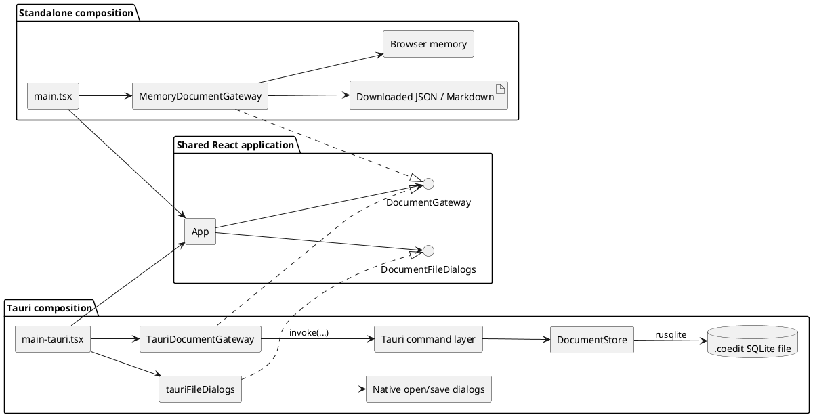
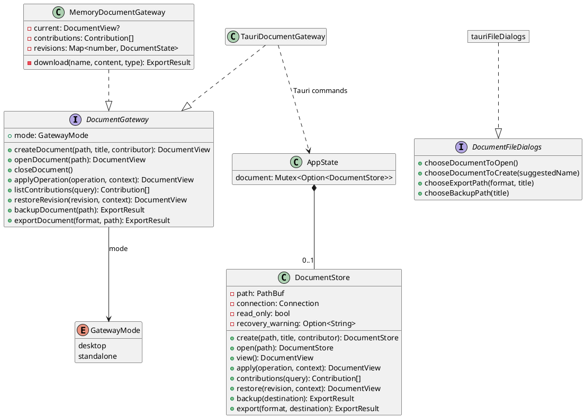
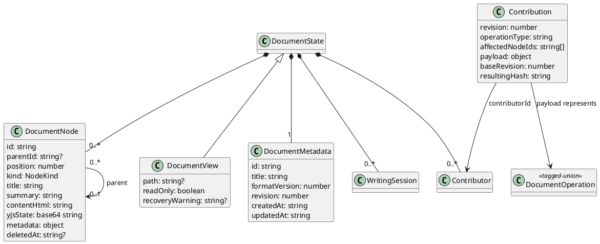
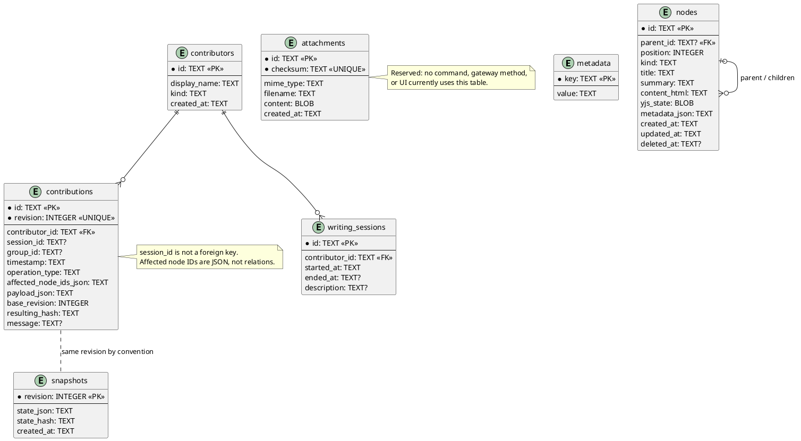
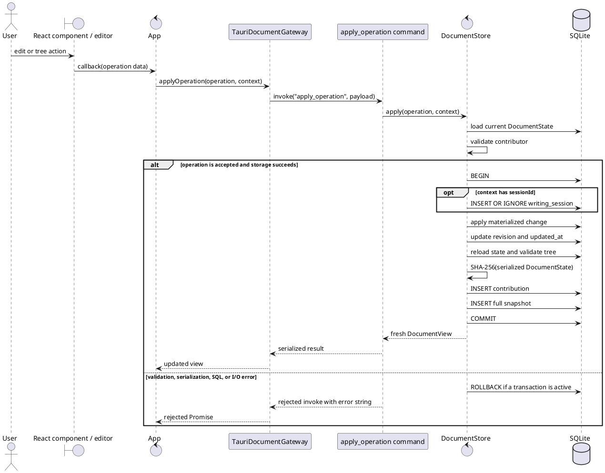
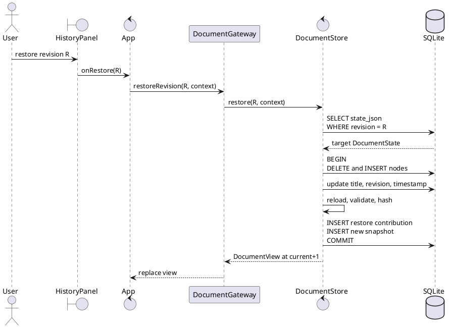

# Persistence design

This artifact describes the persistence subsystem that exists in Coedit Local `0.1.0`. It is the analysis-and-design/data-model companion to the [architecture](./ARCHITECTURE.md), [document-format specification](./DOCUMENT_FORMAT.md), and [security model](./SECURITY.md). It deliberately distinguishes the durable Tauri implementation from the in-memory standalone implementation.

For unresolved defects and constraints, see [Known limitations](./KNOWN_LIMITATIONS.md). For end-to-end use-case realizations, see [Sequence diagrams](./SEQUENCE_DIAGRAMS.md).

## Responsibilities and boundary

The shared React UI does not know whether a document lives in browser memory or SQLite. It calls a TypeScript port, `DocumentGateway`. Native file selection is a second port, `DocumentFileDialogs`, so path selection is not part of document storage.

There are two explicit compositions:

- `src/main.tsx` constructs `MemoryDocumentGateway` for the standalone `index.html` artifact.
- `src/main-tauri.tsx` constructs `TauriDocumentGateway` and supplies `tauriFileDialogs` for the desktop host.

There is no runtime probing for Tauri and no local HTTP persistence service. Desktop persistence crosses Tauri IPC; standalone persistence stays inside the browser process.

## Ports, adapters, and ownership

### `DocumentGateway`

`src/persistence/gateway.ts` is the persistence port. Its `mode` discriminant is either `standalone` or `desktop`. The methods cover:

- create, open, close, and get current document;
- apply one attributed `DocumentOperation`;
- query contributions;
- restore a prior revision as a new revision;
- create a backup;
- export JSON or Markdown.

The port returns complete `DocumentView` values after mutations. It has no event stream, optimistic expected-revision argument, partial-load API, contributor-registration API, attachment API, or import API.

### `DocumentFileDialogs`

`src/persistence/fileDialogs.ts` owns native selection of document, export, and backup paths. `src/persistence/tauriFiles.ts` implements it with `@tauri-apps/plugin-dialog`. The standalone composition omits the port because browser downloads choose their destination according to browser policy.

### `MemoryDocumentGateway`

`src/persistence/memoryGateway.ts` stores:

- one current `DocumentView`;
- an in-memory `Contribution[]`;
- a `Map<number, DocumentState>` containing every runtime revision.

It uses `src/domain/tree.ts` for operations and `src/domain/hash.ts` for SHA-256 hashes. It can create, edit, query history, restore, and download exports. It cannot open SQLite files, and closing or reloading destroys the document.

### `TauriDocumentGateway`

`src/persistence/tauriGateway.ts` is intentionally thin. Each method validates only path presence where required and delegates to a named Tauri command with `invoke`. Rust owns durable validation, transactions, recovery metadata, sanitization, and file output.

### Rust command and store layers

`src-tauri/src/lib.rs` contains the IPC boundary. `AppState` holds `Mutex<Option<DocumentStore>>`, so the running application has one current store and serializes command access to it. Tauri commands translate Rust errors to rejected invoke promises as strings.

`src-tauri/src/store.rs` contains schema creation, loading, validation, operations, revision history, restore, backup, and export. `src-tauri/src/models.rs` mirrors the camel-case TypeScript wire model with Serde.

## Domain and wire model

The TypeScript source of truth for frontend-facing shapes is `src/domain/types.ts`. The Rust transport equivalents are in `src-tauri/src/models.rs`. Serde uses `camelCase`, and `DocumentOperation` is a tagged union with a `type` field.

The seven implemented operation variants are `createNode`, `updateNode`, `updateContent`, `moveNode`, `softDeleteNode`, `restoreNode`, and `renameDocument`. Contributions additionally use `createDocument` and `restoreRevision` as operation types.

## Implementation map

| Concern | File and symbol |
|---|---|
| Frontend domain and wire types | `src/domain/types.ts` |
| In-memory tree rules | `src/domain/tree.ts`: `applyOperation`, `assertValidTree`, `affectedNodeIds` |
| Browser canonicalization and hashing | `src/domain/hash.ts`: `canonicalDocumentJson`, `hashDocument` |
| Persistence port | `src/persistence/gateway.ts`: `DocumentGateway` |
| File-dialog port | `src/persistence/fileDialogs.ts`: `DocumentFileDialogs` |
| Standalone adapter | `src/persistence/memoryGateway.ts`: `MemoryDocumentGateway` |
| Desktop adapter | `src/persistence/tauriGateway.ts`: `TauriDocumentGateway` |
| Native file dialogs | `src/persistence/tauriFiles.ts` |
| Standalone composition | `src/main.tsx` |
| Desktop composition | `src/main-tauri.tsx` |
| Rust wire/domain types | `src-tauri/src/models.rs` |
| Tauri state and commands | `src-tauri/src/lib.rs` |
| SQLite store | `src-tauri/src/store.rs`: `DocumentStore` |
| Schema constants | `src-tauri/src/models.rs`: `APPLICATION_ID`, `FORMAT_VERSION` |
| Tauri permissions | `src-tauri/capabilities/default.json` |
| Desktop build/runtime policy | `src-tauri/tauri.conf.json` |
| Format and recovery contract | `docs/DOCUMENT_FORMAT.md` |

### IPC command map

| Gateway method | Tauri command | Store operation |
|---|---|---|
| `createDocument` | `create_document` | `DocumentStore::create`, then `view` |
| `openDocument` | `open_document` | `DocumentStore::open`, then `view` |
| `closeDocument` | `close_document` | Drop the store from `AppState` |
| `applyOperation` | `apply_operation` | `apply` |
| `listContributions` | `list_contributions` | `contributions` |
| `restoreRevision` | `restore_revision` | `restore` |
| `backupDocument` | `backup_document` | `backup` |
| `exportDocument` | `export_document` | `export` |

## SQLite data model

Format version `1` is a SQLite database with application ID `0x434F4544`. The exact portable format is specified in [Document format](./DOCUMENT_FORMAT.md).

### Physical and logical relationships

- `contributors.id` is referenced by `writing_sessions.contributor_id` and `contributions.contributor_id`.
- `nodes.parent_id` is a nullable self-reference. A null parent denotes a root.
- `contributions.session_id` is descriptive text, not a foreign key.
- `contributions.affected_node_ids_json` can name nodes but is not relationally constrained.
- A contribution and snapshot normally share a revision, but the schema defines no foreign key between them.
- `metadata.revision` is stored as text and identifies the current materialized revision.
- `attachments` is reserved and disconnected from the current domain model.

The materialized node table includes deleted nodes. `deleted_at IS NULL` identifies active nodes. Active siblings are ordered by `position` and then ID where a stable tie-break is needed.

## Document lifecycle

### Create

`DocumentStore::create`:

1. rejects an existing destination, a destination without the exact lowercase `.coedit` extension, or a missing parent directory;
2. creates a uniquely named temporary SQLite file beside the destination;
3. initializes schema and PRAGMAs;
4. inserts metadata and the initial contributor in a transaction;
5. creates revision `0`, its `createDocument` contribution, SHA-256 state hash, and full snapshot in that transaction;
6. commits, runs `PRAGMA optimize`, closes the temporary database, and renames it to the requested path;
7. reopens it through the normal validation path.

Creation cleanup attempts to remove the temporary file after an error.

### Open

`DocumentStore::open`:

1. requires an existing regular file but does not require an extension;
2. notes whether a sibling SQLite `-journal` file exists;
3. probes `application_id` and `user_version` read-only;
4. chooses read-only mode for a version newer than the application and read-write mode otherwise;
5. opens with a five-second busy timeout and enables foreign keys;
6. runs `PRAGMA integrity_check` and requires `ok`;
7. verifies the metadata magic marker;
8. loads metadata, contributors, sessions, and nodes;
9. requires metadata `format_version` to equal SQLite `user_version`;
10. validates node identities, parent references, and cycles.

If a journal existed, the returned view contains a recovery warning. A newer file opens read-only only if its core version-1 tables and columns remain readable; forward compatibility is therefore best-effort, not guaranteed.

### Close

Desktop close replaces `AppState.document` with `None`, dropping the SQLite connection. Standalone close clears the current view, contributions, and revision map. Neither adapter prompts independently; close coordination belongs to `App`.

## Transactional mutation

Every desktop `applyOperation` reloads the current state, validates the contributor, and then commits the materialized change, metadata revision, contribution, and snapshot together.

The state read used to calculate `baseRevision` occurs before the SQL transaction begins. The process-local mutex serializes this application's calls, but cross-process collaborative editing is not a supported concurrency model.

### Operation enforcement

| Operation | Durable-store behavior |
|---|---|
| `createNode` | Requires a new ID and existing parent; clamps insertion index; shifts siblings; cleans title; limits summary/content/Yjs; sanitizes HTML; decodes complete Yjs state; inserts; normalizes active sibling positions. |
| `updateNode` | Requires the node; cleans title; limits summary and serialized metadata; changes kind/metadata as supplied; updates timestamp. |
| `updateContent` | Requires the node; checks HTML and encoded-update size; decodes update and state; limits decoded complete state; sanitizes HTML; persists HTML and complete Yjs state. |
| `moveNode` | Requires node and target parent; rejects a descendant target; moves and normalizes both sibling groups. Final state loading also rejects cycles. |
| `softDeleteNode` | Uses a recursive CTE to timestamp the node and all descendants, then normalizes the former active sibling group. |
| `restoreNode` | Clears deletion on the node and its ancestors. It does not restore the node's deleted descendants. |
| `renameDocument` | Trims and limits title, using `Untitled document` when empty. |

The memory adapter performs the corresponding structural transformations in `src/domain/tree.ts`, but it does not implement the Rust store's size checks or independent Ammonia sanitization.

## Invariants and limits

The desktop store enforces these invariants when loading and after mutation:

- node IDs are unique;
- every non-null parent exists;
- the parent graph contains no cycle;
- a contributor named in a mutation is registered in the document;
- newer supported-looking formats are not mutated;
- active sibling positions are normalized after operations that affect ordering;
- contribution revisions are unique;
- current revision, contribution, and snapshot advance atomically for ordinary mutations.

Current Rust limits use UTF-8 byte length:

| Value | Limit |
|---|---:|
| Title | 4,096 bytes |
| Summary | 1 MiB |
| Serialized metadata JSON | 1 MiB |
| Content HTML | 16 MiB |
| Decoded complete Yjs state | 32 MiB |
| Encoded Yjs update string | 64 MiB |

The Yjs update is base64-decoded for validity but is not interpreted or applied by Rust. The caller-supplied complete Yjs state is authoritative. The store does not prove that `contentHtml`, `yjsUpdate`, and `yjsState` represent identical content.

## Contributions, hashes, and snapshots

Each contribution records:

- a UUID and unique revision;
- contributor identity and kind (the latter is resolved when reading);
- optional session, group, and message;
- UTC timestamp;
- operation type, affected node IDs, and serialized payload;
- base revision;
- SHA-256 hash of the resulting state.

The desktop hash is SHA-256 over Serde's JSON encoding of `DocumentState`. It covers document metadata, nodes, contributors, and sessions. It does not cover the contribution ledger, snapshots table, attachments, view path, read-only state, or recovery warning.

The current implementation writes but never verifies `contributions.resulting_hash` or `snapshots.state_hash`. Opening does not replay the contribution ledger, and restore does not compare a snapshot with its stored hash. These are useful recorded checksums, not a tamper-evidence or authenticity guarantee.

The standalone adapter uses `src/domain/hash.ts`, whose canonicalization differs from Rust. It recursively sorts keys and, at runtime, currently also receives `DocumentView` fields. Hash values are therefore not portable across adapters.

Every revision currently stores a full `DocumentState` JSON snapshot. This makes restore direct but can cause substantial database growth. There is no compactor.

### History queries

The Rust store reads at most the newest 100,000 contributions, then applies `beforeRevision`, contributor, node, and text filters in Rust. It returns at most the requested limit, defaulting to 200 and capped at 100,000. Consequently, filters cannot find a matching entry older than the initial 100,000-row window.

The memory adapter reverses its complete runtime array, filters it, and returns 200 by default.

## Revision restore

Restore never rewinds or deletes the ledger. It uses a prior snapshot as content for a new revision:

1. validate write permission and contributor;
2. load the requested snapshot JSON;
3. begin a transaction and defer foreign-key checking;
4. optionally create a writing session;
5. replace all nodes from the snapshot, sanitizing their HTML and decoding Yjs state;
6. restore the snapshot title while retaining current document identity, format metadata, contributors, and sessions;
7. allocate `current revision + 1`;
8. hash the restored materialized state;
9. append a `restoreRevision` contribution and a new full snapshot;
10. commit and return the new view.

Snapshot hashes are not verified, and restore does not reapply every normal mutation size limit. Tree validation during the transactional reload still rejects missing parents and cycles.

## Backup and export

### Desktop backup

`DocumentStore::backup` runs `PRAGMA optimize` for a writable document, copies the SQLite file to a temporary file in the destination directory, calls `sync_all`, and replaces the destination by rename. The normal UI suggests `.coedit-backup`. This is a SQLite copy, not a custom archive.

The normal open dialog filters for `.coedit`, not `.coedit-backup`; the store itself will open either extension. See the recovery procedure in [Document format](./DOCUMENT_FORMAT.md).

### Desktop JSON export

The JSON envelope contains `exportVersion`, `exportedAt`, the complete current `state`, and at most the newest 100,000 `contributions`. It is human-inspectable but not accepted by any importer because no import workflow exists.

### Desktop Markdown export

Markdown visits active nodes depth-first, using document/node titles as headings, summaries as italic paragraphs, and a simple HTML-to-plain-text conversion. It omits deleted nodes, structured rich-text markup, Yjs state, metadata, contributors, sessions, revisions, history, and attachments.

### Output replacement

Desktop exports and backups write or copy a temporary file in the destination directory, sync the file, and rename it into place. Replacing an existing destination first renames the old destination and attempts rollback if the final rename fails. Parent-directory metadata is not explicitly synchronized.

## Standalone and desktop parity

| Capability | Standalone `MemoryDocumentGateway` | Desktop `TauriDocumentGateway` / `DocumentStore` |
|---|---|---|
| Create | In memory; path ignored | New `.coedit` file; path required |
| Open `.coedit` | Rejected | Validated SQLite open |
| Lifetime | Until close/reload/tab loss | Durable file |
| Tree operations | TypeScript domain rules | Rust validation and SQL |
| Sanitization/limits at gateway boundary | No independent enforcement | Ammonia, base64, tree, and size validation |
| Contributions | Runtime array | SQLite ledger |
| Sessions | Never populated | Lazily inserted when context supplies an ID |
| Restore | Runtime revision map | SQLite full snapshots |
| Hash | Browser Web Crypto, JS canonicalization | Rust SHA-256 over Serde JSON |
| Backup | `coedit-backup.json` containing current view only | Byte copy of SQLite, normally `.coedit-backup` |
| JSON export | Current `DocumentView` only | Recovery envelope plus capped ledger |
| Markdown export | DOM parser to text | Rust tag stripping to text |
| Path selection | Browser download behavior | Native dialogs |

The two adapters share a port and user-facing concepts, not a byte-compatible storage/export contract. Cross-adapter contract tests do not yet exist.

## Concurrency, durability, and trust boundaries

- `AppState` permits one open desktop document and serializes its commands with a mutex.
- SQLite has a five-second busy timeout. Multiple application processes editing one file are not a supported collaboration mechanism.
- Operations do not carry a caller-supplied expected revision. The store determines `baseRevision` from its current load.
- Schema creation selects SQLite `DELETE` journal mode so a closed document normally consists of one portable file.
- Desktop writes use transactions; create and exported outputs also use same-directory temporary files and rename.
- `.coedit` files, snapshot JSON, stored metadata, and HTML are untrusted input. Open performs structural checks; frontend and Rust mutation paths provide separate HTML-sanitization boundaries. See [Security](./SECURITY.md).
- The ledger is append-only through `DocumentStore`, but SQLite contains no trigger or signature preventing direct modification.
- Documents and exports are not encrypted.

## Extension playbooks

### Add a document operation

1. Add the tagged union member to `DocumentOperation` in `src/domain/types.ts`.
2. Implement its in-memory effect and affected-node reporting in `src/domain/tree.ts`.
3. Add the matching Serde variant in `src-tauri/src/models.rs`.
4. Update Rust `operation_type` and `affected_node_ids`.
5. Implement validation and mutation in `DocumentStore::apply_sql`.
6. Dispatch it from the owning UI component through `App`.
7. Add TypeScript domain/memory tests and Rust success, rollback, history, and restore tests.
8. Update [Traceability](./TRACEABILITY.md), [Sequence diagrams](./SEQUENCE_DIAGRAMS.md), and this operation table.

### Change the schema or persisted model

1. Decide whether the change is backward-compatible at the table and JSON levels.
2. Update Rust models, schema, loaders, writers, snapshots, hashes, and exports.
3. Bump `FORMAT_VERSION` and SQLite `user_version` for an incompatible change.
4. Implement and test an explicit migration before treating an older version as writable; no migration framework exists today.
5. Preserve or deliberately change application ID and metadata magic semantics.
6. Update [Document format](./DOCUMENT_FORMAT.md) and add fixture-based compatibility/recovery tests.

### Add a persistence adapter

1. Implement every `DocumentGateway` method and declare its durability semantics.
2. Wire it in a dedicated composition root; do not add environment probing to shared UI code.
3. Define attribution, sanitization, tree validation, history, restore, backup, and export behavior.
4. Reuse or extract gateway contract tests so parity is intentional.

### Add an export format

1. Extend the format union in the gateway and dialog contracts.
2. Implement both adapters or explicitly mark one unsupported.
3. Extend the Tauri command/store dispatch and file filter.
4. Define whether the format is lossless, attributable, and importable.
5. Add unsafe-content, destination-overwrite, and representative hierarchy tests.

### Add contributors and session lifecycle

1. Add explicit gateway and Rust commands for registration/selection and session start/end.
2. Add transactional store methods and decide duplicate-ID behavior.
3. Decide whether `contributions.session_id` should become a foreign key.
4. Replace the UI's first-contributor fallback with an explicit identity flow.
5. Test opening on a machine whose local profile is not already registered.

### Activate attachments

Define a domain model and gateway first. Then add store commands, checksum validation, document references, size limits, export/recovery behavior, and security tests. The existing table alone does not constitute attachment support.

## Verification and known gaps

Current persistence tests are listed in [Testing strategy](./TESTING.md). The memory gateway has one attribution/hash/restore test. Rust tests cover cycle rejection, HTML sanitization, and a create-edit-restore-backup-export-reopen path.

Priority missing coverage includes format migration, corrupt snapshots, hash verification, adapter parity, transaction failure injection, size boundaries, read-only behavior, history beyond 100,000 entries, contributor/session integrity, overwrite failures, and simultaneous access.

The definitive triage list, including pending-editor-save and stale-editor-after-restore risks that cross the persistence/UI boundary, is [Known limitations](./KNOWN_LIMITATIONS.md).
