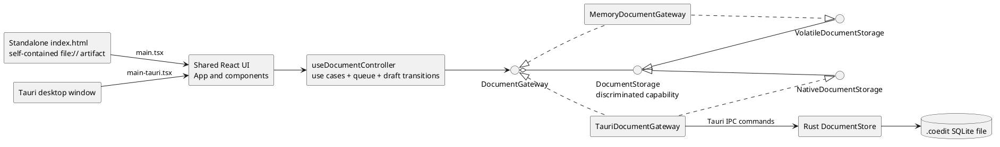

# Coedit engineering documentation

This directory describes Coedit Local as it exists in the repository at version `0.1.0` and document format version `1`. It is intended to let a contributor answer three questions quickly:

1. What behavior exists now?
2. Where is that behavior implemented?
3. Which contracts, tests, and documentation must change with it?

The set follows Rational Unified Process (RUP) ideas without assuming a heavyweight process: requirements are separated from architecture and design; the architecture is described through the 4+1 views; use cases are traceable to implementation and tests; and known gaps are recorded rather than presented as finished features.

## Start here

| If you want to... | Read first | Then use |
|---|---|---|
| Understand the product and its users | [Vision and use cases](./RUP_VISION_AND_USE_CASES.md) | [UI and UX](./UI_UX.md) |
| Understand the whole system | [Architecture](./ARCHITECTURE.md) | [Sequence diagrams](./SEQUENCE_DIAGRAMS.md) |
| Find the implementation of a feature | [Traceability and code map](./TRACEABILITY.md) | [Frontend design](./FRONTEND_DESIGN.md) or [Persistence design](./PERSISTENCE_DESIGN.md) |
| Add or change a feature | [Contributing](./CONTRIBUTING.md) | [Testing strategy](./TESTING.md) |
| Build or package the software | [Build, release, and portability](./BUILD_AND_PORTABILITY.md) | [Security model](./SECURITY.md) |
| Work on the portable file format | [Document format](./DOCUMENT_FORMAT.md) | [Persistence design](./PERSISTENCE_DESIGN.md) |
| Assess unfinished or risky behavior | [Known limitations](./KNOWN_LIMITATIONS.md) | [Traceability and code map](./TRACEABILITY.md) |

## Artifact register

| RUP discipline or view | Artifact | What it answers |
|---|---|---|
| Business modeling / requirements | [Vision and use cases](./RUP_VISION_AND_USE_CASES.md) | Scope, stakeholders, actors, user stories, use cases, supplementary requirements |
| Analysis and design: 4+1 views | [Architecture](./ARCHITECTURE.md) | System context, logical/process/development/physical views, boundaries, decisions |
| Analysis and design | [Frontend design](./FRONTEND_DESIGN.md) | React components, state ownership, editor/Yjs behavior, browser host |
| Analysis and design / data model | [Persistence design](./PERSISTENCE_DESIGN.md) | Gateway ports, Tauri commands, Rust store, transactions, SQLite relationships |
| Use-case realization | [Sequence diagrams](./SEQUENCE_DIAGRAMS.md) | Runtime interactions for creation, editing, history, restore, export, and close |
| User experience | [UI and UX](./UI_UX.md) | Information architecture, current interaction rules, states, and wireframes |
| Implementation | [Traceability and code map](./TRACEABILITY.md) | Feature-to-file and operation-to-layer lookup tables |
| Implementation / change management | [Contributing](./CONTRIBUTING.md) | Setup, safe change paths, extension recipes, review checklist |
| Test | [Testing strategy](./TESTING.md) | Existing coverage, commands, manual checks, and priority gaps |
| Deployment | [Build, release, and portability](./BUILD_AND_PORTABILITY.md) | Standalone versus Tauri outputs, packaging, platforms, release checks |
| Configuration and change management | [Known limitations](./KNOWN_LIMITATIONS.md) | Verified defects, constraints, workarounds, and recommended ownership |
| Data / recovery | [Document format](./DOCUMENT_FORMAT.md) | `.coedit` format, schema policy, backup, export, and recovery |
| Security | [Security model](./SECURITY.md) | Trust boundaries, sanitization, CSP, capabilities, future network rules |

The earlier [local-first implementation plan](../LOCAL_FIRST_TREE_EDITOR_PLAN.md) records product intent and phased acceptance criteria. Where it differs from the code, this engineering set and the code describe the current state; the plan remains a roadmap artifact.

## System at a glance

Coedit has one shared React/TypeScript UI and two explicit composition roots:

- `corepack pnpm build` produces one double-clickable `dist/index.html`. It has an in-memory backend, cannot open `.coedit` files, and loses the working document when the page closes.
- `corepack pnpm tauri:dev` runs the desktop host for development.
- `corepack pnpm tauri:build` packages the desktop host. It uses Rust and SQLite for persistent `.coedit` documents.
- Production code does not start or require a local HTTP backend. Vite serves loopback HTTP only during development.

## Current hardening passes

The current branch is intentionally staged:

1. **Standalone-first architecture (implemented in the current worktree):** application controller and serialized command queue; synchronous freeze plus awaitable title, metadata, and rich-text drains; authoritative editor remount after restore; discriminated volatile/native-file storage; cursor-paged history; a complete in-memory recovery envelope; centralized filename/sanitization contracts; and versioned TypeScript fixtures.
2. **Tauri parity and hardening (second pass):** align Rust hashing and sanitizer expectations with the versioned fixtures; push indexed filtering/pagination into SQLite without the 100,000-row pre-window; move file authorization/path ownership behind a defensible Rust boundary; minimize native permissions; define versioned schema migration and measured snapshot compaction; and run the full native verification matrix. The current TypeScript Tauri adapter is shaped for the new ports, but this documentation does not claim native parity has been proven.
3. **Dormant-feature decisions (third pass):** explicitly retain, finish, migrate, or remove AI, attachments, `restoreNode`, contributor/session lifecycle, contribution grouping, and generic node metadata.

These pass boundaries are scope statements, not release promises. [Known limitations](./KNOWN_LIMITATIONS.md) remains the authoritative risk register.

## Status language

The documents use these labels consistently:

- **Implemented**: reachable in the current composition roots and backed by code.
- **Partial**: implemented with a material limitation documented in [Known limitations](./KNOWN_LIMITATIONS.md).
- **Reserved**: represented in a type or schema, but no end-user workflow exists.
- **Proposed**: a contribution or roadmap recommendation, not current behavior.

## Diagram sources

PlantUML source is embedded in fenced `plantuml` blocks so it remains reviewable beside the prose. A Markdown renderer with PlantUML support can render it directly. Otherwise, copy a block from `@startuml` through `@enduml` into a local PlantUML renderer. Diagrams are explanatory views; TypeScript interfaces, Rust models, and the SQLite schema remain the executable sources of truth.

## Documentation maintenance rule

A change is not complete when it changes an externally visible use case, an architecture boundary, a persisted shape, a Tauri command, a build output, or a known limitation without updating the corresponding artifact and [traceability row](./TRACEABILITY.md). Keep proposed behavior explicitly separated from implemented behavior.
