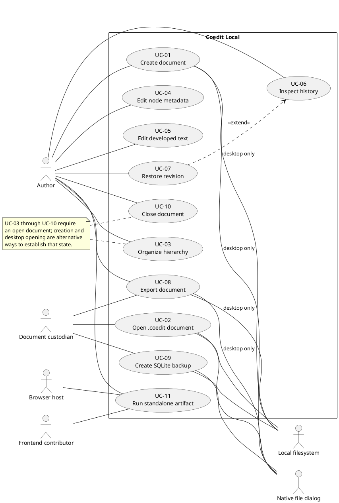

# Vision, requirements, and use-case model

This document is the Rational Unified Process (RUP) requirements artifact for the current Coedit Local repository. It states what the product is for, who interacts with it, which behavior is reachable now, and which ideas are only represented in contracts or roadmap material. The matching code locations are indexed in [Traceability and code map](./TRACEABILITY.md); runtime realizations are shown in [Sequence diagrams](./SEQUENCE_DIAGRAMS.md).

The baseline described here is application version `0.1.0` and `.coedit` format version `1`. When this document and an older plan disagree, the executable code is the source of truth for current behavior. [Known limitations](./KNOWN_LIMITATIONS.md) records defects and constraints in more operational detail.

## Status notation

- **Implemented** means the behavior is reachable through a current composition root.
- **Partial** means a useful path exists, but a material limitation or known defect remains.
- **Reserved** means a type, table, or operation anticipates the behavior, but no complete user workflow exists.
- **Proposed** means the behavior is a roadmap or contribution recommendation, not a current feature.

## Vision

### Problem statement

Long-form writing often begins as a hierarchy of ideas and only later becomes polished prose. Conventional flat editors obscure that transition, while cloud-first tools make availability, privacy, and document ownership depend on a service. Contributors also need to understand how a visible result came to exist without rewriting or deleting the prior record.

Coedit Local addresses this by combining:

- a movable hierarchy of typed ideas;
- rich text attached to each stable node;
- an attributable contribution ledger and restorable snapshots;
- an offline desktop document stored as one portable SQLite file; and
- a self-contained, in-memory HTML build for UI debugging without a native backend.

### Product position

For authors who want to turn nested ideas into developed text while retaining local control, Coedit Local is an offline-first hierarchical editor. Unlike a hosted collaborative writing service, its base application starts no application server, requires no account, and registers no network provider. Unlike the standalone debug artifact, the Tauri desktop application persists the document, history, and snapshots in a `.coedit` file.

### Product goals

1. Keep structure and prose together without conflating them.
2. Route visible persisted mutations through one typed operation boundary.
3. Preserve attributable history and restore old state by adding history, not deleting it.
4. Make a desktop document movable as one `.coedit` file.
5. Keep the base runtime offline and narrowly permissioned.
6. Let frontend contributors run and debug the complete UI from a generated HTML file.
7. Keep AI and synchronization as explicit, opt-in extensions rather than implicit dependencies.

### Success evidence for the current MVP

The following are useful release checks, not a claim that every item is automated today:

- A standalone build opens through `file://`, creates and edits an in-memory document, and exports through browser downloads.
- A desktop document can be created, closed, reopened, edited, restored, exported, and backed up without losing committed state.
- Tree cycles and missing parents are rejected.
- A desktop mutation updates materialized state, revision metadata, contribution history, state hash, and snapshot in one transaction.
- Pasted or persisted rich HTML cannot retain executable tags or event handlers through the supported path.
- The base production CSP permits required local resources and Tauri IPC, but not ordinary outbound network connections.
- A newer document format is not silently rewritten by an older application.

Verification responsibilities and current coverage are described in [Testing strategy](./TESTING.md).

## Scope

### In scope now

| Capability | Status | Current boundary |
|---|---|---|
| Create a document | Implemented | In memory in standalone mode; new `.coedit` file in desktop mode |
| Open an existing `.coedit` document | Implemented | Desktop mode only |
| Add, select, expand, collapse, reorder, reparent, and soft-delete nodes | Implemented | Active nodes in one document |
| Edit node title, summary, kind, and rich text | Implemented | Rich text commits after a 1.2-second idle period |
| Attribute operations to a contributor and writing session | Partial | Creator/session records exist; contributor management does not |
| Search/filter recent contribution history | Partial | UI loads at most 500 contributions and filters that set locally |
| Restore a stored revision | Partial | Compensating history is written; editor-state refresh has a known same-node risk |
| Export Markdown and JSON | Partial | Markdown is lossy; standalone JSON does not include the contribution ledger; desktop JSON is capped |
| Create a SQLite backup | Implemented | Desktop mode only |
| Open newer formats read-only | Partial | Version gate exists; no migration framework or compatibility suite exists |
| Run a self-contained HTML application | Implemented | Generated `dist/index.html`, memory-only, no reopen/import workflow |
| Remain offline by default | Implemented | No network provider; restrictive standalone and Tauri CSPs |

### Reserved extension points

| Extension point | Evidence | What is missing |
|---|---|---|
| AI proposals | `src/ai/provider.ts` and AI types in `src/domain/types.ts` | Provider implementation, configuration, consent, preview, acceptance flow, capabilities |
| Multiple contributor kinds | Contributor types and `contributors` table | Registration, identity selection, profile reconciliation, management UI |
| Writing-session lifecycle | `WritingSession` types/table and `INSERT OR IGNORE` on mutation | End-session behavior, descriptions, session UI |
| Attachments | `attachments` SQLite table | Domain type, operations, gateway methods, UI, validation, export |
| Restore a deleted node directly | `restoreNode` operation in TypeScript and Rust | Reachable UI action and focused tests |
| Yjs synchronization | Yjs state/update representation | Transport, authentication, conflict policy, consent, offline synchronization lifecycle |

### Explicitly out of scope for the base runtime

- User accounts, email, cloud storage, telemetry, and hosted backend services.
- An always-running local HTTP application server.
- Automatic calls to AI or other remote endpoints.
- Real-time multi-user synchronization.
- Executing HTML, scripts, plug-ins, or arbitrary code from a document.
- Treating Markdown as a lossless recovery format.
- Treating the standalone browser artifact as durable document storage.

## Stakeholders and actors

### Stakeholders

| Stakeholder | Interest | Primary concerns |
|---|---|---|
| Author | Develop structured writing | Low-friction editing, clear save state, recoverability, privacy |
| Document custodian | Preserve and transfer documents | Portable files, backups, exports, version handling, recovery guidance |
| Contributor | Receive correct attribution | Stable identity, understandable contributions, session grouping |
| Frontend contributor | Change UI/editor behavior | Standalone debugging, component boundaries, deterministic gateway contract |
| Persistence contributor | Evolve `.coedit` behavior | Transactions, schema compatibility, validation, recovery, cross-language contracts |
| Release maintainer | Ship safe platform artifacts | Reproducible builds, offline guarantees, platform verification, dependency review |
| Security reviewer | Defend trust boundaries | Sanitization, CSP, least privilege, untrusted document handling |

### Primary and supporting actors

- **Author** is the primary actor for all editing use cases.
- **Document custodian** may be the same person, acting specifically to open, export, back up, transfer, or recover files.
- **Frontend contributor** is a primary actor for the standalone-artifact use case when using it to develop or diagnose the shared UI.
- **Browser host** supplies DOM, Web Crypto, local storage when available, Blob URLs, and downloads to the standalone adapter.
- **Native file dialog** supplies user-approved paths to the desktop UI.
- **Tauri command host** transports typed requests between the WebView and Rust without HTTP.
- **Local filesystem and SQLite** store desktop documents and exports.
- **Future AI provider** is a proposed secondary actor and is not registered in either current composition root.

## Use-case overview

## Detailed use-case specifications

### UC-01 - Create a document

**Status:** Implemented, with different persistence semantics by host.

**Primary actor:** Author.

**Goal:** Begin a titled document associated with a contributor identity.

**Preconditions:** The application is on the welcome screen and no document is open. In desktop mode, file dialogs are configured.

**Trigger:** The author activates **Create document** or presses Enter in the document-title field.

**Main success scenario:**

1. The author enters a contributor display name and document title.
2. In desktop mode, the application asks for a new `.coedit` path. In standalone mode, no path is requested.
3. `App` calls `DocumentGateway.createDocument` with the title, current profile, and optional path.
4. The selected adapter constructs revision `0`, records the creator, calculates a state hash, and creates a `createDocument` contribution.
5. Desktop mode also initializes the SQLite schema and revision-0 snapshot, then atomically renames the temporary database to the chosen path.
6. The returned `DocumentView` becomes the active UI state and history is loaded.

**Alternate and exception flows:**

- Canceling the native save dialog leaves the welcome screen unchanged.
- A blank title becomes `Untitled document`; a blank display name becomes `Local author`.
- Desktop creation rejects an existing target, a non-`.coedit` extension, a missing parent directory, or an over-limit title.
- A gateway, filesystem, or database error is shown in the error banner and no document view is installed.
- Standalone mode warns that the document disappears when the page closes.

**Postconditions:** On success, one writable document is active at revision `0`. Desktop state is durable in a `.coedit` file; standalone state exists only in the gateway instance.

**Realization:** `src/App.tsx`, `src/persistence/memoryGateway.ts`, `src/persistence/tauriGateway.ts`, `src/persistence/tauriFiles.ts`, `src-tauri/src/lib.rs`, and `DocumentStore::create` in `src-tauri/src/store.rs`.

### UC-02 - Open a `.coedit` document

**Status:** Implemented on desktop; contributor portability and migration handling are partial.

**Primary actor:** Document custodian.

**Goal:** Load and validate an existing portable document.

**Preconditions:** Desktop mode is running, no document is shown, and file dialogs are configured.

**Trigger:** The actor activates **Open .coedit file** and selects a file.

**Main success scenario:**

1. The native dialog returns a `.coedit` path.
2. `TauriDocumentGateway` invokes `open_document`.
3. `DocumentStore::open` probes the SQLite application ID and user version without write access.
4. It selects read/write or read-only flags according to the format version.
5. It enables foreign keys, runs `PRAGMA integrity_check`, validates the Coedit magic metadata, loads typed rows, decodes JSON/Yjs data, and validates the hierarchy.
6. It returns a `DocumentView`, including any read-only or interrupted-journal warning.
7. The UI selects the first active node and loads recent history.

**Alternate and exception flows:**

- Canceling the dialog changes nothing.
- A missing file, wrong application ID, bad magic value, inconsistent version metadata, corrupt SQLite database, invalid enum/JSON/base64 value, missing parent, or cycle fails closed and displays an error.
- A file with a newer user version is opened read-only if its current core tables remain readable.
- If a `-journal` file existed when opening began, the returned view carries a recovery warning.
- The dialog filters only `.coedit`, so a `.coedit-backup` cannot currently be selected without renaming it.
- If the local browser profile ID is absent from the document, `App` falls back to the document's first contributor. There is no registration or reconciliation workflow.

**Postconditions:** On success, exactly one desktop `DocumentStore` is active. The UI is writable only when the format is supported.

**Realization:** `App.openDocument`, `src/persistence/tauriFiles.ts`, `src/persistence/tauriGateway.ts`, `open_document` in `src-tauri/src/lib.rs`, and `DocumentStore::open`, `load_state`, and `validate_tree` in `src-tauri/src/store.rs`.

### UC-03 - Organize the hierarchy

**Status:** Implemented; direct deleted-node restoration is reserved.

**Primary actor:** Author.

**Goal:** Turn ideas into an ordered, nested structure without losing node identity.

**Preconditions:** A writable document is open.

**Trigger:** The author adds, reorders, reparents, navigates, expands, collapses, or deletes a node.

**Main success scenario:**

1. The author creates a root or child node, or selects an existing active node.
2. `Outline` emits the requested identifier, parent, and sibling index.
3. `App` constructs a typed `DocumentOperation` and contribution context.
4. The active gateway checks identity and tree constraints, applies the operation, normalizes active sibling positions, advances the revision, and records the contribution/snapshot.
5. `App` replaces its view and reloads history.

**Alternate and exception flows:**

- Arrow up/down selects the previous/next visible row; arrow right expands; arrow left collapses or selects the parent.
- Dragging a node onto another node reparents it as that node's last child. Up/down controls reorder siblings.
- Moving a node into itself or one of its descendants is rejected.
- Deletion asks for confirmation, then timestamps the complete subtree rather than removing rows.
- `restoreNode` exists in both operation models, but the current UI exposes restoration only through whole-revision restore.
- Read-only or busy outline controls are disabled.

**Postconditions:** The active hierarchy remains acyclic, every non-root parent exists, active sibling positions are normalized, and stable node IDs are retained.

**Realization:** `src/components/Outline.tsx`, `src/App.tsx`, `src/domain/tree.ts`, both gateway adapters, `src-tauri/src/models.rs`, and `DocumentStore::apply_sql`.

### UC-04 - Edit node metadata

**Status:** Implemented.

**Primary actor:** Author.

**Goal:** Describe and classify the selected idea independently of its developed text.

**Preconditions:** A writable document and active node are selected.

**Trigger:** The author edits the title or summary and leaves the field, or changes the kind selector.

**Main success scenario:**

1. `NodeEditor` keeps title and summary draft values in component state.
2. Blur emits changed title/summary values; kind selection emits immediately.
3. `App` creates an `updateNode` operation with message `Refined idea`.
4. The gateway applies the update and records a new revision.

**Alternate and exception flows:**

- A blank title becomes `Untitled idea`.
- Desktop persistence enforces title, summary, and metadata size limits.
- Read-only controls are disabled.
- An operation for a missing node is rejected.

**Postconditions:** Updated metadata and attribution are visible in the current view and history.

**Realization:** `src/components/NodeEditor.tsx`, `App.apply`, `src/domain/tree.ts`, and `DocumentStore::apply_sql`.

### UC-05 - Edit developed text

**Status:** Partial because close/restore lifecycle races can affect pending or displayed state.

**Primary actor:** Author.

**Goal:** Develop formatted prose for a node while preserving a CRDT-compatible state representation.

**Preconditions:** A node is selected. It is writable for mutations, or read-only for inspection.

**Trigger:** The author types, pastes, formats, undoes, or redoes content in the rich-text surface.

**Main success scenario:**

1. `RichTextEditor` creates a Yjs document from the node's stored base64 state.
2. Tiptap Collaboration maps the editor field to that Yjs document.
3. Yjs updates are accumulated in memory.
4. After 1.2 seconds without another update, the editor merges updates, sanitizes rendered HTML, encodes the incremental update and complete Yjs state, and calls `onCommit`.
5. `App` emits `updateContent` with a new group ID and message `Writing contribution`.
6. Desktop persistence checks sizes and base64, sanitizes HTML again with Ammonia, and commits state plus history; the memory adapter applies the equivalent domain operation.

**Alternate and exception flows:**

- Pasted HTML is restricted to the editor's allow-list; Rust independently sanitizes desktop persistence.
- Initial legacy HTML is sanitized and loaded when no Yjs state exists.
- A gateway failure is shown in the global error banner.
- Component cleanup attempts to flush pending updates, but closing the document can clear the gateway before that asynchronous flush completes.
- A whole-revision restore that retains the selected node ID can leave the memoized editor Yjs document based on the old state.

**Postconditions:** After a successful commit, the node stores sanitized HTML and full Yjs state, and history contains the operation payload including its incremental Yjs update.

**Realization:** `src/editor/RichTextEditor.tsx`, `src/editor/yjsEncoding.ts`, `src/components/NodeEditor.tsx`, `src/App.tsx`, and the `UpdateContent` branches in both persistence implementations.

### UC-06 - Inspect contribution history

**Status:** Partial because the UI view is bounded.

**Primary actor:** Author or document custodian.

**Goal:** Understand recent document changes and their attribution.

**Preconditions:** A document is open.

**Trigger:** The actor opens **History**, enters search text, or selects the node-only filter.

**Main success scenario:**

1. After create/open/operation/restore, `App` asks the gateway for up to 500 contributions.
2. The adapter returns newest-first records.
3. `HistoryPanel` displays revision, message or operation type, contributor name, local timestamp, and a 12-character hash prefix.
4. Search matches operation type, contributor name, and message in the loaded array.
5. The optional node filter keeps contributions whose affected-node list contains the selected node.

**Alternate and exception flows:**

- No match displays an empty result message.
- The selected-node filter is disabled when no node is selected.
- The Rust query API supports search, node, contributor, before-revision, and limit filters, but `App` currently requests only a limit and performs visible filtering in React.
- The displayed history count is the loaded count, not a database-wide total when more than 500 contributions exist.

**Postconditions:** No document state is changed.

**Realization:** `App.refreshHistory`, `src/components/HistoryPanel.tsx`, `DocumentGateway.listContributions`, `MemoryDocumentGateway.listContributions`, and `DocumentStore::contributions`.

### UC-07 - Restore a revision

**Status:** Partial because of the same-selected-node editor refresh risk.

**Primary actor:** Author.

**Goal:** Make an earlier snapshot the current document state without erasing intervening history.

**Preconditions:** A writable document is open and the target revision is available. The latest loaded contribution is not offered as a restore target.

**Trigger:** The author activates **Restore** for a history entry and confirms the warning.

**Main success scenario:**

1. `App` asks the gateway to restore the selected revision with the current contribution context.
2. The adapter loads the snapshot for that revision.
3. It preserves the current contributor set and assigns current revision plus one.
4. Desktop mode replaces materialized nodes and title inside a transaction.
5. The adapter computes the restored-state hash and appends a `restoreRevision` contribution and snapshot.
6. The UI replaces its view and reloads history.

**Alternate and exception flows:**

- Canceling confirmation makes no change.
- A missing snapshot, unregistered contributor, or read-only document is rejected.
- Desktop restoration validates stored Yjs base64 and sanitizes restored HTML.
- Current history remains present; restore never deletes contribution rows.
- The selected node's React key is based on node ID, so restoring different content for the same ID may not recreate the Yjs document.

**Postconditions:** The restored materialized state is the newest revision and a compensating audit record identifies the source revision.

**Realization:** `HistoryPanel`, `App.restore`, both gateway `restoreRevision` implementations, and `DocumentStore::restore`.

### UC-08 - Export a document

**Status:** Partial; exports have deliberately different fidelity and current limits.

**Primary actor:** Author or document custodian.

**Goal:** Produce an interchange or recovery-oriented file outside the active document.

**Preconditions:** A document is open.

**Trigger:** The actor chooses **Markdown** or **JSON recovery file** from Export.

**Main success scenario:**

1. Desktop mode asks for a destination; standalone mode derives a download name.
2. `App` calls `DocumentGateway.exportDocument`.
3. Markdown walks active nodes in hierarchy order and emits headings, summaries, and plain text.
4. JSON serializes the current state; desktop mode additionally wraps export metadata and a newest-first contribution list.
5. Desktop mode writes through a temporary file and replacement step. Standalone mode creates a Blob URL and activates a download anchor.
6. The UI reports export success.

**Alternate and exception flows:**

- Canceling a desktop save dialog makes no change.
- Unsupported formats or invalid destinations are rejected.
- Markdown is lossy: rich formatting, deleted nodes, snapshots, and full history are not represented.
- Standalone JSON currently contains only `DocumentView`, not the contribution ledger, despite the UI's recovery label.
- Desktop JSON asks `contributions` for 100,000 records and therefore silently omits older entries beyond that bound.

**Postconditions:** The active document is unchanged; a file or browser download exists on success.

**Realization:** `App.exportFile`, file-dialog and gateway adapters, `MemoryDocumentGateway.download`, and `DocumentStore::export`, `markdown`, and `atomic_write`.

### UC-09 - Create a SQLite backup

**Status:** Implemented on desktop, with an open-dialog discoverability limitation.

**Primary actor:** Document custodian.

**Goal:** Capture the complete current `.coedit` database while the application owns it.

**Preconditions:** A desktop document is open and file dialogs are configured.

**Trigger:** The actor chooses **SQLite backup** and selects a destination.

**Main success scenario:**

1. `App` requests a `.coedit-backup` destination.
2. `TauriDocumentGateway` invokes `backup_document`.
3. The store optimizes writable SQLite state, copies the source to a temporary sibling, syncs it, and replaces the destination.
4. The returned result reports path and bytes written.

**Alternate and exception flows:**

- Canceling the dialog makes no change.
- A missing destination parent, copy/sync/rename failure, or poisoned document lock is reported.
- The normal Open dialog filters `.coedit`, not `.coedit-backup`; recovery currently requires renaming or another external workflow.

**Postconditions:** The active document is unchanged and a byte-copy backup exists on success.

**Realization:** `App.backup`, `src/persistence/tauriFiles.ts`, `TauriDocumentGateway.backupDocument`, `backup_document`, and `DocumentStore::backup`/`atomic_copy`.

### UC-10 - Close a document

**Status:** Partial because pending editor work is not synchronously drained before backend close.

**Primary actor:** Author.

**Goal:** Release the current document and return to the welcome screen.

**Preconditions:** A document is open.

**Trigger:** The author activates **Close**.

**Main success scenario:**

1. `App` asks the gateway to close the current document.
2. The memory adapter clears state/history/snapshots, or the Tauri command drops the active `DocumentStore` from its mutex.
3. `App` clears the view, loaded history, selection, and history-panel state.
4. The welcome screen appears.

**Alternate and exception flows:**

- A gateway error appears in the banner, but `App.close` currently clears its UI state after `run` returns even when `run` caught that error; backend and UI state could therefore disagree on an exceptional close.
- `RichTextEditor` cleanup asynchronously attempts to flush pending updates after unmount, but the gateway may already have been closed. The UI currently has no explicit flush barrier or unsaved-change confirmation.

**Postconditions:** On the normal path, no document is active. Committed desktop state remains on disk; standalone state is discarded. Exceptional close consistency is not currently guaranteed.

**Realization:** `App.close`, both `closeDocument` adapters, and `close_document` in `src-tauri/src/lib.rs`.

### UC-11 - Run the standalone artifact

**Status:** Implemented as a generated debugging/development artifact.

**Primary actor:** Frontend contributor or author evaluating the memory workflow.

**Goal:** Launch the full editor UI without Tauri, Rust, SQLite, or a web server.

**Preconditions:** Dependencies are installed and `corepack pnpm build` has completed successfully.

**Trigger:** The actor double-clicks `dist/index.html` or opens it through a browser's file picker.

**Main success scenario:**

1. The browser loads the generated `file://` HTML.
2. The inline CSP permits the hashed inline module and inline styles while denying network connections.
3. `src/main.tsx` composes `App` with a new `MemoryDocumentGateway` and no file-dialog adapter.
4. The welcome screen labels the session as standalone and volatile.
5. The actor can perform the shared editing/history/restore/export workflows supported by the memory adapter.

**Alternate and exception flows:**

- Opening the source `index.html` directly is not supported; Vite transforms and inlines the application into the generated file.
- If `file://` local storage is unavailable, the contributor profile remains usable only in React memory.
- Browser download behavior and local-file support vary, especially on mobile browsers.
- Closing or reloading the page discards the document; there is no import/reopen path.

**Postconditions:** The browser process owns all working state. No application server or native process is required.

**Realization:** `index.html`, `src/main.tsx`, `vite.config.ts`, `MemoryDocumentGateway`, and the shared React UI. Build details are in [Build, release, and portability](./BUILD_AND_PORTABILITY.md).

## User-story catalog

### Implemented stories

| ID | Story | Acceptance evidence |
|---|---|---|
| US-01 | As an author, I can create a titled document and begin without an account. | UC-01 succeeds in either composition root. |
| US-02 | As an author, I can arrange stable ideas into an ordered hierarchy. | Create, move, reparent, expand/collapse, and cycle rejection work. |
| US-03 | As an author, I can classify nodes as idea, section, scene, beat, or final text. | `NodeEditor` emits a persisted `updateNode` operation. |
| US-04 | As an author, I can develop formatted prose for each node. | Tiptap/Yjs editor commits sanitized content. |
| US-05 | As an author, I can identify recent changes by revision and contributor. | History presents contribution metadata and hash prefix. |
| US-06 | As an author, I can make a stored revision current without deleting later history. | Restore appends a new `restoreRevision` contribution. |
| US-07 | As a custodian, I can reopen a committed `.coedit` file. | Desktop open validates and materializes the document. |
| US-08 | As a custodian, I can create interchange exports and a database backup. | Markdown, JSON, and desktop backup paths exist. |
| US-09 | As a frontend contributor, I can launch the built UI by double-clicking one HTML file. | The standalone Vite output inlines JS/CSS and uses the memory gateway. |
| US-10 | As a privacy-conscious author, I can use the base application without ordinary network access. | Composition roots register no network provider and production CSPs deny it. |

### Partial stories

| ID | Story | Current limitation |
|---|---|---|
| US-11 | As an author, I do not lose accepted typing when I close or restore. | Pending-close ordering and same-node restore editor state require fixes/tests. |
| US-12 | As a custodian, I can rely on JSON as complete recovery evidence. | Standalone omits history; desktop caps it at 100,000 records. |
| US-13 | As an author, I can search the complete ledger. | The UI only loads 500 newest records. |
| US-14 | As a contributor, my local identity follows me to an existing document. | No registration/reconciliation flow exists. |
| US-15 | As a custodian, I can open future formats safely. | Read-only gating exists, but migrations/compatibility tests do not. |
| US-16 | As a mobile/tablet user, I can use all editing interactions. | Current layout is only partly responsive and drag/drop is not touch-oriented. |

### Reserved stories

| ID | Story | Reserved evidence |
|---|---|---|
| US-20 | As an author, I can request and review an AI proposal before accepting it. | `AiProvider`, `AiRequest`, and `AiProposal` contracts only |
| US-21 | As a collaborator, I can synchronize Yjs updates with authenticated peers. | Yjs update/state representation only |
| US-22 | As an author, I can embed checksum-addressed attachments. | SQLite `attachments` table only |
| US-23 | As an author, I can explicitly restore one deleted subtree. | `restoreNode` operation without UI |
| US-24 | As a contributor, I can manage named writing sessions. | Session model/table without lifecycle UI |

### Proposed contributor stories

| ID | Story | Completion condition |
|---|---|---|
| US-30 | As a maintainer, I can evolve format version `1` through tested migrations. | Versioned migration runner, fixtures, rollback/recovery policy, compatibility tests |
| US-31 | As a maintainer, I can prove TypeScript and Rust contracts remain compatible. | Shared fixtures or generated schema plus an IPC contract suite |
| US-32 | As a custodian, I can verify hashes by deterministic replay. | One specified canonical form, replay engine, open-time/reporting behavior |
| US-33 | As a release maintainer, I can verify Windows, macOS, and Linux packages automatically. | CI matrix and platform smoke evidence |
| US-34 | As an author, I can import a standalone recovery export into a fresh session. | Versioned import use case, validation, attribution, and UI |

## Supplementary functional requirements

These requirements complement the use cases. “Current satisfaction” describes the repository, not a promised future release.

| ID | Requirement | Current satisfaction and evidence |
|---|---|---|
| FR-01 | The host shall select persistence explicitly at a composition root. | Satisfied: `main.tsx` constructs memory; `main-tauri.tsx` constructs Tauri and dialogs. |
| FR-02 | UI orchestration shall depend on `DocumentGateway`, not invoke Tauri directly. | Satisfied in `App.tsx`; native APIs stay in adapters. |
| FR-03 | A desktop document shall use `.coedit`, a fixed application ID, and a versioned schema. | Satisfied for format `1` in `models.rs` and `store.rs`. |
| FR-04 | The application shall permit at most one active document per instance. | Satisfied by React state and `Mutex<Option<DocumentStore>>`. |
| FR-05 | Every node shall have a stable ID, optional parent, sibling position, kind, metadata, Yjs state, timestamps, and deletion marker. | Satisfied by TypeScript/Rust models and SQLite `nodes`. |
| FR-06 | A hierarchy shall reject duplicate IDs, missing parents, self-parenting/cycles, and moves into descendants. | Satisfied in both domain implementations; test depth differs. |
| FR-07 | Deletion shall be soft and cover the subtree. | Satisfied; current UI has no direct deleted-node browser. |
| FR-08 | A persisted visible mutation shall be represented by a typed operation and attributed contribution. | Mostly satisfied; lifecycle races can prevent a final editor commit. |
| FR-09 | A mutation shall advance revision from its base revision and record affected nodes, payload, hash, contributor context, and message. | Satisfied by both gateways. |
| FR-10 | Desktop state, contribution, hash, and snapshot shall commit atomically. | Satisfied by the current Rust transaction path. |
| FR-11 | Text typing shall be grouped rather than committed per keystroke. | Satisfied with a fixed 1.2-second idle timer. |
| FR-12 | Rich HTML shall be sanitized before use and independently before desktop persistence. | Satisfied through DOMPurify and Ammonia. |
| FR-13 | Restore shall append a compensating revision instead of removing history. | Satisfied at persistence level. |
| FR-14 | Desktop opening shall validate identity, version consistency, SQLite integrity, typed values, and tree structure. | Satisfied for the current schema; no migration behavior exists. |
| FR-15 | Newer supported-core documents shall be exposed read-only. | Partially satisfied; compatibility is assumed rather than migration-tested. |
| FR-16 | Markdown shall be presented as lossy interchange, and JSON/SQLite as recovery-oriented outputs. | Partially satisfied; JSON completeness differs by adapter. |
| FR-17 | A standalone production build shall contain no required external JS/CSS assets. | Satisfied by the `standaloneHtml` build plug-in, with manual verification today. |
| FR-18 | The base application shall not register an AI or synchronization provider. | Satisfied. |

## Supplementary non-functional requirements

### Security and privacy

| ID | Requirement | Current mechanism / qualification |
|---|---|---|
| NFR-SEC-01 | Base production operation shall require no outbound network request. | Standalone CSP has `connect-src 'none'`; Tauri CSP permits IPC only; no HTTP client/provider is registered. |
| NFR-SEC-02 | Native permissions shall follow least privilege. | Current capability grants core defaults and open/save dialogs only. |
| NFR-SEC-03 | `.coedit` content and imported HTML shall be treated as untrusted. | SQLite/file validation plus DOMPurify/Ammonia; see [Security model](./SECURITY.md). |
| NFR-SEC-04 | Contributor preferences shall not store secrets. | Only ID, display name, kind, and creation time are stored under `coedit-local-contributor`. |
| NFR-SEC-05 | Future network behavior shall require an explicit build/permission/consent design. | Proposed; current `AiProvider` contract alone does not grant access. |

### Integrity, recovery, and limits

| ID | Requirement | Current mechanism / qualification |
|---|---|---|
| NFR-DATA-01 | A committed desktop mutation shall be all-or-nothing. | SQLite transaction; new files explicitly select `synchronous = FULL` and delete journal. Reopen does not explicitly reissue `synchronous`. |
| NFR-DATA-02 | Creation/export/backup shall avoid exposing a partially written destination. | Temporary sibling plus rename/replacement. Crash behavior between replacement renames still needs fault testing. |
| NFR-DATA-03 | A current document shall have a materialized snapshot for every revision. | Satisfied in the MVP; future compaction is only a comment/roadmap idea. |
| NFR-DATA-04 | State hashes shall be deterministic and verifiable. | Partial: hashes are written, but no replay/open verification exists and browser/Rust canonicalization is not a shared formal contract. |
| NFR-DATA-05 | Desktop input shall have explicit size bounds. | Title 4,096 bytes; summary/metadata 1 MiB; sanitized HTML 16 MiB; decoded full Yjs state 32 MiB; update input has a string-size guard. |
| NFR-DATA-06 | A locked SQLite file shall fail promptly rather than hang indefinitely. | Connection busy timeout is 5 seconds. |
| NFR-DATA-07 | Recovery procedures and format semantics shall be documented. | See [Document format](./DOCUMENT_FORMAT.md); backup discoverability and export limits remain. |

### Portability and compatibility

| ID | Requirement | Current mechanism / qualification |
|---|---|---|
| NFR-PORT-01 | Desktop source shall be buildable for Windows, macOS, and Linux through Tauri. | Architecture and dependencies are portable; there is no current cross-platform CI evidence. |
| NFR-PORT-02 | A closed desktop document shall normally be one movable file. | SQLite uses delete journal; interrupted transactions can temporarily leave a sidecar journal. |
| NFR-PORT-03 | The standalone build shall run through `file://` in a compatible desktop browser. | Implemented; browser capability and platform matrix are in [Build, release, and portability](./BUILD_AND_PORTABILITY.md). |
| NFR-PORT-04 | iPadOS support shall not be claimed from icon assets alone. | Not supported today: native project/file lifecycle and touch interactions are incomplete. |

### Usability, accessibility, and maintainability

| ID | Requirement | Current mechanism / qualification |
|---|---|---|
| NFR-UX-01 | The UI shall make standalone volatility, read-only mode, recovery warnings, busy state, and errors visible. | Implemented banners/statuses; pending-edit risk is not visible. |
| NFR-UX-02 | Core hierarchy navigation shall be keyboard accessible. | Arrow navigation and focus-visible styling exist; no automated accessibility audit. |
| NFR-UX-03 | The workspace shall remain usable at the desktop window minimum and narrower browser widths. | One `900px` breakpoint exists; touch/small-tablet behavior is incomplete. |
| NFR-MAINT-01 | Shared UI code shall remain independent of native APIs. | Satisfied through gateway/dialog ports and two entry points. |
| NFR-MAINT-02 | TypeScript and Rust models shall remain wire-compatible. | Required, but manually maintained and not contract-tested. |
| NFR-MAINT-03 | Externally visible changes shall remain traceable from requirement to code and test. | This documentation establishes the convention; see [Contributing](./CONTRIBUTING.md). |

## Business rules and invariants

1. Node IDs and contribution IDs are stable identifiers; hierarchy changes do not replace node identity.
2. An active node has exactly one parent or is a root; the parent graph must remain acyclic.
3. Active sibling order is represented by normalized integer positions, then stable ID as a tie-breaker while loading/displaying.
4. Soft-deleted nodes remain in persisted state and history but are absent from the active outline/export traversal.
5. The contributor referenced by a mutation must already exist in the document.
6. A contribution's `baseRevision` is the revision observed before its operation; its `revision` is the resulting revision.
7. Revision restore creates a new current revision. Historical contribution rows are immutable through the application API.
8. The stored Yjs state is the complete current editor state; the incremental update is retained in the contribution payload on desktop.
9. `DocumentView.path`, `readOnly`, and `recoveryWarning` are host/view metadata and should not define document identity. Rust hashes `DocumentState`; the memory adapter currently passes a runtime `DocumentView` through the TypeScript spread-based canonicalizer, so these extra fields can enter its hash. RK-04 treats that scope difference as an unresolved contract defect.
10. Markdown is interchange. `.coedit` and its SQLite backup are the lossless current recovery artifacts; desktop JSON is a human-inspection/recovery aid with a documented history cap and no importer.

## Current RUP lifecycle and risk assessment

### Lifecycle position

- **Inception:** product problem, offline position, and initial scope are established.
- **Elaboration:** an executable architecture demonstrates the React port/adapters boundary, Tauri IPC, SQLite format, history model, and standalone host. Elaboration is not complete because schema migration, deterministic replay verification, contributor identity portability, and platform qualification remain unresolved architectural risks.
- **Construction:** the main MVP use cases are implemented and usable. Test depth is substantially below the risk profile of a writing/persistence tool.
- **Transition:** Windows standalone has manual evidence from current development. Signed/package-qualified macOS and Linux releases, upgrade evidence, and iPadOS support are not established.

### Risk list

| ID | Risk | Probability / impact | Current response | Recommended next evidence |
|---|---|---|---|---|
| RK-01 | Pending Yjs updates can race document close. | Medium / critical data loss | Known and documented | Explicit async flush barrier plus close-before-idle integration test |
| RK-02 | Restore can leave same-ID editor state stale and later overwrite restored content. | Medium / critical integrity | Known and documented | Key editor/Y.Doc by state generation and add restore-edit regression test |
| RK-03 | A profile opening another author's document is not registered. | High / high usability/attribution | Falls back to first contributor | Explicit register/select contributor use case and tests |
| RK-04 | Recorded hashes are not replay-verified and adapters use separately implemented canonicalization. | Medium / high trust | Hash is displayed/stored only | Specify canonical form, golden fixtures, replay verifier |
| RK-05 | Format versioning has no migration framework. | Certain with first schema change / high | Newer version becomes read-only | Versioned migrations, old/new fixtures, interruption recovery tests |
| RK-06 | Recovery exports are incomplete at different bounds. | Medium / high recovery | Limitations documented | Versioned complete streaming export and round-trip import tests |
| RK-07 | TypeScript/Rust operation models can drift. | Medium / high | Manual review | Generated contract or shared JSON fixture suite |
| RK-08 | Native behavior is not continuously tested on Windows, macOS, and Linux. | High / medium-high | Source portability only | CI build matrix and platform smoke checklist |
| RK-09 | History UI silently represents only the latest 500 entries. | High in long documents / medium | Fixed request limit | Paginated server-side query and total/loaded indication |
| RK-10 | Replacement and interrupted-journal recovery paths lack fault-injection coverage. | Low-medium / high | Atomic-style helpers and warning | Filesystem failure tests and recovery rehearsal |

The prioritized verification work is in [Testing strategy](./TESTING.md). Ownership and suggested fixes are maintained in [Known limitations](./KNOWN_LIMITATIONS.md).

## Glossary

| Term | Meaning in Coedit |
|---|---|
| Active node | A node whose `deletedAt` is `null` and which is therefore visible in the working hierarchy. |
| Adapter | A concrete implementation of a port, such as `MemoryDocumentGateway` or `TauriDocumentGateway`. |
| Base revision | Document revision observed immediately before a contribution is applied. |
| Compensating contribution | A new history entry that restores prior state without deleting intervening contributions. |
| Composition root | Host-specific entry point that constructs `App` with its adapters: `main.tsx` or `main-tauri.tsx`. |
| Contribution | Immutable application-ledger record of a persisted operation, attribution, revision transition, payload, and resulting hash. |
| Contributor | Stable identity with a display name and kind: human, automation, AI, or imported. |
| CRDT | Conflict-free replicated data type. Yjs supplies the text-state/update representation even though synchronization is not connected. |
| Document gateway | UI-facing persistence port defined in `src/persistence/gateway.ts`. |
| Document state | Document metadata, nodes, contributors, and sessions. Rust hashes this shape; the memory adapter currently has a documented hash-scope discrepancy when it passes a `DocumentView`. |
| Document view | Document state plus path, read-only flag, and recovery warning returned to the UI. |
| Format version | Version of the `.coedit` schema/contract; currently `1`. |
| Group ID | Optional contribution field used to associate a logical burst, currently generated per rich-text commit. |
| Materialized state | Current document and node rows, as opposed to the historical ledger/snapshots. |
| Operation | Typed request that mutates document materialized state, such as `moveNode` or `updateContent`. |
| Port | Interface that separates shared UI policy from a host capability, notably `DocumentGateway` and `DocumentFileDialogs`. |
| Revision | Monotonically increasing document-state number, beginning at `0` for creation. |
| Snapshot | Full serialized document state stored at a revision. The current desktop MVP stores one at every revision. |
| Soft deletion | Marking a node/subtree deleted while retaining its rows and history. |
| Standalone mode | Generated single-file HTML host using `MemoryDocumentGateway`; it is not durable storage. |
| Tauri mode | Native desktop host using Tauri IPC, Rust `DocumentStore`, native dialogs, and SQLite. |
| Writing session | Attribution grouping tied to a contributor and session identifier; lifecycle management is not yet exposed. |
| Yjs state | Base64 representation of the complete CRDT document for a node's rich text. |
| Yjs update | Base64 incremental CRDT change included with an `updateContent` operation. |

## Maintaining this artifact

Update this document when a change alters an actor-visible outcome, use-case precondition or alternate flow, requirement, status label, business rule, or major risk. In the same change, update the corresponding row in [Traceability and code map](./TRACEABILITY.md), affected realization in [Sequence diagrams](./SEQUENCE_DIAGRAMS.md), and verification in [Testing strategy](./TESTING.md).
