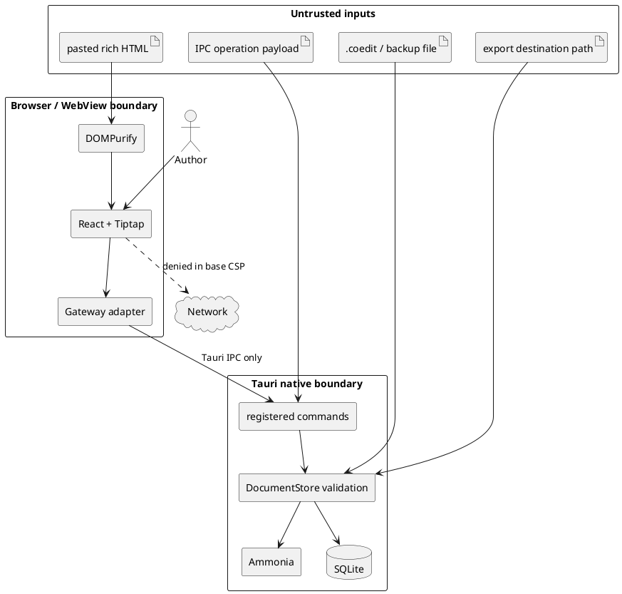

# Security model

This document describes the security posture of the current offline standalone and Tauri desktop builds. It is a design/control inventory, not a claim that the application or `.coedit` format has completed a security audit. Residual defects are tracked in [Known limitations](./KNOWN_LIMITATIONS.md).

## Security goals

- Keep the base product functional without outbound network access or a local production server.
- Treat document files, stored rich content, pasted HTML, IPC payloads, and export destinations as untrusted input.
- Minimize native capabilities and expose narrow document commands rather than arbitrary filesystem/database access to the UI.
- Prevent imported/persisted content from becoming executable application code.
- Commit desktop materialized state and its attribution/recovery records atomically.
- Fail closed for wrong/corrupt document identity and unsupported structures.
- Keep future AI and collaboration explicitly opt-in and outside the base capability profile.

## Non-goals and trust assumptions

- A plain `.coedit` file is not encrypted. Anyone with filesystem access can read it with SQLite tooling.
- Contributions and hashes are not digitally signed. A person who can modify the database directly can rewrite state/history/hashes.
- The application does not protect a compromised operating-system account, browser, WebView, native runtime, or dependency supply chain.
- Standalone memory is not durable or isolated from browser extensions/process inspection.
- The current hash ledger is not verified on open and is not a tamper-evident chain.

## Assets

| Asset | Desired property |
|---|---|
| Developed text and hierarchy | confidentiality on the local device; integrity and recoverability |
| Contributor attribution/history | correct identity association; append-only behavior through the application |
| `.coedit` and backup files | recognizable format, structurally valid state, safe recovery |
| Standalone exports | no accidental remote transmission; clear limits/fidelity |
| Local contributor preference | availability only; it is not secret/authentication material |
| Native capabilities | least privilege and explicit review |

## Trust boundaries

### Standalone boundary

The standalone build contains UI, domain logic, and `MemoryDocumentGateway` in one local HTML file. It has no native command boundary. Its generated CSP denies all `connect-src`; exports use browser Blob/object URLs and a download anchor. `localStorage` contains only the contributor object under `coedit-local-contributor`; storage failure is non-fatal.

### Desktop boundary

The OS WebView contains the shared UI and thin Tauri adapters. The Rust process holds the SQLite connection. TypeScript can call only registered Tauri commands and enabled plugin capabilities. The command layer maps typed payloads to `DocumentStore`; it does not expose arbitrary SQL or arbitrary file-read commands.

## Network and content-security policy

No HTTP client, synchronization provider, telemetry SDK, updater, remote image/font/script, or AI provider is registered in the base application.

The generated standalone policy denies all sources by default, permits only the build-generated inline script hash and inline CSS, permits data/blob image/font resources needed locally, and sets `connect-src 'none'`.

The desktop production policy permits packaged resources and Tauri IPC (`ipc:` and `http://ipc.localhost`) while denying ordinary remote connections, frames, objects, base changes, and form submission. The only enabled plugin permissions are native open/save dialogs plus core defaults.

Vite binds `127.0.0.1:1420` only during development. A release artifact attempting to load that address is misbuilt, not a production service design; see [Build and portability](./BUILD_AND_PORTABILITY.md).

## Native command and capability surface

Registered document commands in [`src-tauri/src/lib.rs`](../src-tauri/src/lib.rs):

- `create_document`
- `open_document`
- `close_document`
- `get_document`
- `apply_operation`
- `list_contributions`
- `restore_revision`
- `backup_document`
- `export_document`

[`src-tauri/capabilities/default.json`](../src-tauri/capabilities/default.json) enables only:

- `core:default`
- `dialog:allow-open`
- `dialog:allow-save`

Adding a plugin, command, filesystem scope, shell access, network origin, updater, or second window is a security-model change and requires threat/permission review.

## `.coedit` validation

`DocumentStore::open` currently performs:

1. ordinary-file existence check;
2. read-only probe of SQLite `application_id` and `user_version`;
3. fixed application-ID comparison;
4. read-only mode selection for a newer version;
5. five-second SQLite busy timeout and foreign keys;
6. `PRAGMA integrity_check`;
7. metadata magic marker comparison;
8. agreement between metadata format version and `user_version`;
9. typed contributor/session/node loading and JSON/enum/Base64 conversion;
10. unique node ID, existing parent, and no-cycle validation.

A pre-existing sibling rollback journal produces a recovery warning. Full format details and limitations are in [Document format](./DOCUMENT_FORMAT.md).

Current validation does **not** authenticate the file, verify contribution/snapshot hashes, replay the ledger, reapply all field-size limits on open, or perform a complete sanitization pass over every loaded record. Treat a document from another party as untrusted despite a successful open.

## Rich-text controls

### Frontend boundary

[`RichTextEditor`](../src/editor/RichTextEditor.tsx) uses DOMPurify when:

- transforming pasted HTML;
- obtaining HTML for a debounced commit;
- loading legacy/fallback `contentHtml` when no Yjs state exists.

Its explicit allowed tags are paragraphs/breaks, basic emphasis, code/pre, blockquote, lists/items, headings 1-4, anchors, and horizontal rules. Allowed attributes are `href` and `title`.

### Desktop persistence boundary

Rust uses Ammonia when creating/updating node HTML and when restoring snapshot HTML. This protects the native store even if a caller bypasses the normal paste UI. A Rust test checks removal of scripts and event-handler content.

The two sanitizer policies are not specified as identical. Changing Tiptap extensions/tags/attributes requires review and tests at both boundaries, including URL schemes and export behavior.

### Yjs boundary

The backend checks that update/state values are valid Base64 and bounds the strings/decoded state, but it does not interpret the incremental update or prove that the supplied HTML and full Yjs state are equivalent. Yjs data is untrusted structured input and should not be treated as validation of the HTML representation.

## Input limits on normal desktop mutations

| Value | Current limit |
|---|---:|
| Title/display name after trim/fallback | 4,096 bytes |
| Summary | 1,048,576 bytes |
| Serialized metadata JSON | 1,048,576 bytes |
| HTML content input/cleaned creation content | 16,777,216 bytes |
| Encoded incremental Yjs update string | 67,108,864 bytes |
| Decoded complete Yjs state | 33,554,432 bytes |

These are mutation-boundary limits, not comprehensive quotas. File size, node count, contribution count, snapshot size, and every loaded/tampered snapshot field are not globally capped. Standalone domain/gateway calls do not independently apply these Rust limits.

## Persistence and output controls

- SQLite uses `STRICT` tables, foreign keys, `journal_mode=DELETE`, and `synchronous=FULL` at creation.
- A normal mutation updates materialized state, revision metadata, contribution, hash, and snapshot in one transaction.
- Creation uses a temporary sibling file and final rename.
- JSON/Markdown export and backup use a temporary sibling, sync file contents, and replace the destination by rename.
- Parent directories are not explicitly fsynced; direct filesystem/symlink/race hardening has not been audited.
- Export destinations come from explicit native dialogs in the current UI.

The standalone download path uses filenames derived from document titles without native path access. Browser download policy still depends on the host browser.

## Threat/control matrix

| Threat | Current controls | Residual exposure / required work |
|---|---|---|
| Remote script/data exfiltration | offline dependencies, CSP, no provider, minimal capabilities | dependency/WebView compromise; future provider permissions |
| Script/event HTML injection | DOMPurify, Ammonia, ProseMirror rendering boundary | policy drift, stored/tampered data validation, URL-scheme cases |
| Wrong/corrupt SQLite opened | application ID, magic, version agreement, integrity/tree/type checks | hash/ledger/snapshot validation and migration fixtures absent |
| Oversized mutation payload | Rust byte limits and Base64 decode | standalone parity, document/node/count quotas, hostile snapshot load |
| Partial state/history commit | one SQLite transaction per mutation | editor lifecycle can fail before mutation reaches transaction |
| Export overwrite/failure | temporary file, sync, rename/rollback attempt | parent-dir durability, filesystem races, platform fault testing |
| Contributor impersonation | store rejects unknown contributor IDs | UI silently falls back to first document contributor |
| History tampering | hashes recorded | no authentication, chain, replay, or verification |
| Unexpected native access | narrow commands and dialog-only capability | future plugins/commands require explicit review |
| Development server exposed | loopback host and strict port | dev machine/browser threat remains; never a release topology |

## Future network features

AI and collaboration must remain opt-in. A future provider must:

1. display its endpoint/model and the content being sent;
2. require an explicit user action and support cancellation;
3. validate protocols and redirects, and define private-network policy;
4. keep returned material as a proposal and preview sanitized output;
5. apply accepted changes through ordinary attributed operations;
6. distinguish provider identity from the approving human;
7. store credentials in an appropriate host secret facility, never document metadata or contributor `localStorage`;
8. use a dedicated CSP/capability/build or explicit permission flow;
9. define retention, logging, authentication, offline failure, and threat behavior;
10. add security tests before the feature is described as supported.

Yjs in the editor is not itself a secure collaboration implementation. A transport would also require authentication, authorization, structural conflict semantics, ledger ordering, and recovery design.

## Security review checklist for contributions

- Does this add an input, parser, URL, file type, command, plugin, permission, origin, or secret?
- Can hostile content cross the browser/native or document/render boundary?
- Are validation, size bounds, and sanitization applied at the authoritative boundary?
- Does failure preserve the primary document, contribution ledger, and recoverable output?
- Does standalone behavior bypass a control present only in Rust?
- Does a schema/model change require a migration and hostile fixture?
- Are CSP/capability changes minimal and documented?
- Are accepted AI/automation changes attributable and user-approved?
- Are success and malicious/failure cases covered by tests in [Testing](./TESTING.md)?
- Are residual limitations recorded rather than hidden?

Report vulnerabilities privately to the project maintainers before public disclosure. The repository does not currently define a separate reporting address or coordinated-disclosure SLA.
