# Sequence diagrams

This document is the RUP interaction view for Coedit Local. It traces important use cases through the current implementation and names the files that own each step.

Every diagram below describes current code unless a note explicitly marks deferred second-pass Tauri work. Notes labeled **Current limitation** identify observed behavior rather than intended behavior.

Related documents:

- [Documentation index](README.md)
- [Repository overview](../README.md)
- [Architecture](ARCHITECTURE.md)
- [Frontend design](FRONTEND_DESIGN.md)
- [Persistence design](PERSISTENCE_DESIGN.md)
- [UI and UX specification](UI_UX.md)
- [Feature-to-code traceability](TRACEABILITY.md)
- [Known limitations](KNOWN_LIMITATIONS.md)

## Participants and notation

| Diagram name | Implementation |
|---|---|
| `App` | Presentation boundary in `src/App.tsx` |
| `Controller` | `useDocumentController` in `src/application/useDocumentController.ts` |
| `Queue` | `SerializedTaskQueue` in `src/application/serializedTaskQueue.ts` |
| `MemoryGateway` | `MemoryDocumentGateway` in `src/persistence/memoryGateway.ts` |
| `TauriGateway` | `TauriDocumentGateway` in `src/persistence/tauriGateway.ts` |
| `Dialogs` | `tauriFileDialogs` in `src/persistence/tauriFiles.ts` |
| `Commands` | Tauri commands in `src-tauri/src/lib.rs` |
| `Store` | `DocumentStore` in `src-tauri/src/store.rs` |
| `SQLite` | The current `.coedit` database connection |

Solid return arrows show relevant returned values, not every JavaScript or Rust stack return. A Tauri `invoke` serializes camel-case TypeScript values to the Serde models in `src-tauri/src/models.rs` and serializes the result back.

## Standalone bootstrap

**Implemented.** This is the double-clicked `dist/index.html` path produced by the default build. It does not start or contact a local server.

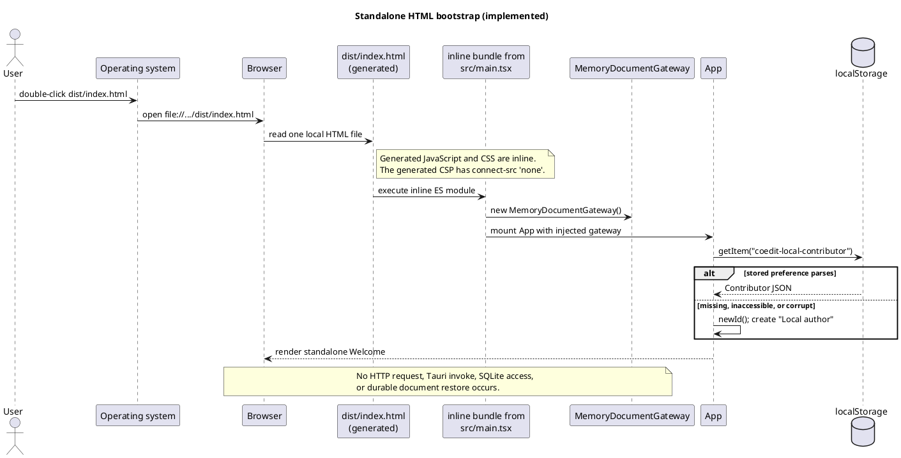

The repository-source `index.html` still references `/src/main.tsx` and normally needs Vite. The self-contained behavior belongs to the generated `dist/index.html` created by `standaloneHtml()` in `vite.config.ts`.

## Create a standalone document

**Implemented.** Standalone create does not ask for a path; `App` passes `null` to the gateway.

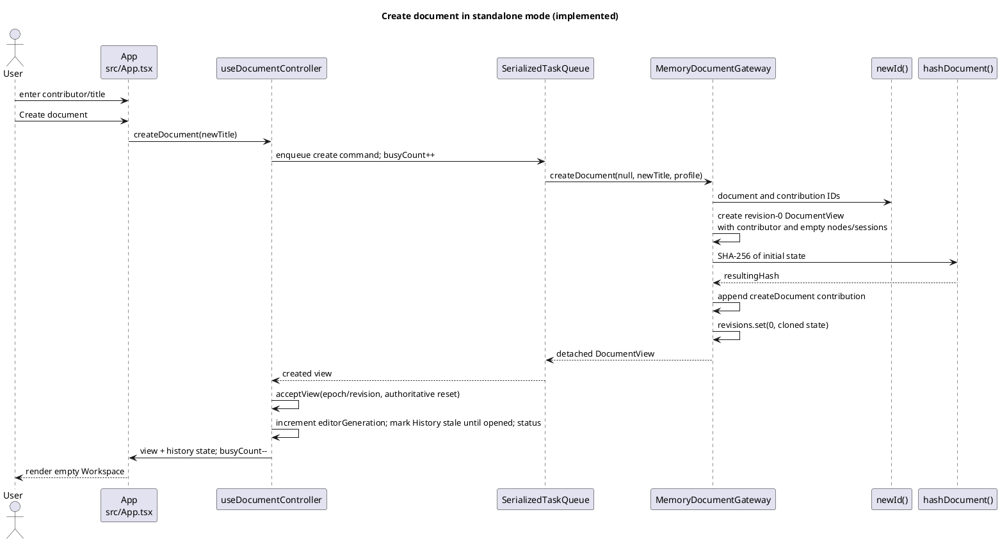

The initial contribution has revision `0`, base revision `-1`, operation type `createDocument`, and message `Created document`.

## Create a desktop document

**Implemented.** The UI selects a destination before `run()` invokes the gateway. `DocumentStore::create` builds a temporary database, commits its initial state, atomically renames it, and then reopens it through the normal validation path.

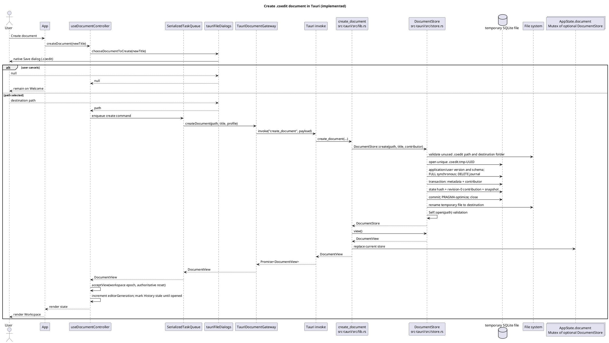

If creation fails before the final rename, `DocumentStore::create` attempts to remove the temporary file and returns an error. The controller's `executeMutation()` path presents gateway errors in the error banner and leaves later queue tasks runnable.

## Open and validate a desktop document

**Implemented.** Opening is desktop-only. Validation happens before the new store replaces the current `AppState.document` value.

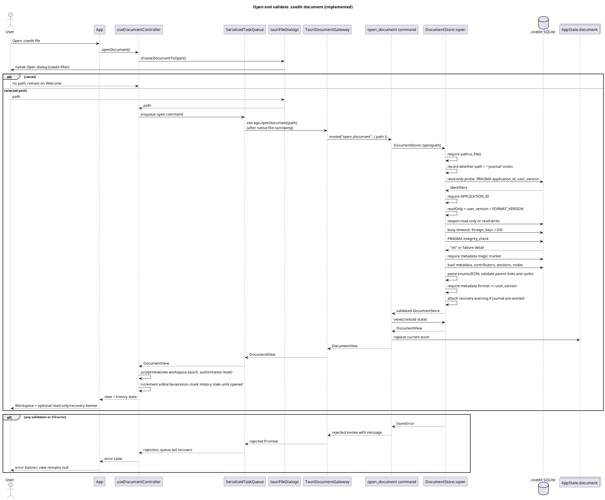

A file whose SQLite `user_version` is newer than the supported format is reopened read-only, provided the current core tables can still be loaded. There is no schema migration path in the current store.

## Apply a structural or metadata operation

**Implemented.** This covers `createNode`, `updateNode`, `moveNode`, `softDeleteNode`, `restoreNode`, and `renameDocument`. `updateContent` travels through the same gateway operation but has the editor-specific preparation shown in the next diagram.

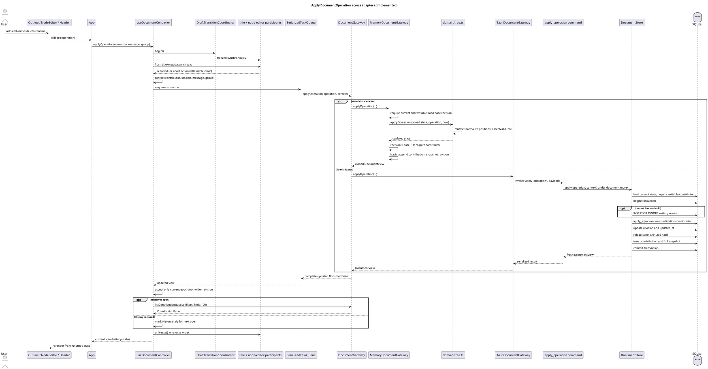

Both adapters return a complete materialized view after every successful mutation. Components do not mutate `view.nodes` directly.

## Rich-text/Yjs commit after 1.2 seconds

**Implemented.** The quiet-period timer starts only after a Yjs update. No gateway operation occurs for each keystroke.

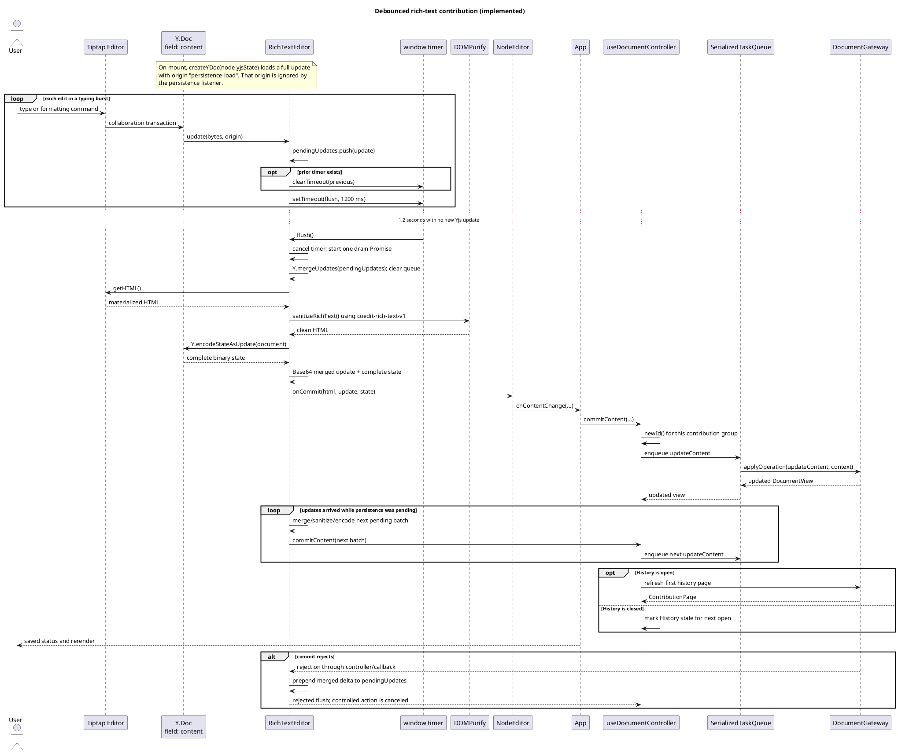

`RichTextEditor` exposes a participant to `NodeEditor`; `NodeEditor` combines its metadata drain with the rich-text drain and registers that aggregate with the controller. The document title registers separately. Controlled selection, operations, restore, export, backup, and Close synchronously freeze these drafts and await them rather than depending on unmount cleanup. In the desktop branch, Rust decodes both Base64 values, enforces content/Yjs size limits, independently sanitizes HTML with Ammonia, and writes the complete Yjs state. Rust sanitizer-fixture parity remains second-pass work.

## Load, filter, and page history

**Implemented for the standalone adapter and shared UI.** Filtering is part of the gateway query and occurs before page construction. The controller requests 100 entries at a time and the panel exposes **Load older contributions** while `hasMore` is true.

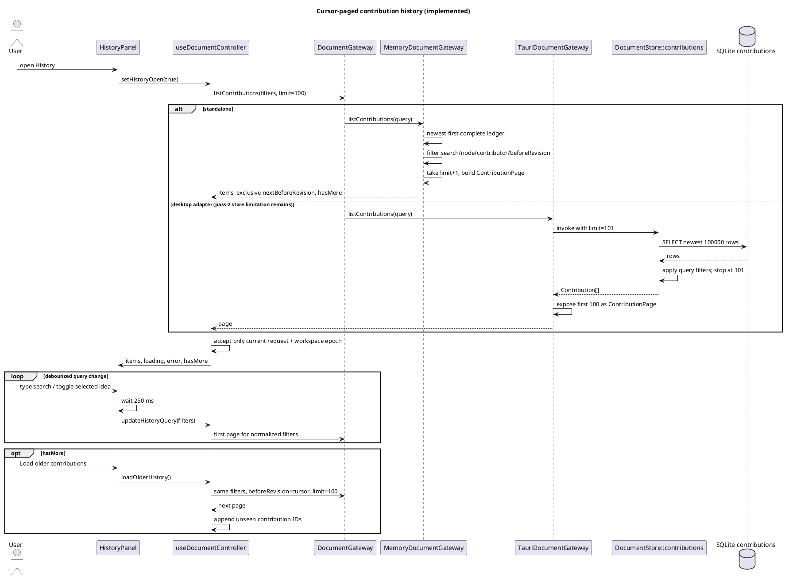

The header count is the number of loaded entries and appends `+` while another page is known to exist; it is not a ledger total. A superseded search/page response is ignored. History failures appear independently from a mutation that already succeeded. In standalone mode the entire runtime ledger is reachable; desktop matching entries older than Rust's 100,000-row pre-window remain a documented second-pass limitation.

## Restore a revision as a compensating contribution

**Implemented.** Restore does not delete later ledger records or move the revision counter backward. It creates a new current revision from an earlier snapshot.

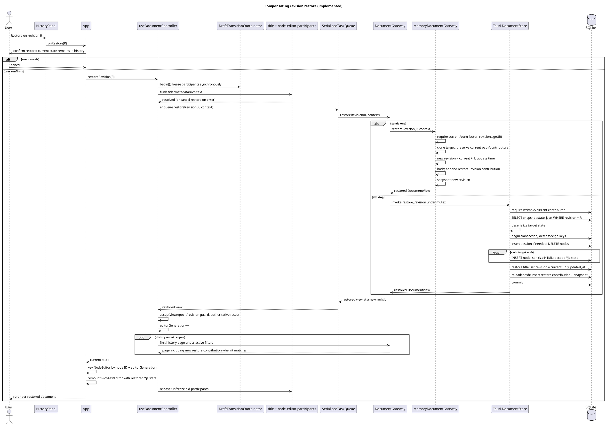

Both adapters record only `restoredRevision` in the compensating contribution payload. The controller test covers flush-before-restore and the authoritative generation change; `App` uses that generation in the editor key, so a same-node restore constructs a new `Y.Doc`. Full Tiptap DOM/reopen coverage and native restore parity remain verification work.

## Export JSON or Markdown

**Implemented.** Both storage capabilities expose export operations, but their JSON schemas still differ. Standalone emits the extended TypeScript `RecoveryExport`; Rust emits the older state/contributions envelope. Schema parity is second-pass work.

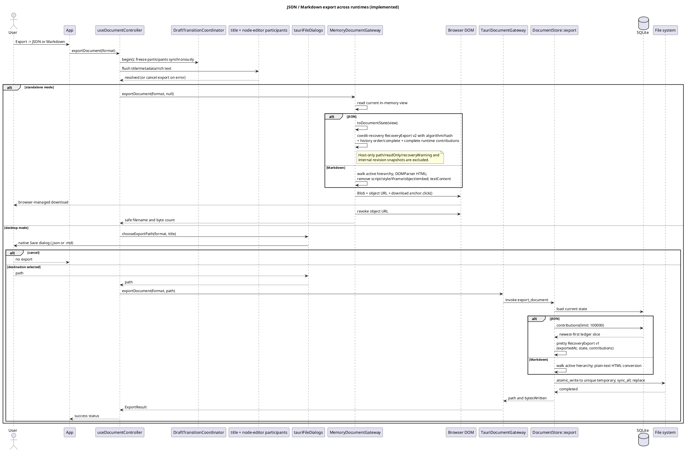

Markdown is presentation/interchange output, not lossless recovery. Standalone JSON contains the full state, canonical state hash, and complete contribution history for the current volatile runtime, but no revision snapshot map and no importer. Desktop JSON still silently requests at most 100,000 contributions and does not emit the standalone `hashAlgorithm`, `stateHash`, or `history` fields. Both filename paths share the centralized `ExportFormat` and `safeFilenameStem()` contracts; schema/semantic parity is part of the second pass.

## Create a desktop SQLite backup

**Implemented.** The backup menu item is rendered only in desktop mode.

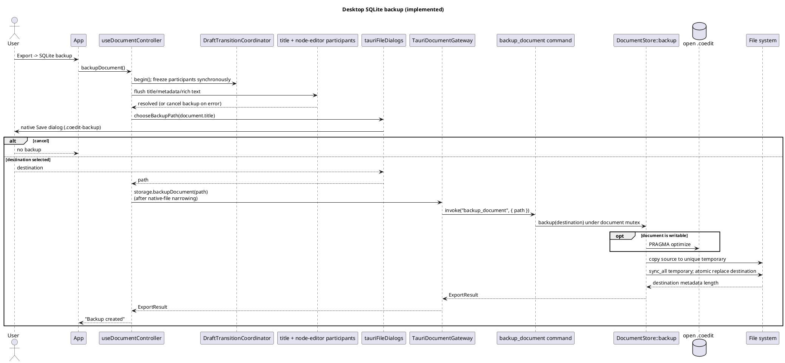

The backup is a file copy while `DocumentStore` owns the connection and command mutex. The desktop Open dialog currently filters only `.coedit`, not `.coedit-backup`.

## Close with an explicit draft-transition barrier

**Implemented for controlled in-app Close.** The controller synchronously freezes all registered draft participants, awaits document-title, node-metadata, and rich-text drains, then enqueues `closeDocument`. Since draft commits and close use the same `SerializedTaskQueue`, the backend cannot be discarded before an accepted pending edit finishes.

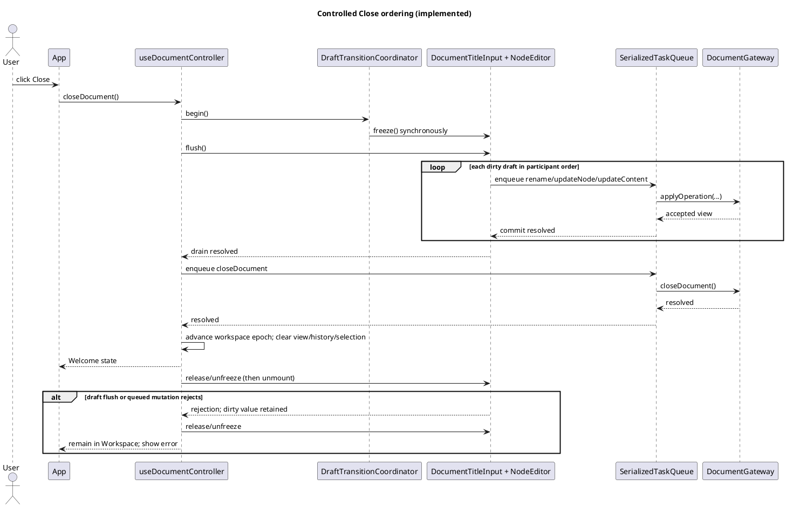

The queue tail recovers after rejection, so one failed command does not prevent a later retry. This barrier covers actions routed through the controller, including node selection, other operations, restore, export, backup, and Close. Blur still triggers an eager drain, but correctness for these transitions no longer relies on blur ordering. The barrier does **not** make browser tab close/reload, operating-system process termination, forced host suspension, or arbitrary React-root teardown awaitable; `RichTextEditor` cleanup clears its timer and deliberately does not launch an unawaitable save.

## Standalone build pipeline

**Implemented.** `corepack pnpm build` produces the double-clickable artifact.

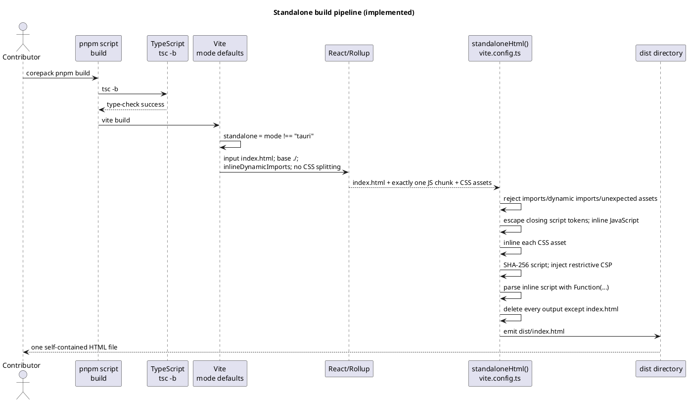

The build target includes ES2022, Chrome 105, and Safari 13. The standalone CSP denies all connections and allows only its hashed inline script, inline styles, and local data/blob image/font sources.

## Tauri build pipeline

**Implemented.** `corepack pnpm tauri:build` is the complete native build. `corepack pnpm build:tauri` creates only the Tauri-oriented frontend files.

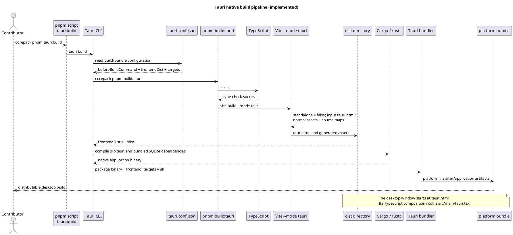

For development, `tauri dev` runs `corepack pnpm dev`, points the webview at `http://127.0.0.1:1420`, and still uses `tauri.html` as the desktop window URL. A raw `cargo build --release` does not execute the configured frontend build/bundling pipeline and is not the documented release command.

## Maintaining these diagrams

**Recommendation:** update this interaction view whenever a contribution changes:

- a composition root or build command;
- gateway call ordering or payloads;
- transaction, validation, hashing, snapshot, export, or backup behavior;
- the editor debounce/flush lifecycle;
- contributor/session attribution;
- history query/pagination behavior; or
- lifecycle concurrency, cancellation, retry, and error presentation.

The matching use case and implementation locations should also be updated in [Traceability](TRACEABILITY.md), and newly discovered mismatches should be recorded in [Known limitations](KNOWN_LIMITATIONS.md).
