# Sequence diagrams

This document is the RUP interaction view for Coedit Local. It traces important use cases through the current implementation and names the files that own each step.

Except for the section explicitly titled **Proposed safe close sequence**, every diagram describes current code. Notes labeled **Current limitation** identify observed behavior rather than intended behavior.

Related documents:

- [Documentation index](README.md)
- [Repository overview](../README.md)
- [Architecture](ARCHITECTURE.md)
- [Frontend design](FRONTEND_DESIGN.md)
- [Persistence design](PERSISTENCE_DESIGN.md)
- [UI and UX specification](UI_UX.md)
- [Feature-to-code traceability](TRACEABILITY.md)
- [Known limitations](KNOWN_LIMITATIONS.md)

## Participants and notation

| Diagram name | Implementation |
|---|---|
| `App` | `App` in `src/App.tsx` |
| `MemoryGateway` | `MemoryDocumentGateway` in `src/persistence/memoryGateway.ts` |
| `TauriGateway` | `TauriDocumentGateway` in `src/persistence/tauriGateway.ts` |
| `Dialogs` | `tauriFileDialogs` in `src/persistence/tauriFiles.ts` |
| `Commands` | Tauri commands in `src-tauri/src/lib.rs` |
| `Store` | `DocumentStore` in `src-tauri/src/store.rs` |
| `SQLite` | The current `.coedit` database connection |

Solid return arrows show relevant returned values, not every JavaScript or Rust stack return. A Tauri `invoke` serializes camel-case TypeScript values to the Serde models in `src-tauri/src/models.rs` and serializes the result back.

## Standalone bootstrap

**Implemented.** This is the double-clicked `dist/index.html` path produced by the default build. It does not start or contact a local server.

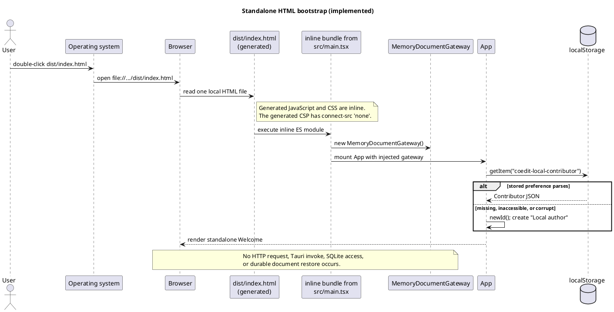

The repository-source `index.html` still references `/src/main.tsx` and normally needs Vite. The self-contained behavior belongs to the generated `dist/index.html` created by `standaloneHtml()` in `vite.config.ts`.

## Create a standalone document

**Implemented.** Standalone create does not ask for a path; `App` passes `null` to the gateway.

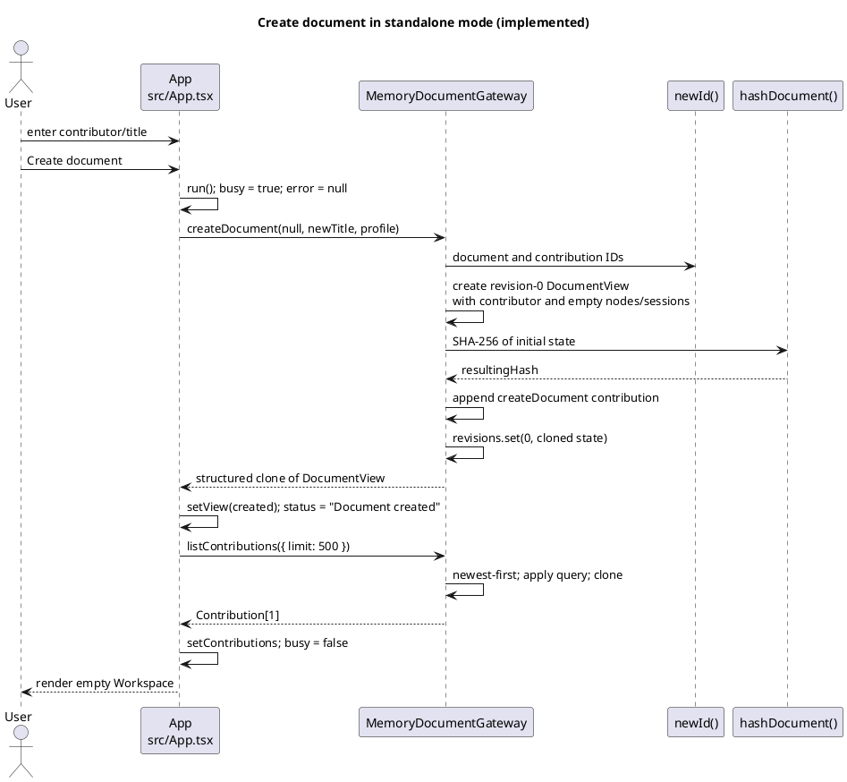

The initial contribution has revision `0`, base revision `-1`, operation type `createDocument`, and message `Created document`.

## Create a desktop document

**Implemented.** The UI selects a destination before `run()` invokes the gateway. `DocumentStore::create` builds a temporary database, commits its initial state, atomically renames it, and then reopens it through the normal validation path.

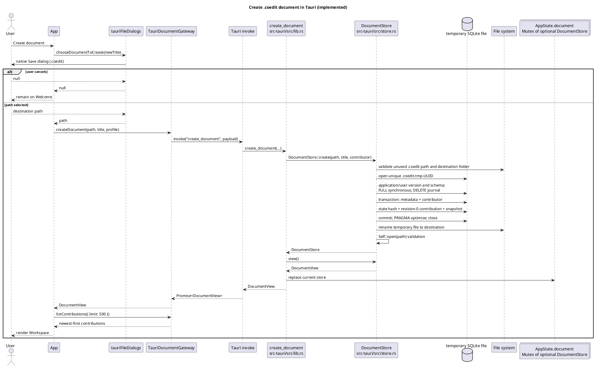

If creation fails before the final rename, `DocumentStore::create` attempts to remove the temporary file and returns an error. `App.run()` presents gateway errors in the error banner.

## Open and validate a desktop document

**Implemented.** Opening is desktop-only. Validation happens before the new store replaces the current `AppState.document` value.

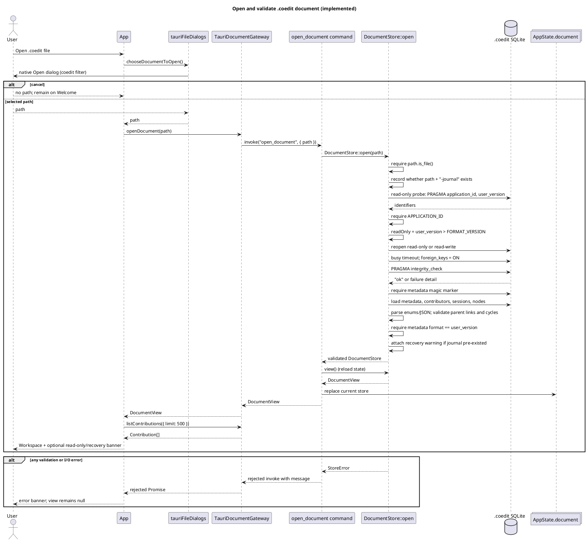

A file whose SQLite `user_version` is newer than the supported format is reopened read-only, provided the current core tables can still be loaded. There is no schema migration path in the current store.

## Apply a structural or metadata operation

**Implemented.** This covers `createNode`, `updateNode`, `moveNode`, `softDeleteNode`, `restoreNode`, and `renameDocument`. `updateContent` travels through the same gateway operation but has the editor-specific preparation shown in the next diagram.

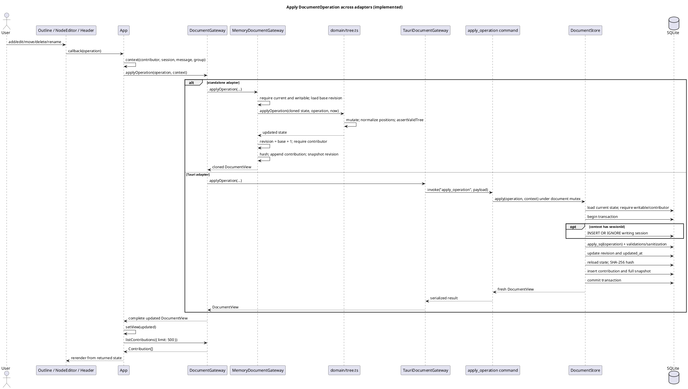

Both adapters return a complete materialized view after every successful mutation. Components do not mutate `view.nodes` directly.

## Rich-text/Yjs commit after 1.2 seconds

**Implemented.** The quiet-period timer starts only after a Yjs update. No gateway operation occurs for each keystroke.

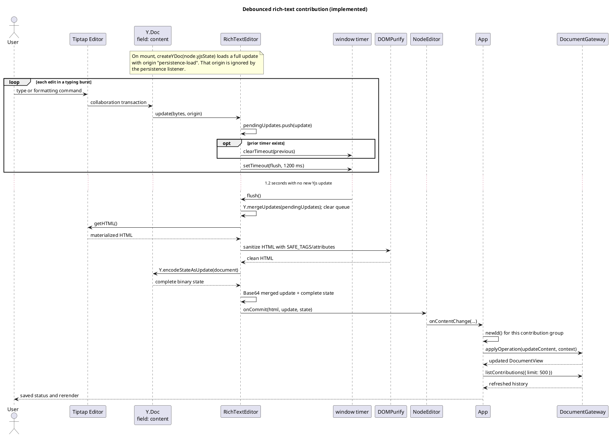

In the desktop branch, Rust decodes both Base64 values, enforces content/Yjs size limits, independently sanitizes HTML with Ammonia, and writes the complete Yjs state. The incremental `yjsUpdate` is validated and retained in the immutable operation payload, not applied separately to the materialized `nodes` row.

## Load and filter history

**Implemented.** `App` requests an unfiltered slice after create, open, every successful operation, and restore. `HistoryPanel` then filters that in-memory slice as the user types.

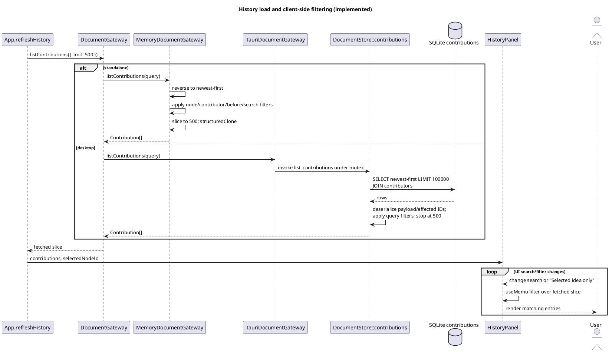

The header count is `contributions.length`. It is therefore the size of the fetched slice, not a separately queried total. The panel does not call the gateway when its search controls change.

## Restore a revision as a compensating contribution

**Implemented.** Restore does not delete later ledger records or move the revision counter backward. It creates a new current revision from an earlier snapshot.

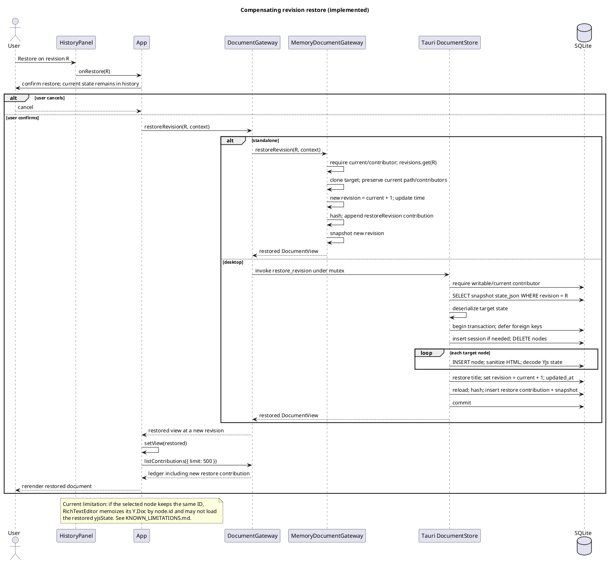

The desktop restore contribution payload records `restoredRevision`; the memory adapter additionally places the restored state in its in-memory contribution payload.

## Export JSON or Markdown

**Implemented.** The two runtime adapters expose the same `DocumentGateway.exportDocument` method but produce different JSON shapes and use different delivery mechanisms.

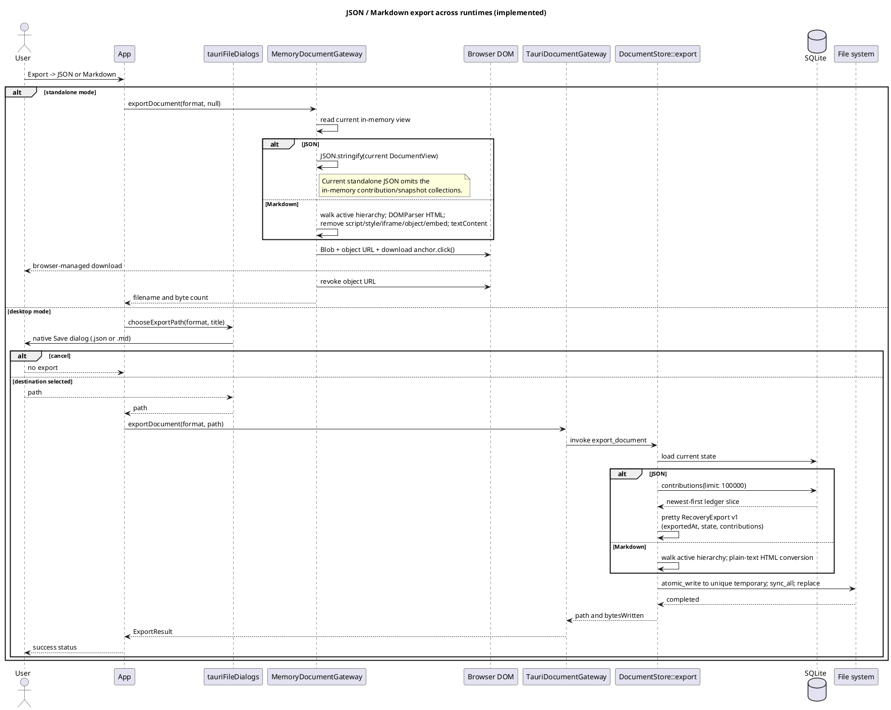

Markdown is presentation/interchange output, not lossless recovery. Desktop JSON is designed as recovery output but silently requests at most 100,000 contributions. The standalone JSON limitation is tracked in [Known limitations](KNOWN_LIMITATIONS.md).

## Create a desktop SQLite backup

**Implemented.** The backup menu item is rendered only in desktop mode.

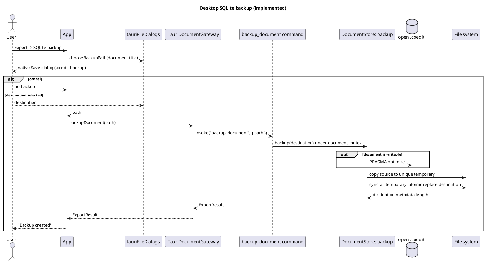

The backup is a file copy while `DocumentStore` owns the connection and command mutex. The desktop Open dialog currently filters only `.coedit`, not `.coedit-backup`.

## Close ordering and pending-edit race

### Current sequence

**Implemented, with known race/data-loss behavior.** `App.close()` awaits the gateway close first and only then sets `view` to `null`. The view change unmounts `RichTextEditor`, whose cleanup attempts to flush pending Yjs updates after the gateway has already closed.

Metadata fields also commit on blur. Clicking Close while such a field is focused can start a metadata operation independently just before the close click handler.

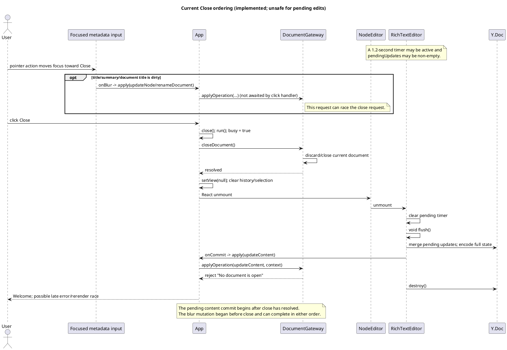

The memory adapter has an additional interleaving risk: `applyOperation()` awaits Web Crypto hashing before assigning `this.current = updated`, while `closeDocument()` can clear `current` during that await. A blur-started memory mutation can therefore finish after close and repopulate adapter state even though the UI intended to close it.

### Proposed safe close sequence

**Proposal only; not implemented.** This sequence requires an explicit save coordinator or imperative flush contract. It is included to make the intended correction reviewable, not to imply that current code already behaves this way.

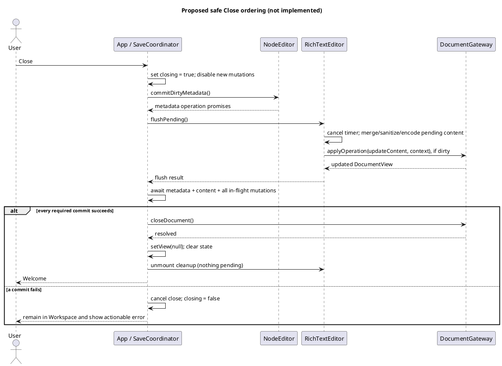

**Recommendation:** the implementation should serialize lifecycle and mutation commands, make editor flush awaitable, and define whether Close may proceed after a failed save. A `beforeunload` strategy for the standalone artifact is a separate browser-lifecycle concern and cannot replace explicit in-app ordering.

## Standalone build pipeline

**Implemented.** `corepack pnpm build` produces the double-clickable artifact.

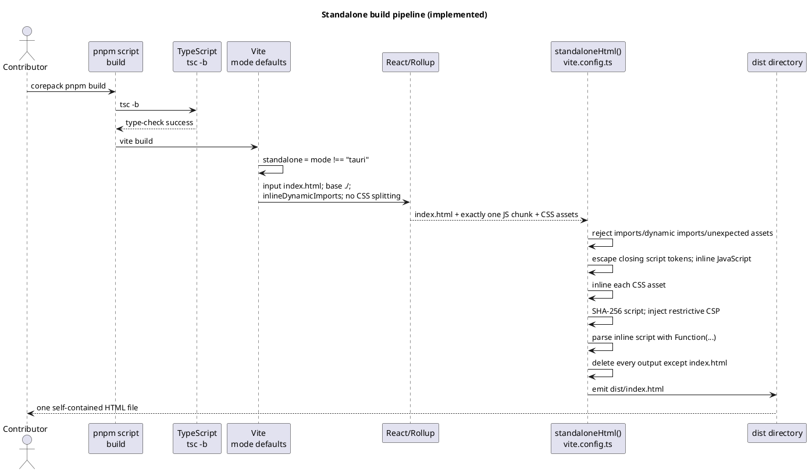

The build target includes ES2022, Chrome 105, and Safari 13. The standalone CSP denies all connections and allows only its hashed inline script, inline styles, and local data/blob image/font sources.

## Tauri build pipeline

**Implemented.** `corepack pnpm tauri:build` is the complete native build. `corepack pnpm build:tauri` creates only the Tauri-oriented frontend files.

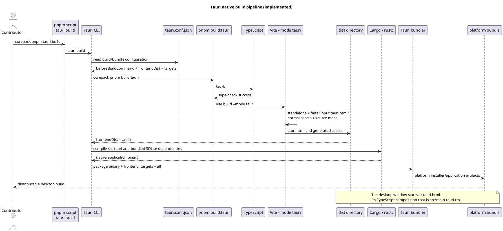

For development, `tauri dev` runs `corepack pnpm dev`, points the webview at `http://127.0.0.1:1420`, and still uses `tauri.html` as the desktop window URL. A raw `cargo build --release` does not execute the configured frontend build/bundling pipeline and is not the documented release command.

## Maintaining these diagrams

**Recommendation:** update this interaction view whenever a contribution changes:

- a composition root or build command;
- gateway call ordering or payloads;
- transaction, validation, hashing, snapshot, export, or backup behavior;
- the editor debounce/flush lifecycle;
- contributor/session attribution;
- history query/pagination behavior; or
- lifecycle concurrency, cancellation, retry, and error presentation.

The matching use case and implementation locations should also be updated in [Traceability](TRACEABILITY.md), and newly discovered mismatches should be recorded in [Known limitations](KNOWN_LIMITATIONS.md).
