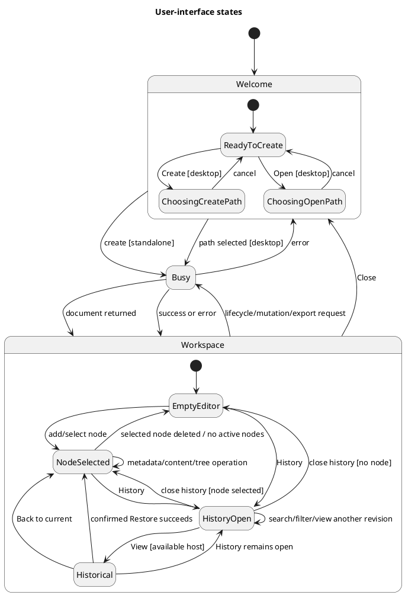

# UI and UX specification

This document records the current Coedit Local interface and gives new contributors a file-level map for changing it. Statements under **Implemented** describe the current code. Statements under **Recommendation** are design guidance and are not promises about the present application.

Related documents:

- [Documentation index](README.md)
- [Repository overview](../README.md)
- [Architecture](ARCHITECTURE.md)
- [Frontend design](FRONTEND_DESIGN.md)
- [Sequence diagrams](SEQUENCE_DIAGRAMS.md)
- [Feature-to-code traceability](TRACEABILITY.md)
- [Known limitations](KNOWN_LIMITATIONS.md)
- [Proposed continuous-workspace change package](proposals/README.md)

## UX intent

The implemented interface supports one local hierarchical writing document at a time. Its primary loop is:

1. create or open a document;
2. create and arrange ideas inline in a continuous hierarchical canvas;
3. refine block metadata and transfer the sole rich-text editor where needed;
4. inspect attributed history;
5. restore, export, back up, or close.

The standalone build emphasizes fast inspection and debugging. It is visibly labeled as volatile and omits desktop-only file actions. The Tauri build adds `.coedit` open/create, native export paths, and SQLite backup without changing the central editing workspace.

## Information architecture

```text
Coedit Local
├── Welcome
│   ├── contributor name
│   ├── document title
│   ├── create document
│   └── open .coedit file                 desktop only
└── Workspace
    ├── Header
    │   ├── document title
    │   ├── persistence status
    │   ├── history toggle and loaded count (+ when more exists)
    │   ├── export menu
    │   │   ├── Markdown
    │   │   ├── JSON recovery file
    │   │   └── SQLite backup             desktop only
    │   └── close
    ├── Continuous document canvas
    │   ├── inline title and freeform tags
    │   ├── sanitized inactive body previews
    │   ├── one transferable rich-text body editor
    │   ├── add sibling/child and collapse/expand
    │   ├── reorder/indent/outdent/reparent
    │   └── confirmed subtree deletion
    └── History                            optional panel
        ├── search
        ├── selected-idea filter
        ├── contribution metadata
        ├── load older contributions
        └── view revision (available host) / restore (host-deferred)
```

## UI state model

The state names below describe rendered states; they are not explicit TypeScript enum values.



`App` renders orthogonal conditions owned by `useDocumentController` and the current view:

- `workspaceProjection.kind === "historical"` renders a persistent revision banner and static sanitized node detail; mutation/export controls are disabled while History navigation, Back, confirmed restore, and Close remain available.
- `view.readOnly` outside historical mode shows a newer-format warning and disables mutation controls.
- `view.recoveryWarning` shows a recovery warning.
- `busy` changes the status dot/text and disables selected controls.
- `error` shows a dismissible fixed error banner.
- `historyOpen` changes the wide layout from two columns to three.

## Current screen mockups

The mockups are schematic. Exact dimensions and colors come from `src/styles.css`.

### Welcome — standalone

```text
┌──────────────────────────────────────────────────────────────────────┐
│                                                                      │
│             ┌──────────────────────────────────────────┐             │
│             │  [ C ]                                   │             │
│             │  LOCAL-FIRST WRITING                     │             │
│             │                                          │             │
│             │  Ideas become structure.                 │             │
│             │  Structure becomes text.                 │             │
│             │                                          │             │
│             │  Create a private hierarchical document… │             │
│             │                                          │             │
│             │  ! Standalone HTML mode: documents are   │             │
│             │    kept in memory and disappear…         │             │
│             │                                          │             │
│             │  YOUR CONTRIBUTOR NAME                   │             │
│             │  [ Local author_______________________ ] │             │
│             │  DOCUMENT TITLE                          │             │
│             │  [ Untitled document__________________ ] │             │
│             │                                          │             │
│             │  [ Create document ]                     │             │
│             └──────────────────────────────────────────┘             │
│                                                                      │
└──────────────────────────────────────────────────────────────────────┘
```

Implementation: the standalone notice and absence of Open are selected by `controller.nativeFilesAvailable`, which derives from `documentGateway.storage.kind === "native-file"` rather than a Tauri/environment check in the component.

### Welcome — desktop difference

```text
Actions:  [ Create document ]  [ Open .coedit file ]
```

Implementation: both actions call `DocumentFileDialogs` before invoking the desktop gateway. Canceling a native dialog leaves the welcome screen unchanged.

### Main workspace

```text
┌──────────────────────────────────────────────────────────────────────────────┐
│ [C] Coedit │        Document title        │ ● All changes saved locally     │
│            │                              │ [History 12] [Export ▾] [Close] │
├────────────┴──────────────────────────────┴──────────────────────────────────┤
│ CONTINUOUS DOCUMENT                                                           │
│ ▾ ⋮⋮ Chapter one                    [scene ×] [draft ×]                       │
│      Sanitized body preview…                              [Edit body]          │
│      [Add below] [Add child] [Move…] [Indent] [Delete]                       │
│   · ⋮⋮ Arrival                      [place ×]                                  │
│        [Bold][Italic][Heading][Bullets][Numbered][Quote]…                     │
│        Write and refine here…                                                 │
│ ▸ ⋮⋮ Discovery                                                               │
│ · ⋮⋮ Chapter two                                                             │
└───────────────────────┴───────────────────────────────────────────────────────┘
```

Implementation ownership:

- Header and workspace switching: `src/App.tsx`.
- Workspace/use-case state, sequencing, paging, and status: `src/application/useDocumentController.ts`.
- Projection, controlled expansion, structural intent, focus fallback, and announcements: `src/components/DocumentCanvas.tsx`.
- Block controls and sole editor ownership: `src/components/NodeBlock.tsx`.
- Metadata fields: `src/components/NodeMetadataFields.tsx`.
- Tag tokens, suggestions, and freeform entry: `src/components/TagEditor.tsx` and `src/domain/tags.ts`.
- Node body and toolbar: `src/editor/RichTextEditor.tsx`.
- Layout and visual styling: `src/styles.css`.

### Workspace with history

```text
┌──────────────────┬──────────────────────────────────┬────────────────────────┐
│ CONTINUOUS DOCUMENT                              │ IMMUTABLE LEDGER       ×│
│ ▾ ⋮⋮ Chapter one                                 │ History                 │
│      The opening…                                │ [Search contributions] │
│   · ⋮⋮ Arrival                                   │ [ ] Context idea only  │
│        Text…                                     │ ────────────────────── │
│   ▸ ⋮⋮ Discovery                                 │ r12 Writing contribution│
│                                                   │ Local author · time    │
│                                                   │ 62bf…          [View]  │
└──────────────────┴──────────────────────────────────┴────────────────────────┘
```

Implementation: history is a 340 px second grid column on viewports wider than 900 px. The list is newest-first as returned by the gateway. Search and canvas-context changes are debounced for 250 ms and sent to the adapter before pagination. A **Load older contributions** button appears when the current page reports `hasMore`.

On a host with revision queries, a row is labeled **Current**, **Loading…**, or **Viewing** as appropriate and other historical rows expose **View**. Host-deferred Tauri omits View and retains its row-level Restore fallback until WP-10.

### Historical workspace — standalone

```text
┌──────────────────────────────────────────────────────────────────────┐
│ Viewing revision 7 · Read only · current revision is 12             │
│                         [Back to current] [Restore as new revision…] │
├──────────────────────────────────────────────────────────────────────┤
│ HISTORICAL DOCUMENT                                                  │
│ ▾ Earlier idea title [research] [draft]                              │
│   Sanitized static historical content…                               │
│ · Earlier child…                                                     │
└──────────────────────────────────────────────────────────────────────┘
```

Implementation: `App` renders the same `DocumentCanvas` with its read-only contract in historical mode. Every block uses `sanitizeRichText` and mounts no form field, contenteditable region, structural mutation action, toolbar, Tiptap/Yjs instance, timer, or draft participant; disclosure remains local presentation state. The banner is outside the scrolling workspace, announces both revisions through a polite status, makes **Back to current** primary, and explains the append/retention consequence before restore. Export cannot open and its actions are disabled.

### Narrow layout

```text
┌──────────────────────────────────────────────────────────┐
│ [C] │ Document title │ [History] [Export] [Close]       │
├──────────────────────────────────────────────────────────┤
│ CONTINUOUS DOCUMENT                                      │
│ ▾ Chapter one                                            │
│   · Arrival                                              │
│      Text…                  ┌───────────────────────────┐ │
│                             │ HISTORY OVERLAY          ×│ │
│                             │ Search / entries          │ │
└─────────────────────────────┴───────────────────────────┴─┘
```

Implementation: at `max-width: 900px`, the brand text and save-status text are hidden, the canvas narrows its margins, and History becomes a fixed right-side overlay of at most 360 px/90 viewport width. The optional compact Navigator/History drawer shell remains later work.

## Interaction specification

### Welcome and document lifecycle

| Action | Trigger | Implemented response | Code |
|---|---|---|---|
| Edit contributor name | Input change | Updates `profile`; an empty value becomes `Local author`; preference is written to local storage. | `loadContributor` and `App` in `src/App.tsx` |
| Edit initial title | Input change | Updates `newTitle`. | `src/App.tsx` |
| Create | Button click or Enter in document-title input | Standalone creates immediately; native-file hosts first ask for a `.coedit` path. Successful creation opens the workspace; History fetches its first page only when opened. | `controller.createDocument`, `src/App.tsx` |
| Open | Native-files button | Native `.coedit` selection followed by narrowed `storage.openDocument`; success opens workspace and marks history ready to load when opened. | `controller.openDocument`, `src/persistence/tauriFiles.ts` |
| Close | Header button | Synchronously freezes and awaits registered document-title, pending tag-input, node-metadata, and rich-text drafts; then queues gateway close and returns to welcome. A failed drain/close retains the workspace and dirty drafts and shows an error. | `controller.closeDocument`, `DraftTransitionCoordinator` |

### Header

| Control | Commit behavior | Notes |
|---|---|---|
| Document title | `renameDocument` on blur if changed | Replaced by static text in historical mode; otherwise disabled when `view.readOnly`. Empty/whitespace is normalized to `Untitled document` by domain logic. |
| Status | Shows transition, revision-loading, saving, or last-success text in that priority order | The dot pulses in the saving state. |
| History | Toggles panel | Count is the number currently loaded. A `+` suffix means another page is reachable; no suffix does not claim a separately queried lifetime total. |
| Export → Markdown | Immediate download in standalone; path dialog then write in desktop | Presentation/interchange export; disabled in historical/loading/read-only mode. |
| Export → JSON recovery file | Flush then immediate download in standalone; flush, path dialog, then write in desktop | Standalone emits the marked `coedit-recovery` version-2 envelope with hash and explicit history completeness. Desktop's legacy version-1 envelope lacks those fields and remains capped. Neither has an importer. Disabled outside an idle live workspace. |
| Export → SQLite backup | Desktop only | Uses a `.coedit-backup` save dialog. |

### Continuous canvas structure

| Action | Trigger | Result |
|---|---|---|
| Set canvas context | Focus any block control | Updates the context ID without claiming body-editor ownership. |
| Activate body | Native **Edit body** button | Drains the previous owner, then mounts exactly one `RichTextEditor`; failure retains the old owner and initiating focus. |
| Expand/collapse | Disclosure button or left/right disclosure handling | Changes controlled expansion only. Hiding an editor-owning descendant first drains/releases it and cancels on failure. |
| Add root | Empty-canvas button | Dispatches `createNode` with `parentId: null` and focuses the accepted title. |
| Add sibling/child | Title Enter, modified shortcut, or block action | Drains registered drafts, creates at the computed sibling/child index, expands a new parent, and focuses the accepted title. |
| Reorder/indent/outdent | Named actions or handle shortcuts | Dispatches `moveNode` after the controller transition barrier and restores handle focus. |
| Reparent | Drag a block handle and drop onto another block | Makes the dragged node the last child of the target; keyboard indent/outdent provides an alternative. |
| Delete | Named action or Delete from the handle, then confirmation | Dispatches `softDeleteNode`; domain logic deletes active descendants and the canvas chooses a visible focus/context fallback. |

Deleted nodes do not appear in `projectVisibleNodes()`. There is no current trash view or `restoreNode` control; whole-document revision restore is available from History.

### Node metadata

| Field | Local behavior | Persistence trigger |
|---|---|---|
| Title | Controlled local `title` state; plain Enter requests the following sibling | Blur or a controlled transition, when different from `node.title`. |
| Tags | Removable chips plus editable combobox; suggestions are distinct tags on active nodes | Enter, suggestion selection, removal, blur, or controlled-transition flush. |

Tags are optional and freeform. Input is Unicode-normalized, whitespace-collapsed, case-insensitively deduplicated, and limited to 20 tags per node and 64 code points/256 UTF-8 bytes per tag. New values grow the reusable document vocabulary; a value shrinks away when its last active-node use is removed or deleted. Selected tags are excluded from suggestions. Arrow keys navigate suggestions, Enter adds, Escape closes, and Backspace in an empty input removes the last tag. Each chip exposes an explicitly named removal button, and additions/removals are announced through a polite live region.

When an accepted block changes, `NodeMetadataFields` synchronizes clean local drafts from props while preserving dirty fields until their registered participant drains.

### Node body

Tiptap commands apply immediately to the sole Yjs-backed editor owner while capacity is available. Pre-application transaction facts drive semantic, character-threshold, 30-second idle, composition, and controlled-transition checkpoints; sanitized HTML, an incremental Yjs update, and complete Yjs state are captured together. Slow/failing persistence visibly blocks further body changes at the two-checkpoint bound and exposes **Retry save**. Canvas owner transfer, owner-hiding collapse/delete, create/move, restore, export, backup, and Close synchronously freeze and drain registered drafts first. An authoritative restore increments the editor generation and remounts the owner even when its node ID is unchanged. Inactive and historical blocks remain separately readable sanitized previews.

Pasted, legacy/fallback, and committed HTML use the centralized `coedit-rich-text-v1` tag/attribute policy in `src/editor/sanitizeRichText.ts`. Read-only mode disables toolbar buttons and makes Tiptap non-editable.

### History

| Action | Implemented behavior |
|---|---|
| Search | Case-insensitive substring match over operation type, contributor name, and message. |
| Selected idea only | Excludes contributions whose `affectedNodeIds` do not contain the current selected ID. Disabled when no node is selected. |
| Inspect | Shows revision, message/operation, contributor, localized time, and first 12 hash characters; full hash is the code element's title. |
| Load older contributions | Requests the next page using the exclusive `nextBeforeRevision` cursor and appends unseen entries. Shown only while `hasMore`. |
| View (available host) | Flushes live drafts, materializes the revision through the query capability, and projects the complete snapshot through the read-only canvas without changing live state or the ledger. |
| Current / Loading… / Viewing | Non-command row states distinguish the retained live revision, active query, and displayed materialization. Other View rows remain available during query loading so a newer request can supersede it. |
| Back to current | Banner action that invalidates a pending query if necessary and restores retained live state without a gateway call. |
| Restore as new revision… | Banner action with explicit confirmation that one new revision will be appended and later history retained. Success returns live; failure retains the historical view. |
| Restore (host-deferred) | Until native revision queries exist, Tauri retains confirmation followed by row-level `restoreRevision`. |

The current live revision is not viewable/restorable from its row. A materialization request has row-local loading state and may be superseded by choosing another revision; query failures preserve the exact live or historical origin and use the global error banner. Contribution-list loading/errors remain independent, so a committed mutation is not represented as failed solely because a visible-panel refresh failed.

## Keyboard behavior

### Implemented

- `Enter` in the welcome document-title field creates a document.
- Normal Tab/Shift+Tab browser order reaches the block disclosure, handle, title, tags, **Edit body**, toolbar/editor, actions, and following blocks.
- Plain `Enter` in a block title creates a following sibling; modified or IME-composition Enter does not take that title path.
- `Mod+Enter` creates a following sibling and `Mod+Shift+Enter` creates the last child from a live block.
- `ArrowUp`/`ArrowDown` on a handle or disclosure moves focus through visible blocks; disclosure `ArrowLeft` collapses or focuses the parent and `ArrowRight` expands or focuses the first child.
- `Alt+Shift+ArrowUp/Down` reorders from the handle; `Alt+Shift+ArrowRight/Left` indents/outdents.
- `Delete` from the explicit handle invokes confirmed subtree deletion; text Delete remains editing.
- `Escape` from an inline control returns focus to its block handle without discarding drafts.
- Handled structural keys prevent browser scrolling and do not fire during IME composition.
- Tiptap supplies editing and Yjs-backed undo/redo behavior; toolbar buttons expose Undo and Redo.
- `:focus-visible` gives buttons, inputs, textareas, selects, and focusable containers a two-pixel outline.

### Remaining qualification

- Test the implemented shortcuts and focus restoration with screen readers and supported browsers/platforms.
- Add touch-first discovery and the optional compact Navigator/History drawer behavior.

## Accessibility inventory

### Implemented

- The canvas is a labeled section containing document-order blocks; hierarchy level and sibling position are announced by each structural handle.
- The rich editor surface has `aria-label="Node text"`.
- The formatting group has `role="toolbar"` and an accessible label.
- Disclosure buttons announce Collapse or Expand and expose `aria-expanded` when children exist.
- Every mutation has a named native button; structural changes use a polite live region.
- History close has `aria-label="Close history"`.
- The document-title input has an accessible label.
- Native labels wrap the welcome, node metadata, and filter controls.
- Read-only controls are disabled rather than merely styled.
- Focus-visible styling has sufficient visual prominence against the light surface.

### Current gaps

- Formatting toggles visually use `.active` but do not expose `aria-pressed`.
- History search has a placeholder but no explicit label.
- Drag placement, touch discovery, and full screen-reader/browser behavior have not completed the manual qualification matrix.
- Status, warning, and error content do not declare live-region semantics.
- The history overlay does not trap focus or restore focus when closed.
- Drag-to-reparent has no equivalent fully featured keyboard command or announced drop state.
- Row actions are revealed by hover or selection, which is awkward for touch and some magnification workflows.
- The UI has no skip link or pane landmarks beyond the outline navigation and main editor.

### Recommendation

Treat accessibility changes as behavior changes: add component tests for names, roles, pressed/expanded state, focus movement, and disabled/read-only behavior. Verify with keyboard-only use and at least one desktop and one mobile screen reader before claiming conformance.

## Feedback, confirmation, and error behavior

### Implemented

- Controller `executeMutation()` clears the prior command error, tracks queued/running work with `busyCount`, catches gateway exceptions, and displays their messages; `runTransition()` also catches draft/transition failures.
- `SerializedTaskQueue` preserves command order and remains usable after a failed task.
- Successful actions replace the status string with a use-case-specific message.
- The busy state changes the header to a pulsing amber dot and `Saving…`.
- Standalone volatility, newer-format read-only state, and recovery warnings use persistent banners.
- Errors use a fixed dismissible banner near the top of the workspace.
- Delete and restore require `window.confirm`.
- Canceling a native file dialog is silent and non-destructive.

### Recommendation

- Give asynchronous status and error regions appropriate live-region behavior.
- Distinguish saving document mutations from exporting or opening instead of describing every busy operation as `Saving…`.
- Replace native confirmations only if a custom dialog also implements correct focus management and keyboard behavior.
- Add live-region semantics for the already separate history-refresh error and command-status channels.

## Visual system and CSS ownership

All current presentation is in `src/styles.css`; there is no component library or CSS-module boundary.

Root custom properties:

| Token | Current value | Use |
|---|---|---|
| `--ink` | `#24251f` | Primary text. |
| `--muted` | `#717267` | Secondary text. |
| `--paper` | `#fffefa` | Main surfaces. |
| `--line` | `#dcd9cd` | Borders and separators. |
| `--accent` | `#365d4d` | Brand, primary action, active state. |
| `--accent-soft` | `#e3ede7` | Selected/count background. |

Typography uses system sans-serif for application chrome and Georgia for editorial headings/content. The visual structure is a warm paper-like workspace with a green accent and a centered maximum-width continuous document column.

Important CSS ownership:

| Area/state | Selectors |
|---|---|
| Welcome | `.welcome-shell`, `.welcome-card`, `.welcome-actions`, `.standalone-notice` |
| Header | `.topbar`, `.brand`, `.document-title`, `.top-actions`, `.status`, `.menu` |
| Main layout | `.workspace`, `.workspace.with-history` |
| Continuous canvas | `.document-canvas`, `.document-canvas-page`, `.node-block` |
| Node metadata/structure | `.node-block-metadata`, `.node-block-title-input`, `.node-block-actions`, `.node-block-handle` |
| Node tags | `.tags-field`, `.tag-editor`, `.tag-chip`, `.tag-options` |
| Rich text | `.rich-editor`, `.editor-toolbar`, `.editor-surface` |
| History | `.history-panel`, `.history-list`, `.history-copy` |
| Feedback | `.warning-banner`, `.error-banner`, `.saving` |
| Narrow layout | `@media (max-width: 900px)` |

## Responsive and touch behavior

### Implemented

- Wide layout: flexible continuous canvas; History adds a 340 px second column.
- At 900 px and below: the canvas remains full-width and History overlays from the right.
- Canvas content width is capped at 920 px and its side margins/indentation shrink at the breakpoint.
- Toolbar buttons wrap.

### Current gaps

- There is no phone-specific compact auxiliary-panel manager.
- Hover/focus-revealed block actions and HTML drag/drop need touch-platform qualification.
- No safe-area-inset or virtual-keyboard-specific behavior is defined.

### Recommendation

Before describing iPadOS or phone support as complete, qualify the named structural buttons as the touch fallback, add the compact auxiliary drawer, safe-area handling, and manual coverage for software keyboard, selection, paste, download, and browser tab lifecycle.

## Continuous-workspace follow-on work

The information architecture, mockups, and interaction tables above describe the executable continuous canvas. WP-1 through WP-4, WP-6, and WP-7 provide verified historical materialization, explicit modes/guards, semantic checkpoints, visible-node ordering, shared live/historical blocks, structural parity, and one coordinator-backed editor. Grouped History, the optional navigator, and its responsive drawer remain follow-on work.

- [Continuous block-outline](proposals/CONTINUOUS_BLOCK_OUTLINE.md): one scrolling projection, indented blocks, contextual controls, separate canvas-context/focus-region/editor-owner state, drain-before-hide collapse, one Tiptap editor, normal Tab navigation, handle-scoped structural shortcuts, live/historical reuse, and an optional navigation-only tree sidebar.
- [Query-first historical views](proposals/QUERY_FIRST_HISTORY.md): History **View** as the primary action, verified detached snapshots, origin-aware loading, persistent read-only revision banner, **Back to current**, and separately confirmed **Restore as new revision**.
- [Body checkpoint strategy](proposals/BODY_CHECKPOINT_STRATEGY.md): semantic insertion/deletion/cursor/focus/tree boundaries, bounded FIFO backpressure, page-aware grouped checkpoints, and centralized configurable `batchCharacterThreshold`/`idleTimeoutMs` defaults.

The optional navigator defaults closed and is a runtime visibility preference, not an editing mode. Where available container width preserves the canvas minimum, it docks beside the canvas; at compact/touch widths it becomes an explicitly opened drawer that is mutually exclusive with a History drawer. A saved dock preference never auto-opens that modal; History has a separate page-session dock request, and compact drawers use one transient active-panel state. Effective History visibility is derived from those layout states: its first reveal without a valid page queries once, hide/reveal with a valid non-stale page is silent, relevant accepted changes while hidden advance a data generation and mark it stale, and the next reveal performs one guarded refresh while older responses are rejected. Navigator rows browse/reveal blocks from the active live or historical projection, while an explicit **Focus in document** action transfers focus to the canvas through the same safety boundary as any cross-block transition. Navigator expansion never hides canvas content, arrow-key browsing never changes canvas context or editor ownership, and the panel contains no body/metadata editor or structural mutation controls. Successful drawer activation closes and focuses the target; failure keeps the row available. A breakpoint-forced departure from a dirty body captures exactly one ordinary checkpoint, while outside-app focus is never pulled back. Manual closing returns focus to its toggle, and historical mode keeps the navigator read-only and sourced from the historical snapshot. Restore expands any changed required ancestry before mounting a surviving editor-resume target, so no hidden block owns the editor.

The proposal documents contain the remaining Navigator/History shell wireframes, state/sequence diagrams, accessibility requirements, failure behavior, rollout steps, and acceptance criteria. Navigator preference/selection/expansion and compact-drawer state will remain presentation-only and excluded from `.coedit`, hashes, snapshots, History, and exports.

## UX extension guide

### Add a workspace panel

1. Decide whether the panel is mutually exclusive, overlay, or another persistent column.
2. Keep document/use-case state in `useDocumentController` when it affects persistence or sibling components; keep purely presentational panel state local when possible.
3. Add a clear accessible name, focus entry/return behavior, empty/loading/error states, and a narrow-layout behavior.
4. Update `.workspace` grid rules and the 900 px media query.
5. Add the corresponding sequence and state transitions to [Sequence diagrams](SEQUENCE_DIAGRAMS.md) and this document.

### Add a canvas structural command

1. Add a `NodeBlockCommand` and map it in `DocumentCanvas`; keep persisted index/ancestry calculations in one place.
2. Dispatch an attributed operation through `useDocumentController`; do not mutate `view.nodes` in the component.
3. Define mouse, keyboard, and touch triggers together.
4. Specify selection/focus after success and behavior during `readOnly`/`busy`.
5. Add domain tests for hierarchy invariants and component tests for interaction semantics.

### Add editor toolbar functionality

1. Add the Tiptap extension and command in `RichTextEditor.tsx`.
2. Expose toggle state with both styling and `aria-pressed` where appropriate.
3. Keep browser and Rust sanitization policies aligned.
4. Test keyboard editing, paste, undo/redo, state reload, read-only mode, and exports.

### Change save behavior

The current save boundary is eager title/tag drains plus semantic Yjs body checkpoints, all backed by the controller-visible draft registry. The body policy centralizes configurable `batchCharacterThreshold` and `idleTimeoutMs`; ProseMirror/`beforeinput` classification drives synchronous Yjs/HTML capture, a two-checkpoint FIFO, visible backpressure/failure, and retry. Controlled node switching, operations, revision restoration, document close, export, backup, and canvas editor transfer freeze and await registered participants; page/process exit and forced suspension remain unawaitable. New structural canvas actions must cover failure/retry, authoritative editor remount, focus restoration, and both gateway implementations. See [Sequence diagrams](SEQUENCE_DIAGRAMS.md) and the [body checkpoint strategy](proposals/BODY_CHECKPOINT_STRATEGY.md).

## UX acceptance checklist

**Recommendation:** every user-visible contribution should be checked in these states:

- standalone and Tauri composition;
- new/empty and populated document;
- selected and unselected node;
- writable, busy, and read-only;
- History closed and open;
- wide and ≤900 px viewport;
- pointer, keyboard-only, and touch where claimed;
- normal result, cancel, validation failure, and gateway failure;
- long title/content, deep hierarchy, and long contribution list;
- focus visibility, accessible name, announced state, and logical focus destination.

Record implementation ownership in [Traceability](TRACEABILITY.md) and unresolved behavior in [Known limitations](KNOWN_LIMITATIONS.md).
