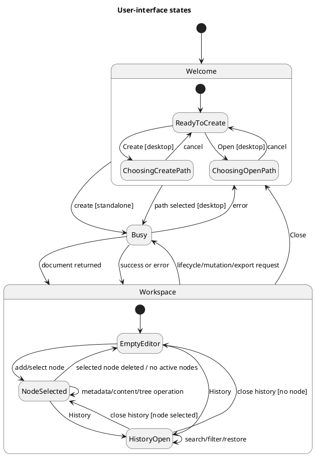

# UI and UX specification

This document records the current Coedit Local interface and gives new contributors a file-level map for changing it. Statements under **Implemented** describe the current code. Statements under **Recommendation** are design guidance and are not promises about the present application.

Related documents:

- [Documentation index](README.md)
- [Repository overview](../README.md)
- [Architecture](ARCHITECTURE.md)
- [Frontend design](FRONTEND_DESIGN.md)
- [Sequence diagrams](SEQUENCE_DIAGRAMS.md)
- [Feature-to-code traceability](TRACEABILITY.md)
- [Known limitations](KNOWN_LIMITATIONS.md)

## UX intent

The implemented interface supports one local hierarchical writing document at a time. Its primary loop is:

1. create or open a document;
2. create and arrange ideas in an outline;
3. refine one idea's metadata and developed text;
4. inspect attributed history;
5. restore, export, back up, or close.

The standalone build emphasizes fast inspection and debugging. It is visibly labeled as volatile and omits desktop-only file actions. The Tauri build adds `.coedit` open/create, native export paths, and SQLite backup without changing the central editing workspace.

## Information architecture

```text
Coedit Local
├── Welcome
│   ├── contributor name
│   ├── document title
│   ├── create document
│   └── open .coedit file                 desktop only
└── Workspace
    ├── Header
    │   ├── document title
    │   ├── persistence status
    │   ├── history toggle and fetched count
    │   ├── export menu
    │   │   ├── Markdown
    │   │   ├── JSON recovery file
    │   │   └── SQLite backup             desktop only
    │   └── close
    ├── Outline
    │   ├── add root
    │   ├── select/collapse/expand
    │   ├── move/reparent
    │   ├── add child
    │   └── delete subtree
    ├── Editor
    │   ├── title
    │   ├── kind
    │   ├── summary
    │   └── developed rich text
    └── History                            optional panel
        ├── search
        ├── selected-idea filter
        ├── contribution metadata
        └── restore revision
```

## UI state model

The state names below describe rendered states; they are not explicit TypeScript enum values.



`App` overlays orthogonal presentation conditions on the workspace:

- `view.readOnly` shows a newer-format warning and disables mutation controls.
- `view.recoveryWarning` shows a recovery warning.
- `busy` changes the status dot/text and disables selected controls.
- `error` shows a dismissible fixed error banner.
- `historyOpen` changes the wide layout from two columns to three.

## Current screen mockups

The mockups are schematic. Exact dimensions and colors come from `src/styles.css`.

### Welcome — standalone

```text
┌──────────────────────────────────────────────────────────────────────┐
│                                                                      │
│             ┌──────────────────────────────────────────┐             │
│             │  [ C ]                                   │             │
│             │  LOCAL-FIRST WRITING                     │             │
│             │                                          │             │
│             │  Ideas become structure.                 │             │
│             │  Structure becomes text.                 │             │
│             │                                          │             │
│             │  Create a private hierarchical document… │             │
│             │                                          │             │
│             │  ! Standalone HTML mode: documents are   │             │
│             │    kept in memory and disappear…         │             │
│             │                                          │             │
│             │  YOUR CONTRIBUTOR NAME                   │             │
│             │  [ Local author_______________________ ] │             │
│             │  DOCUMENT TITLE                          │             │
│             │  [ Untitled document__________________ ] │             │
│             │                                          │             │
│             │  [ Create document ]                     │             │
│             └──────────────────────────────────────────┘             │
│                                                                      │
└──────────────────────────────────────────────────────────────────────┘
```

Implementation: the standalone notice and absence of Open are selected by `documentGateway.mode === "standalone"` in `src/App.tsx`.

### Welcome — desktop difference

```text
Actions:  [ Create document ]  [ Open .coedit file ]
```

Implementation: both actions call `DocumentFileDialogs` before invoking the desktop gateway. Canceling a native dialog leaves the welcome screen unchanged.

### Main workspace

```text
┌──────────────────────────────────────────────────────────────────────────────┐
│ [C] Coedit │        Document title        │ ● All changes saved locally     │
│            │                              │ [History 12] [Export ▾] [Close] │
├────────────┴──────────────────────────────┴──────────────────────────────────┤
│ OUTLINE              │                                                       │
│          [+ Root idea]│ IDEA TITLE                           KIND              │
│ ▾ Chapter one    ↑↓+× │ The opening                          [Section ▾]       │
│   · Arrival      ↑↓+× │                                                       │
│   ▸ Discovery    ↑↓+× │ WORKING SUMMARY                                      │
│ ▸ Chapter two    ↑↓+× │ [ Establish place and conflict…                    ] │
│                       │                                                       │
│                       │ DEVELOPED TEXT                         grouped 1.2 s   │
│ Drag onto an idea…    │ [Bold][Italic][Heading][Bullets][Numbered][Quote]…    │
│                       │ ────────────────────────────────────────────────────  │
│                       │ Write and refine here…                                │
│                       │                                                       │
└───────────────────────┴───────────────────────────────────────────────────────┘
```

Implementation ownership:

- Header and workspace switching: `src/App.tsx`.
- Outline and recursive rows: `src/components/Outline.tsx`.
- Metadata fields: `src/components/NodeEditor.tsx`.
- Developed text and toolbar: `src/editor/RichTextEditor.tsx`.
- Layout and visual styling: `src/styles.css`.

### Workspace with history

```text
┌──────────────────┬──────────────────────────────────┬────────────────────────┐
│ OUTLINE          │ EDITOR                           │ IMMUTABLE LEDGER       ×│
│                  │                                  │ History                 │
│ ▾ Chapter one    │ The opening                      │ [Search contributions] │
│   · Arrival      │                                  │ [ ] Selected idea only │
│   ▸ Discovery    │ Working summary                  │ ────────────────────── │
│                  │                                  │ r12 Writing contribution│
│                  │ Developed text                   │ Local author · time    │
│                  │                                  │ 62bf…       [Restore]  │
│                  │                                  │ ────────────────────── │
│                  │                                  │ r11 Refined idea       │
└──────────────────┴──────────────────────────────────┴────────────────────────┘
```

Implementation: history is a third 340 px grid column on viewports wider than 900 px. The list is newest-first as returned by the gateway. Search and the selected-node filter operate locally on the fetched contribution slice.

### Narrow layout

```text
┌──────────────────────────────────────────────────────────┐
│ [C] │ Document title │ [History] [Export] [Close]       │
├──────────────────┬───────────────────────────────────────┤
│ OUTLINE 230 px   │ EDITOR                                │
│                  │                                       │
│ ▾ Chapter one    │ The opening                           │
│   · Arrival      │                                       │
│                  │ Developed text…                       │
│                  │                                       │
│                  │              ┌───────────────────────┐│
│                  │              │ HISTORY OVERLAY      ×││
│                  │              │ Search / entries      ││
└──────────────────┴──────────────┴───────────────────────┴┘
```

Implementation: at `max-width: 900px`, the brand text and save-status text are hidden, the outline becomes 230 px, the editor narrows its margins, and history becomes a fixed right-side overlay of at most 360 px/90 viewport width. There is no smaller-screen pane switcher.

## Interaction specification

### Welcome and document lifecycle

| Action | Trigger | Implemented response | Code |
|---|---|---|---|
| Edit contributor name | Input change | Updates `profile`; an empty value becomes `Local author`; preference is written to local storage. | `loadContributor` and `App` in `src/App.tsx` |
| Edit initial title | Input change | Updates `newTitle`. | `src/App.tsx` |
| Create | Button click or Enter in document-title input | Standalone creates immediately; desktop first asks for a `.coedit` path. Successful creation opens the workspace and fetches history. | `createDocument` in `src/App.tsx` |
| Open | Desktop button | Native `.coedit` selection followed by `openDocument`; success opens workspace and fetches history. | `openDocument`, `src/persistence/tauriFiles.ts` |
| Close | Header button | Closes the gateway and returns to welcome; selection/history are cleared. | `close` in `src/App.tsx` |

### Header

| Control | Commit behavior | Notes |
|---|---|---|
| Document title | `renameDocument` on blur if changed | Disabled when `view.readOnly`. Empty/whitespace is normalized to `Untitled document` by domain logic. |
| Status | Changes to `Saving…` while `busy`, otherwise shows last success text | The dot pulses in the saving state. |
| History | Toggles panel | Count is the length of the currently fetched contribution array, not a guaranteed ledger total. |
| Export → Markdown | Immediate download in standalone; path dialog then write in desktop | Presentation/interchange export. |
| Export → JSON recovery file | Immediate download in standalone; path dialog then write in desktop | Recovery semantics differ by adapter; see [Known limitations](KNOWN_LIMITATIONS.md). |
| Export → SQLite backup | Desktop only | Uses a `.coedit-backup` save dialog. |

### Outline

| Action | Trigger | Result |
|---|---|---|
| Select | Click node title | Sets `selectedId`; editor displays that active node. |
| Expand/collapse | Disclosure button or left/right keyboard handling | Changes local `expanded` set only. |
| Add root | Outline header or empty-outline button | Dispatches `createNode` with `parentId: null`, kind `idea`, title `New idea`. |
| Add child | Row plus button | Dispatches `createNode` under the row node. |
| Reorder | Up/down row buttons | Dispatches `moveNode` with same parent and adjacent sibling index. |
| Reparent | Drag one row and drop it onto another | Makes the dragged node the last child of the drop target. |
| Delete | Row × then confirmation | Dispatches `softDeleteNode`; domain logic also deletes active descendants. |

Deleted nodes do not appear in `buildTree()`. There is no current trash view or `restoreNode` control; whole-document revision restore is available from History.

### Node metadata

| Field | Local behavior | Persistence trigger |
|---|---|---|
| Title | Controlled local `title` state | Blur, when different from `node.title`. |
| Kind | Directly reflects `node.kind` | Select change. |
| Working summary | Controlled local `summary` state | Blur, when different from `node.summary`. |

When `node.id`, `node.title`, or `node.summary` changes, the metadata component synchronizes its local drafts from props.

### Developed text

Tiptap commands apply immediately to the Yjs-backed editor. Yjs updates are grouped after 1.2 seconds without a new update, then HTML, an incremental Yjs update, and the complete Yjs state are committed together. The save hint explicitly tells the user about this grouping.

Pasted HTML and committed HTML are sanitized with the tag/attribute allowlist in `RichTextEditor.tsx`. Read-only mode disables toolbar buttons and makes Tiptap non-editable.

### History

| Action | Implemented behavior |
|---|---|
| Search | Case-insensitive substring match over operation type, contributor name, and message. |
| Selected idea only | Excludes contributions whose `affectedNodeIds` do not contain the current selected ID. Disabled when no node is selected. |
| Inspect | Shows revision, message/operation, contributor, localized time, and first 12 hash characters; full hash is the code element's title. |
| Restore | Confirmation followed by `restoreRevision`; current state remains represented in history through a new compensating revision. |

The latest fetched revision's Restore button is disabled, as are all restore controls in read-only or busy state.

## Keyboard behavior

### Implemented

- `Enter` in the welcome document-title field creates a document.
- Normal Tab/Shift+Tab browser order reaches form fields, buttons, details/summary, and the focusable outline navigation region.
- With an outline selection and a key event reaching the outline navigation:
  - `ArrowUp` selects the previous visible node;
  - `ArrowDown` selects the next visible node;
  - `ArrowRight` expands the selected node;
  - `ArrowLeft` collapses an expanded selected node, otherwise selects its parent.
- Arrow navigation prevents the browser's default scrolling behavior after it handles a supported key.
- Tiptap supplies editing and Yjs-backed undo/redo behavior; toolbar buttons expose Undo and Redo.
- `:focus-visible` gives buttons, inputs, textareas, selects, and focusable containers a two-pixel outline.

### Recommendation

- Add documented shortcuts only after resolving conflicts with editor/browser/platform conventions.
- Add a dedicated keyboard mechanism for reordering/reparenting, not only selection traversal.
- Move focus predictably when creating/deleting a node and when opening/closing History.
- Test the actual bubbling/focus behavior of outline arrow keys with screen readers and all interactive row controls.

## Accessibility inventory

### Implemented

- The outline is a `<nav aria-label="Document hierarchy">`.
- The rich editor surface has `aria-label="Node text"`.
- The formatting group has `role="toolbar"` and an accessible label.
- Disclosure buttons announce Collapse or Expand.
- History close has `aria-label="Close history"`.
- The document-title input has an accessible label.
- Native labels wrap the welcome, node metadata, and filter controls.
- Read-only controls are disabled rather than merely styled.
- Focus-visible styling has sufficient visual prominence against the light surface.

### Current gaps

- Formatting toggles visually use `.active` but do not expose `aria-pressed`.
- History search has a placeholder but no explicit label.
- Symbol-only row commands use visible symbols and `title`, but do not have explicit `aria-label` values.
- Status, warning, and error content do not declare live-region semantics.
- The history overlay does not trap focus or restore focus when closed.
- Drag-to-reparent has no equivalent fully featured keyboard command or announced drop state.
- Row actions are revealed by hover or selection, which is awkward for touch and some magnification workflows.
- The UI has no skip link or pane landmarks beyond the outline navigation and main editor.

### Recommendation

Treat accessibility changes as behavior changes: add component tests for names, roles, pressed/expanded state, focus movement, and disabled/read-only behavior. Verify with keyboard-only use and at least one desktop and one mobile screen reader before claiming conformance.

## Feedback, confirmation, and error behavior

### Implemented

- `run()` clears the prior error, sets `busy`, catches the gateway exception, and displays its message.
- Successful actions replace the status string with a use-case-specific message.
- The busy state changes the header to a pulsing amber dot and `Saving…`.
- Standalone volatility, newer-format read-only state, and recovery warnings use persistent banners.
- Errors use a fixed dismissible banner near the top of the workspace.
- Delete and restore require `window.confirm`.
- Canceling a native file dialog is silent and non-destructive.

### Recommendation

- Give asynchronous status and error regions appropriate live-region behavior.
- Distinguish saving document mutations from exporting or opening instead of describing every busy operation as `Saving…`.
- Replace native confirmations only if a custom dialog also implements correct focus management and keyboard behavior.
- Surface history-refresh failure independently from an already successful document commit.

## Visual system and CSS ownership

All current presentation is in `src/styles.css`; there is no component library or CSS-module boundary.

Root custom properties:

| Token | Current value | Use |
|---|---|---|
| `--ink` | `#24251f` | Primary text. |
| `--muted` | `#717267` | Secondary text. |
| `--paper` | `#fffefa` | Main surfaces. |
| `--line` | `#dcd9cd` | Borders and separators. |
| `--accent` | `#365d4d` | Brand, primary action, active state. |
| `--accent-soft` | `#e3ede7` | Selected/count background. |
| `--danger` | `#9a4539` | Declared danger color; current error classes use additional literal colors. |

Typography uses system sans-serif for application chrome and Georgia for editorial headings/content. The visual structure is a warm paper-like workspace with a green accent, compact outline controls, and a centered maximum-width editor column.

Important CSS ownership:

| Area/state | Selectors |
|---|---|
| Welcome | `.welcome-shell`, `.welcome-card`, `.welcome-actions`, `.preview-notice` |
| Header | `.topbar`, `.brand`, `.document-title`, `.top-actions`, `.status`, `.menu` |
| Main layout | `.workspace`, `.workspace.with-history` |
| Outline | `.outline`, `.outline-row`, `.disclosure`, `.row-actions` |
| Node metadata | `.node-editor`, `.node-meta`, `.title-input`, `.summary-field` |
| Rich text | `.rich-editor`, `.editor-toolbar`, `.editor-surface` |
| History | `.history-panel`, `.history-list`, `.history-copy` |
| Feedback | `.warning-banner`, `.error-banner`, `.saving` |
| Narrow layout | `@media (max-width: 900px)` |

## Responsive and touch behavior

### Implemented

- Wide layout: 300 px outline plus flexible editor; History adds a 340 px third column.
- At 900 px and below: 230 px outline plus editor; History overlays from the right.
- Editor content width is capped at 860 px and its side margins shrink at the breakpoint.
- Toolbar buttons wrap.

### Current gaps

- There is no phone-specific mode that switches between outline and editor.
- The outline remains fixed at 230 px on all viewports below 900 px.
- Hover-revealed row actions and HTML drag/drop are not a complete touch interaction.
- No safe-area-inset or virtual-keyboard-specific behavior is defined.

### Recommendation

Before describing iPadOS or phone support as complete, add a touch-first outline reordering design, pane navigation for narrow widths, safe-area handling, and manual coverage for software keyboard, selection, paste, download, and browser tab lifecycle.

## UX extension guide

### Add a workspace panel

1. Decide whether the panel is mutually exclusive, overlay, or another persistent column.
2. Keep its open/selection state in `App` if it affects sibling components.
3. Add a clear accessible name, focus entry/return behavior, empty/loading/error states, and a narrow-layout behavior.
4. Update `.workspace` grid rules and the 900 px media query.
5. Add the corresponding sequence and state transitions to [Sequence diagrams](SEQUENCE_DIAGRAMS.md) and this document.

### Add an outline command

1. Add a callback to `OutlineProps` and pass it through `OutlineRow` only if row-scoped.
2. Dispatch an attributed operation from `App`; do not mutate `view.nodes` in the component.
3. Define mouse, keyboard, and touch triggers together.
4. Specify selection/focus after success and behavior during `readOnly`/`busy`.
5. Add domain tests for hierarchy invariants and component tests for interaction semantics.

### Add editor toolbar functionality

1. Add the Tiptap extension and command in `RichTextEditor.tsx`.
2. Expose toggle state with both styling and `aria-pressed` where appropriate.
3. Keep browser and Rust sanitization policies aligned.
4. Test keyboard editing, paste, undo/redo, state reload, read-only mode, and exports.

### Change save behavior

The current save boundary is the 1.2-second Yjs quiet period plus metadata blur. Changes must account for node switching, revision restoration, document close, page unload, concurrent commits, failure/retry, status feedback, and both gateway implementations. See the exact flows in [Sequence diagrams](SEQUENCE_DIAGRAMS.md).

## UX acceptance checklist

**Recommendation:** every user-visible contribution should be checked in these states:

- standalone and Tauri composition;
- new/empty and populated document;
- selected and unselected node;
- writable, busy, and read-only;
- History closed and open;
- wide and ≤900 px viewport;
- pointer, keyboard-only, and touch where claimed;
- normal result, cancel, validation failure, and gateway failure;
- long title/content, deep hierarchy, and long contribution list;
- focus visibility, accessible name, announced state, and logical focus destination.

Record implementation ownership in [Traceability](TRACEABILITY.md) and unresolved behavior in [Known limitations](KNOWN_LIMITATIONS.md).
