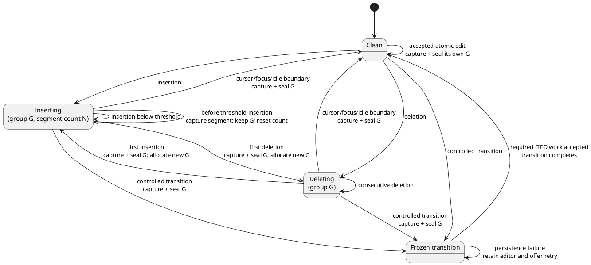
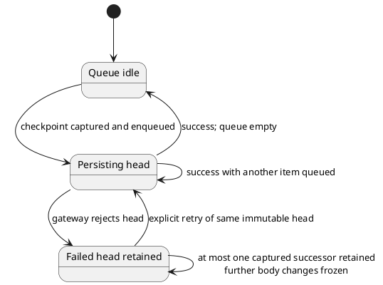

# Proposed body checkpoint and commit strategy

**Product decision:** Approved design direction.

**Implementation status:** WP-4 UI-neutral core and application contract implemented; Tiptap/Yjs capture, canvas ownership integration, grouped History, and browser/native qualification remain staged.

**Change package:** [Continuous workspace proposals](./README.md)

## Problem statement

The current compatibility editor accumulates Yjs updates and resets a fixed 1.2-second timer after every update. When the timer expires, it emits an `updateBody` operation with a fresh caller-owned `groupId`. This protects against pending in-app drafts but treats every short pause as a separate revision, so History cannot yet collapse related safety checkpoints into one semantic writing episode. The controller contract now accepts the producer's group ID; the implemented coordinator core will reuse it across threshold checkpoints when connected at the canvas integration gate.

The target design checkpoints at explicit editing boundaries and a bounded character threshold, with a longer configurable idle safety interval.

## Goals

1. Bound uncheckpointed insertion work without committing on every short pause.
2. Separate persisted safety checkpoints from human-visible edit groups.
3. Create boundaries around insertion/deletion mode changes, explicit cursor movement, focus changes, tree/lifecycle commands, and inactivity.
4. Preserve correct Yjs update ordering and failure retry behavior.
5. Avoid false boundaries from the automatic cursor movement that accompanies typing.
6. Handle IME, paste, cut, formatting, undo, redo, and accessibility input paths intentionally.
7. Place the batch character threshold and idle timeout in one obvious, easily modifiable code policy.

## Required configuration design

The implementation shall define one exported, immutable default policy in a dedicated module. The values must not be duplicated as literals in React components, controller code, adapters, or tests.

```ts
// Proposed file: src/editor/bodyCheckpointPolicy.ts
// Proposed API; not current source.
export interface BodyCheckpointPolicy {
  /** Seal the preceding insertion checkpoint before this numbered
      grapheme would be applied within the current threshold segment. */
  batchCharacterThreshold: number;

  /** Seal a dirty edit group after this many milliseconds without a
      body-changing transaction. */
  idleTimeoutMs: number;
}

export const DEFAULT_BODY_CHECKPOINT_POLICY: Readonly<BodyCheckpointPolicy> =
  Object.freeze({
    batchCharacterThreshold: 20,
    idleTimeoutMs: 30_000,
  });
```

Mandatory configurability rules:

1. `batchCharacterThreshold` and `idleTimeoutMs` live together in this one named policy object.
2. Production composition injects the default policy into the coordinator/editor; the coordinator does not import unexplained numeric constants.
3. Unit tests inject small values such as threshold `3` and idle `50` rather than waiting on production values.
4. Policy validation requires safe integers at least `1`; `idleTimeoutMs` must also be at most `2_147_483_647`, the portable signed 32-bit browser-timer ceiling.
5. Changing either default requires changing one source line plus relevant expectations/documentation, not component logic.
6. The values are code configuration for this pass, not document data, local-storage preferences, environment variables, or a settings UI.
7. The names `batchCharacterThreshold` and `idleTimeoutMs` are canonical unless an architecture review deliberately renames and updates this specification.

The literal interpretation of threshold `20` is: while inserting, before the twentieth uncheckpointed grapheme in the current threshold segment would be applied, synchronously capture the preceding nineteen graphemes as a checkpoint. The twentieth grapheme begins the next threshold segment but remains in the same semantic edit group.

This pre-input behavior is chosen to match “save before every twentieth character” exactly and must have an explicit off-by-one test.

## Terminology

| Term | Meaning |
|---|---|
| Body-changing transaction | A ProseMirror/Tiptap transaction that changes persisted node body content or formatting. |
| Edit mode | Current semantic input class: clean, inserting, deleting, or atomic. |
| Threshold segment | Insertions counted since the most recent threshold checkpoint within one edit group. |
| Checkpoint | Captured sanitized body HTML, merged incremental Yjs update, complete Yjs state, node ID, group ID, and reason; persistence produces an `updateBody` revision. |
| Edit group | Human-meaningful continuous episode. It may contain several threshold checkpoints sharing one `groupId`. |
| Seal | End the current edit group. If it is dirty, capture/checkpoint it; do not add a no-op revision. |
| Boundary | Event requiring a checkpoint and/or group seal before later semantic work is mixed with it. |

## Persistence and history semantics

This design deliberately distinguishes durability from presentation:

- Every nonempty checkpoint remains an ordinary append-only `updateBody` operation and revision.
- The coordinator allocates `groupId` when an edit group starts.
- Threshold checkpoints reuse that `groupId` and keep the edit group open.
- Cursor/focus/mode/tree/idle boundaries seal the group; the next edit receives a new `groupId`.
- Sealing a clean group creates no operation.
- History groups contiguous body contributions with the same `groupId` into one collapsed row.
- The collapsed row represents the last checkpoint revision and may display a revision range.
- Expanding the row reveals exact checkpoint revisions for historical viewing.
- Non-body operations remain independently visible and break body-group contiguity.
- Navigator visibility, selection, expansion, locate, and scroll are UI-only and never become checkpoint metadata, operations, history rows, snapshots, state hashes, or document/export fields.

No mutable silent working-copy table is introduced in this pass. If measured full-snapshot growth remains unacceptable, compaction or a separate durability layer requires its own persistence design.

## Input classification

Yjs update bytes are insufficient to classify user intent. Classification belongs at the ProseMirror/Tiptap transaction and DOM `beforeinput` boundaries.

Do not use raw `keydown` as the source of truth: it misses paste, drag/drop, speech input, accessibility tools, mobile editing, and IME, and it can miscount shortcuts.

### Insertions

- Count inserted user-visible Unicode grapheme clusters, not UTF-16 code units or key events.
- A normal insertion starts or continues `inserting` mode.
- Before an insertion would reach/cross `batchCharacterThreshold`, capture the preceding dirty threshold segment synchronously.
- Do not split an IME composition. If a composition would cross the threshold, checkpoint the preceding segment before composition starts/commits; count the composed result atomically at `compositionend`.
- Autocorrect/replacement transactions are atomic replacements, not a series of synthetic typed characters.

### Deletions

- Backspace, Delete, cut, and replacement removal are deletion-class body changes.
- Before the first deletion after an insertion/atomic dirty group, checkpoint and seal that prior group.
- If the editor is clean, the pre-deletion state is already persisted; do not create a duplicate checkpoint before deletion.
- Consecutive deletions accumulate in one deleting group.
- Before the first insertion after a deleting group, checkpoint and seal the deletion group, then begin an insertion group.
- A cursor/focus/idle/tree boundary checkpoints and seals a pending deletion group.

### Cursor and selection changes

- Only a selection-only transaction (`docChanged === false` with an actual selection change) after a dirty body group is a cursor boundary.
- Selection movement produced by the same transaction as insertion/deletion/formatting is not a boundary.
- The first qualifying cursor move checkpoints and seals; later moves while clean do nothing.
- Browsers report a pointer/keyboard selection change after the caret has moved. Because that transaction does not alter persisted body content, synchronous capture immediately when it is observed is content-equivalent to capture before the move; the checkpoint must be detached before any subsequent body-changing transaction is accepted.
- Mouse, keyboard, touch, and programmatic focus restoration must feed the same semantic event rather than separate ad hoc timers.

### Focus changes

- Leaving the active body for another block, title, tag control, toolbar command, History, header, optional navigator, or outside the application seals a dirty group.
- The body state is captured synchronously; ordinary focus movement need not wait for disk persistence.
- Opening or closing the navigator is not itself a checkpoint event. If reaching its toggle/tree moves DOM focus out of a dirty body, that focus departure seals exactly once; a shortcut that changes visibility while body focus remains creates no boundary.
- Arrow/Home/End/Left/Right browsing, selection, navigator disclosure, locate, scroll, and responsive dock/drawer changes after focus has entered the navigator create no further body boundary and never remount the editor.
- Switching the mutually exclusive compact auxiliary between Navigator and History after focus has already left the body creates no second boundary; only the original dirty-body departure may checkpoint.
- A responsive collision is not itself a checkpoint event. If resolving it must actually move DOM focus from a dirty body into a now-modal Navigator or History panel, synchronously capture and seal exactly that one ordinary focus-departure boundary during the handoff; subsequent responsive or panel navigation remains silent. If focus is outside the application, resize must not pull it back merely to create a boundary.
- Explicit navigator **Focus in document** to another block is a controlled editor-ownership transition and must await any required captured checkpoint through the same draft-transition barrier.
- A controlled operation that may remove/change the editor—node switch, tree operation, historical view, restore, export, backup, or close—must await the captured checkpoint through the draft-transition barrier.
- Window/page lifecycle events that cannot await remain a separately documented limitation.

### Paste, drop, formatting, undo, and redo

| Event | Proposed behavior |
|---|---|
| Paste or body drop | Seal prior group before input; apply as one atomic group; checkpoint and seal immediately after accepted transaction. |
| Cut | Seal prior group; apply cut as one atomic deletion group; checkpoint and seal immediately. |
| Formatting an existing selection | Seal prior group; apply as one atomic group; checkpoint and seal immediately. |
| Toggle stored mark with no document change | No checkpoint until content is inserted or another body-changing transaction occurs. |
| Undo or redo | Seal prior group before command; apply result as its own atomic group; checkpoint and seal. |
| Programmatic persistence load | Ignore; it is not user editing and must never produce a checkpoint. |

## State machine

The design uses two coordinated state machines. The edit-group machine classifies the author's current semantic episode and performs synchronous capture. The persistence machine owns asynchronous FIFO delivery and retry. Keeping them separate is what permits normal typing to continue without waiting for storage while still preserving checkpoint order.

### Edit-group state



### Persistence FIFO state



A threshold capture returns immediately to `Inserting` with the same edit group and a reset threshold-segment count. A sealed boundary returns to `Clean`. The persistence machine may still be delivering an immutable checkpoint while the edit-group machine accepts a later segment; only a controlled transition enters `Frozen` and awaits the required FIFO prefix.

## Transition table

| State | Event | Checkpoint timing | Group result | Next mode |
|---|---|---|---|---|
| clean | insert | none before first | allocate G | inserting |
| inserting | insertion below threshold | none | retain G | inserting |
| inserting | insertion reaches threshold | before triggering insertion; checkpoint prior segment | retain G | inserting, count reset then triggering insertion counted |
| clean | delete | none before delete | allocate G after change | deleting |
| inserting | first delete | before delete; seal insertion G | allocate new deletion group for delete | deleting |
| deleting | further delete | none | retain G | deleting |
| deleting | first insert | before insertion; seal deletion G | allocate new insertion group | inserting |
| dirty | first selection-only cursor move | after document-neutral move is observed; capture unchanged body and seal once | close G | clean |
| dirty | focus change | synchronously capture at focus boundary; seal | close G | clean |
| dirty | idle timeout | checkpoint and seal | close G | clean |
| dirty | controlled tree/lifecycle command | checkpoint, seal, and await before command | close G | clean/frozen |
| clean | cursor/focus/idle/tree boundary | no-op | none | clean |

“After any tree operation” is implemented as a stronger ordering rule: pending body work is checkpointed **before** the tree operation, and the post-condition after the operation is that no prior body group remains open. Waiting until after could remove or retarget the editor before capture.

## Idle timer

- Use `policy.idleTimeoutMs`; the default is `30_000` milliseconds.
- Start/reset after every accepted body-changing transaction in an open dirty group.
- Do not reset for automatic or explicit cursor movement; an explicit cursor boundary seals immediately.
- On expiry, checkpoint and seal insertion, deletion, or other dirty body work.
- Apply the idle rule to deletion and formatting as well as typed characters so a terminal deletion cannot remain pending indefinitely.
- Cancel the timer when clean, frozen, unmounted, entering historical mode, or after synchronous capture.
- Tests use fake timers and injected policy; production tests must not wait 30 seconds.

## Character threshold

- Use `policy.batchCharacterThreshold`; the default is `20`.
- Count grapheme clusters added by insertion transactions within the current threshold segment.
- Do not use net document-length change: replacements, formatting, and deletions would produce misleading counts.
- Do not split paste, composition, or other atomic input merely to obey the threshold.
- After a threshold checkpoint, reset only the segment counter; keep the edit group's `groupId`.
- If one non-composition insertion transaction contains more graphemes than the threshold, checkpoint the preceding segment, accept the atomic transaction as a new segment, then immediately checkpoint it if needed by the atomic-input rules. Do not synthesize partial ProseMirror transactions.

## Coordinator responsibilities

Proposed separation:

```ts
// Illustrative only.
interface CapturedBodyCheckpoint {
  nodeId: string;
  groupId: string;
  reason:
    | "character-threshold"
    | "insert-to-delete"
    | "delete-to-insert"
    | "cursor-move"
    | "focus-change"
    | "idle-timeout"
    | "atomic-edit"
    | "controlled-transition";
  bodyHtml: string;
  yjsUpdate: string;
  yjsState: string;
}
```

The coordinator shall:

1. validate/hold the policy;
2. classify semantic events supplied by the editor integration;
3. own mode, segment count, current group ID, and idle timer;
4. synchronously detach pending Yjs updates at a boundary;
5. synchronously capture sanitized body HTML and complete Yjs state corresponding to that boundary;
6. enqueue immutable checkpoints in FIFO order;
7. call the application commit callback serially;
8. keep threshold checkpoints in the same group;
9. retain failed checkpoints and later batches without reordering or merging group identities;
10. expose `freeze`, `flush`, and `unfreeze` through the existing draft-participant contract;
11. produce no operation for an empty/no-op checkpoint;
12. cancel timers/listeners safely under React StrictMode lifecycle replay.

The Tiptap/Yjs integration shall classify transactions and deliver semantic events; it should not own persistence policy decisions.

## Synchronous capture, asynchronous persistence

While the FIFO is below its safety high-water mark, normal typing and cursor movement must not wait for disk or a gateway round trip. Reaching the bound deliberately applies visible backpressure.

At each boundary:

1. detach the pending Yjs updates immediately;
2. read/sanitize editor HTML immediately;
3. encode the complete Yjs state immediately;
4. create an immutable checkpoint object with node/group/reason;
5. enqueue persistence;
6. allow ordinary editing/focus to continue into a new pending segment unless a controlled transition requires freezing;
7. preserve serialized order through the application task queue.

The only capacity exception is a controlled transition requested while two checkpoints are already pending: freeze the editor synchronously, retain the last dirty segment in that mounted editor, wait for one FIFO slot, then perform the capture steps before allowing the transition. No later input can enter that frozen segment.

This prevents a later character from leaking into the earlier checkpoint's full state while avoiding UI pauses every nineteen characters.

## Failure and retry

Failure rules are data-integrity requirements:

- A failed checkpoint remains at the head of the FIFO with its original group ID/reason/state.
- Later captured checkpoints remain queued behind it.
- Controlled transitions stay blocked until retry succeeds or a future explicit discard policy is designed.
- Normal editing may continue only if memory pressure and error UX are bounded; the safer first implementation freezes body editing after a persistence failure and offers retry.
- Retrying does not recapture current editor state or merge updates; it resubmits the immutable failed checkpoint.
- Successful retry then drains later checkpoints in order.
- A failed threshold checkpoint must not cause the threshold-triggering input to be lost. The event integration must either allow it into the next in-memory segment or deliberately block it with visible failure before application; this choice requires focused browser tests.
- No rejection may silently clear pending updates, timer state, or group identity.

## Backpressure and resource bounds

Asynchronous persistence must not turn fast typing or a slow gateway into an unbounded list of full Yjs states.

- Define one named safety invariant beside the coordinator, `MAX_PENDING_BODY_CHECKPOINTS = 2`. This is a queue high-water mark, not one of the user-tunable batching values.
- At most one immutable checkpoint is in flight and one is queued behind it. Reaching two freezes acceptance of further body-changing transactions until the FIFO falls below the high-water mark; navigation/status controls and retry remain available.
- If the second checkpoint was triggered immediately before an insertion, the integration may accept that already-triggering insertion into the current in-memory segment, then must freeze before any later body change. It must never drop the triggering input.
- Each checkpoint is measured and validated against the shared `updateBody` HTML/Yjs size limits before enqueue. An oversized capture leaves the editor mounted/frozen with an actionable error; it is not truncated.
- The current dirty editor state plus at most two detached checkpoints is the maximum retained body work. A persistence rejection freezes immediately with the failed immutable head and any already-queued successor intact.
- A slow-but-successful gateway exercises the same high-water behavior as a failed one; backpressure does not wait for an error event.
- If a controlled transition is requested while two checkpoints are pending and the current editor has a later dirty segment, freeze the editor immediately, await one FIFO slot, then capture/enqueue that frozen segment and drain it before the command. Do not create a third detached checkpoint or apply the command first.
- Unfreeze automatically when successful FIFO progress drops below the high-water mark, unless a controlled transition or error still owns the freeze.

If later measurements justify a different high-water mark, changing it is a separate safety/performance decision with memory and failure tests. It must not be silently coupled to `batchCharacterThreshold` or `idleTimeoutMs`.

## History projection

History groups only contiguous `updateBody` contributions with the same non-null `groupId`.

Collapsed example:

```text
r41–r44  Writing contribution · 4 safety checkpoints · Local author
         [View r44] [Expand]
```

Expanded checkpoints display revision, timestamp, reason where available, and **View**. The checkpoint reason may initially remain application-only unless persisted as contribution metadata/message; if persisted, define the protocol deliberately rather than parsing UI prose.

The collapsed group's canonical historical view is its last checkpoint, because that is the final materialized state of the episode.

### Groups that cross history pages

Raw `ContributionPage` pagination remains revision-based and newest-first. Group presentation is a stateful projection over the accumulated raw rows:

1. When the first row of an appended page has the same eligible `groupId` as the last accumulated group, merge it into that group instead of rendering a second collapsed row.
2. If the oldest loaded row has a non-null group ID and `hasMore` is true, mark that group **partial (older checkpoints not loaded)**. Display `at least N checkpoints`, not an exact count.
3. **Expand** on a partial group issues a dedicated group query, conceptually `listContributionGroup(groupId, beforeRevision, limit)`, until a different group/end is proven. It must not assume the normal 100-row page contains the complete group.
4. Group-query pages return immutable raw contributions in the same newest-first order and are deduplicated by contribution ID. The query filters by exact `groupId`; ordinary search text must not hide checkpoints from an explicit expansion.
5. A collapsed row's canonical **View** remains its newest/final checkpoint, which is available when the group is first encountered. Each expanded exact checkpoint keeps its own **View** target.
6. Keep counts explicit: `loadedContributionCount` is raw unique contributions, while `visibleHistoryRowCount` is collapsed presentation rows. Do not relabel the latter as contributions.
7. Refresh/filter changes rebuild grouping from raw results and invalidate incomplete group-expansion requests with the same request/query epoch rules as ordinary history.

For standalone-first work, the memory history capability implements the exact group query over the complete runtime ledger. Native SQL/group-query parity may remain absent until WP-10, in which case partial-group expansion is visibly unavailable rather than silently incomplete.

## Interaction with continuous outline and history

- Moving active editor ownership between blocks is a focus boundary and seals the old block.
- Moving focus from a dirty body into the optional navigator seals that group once; subsequent tree browsing and reveal-only scrolling are local UI state and create no checkpoint.
- `navigatorSelectionId` is independent of canvas context, actual focus region, and editor ownership. A docked locate action may expand canvas ancestors and scroll without invoking the coordinator.
- Explicit **Focus in document** (and narrow-drawer row activation) uses the normal controlled transfer only when it must remove/change an editor owner. If a queued checkpoint still belongs to that transfer, await it; success may then close the drawer and focus the block, while failure keeps the drawer/selected row available and retains the old owner.
- Merely opening/closing the navigator, changing navigator disclosure, or crossing the responsive breakpoint is never a document command and never allocates a `groupId`; only an actual dirty-body focus departure forced by collision resolution captures and seals the current group once.
- Navigator/History compact-panel handoff after the initial focus departure is likewise UI-only and does not allocate another `groupId`.
- Creating/moving/deleting a tree node uses a controlled transition and awaits the checkpoint first.
- Entering historical mode flushes/seals the live group, then performs a non-mutating revision query.
- Historical mode creates no batch coordinator or idle timer.
- Restoring a historical state remounts a fresh live editor generation; no old pending group survives.
- Back to current restores the retained live projection and begins clean until the next edit.

## Proposed unit tests

Use injected policy values and fake time.

### Policy

- default is exactly `{ batchCharacterThreshold: 20, idleTimeoutMs: 30_000 }`;
- either value can be overridden independently;
- unsafe/fractional/zero/negative values and an idle timeout above the portable timer ceiling are rejected;
- source scan/review confirms no duplicate production literals.

### Threshold

- threshold `3`: first and second graphemes do not checkpoint; before third, preceding two are captured;
- third grapheme begins reset segment under same group ID;
- subsequent threshold checkpoint retains group ID;
- grapheme clusters such as emoji/combining sequences count once;
- paste/IME not split;
- exact off-by-one semantics.

### Mode boundaries

- insertion to first deletion captures insertion before deletion and changes group;
- repeated deletion does not checkpoint each key;
- deletion to first insertion captures deletion before insertion and changes group;
- clean first deletion creates no duplicate pre-delete operation;
- selection movement included in a doc-changing typing transaction does not checkpoint;
- first selection-only move checkpoints once; later clean moves do nothing;
- focus boundary captures once;
- dirty-body focus departure to the navigator captures once, while repeated navigator browsing/reveal produces no additional capture;
- navigator toggle by a shortcut that retains body focus produces no boundary;
- explicit navigator-to-document transfer awaits an already-required FIFO prefix and does not recapture a clean body;
- compact Navigator/History handoff after one dirty-body departure produces no second capture;
- a dirty canvas-focused wide-to-compact collision captures once before focus enters the surviving modal, while a clean, already-panel-focused, or outside-app resize captures nothing;
- tree transition awaits pending checkpoint before command.

### Idle and lifecycle

- any body-changing transaction resets injected timer;
- expiry checkpoints/seals insertion and deletion;
- clean/frozen/unmount cancels timer;
- StrictMode setup/cleanup does not duplicate listeners/checkpoints;
- entering historical mode leaves no active timer.

### Atomic/editing paths

- paste, cut, selection formatting, undo, and redo boundaries;
- stored-mark toggle without doc change produces no checkpoint;
- IME composition never checkpoints mid-composition;
- accessibility/mobile-style `beforeinput` paths classify without keydown.

### Failure/concurrency

- immutable capture occurs before later input;
- later checkpoints queue behind slow persistence;
- failure retains head and group IDs;
- retry preserves order and exact payload;
- an unresolved slow head plus a queued successor reaches the two-checkpoint high-water mark, freezes further body changes, and unfreezes after progress;
- a controlled tree/focus transition requested at the high-water mark freezes, waits for capacity, captures its remaining dirty segment, then proceeds in order;
- oversize capture fails visibly without truncation or losing editor state;
- controlled operation is canceled/blocked on failure;
- no-op boundary creates no revision.

## Integration and manual tests

1. Type slowly with pauses shorter than 30 seconds: no pause-based history row every 1.2 seconds.
2. Type through the exact threshold and inspect checkpoint/group behavior.
3. Type, move cursor once, continue typing elsewhere: two semantic groups.
4. Type then hold Backspace: insertion group closes once; deletion is grouped.
5. Delete then type: deletion closes before new insertion group.
6. Type then click another node/title/tag/history/navigator control: old body captured once.
7. Type then immediately add/move/delete a node: body checkpoint precedes tree contribution.
8. Leave dirty insertion and deletion idle beyond configured timeout.
9. Exercise paste, format, cut, undo/redo, emoji, dead keys, CJK IME, touch keyboard, and screen reader input.
10. Inject persistence failure and verify no loss/reordering plus visible retry behavior.
11. Confirm collapsed History is readable and expanded exact revisions remain viewable.
12. Create a group spanning more than one 100-row page; verify partial labeling, exact expansion, deduplication, and separate raw-versus-visible counts.
13. Hold persistence unresolved while typing across thresholds; verify the two-checkpoint backpressure bound and recovery.
14. After entering the docked navigator, use tree arrows, disclosure, locate, open/close, and responsive resize; verify no extra group/revision and no editor remount. Separately resize a dual-dock layout while a dirty body has focus and verify exactly one ordinary focus-departure checkpoint before focus enters the surviving modal; repeat clean and with browser/OS focus outside and verify zero captures and no focus theft.
15. Invoke **Focus in document** for another block with a pending/failed checkpoint; verify ordered wait on success and retained navigator focus/editor owner on failure.

## Acceptance criteria

1. The fixed 1.2-second quiet-period constant and behavior are removed.
2. The only production defaults are `batchCharacterThreshold: 20` and `idleTimeoutMs: 30_000` in one exported, injectable policy module.
3. Changing either value requires no state-machine/component rewrite and tests can inject alternatives.
4. Exact threshold, insertion/deletion transitions, first explicit cursor move, focus change, controlled tree/lifecycle operation, and idle expiry produce the specified boundaries.
5. Automatic selection movement caused by typing does not create a boundary.
6. IME composition is never split and non-keyboard input paths are covered.
7. Threshold checkpoints within one episode share a `groupId`; semantic boundaries allocate new groups.
8. History collapses shared-group checkpoints by default and retains exact revision access.
9. Checkpoint capture is synchronous and persistence is serialized/asynchronous; ordinary typing does not wait on the gateway while the bounded FIFO has capacity.
10. Failures retain immutable checkpoints and block unsafe controlled transitions without losing or mixing edits.
11. Slow or failed persistence retains at most two detached checkpoints, applies visible backpressure, and resumes without loss or reordering.
12. Page-spanning groups merge at boundaries, label incomplete counts honestly, and can fetch every exact checkpoint through a group query.
13. Both standalone and Tauri paths accept the same checkpoint operations; native snapshot-growth impact is measured before release.
14. Navigator visibility/browsing produces no checkpoint, group, or document mutation; only an actual dirty-body focus departure seals once, and explicit cross-block focus follows the normal controlled-transfer failure contract.

## Implementation sequence

1. **Implemented (WP-4 core):** add pure policy validation and edit-state coordinator tests.
2. **Implemented at the UI-neutral fact boundary (WP-4 core):** add transaction classification for selection-only changes, insertion/deletion, composition updates/commits, paste/drop/cut, replacement, formatting, undo, redo, and persistence loads. Concrete ProseMirror/`beforeinput` observation wiring remains step 6.
3. **Implemented (WP-4 core):** add the UI-neutral edit-group machine, immutable checkpoint FIFO/retry/backpressure, and its `DraftParticipant`-compatible/application-facing contract without coupling ownership to `Outline` or `NodeEditor`.
4. **Implemented (WP-4 core):** move `groupId` ownership from `commitBody` to the checkpoint application request and test the contract independently of either workspace composition. The temporary timer path supplies one fresh ID per legacy flush until step 6.
5. With WP-6 complete, keep WP-4 component integration paused while the read-only WP-7 scaffold establishes `DocumentCanvas`/`NodeBlock`; the existing master/detail editor may retain its current timer only while that scaffold is unreachable or read-only.
6. Integrate transaction classification and synchronous Yjs/HTML capture into the single active editor owned by the final `NodeBlock` boundary.
7. Integrate draft-transition/tree/focus/historical boundaries and prove that transfer, collapse, delete, create, move, export, backup, and close drain before changing/removing the owner and cancel on failure.
8. Delete the 1.2-second path before enabling editable canvas behavior; do not ship or qualify the editable canvas behind two batching implementations.
9. Complete editable/structural canvas parity, then add grouped History projection and exact checkpoint expansion as WP-5.
10. Add the optional navigator's one focus-departure boundary and non-boundary browsing events after the canvas/controller boundary is stable.
11. Measure standalone memory and native SQLite snapshot/history growth.
12. Run browser, IME, accessibility, failure, recovery, and platform suites.
13. Update current architecture, frontend, sequences, RUP, testing, traceability, persistence, and limitations documentation.
