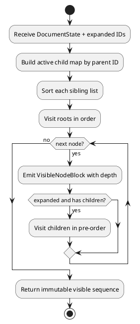
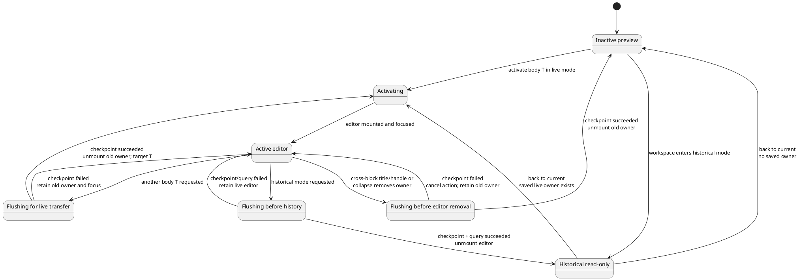
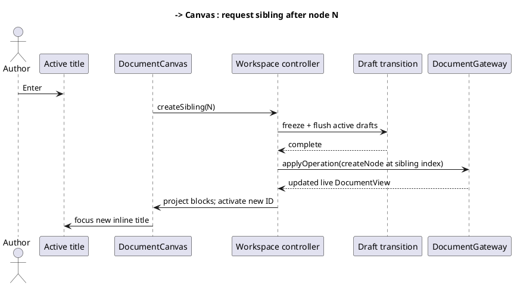

# Proposed continuous block-outline design

**Product decision:** Approved design direction.

**Implementation status:** Proposed; not implemented.

**Change package:** [Continuous workspace proposals](./README.md)

## Problem statement

The implemented workspace is master/detail: `Outline` renders the hierarchy in a left column and `NodeEditor` renders only the selected node in the central column. Adding or developing another node requires a structural action, selection/context change, and movement between visually separate regions. This makes the application feel like a record editor rather than a continuous writing surface.

The target interaction resembles an outline-oriented word processor: hierarchy and authored text flow in one scrollable document, while indentation and disclosure still expose structure.

## Goals

1. Present active nodes in document order on one continuous page.
2. Make adding and restructuring nodes possible without leaving the writing flow.
3. Preserve the existing `DocumentNode[]`, stable IDs, `parentId`, `position`, tags, body HTML, and Yjs state.
4. Reuse the canvas for live and historical read-only states.
5. Keep one active Tiptap/Yjs editor in the first implementation.
6. Preserve the explicit draft/checkpoint barrier before focus ownership or tree structure changes.
7. Support keyboard, pointer, touch, and assistive-technology paths without depending on HTML drag/drop.

## Non-goals

- One ProseMirror/Yjs document for the entire tree.
- Rich-text selection or formatting across node boundaries.
- Replacing the tree domain with heading levels embedded in HTML.
- Virtualizing the document before performance measurements justify it.
- Removing stable node identity or append-only contribution attribution.

## Target information architecture

```text
┌─────────────────────────────────────────────────────────────────────┐
│ Coedit · Document title       Current · saved       History  Export │
├─────────────────────────────────────────────────────────────────────┤
│ CONTINUOUS DOCUMENT                                                 │
│                                                                     │
│ ▾  Chapter one                                      [tags…]         │
│    Opening text flows here…                                         │
│                                                                     │
│    ▾  Arrival                                      scene  draft     │
│       The station was empty when…                                   │
│                                                                     │
│       ───────────────  + Add after  ───────────────                 │
│                                                                     │
│    ▸  Discovery                                    research         │
│                                                                     │
│ ▸  Chapter two                                                     │
│                                                                     │
└─────────────────────────────────────────────────────────────────────┘
```

Indentation communicates parentage. Disclosure controls collapse descendants. The active block receives the complete editor toolbar and editable Tiptap surface; inactive bodies are sanitized renderings with a clear focus affordance. Gutter controls appear on focus and pointer hover but remain keyboard reachable.

## Visible-node projection

Persistence remains a flat collection. A pure projection produces the canvas order.

```ts
// Proposed shape; not current source.
interface VisibleNodeBlock {
  node: DocumentNode;
  depth: number;
  hasActiveChildren: boolean;
  expanded: boolean;
  visibleIndex: number;
  previousVisibleNodeId: string | null;
  nextVisibleNodeId: string | null;
}
```

Projection rules:

1. Exclude `deletedAt !== null`.
2. Sort roots and siblings by `position`, then stable ID as tie-break.
3. Traverse in pre-order.
4. Emit a parent whether expanded or collapsed.
5. Traverse its descendants only when expanded.
6. Derive depth from traversal; do not persist it.
7. Return immutable values and never modify `DocumentView.nodes`.
8. Detect invalid/missing parents through existing domain validation rather than silently inventing structure.



## Component responsibilities

Names are proposed ownership targets.

| Component/module | Responsibility |
|---|---|
| `DocumentCanvas` | Scroll surface, list semantics, active block, insertion positions, historical banner slot |
| `NodeBlock` | One visible node's indentation, disclosure, title, tags, body preview/editor, gutter actions |
| `NodeBodyPreview` | Sanitized, non-editable body rendering for inactive or historical blocks |
| `RichTextEditor` | Active live block only; body editing and checkpoint participant |
| `visibleNodes.ts` | Pure projection and adjacent-block lookup |
| Workspace controller | Focused block ID, editor-owner node ID, expansion state, focus intent, structural commands, live/historical guard |
| `BodyEditBatchCoordinator` | Capture/await old block changes before active editor ownership moves |

`Outline` and the master/detail composition should be retired only after the canvas covers selection, expansion, insertion, reorder, reparent, deletion, keyboard navigation, and history filtering. Reuse pure domain operations rather than cloning their rules into components.

## Active-editor ownership

Only one live node owns Tiptap/Yjs editor state at a time.



Focus transfer procedure:

1. Record the requested target node and intended field/focus position.
2. Synchronously freeze the active block's body participant.
3. Capture and await its pending checkpoint in operation order.
4. If persistence fails, keep the old editor mounted and focused; show the error.
5. On success, unmount the old editor and clear its ownership. If the request targets another body, assign that node as editor owner, mount its Yjs state, then restore intended focus; if it targets a title/tag/handle, focus that control without mounting another editor.
6. Never display two editable body surfaces during the transfer.

Inactive previews must not create editor instances or Yjs update listeners.

Keep `focusedBlockId` and `editorOwnerNodeId` as separate controller state. `focusedBlockId` identifies the block containing the current keyboard/pointer focus. `editorOwnerNodeId` is either the sole node with a mounted live Tiptap/Yjs editor or `null`. Cross-block activation always passes through the transfer/removal barrier above; same-block toolbar/title focus seals a dirty body group but need not remount the editor.

## Interaction contract

### Pointer and touch

| Action | Result |
|---|---|
| Click/focus title in another block | Freeze/checkpoint any other editor owner, unmount it on success, then focus this title; failure keeps the prior owner/focus and cancels activation. |
| Click/focus body preview | Flush old active body, then mount/focus this block's editor. |
| Click disclosure | Toggle descendants without changing persisted document state. If collapse would hide the editor owner, checkpoint/await it and cancel on failure before collapsing; if it hides only the focused block, move focus to the collapsing parent without an editor drain. |
| Click insertion affordance | Flush any dirty editor owner, create a sibling after that block, and focus its title. |
| Click child affordance | Flush any dirty editor owner, create the last child, expand the parent, and focus the new title. |
| Drag from gutter | After a valid drop indicator, flush any dirty editor owner and then reparent/reorder; a keyboard alternative is mandatory. |
| Delete action | Confirm subtree deletion, flush any dirty editor owner before the tree command, apply `softDeleteNode`, unmount if its owner was deleted, then focus the nearest surviving block. |

Touch targets must be at least 44 CSS pixels in their principal dimension. Hover-only controls are insufficient.

All keyboard and pointer actions call the same controller intents. In particular, the checkpoint/cancel/focus rule for collapsing an ancestor applies equally to disclosure click, ArrowLeft, and any programmatic collapse-all action.

### Keyboard

Default proposed bindings:

| Context/key | Result |
|---|---|
| `ArrowUp` / `ArrowDown` from a block-level control | Move focus to the corresponding control in the previous/next visible block. |
| `ArrowLeft` on disclosure | Collapse; if already collapsed, move to parent block. |
| `ArrowRight` on disclosure | Expand; if already expanded, move to first child. |
| `Enter` in a single-line title | Create a following sibling and focus its title. Titles do not accept newlines. |
| `Mod+Enter` anywhere in a live block | Create following sibling and focus its title. |
| `Mod+Shift+Enter` anywhere in a live block | Create last child, expand, and focus its title. |
| `Tab` / `Shift+Tab` | Preserve normal browser focus order among handle, title, tags, **Edit body**, toolbar/editor, and later blocks. Never use Tab as a structural command. |
| `Enter` / `Space` on a block's **Edit body** action | Transfer editor ownership to that block and focus its body. The static body text remains separately readable. |
| `Alt+Shift+ArrowLeft/Right` from the block handle | Outdent / indent under the previous sibling. |
| `Alt+Shift+ArrowUp/Down` from the block handle | Reorder block among current siblings. |
| `Delete` from an explicit block handle | Invoke confirmed subtree deletion; ordinary text Delete remains text editing. |
| `Escape` | Leave an active inline control for the block handle without discarding changes. |

`Mod` means Control on Windows/Linux and Command on macOS. Bindings must not fire during IME composition. Platform/accessibility testing may require adjustment, but changes must remain documented and discoverable in the UI.

Normal `Enter`, Tab, Backspace, and arrow behavior inside the rich-text body remains owned by Tiptap unless a command is explicitly scoped to a modifier. The body preview remains readable document content; live inactive blocks provide a separate native **Edit body** button so keyboard activation does not require turning the whole rich preview into a misleading ARIA button. This avoids destructive surprises and preserves paragraph editing and logical focus order.

## Adding a node seamlessly

The primary path is title-driven outline creation:



The new block appears immediately in document position after the accepted view returns. An optimistic placeholder may be considered later, but the first implementation should avoid displaying an editable node that does not yet have an accepted stable ID/revision.

## Expansion and selection state

- Expansion is workspace UI state, not persisted document material.
- New parents are expanded automatically when a child is created beneath them.
- Restoring or materializing a different revision prunes expansion IDs absent from that state.
- Returning from historical mode restores the prior live expansion set.
- `focusedBlockId` replaces the old meaning of selected detail node for navigation/filter context; `editorOwnerNodeId` separately identifies the only mounted Tiptap instance.
- If collapse would hide a focused descendant without an editor, collapse and move focus to the parent. If it would hide the editor owner, freeze/checkpoint/await first; on failure leave expansion and focus unchanged, and on success unmount then collapse/focus the parent.
- If the focused block or editor owner is deleted, flush as required, then choose the next visible block, previous, parent, or root fallback and clear/remount editor ownership deliberately.

## Historical mode

The canvas consumes a `WorkspaceProjection`, so it does not special-case gateway calls. In historical mode:

- every node is a body preview;
- no Tiptap editor is mounted;
- title, tags, insertion, drag, reorder, and deletion controls are absent or disabled;
- collapse/expand, scrolling, text selection, copying, History navigation, **Back to current**, and explicit restoration remain available;
- styling and a persistent banner communicate the revision and read-only state.

See [Query-first historical views](./QUERY_FIRST_HISTORY.md).

## Accessibility semantics

The canvas should use document/section semantics for reading flow and a separately discoverable tree-navigation mechanism for structural controls. A single element should not pretend to be both a rich document editor and a fully conforming ARIA tree.

Minimum requirements:

- Every block has an accessible name derived from its title.
- The structural handle communicates level, expanded state, position, and available commands.
- Focus order follows visible document order.
- Normal Tab/Shift+Tab traverses interactive controls; structural indentation is available only through documented handle shortcuts/actions.
- Indentation is not the only parentage cue; level is announced.
- Collapse moves focus to the parent when focused descendants disappear.
- Insertion, movement, and deletion are announced through a polite live region.
- Historical mode and revision are announced on entry.
- Pointer drag always has keyboard equivalents.
- Body preview HTML cannot introduce interactive elements that bypass read-only expectations unless explicitly sanitized/handled.

## Performance design

The first performance tactic is one active editor, not virtualization.

- Body previews should memoize by node ID, body HTML, and relevant read-only state.
- Visible-node projection should be pure and memoized by node collection plus expansion state.
- Do not recreate every preview while typing in the active block if its inputs did not change.
- Measure projection time, React commit time, editor transfer time, and scroll stability at representative 100, 1,000, and 10,000-node documents.
- Introduce virtualization only after defining browser find, text selection/copy, focus restoration, screen-reader, and historical-view behavior for off-screen blocks.

## Error behavior

- Failed active-body flush keeps the old block active and prevents node creation/focus transfer/tree mutation.
- Failed create/move/delete leaves the accepted projection unchanged and reports the gateway error.
- A projection invariant failure renders a non-editable error state rather than partial tree controls.
- If historical materialization fails or is canceled, retain the request's exact origin projection: the live canvas for a live-origin request or the prior historical canvas for a historical-origin request.
- Focus must never silently fall back to `document.body` after an operation failure.

## Proposed tests

### Pure projection

- pre-order traversal, root/sibling ordering, depth, adjacency;
- collapsed descendants excluded;
- deleted nodes excluded;
- multiple roots and stable tie-breaks;
- no mutation of input;
- invalid parent/cycle behavior follows domain validation.

### Components

- all active nodes appear in continuous order;
- only one active rich editor exists;
- focus transfer waits for the old checkpoint;
- failed checkpoint retains old block/editor;
- title Enter and explicit insertion create/focus correct sibling;
- indent/outdent/reorder issue correct operations;
- collapse/focus behavior and live announcements;
- collapse of an ancestor containing the editor drains before removal and cancels on failure;
- separate focused-block/editor-owner state, cross-block title activation, and keyboard activation of **Edit body**;
- historical canvas exposes no mutation controls;
- keyboard commands do not fire during IME composition or from ordinary rich-text editing.

### Integration and manual

- create many siblings/children without using a separate navigator;
- type, add sibling, return, and verify body/title ordering and history groups;
- mouse, keyboard-only, touch, and screen-reader flows;
- long-document scroll/focus stability;
- live-to-historical-to-live mode preserves live state and focus where possible;
- Chromium, Firefox, Safari/macOS, and Safari/iPadOS behavior.

## Acceptance criteria

1. No separate persistent outline/navigation column is required to add, select, read, or reorganize a node.
2. Every active node's title and body appears in one scrollable document projection unless hidden by an explicitly collapsed ancestor.
3. A keyboard user can create siblings/children, indent/outdent, reorder, collapse/expand, activate body editing, and delete with confirmation.
4. Exactly one Tiptap/Yjs editor is mounted in live mode and zero in historical mode.
5. Focus transfer cannot lose an uncheckpointed body batch.
6. Collapsing or deleting an ancestor cannot unmount an owned editor until its checkpoint succeeds; failure cancels the structural action.
7. The same canvas renders a historical revision read-only without mutating live state.
8. Existing tree invariants and stable IDs remain intact.
9. Tests cover projection, focus/checkpoint ordering, failures, keyboard semantics, and historical read-only behavior.

## Implementation sequence

1. Add and test pure visible-node projection without changing UI.
2. Add `DocumentCanvas` in a feature branch/flag beside the current workspace.
3. Render read-only previews for every visible block.
4. Add active-editor ownership using the new checkpoint coordinator.
5. Add title/tag editing and insertion.
6. Add structural keyboard and pointer controls.
7. Reuse the canvas for historical mode.
8. Complete accessibility/performance/browser testing.
9. Remove the master/detail composition only after parity is demonstrated.
10. Update as-built architecture, UI/UX, sequences, traceability, and known limitations.
