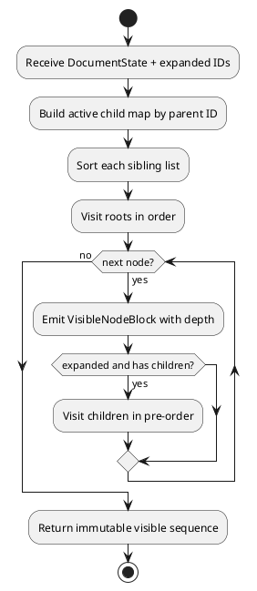
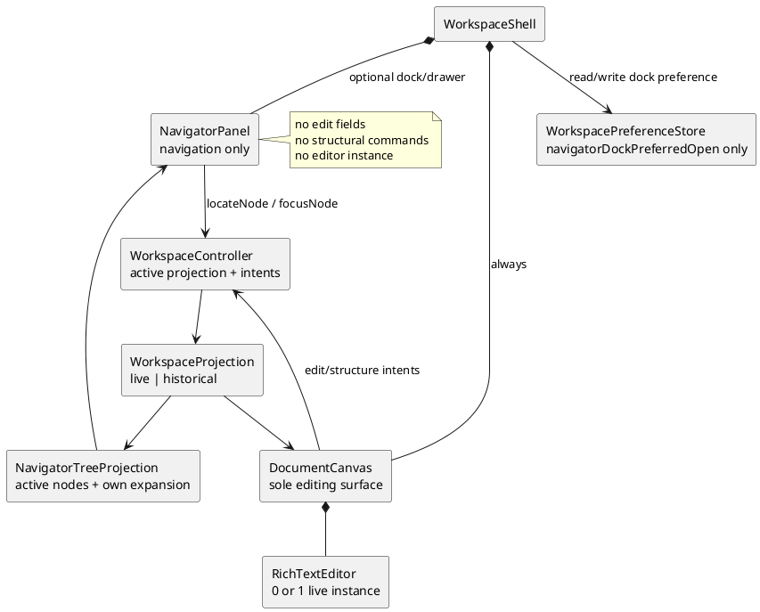
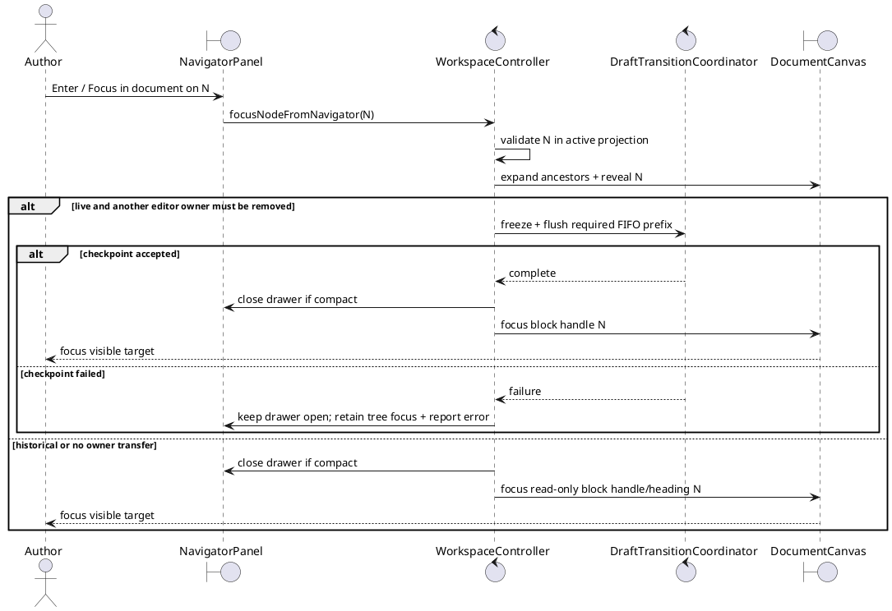
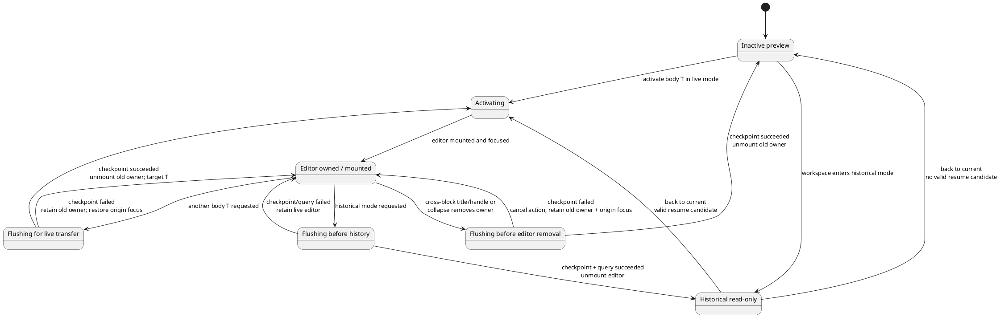
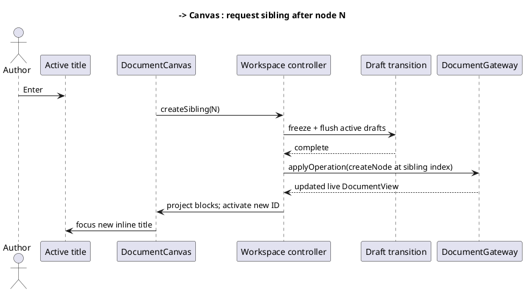

# Proposed continuous block-outline design

**Product decision:** Approved design direction.

**Implementation status:** Proposed; not implemented.

**Change package:** [Continuous workspace proposals](./README.md)

## Problem statement

The implemented workspace is master/detail: `Outline` renders the hierarchy in a left column and `NodeEditor` renders only the selected node in the central column. Adding or developing another node requires a structural action, selection/context change, and movement between visually separate regions. This makes the application feel like a record editor rather than a continuous writing surface.

The target interaction resembles an outline-oriented word processor: hierarchy and authored text flow in one scrollable document, while indentation and disclosure still expose structure.

## Goals

1. Present active nodes in document order on one continuous page.
2. Make adding and restructuring nodes possible without leaving the writing flow.
3. Preserve the existing `DocumentNode[]`, stable IDs, `parentId`, `position`, tags, body HTML, and Yjs state.
4. Reuse the canvas for live and historical read-only states.
5. Keep one active Tiptap/Yjs editor in the first implementation.
6. Preserve the explicit draft/checkpoint barrier before focus ownership or tree structure changes.
7. Support keyboard, pointer, touch, and assistive-technology paths without depending on HTML drag/drop.
8. Offer a runtime-toggleable hierarchy navigator for rapid orientation in long documents without making it another editing surface.

## Non-goals

- One ProseMirror/Yjs document for the entire tree.
- Rich-text selection or formatting across node boundaries.
- Replacing the tree domain with heading levels embedded in HTML.
- Virtualizing the document before performance measurements justify it.
- Removing stable node identity or append-only contribution attribution.
- Retaining the old outline-plus-detail editor as a selectable display mode.
- Editing titles, tags, or bodies, or issuing create/move/delete operations, from the optional navigator.

## Target information architecture

```text
┌─────────────────────────────────────────────────────────────────────┐
│ Coedit · Document title       Current · saved       History  Export │
├─────────────────────────────────────────────────────────────────────┤
│ CONTINUOUS DOCUMENT                                                 │
│                                                                     │
│ ▾  Chapter one                                      [tags…]         │
│    Opening text flows here…                                         │
│                                                                     │
│    ▾  Arrival                                      scene  draft     │
│       The station was empty when…                                   │
│                                                                     │
│       ───────────────  + Add after  ───────────────                 │
│                                                                     │
│    ▸  Discovery                                    research         │
│                                                                     │
│ ▸  Chapter two                                                     │
│                                                                     │
└─────────────────────────────────────────────────────────────────────┘
```

Indentation communicates parentage. Disclosure controls collapse descendants. The active block receives the complete editor toolbar and editable Tiptap surface; inactive bodies are sanitized renderings with a clear focus affordance. Gutter controls appear on focus and pointer hover but remain keyboard reachable.

The canvas is complete without a sidebar. When the optional navigator is open on a wide viewport, it is composed beside—not instead of—the same canvas:

```text
+----------------------+--------------------------------------------------+
| Document navigator   | CONTINUOUS DOCUMENT                              |
| [close]               |                                                  |
| > Chapter one        | v  Chapter one                                   |
|   > Arrival          |    Opening text flows here...                    |
|   > Discovery        |                                                  |
| > Chapter two        |    v  Arrival                                    |
|                      |       The station was empty when...              |
+----------------------+--------------------------------------------------+
```

The navigator defaults closed, can be toggled at runtime, and never replaces `DocumentCanvas`. On compact/touch layouts the same navigation-only component appears only after an explicit action, as a modal drawer over an inert canvas:

```text
+----------------------------------+
| Document navigator       [Close] |
| > Chapter one                    |
|   > Arrival                      |
|   > Discovery                    |
| > Chapter two                    |
+----------------------------------+
| continuous canvas dimmed/inert   |
+----------------------------------+
```

Responsive layout never selects a different editor implementation. The saved dock preference does not auto-open this compact drawer.

## Visible-node projection

Persistence remains a flat collection. A pure projection produces the canvas order.

```ts
// Proposed shape; not current source.
interface VisibleNodeBlock {
  node: DocumentNode;
  depth: number;
  hasActiveChildren: boolean;
  expanded: boolean;
  visibleIndex: number;
  previousVisibleNodeId: string | null;
  nextVisibleNodeId: string | null;
}
```

Projection rules:

1. Exclude `deletedAt !== null`.
2. Sort roots and siblings by `position`, then stable ID as tie-break.
3. Traverse in pre-order.
4. Emit a parent whether expanded or collapsed.
5. Traverse its descendants only when expanded.
6. Derive depth from traversal; do not persist it.
7. Return immutable values and never modify `DocumentView.nodes`.
8. Detect invalid/missing parents through existing domain validation rather than silently inventing structure.



## Component responsibilities

Names are proposed ownership targets.

| Component/module | Responsibility |
|---|---|
| `WorkspaceShell` | Header toggles, responsive canvas plus Navigator/History composition, mutually exclusive compact auxiliary state, breakpoint transition, focus containment/handoff/return |
| `DocumentCanvas` | Scroll surface, list semantics, active block, insertion positions, historical banner slot |
| `NavigatorPanel` | Optional navigation-only ARIA tree, independent selection/expansion, locate and explicit focus intents |
| `NodeBlock` | One visible node's indentation, disclosure, title, tags, body preview/editor, gutter actions |
| `NodeBodyPreview` | Sanitized, non-editable body rendering for inactive or historical blocks |
| `RichTextEditor` | Active live block only; body editing and checkpoint participant |
| `visibleNodes.ts` | Pure projection and adjacent-block lookup |
| `navigatorTree.ts` | Pure active hierarchy projection using navigator-specific expansion state; never supplies document commands |
| `workspacePreferences.ts` | Versioned validation and best-effort browser storage of `navigatorDockPreferredOpen` only |
| Workspace controller | Canvas-context node ID, editor-owner node ID, live/historical canvas/navigator contexts, locate/focus intents, structural commands, live/historical guard |
| `BodyEditBatchCoordinator` | Capture/await old block changes before active editor ownership moves |

`Outline` and the master/detail composition should be retired only after the canvas covers selection, expansion, insertion, reorder, reparent, deletion, keyboard navigation, and history filtering. Reuse pure domain operations rather than cloning their rules into components.

## Optional navigator sidebar

### Role and architecture boundary

`NavigatorPanel` is an **Auxiliary View** over the active hierarchy. It helps an author locate a block in a long document; it is not the old `Outline` preserved as another editor mode. `DocumentCanvas` remains mounted and remains the sole location for title, tag, body, insertion, reorder, reparent, and deletion interaction.

The first navigator slice contains only disclosure, row selection/location, and an explicit **Focus in document** action. It does not contain Tiptap, editable fields, drag/drop, structural menus, or create/delete buttons. Closing it cannot remove any editing capability from the canvas.



### State ownership and persistence boundary

Canvas context, editor ownership, navigator selection, and actual DOM-focus region have different meanings and must not be collapsed into one `selectedNodeId`:

```ts
// Proposed shapes; not current source.
interface NavigatorContextState {
  navigatorSelectionId: string | null;
  navigatorExpandedIds: ReadonlySet<string>;
}

interface CanvasContextState {
  canvasExpandedIds: ReadonlySet<string>;
  canvasContextNodeId: string | null;
  scrollAnchor: string | null;
}

interface LiveWorkspaceContext {
  view: DocumentView;
  canvas: CanvasContextState;
  navigator: NavigatorContextState;
}

interface RetainedLiveWorkspaceContext {
  live: LiveWorkspaceContext;
  resumeEditorNodeId: string | null; // one-shot candidate; validated before remount
}

interface HistoricalWorkspaceContext {
  materialized: MaterializedRevision;
  canvas: CanvasContextState;
  navigator: NavigatorContextState;
}

type WorkspaceFocusRegion =
  | "canvas"
  | "navigator"
  | "history"
  | "chrome"
  | "outside";

type CompactAuxiliary = "none" | "navigator" | "history";

interface WorkspaceRuntimeState {
  editorOwnerNodeId: string | null; // actual mounted owner; null historically
  focusRegion: WorkspaceFocusRegion;
  activeCompactAuxiliary: CompactAuxiliary;
  lastExplicitAuxiliary: "navigator" | "history" | null;
  historyDockRequestedOpen: boolean;
}

interface WorkspacePreferencesV1 {
  version: 1;
  navigatorDockPreferredOpen: boolean;
}
```

| State | Owner/lifetime | Meaning |
|---|---|---|
| `canvasContextNodeId` | Separate live or historical canvas context | Last/current canvas block used for reveal, restoration, and filtering. When focus is in the canvas it tracks that block; browsing another surface does not rewrite it. |
| `editorOwnerNodeId` | Active controller runtime, outside retained contexts | Only block with an actually mounted Tiptap/Yjs editor. It is set to `null` before historical mode. |
| `resumeEditorNodeId` | `RetainedLiveWorkspaceContext` only | One-shot candidate live body to remount after **Back to current** or use as the initial owner after Restore; it is never ownership, must be validated, and is discarded when live mode resumes. |
| `canvasExpandedIds` | Live or temporary historical canvas context | Controls which blocks flow on the page. |
| `navigatorSelectionId` | Separate live or historical navigator context | Current navigator tree item; it may differ from canvas context, actual focus region, and editor owner. |
| `navigatorExpandedIds` | Separate live or historical navigator context | Controls only navigator disclosure and never hides canvas blocks. |
| `focusRegion` | Workspace shell | Where DOM focus actually resides; it prevents canvas context from being mistaken for navigator, History, chrome, or outside focus. |
| `activeCompactAuxiliary` | Workspace shell/session | The only effective compact overlay: `none`, `navigator`, or `history`. It is never restored automatically from browser storage. |
| `lastExplicitAuxiliary` | Workspace shell/session | Deterministic survivor when two wide docks no longer fit; updated only by explicit panel open/interaction and never persisted. |
| `historyDockRequestedOpen` | Workspace shell/page session | Whether History should dock when inline space permits. It defaults `false`, changes only from the wide History toggle, and is never persisted; compact History open/close changes only `activeCompactAuxiliary`. |
| `navigatorDockPreferredOpen` | Host/browser UI preference | Whether the navigator should be docked when inline space permits; default `false`. |

`navigatorDockPreferredOpen` is read from one versioned, validated, best-effort browser preference (for example `coedit.workspace-preferences.v1`). A missing, malformed, unsupported, or unreadable initial value falls back to `false` without preventing the standalone app from launching. A later write failure retains the user's current in-memory preference for that session and reports a non-blocking diagnostic; it must not snap the panel closed. The preference stores no document ID, node ID, title, or authored content.

Requested visibility and effective rendering are deliberately distinct. With a workspace present, derive rather than store them:

```ts
const navigatorVisible = dockLayout
  ? navigatorDockPreferredOpen
  : activeCompactAuxiliary === "navigator";
const historyVisible = dockLayout
  ? historyDockRequestedOpen
  : activeCompactAuxiliary === "history";
```

`dockLayout` is a derived capability of the named available-container-width rule, not a persisted flag. With no workspace, both effective values are `false` regardless of requests.

Only effective `historyVisible` starts the initial History query or refreshes the first page after accepted live changes. The first effective reveal with no valid page issues exactly one guarded initial query. If a breakpoint transition or Navigator handoff makes History ineffective while `historyDockRequestedOpen` remains true, retain its loaded rows, mark them stale after a relevant accepted change, and perform exactly one guarded refresh when History next becomes effective. Once a valid, non-stale page is loaded, layout-only hide/reveal transitions issue no query. Every relevant accepted change advances the History data generation so an older in-flight response cannot clear the new stale state.

None of these UI values is part of `DocumentState`, the `.coedit` schema, state hashes, revision snapshots, contribution history, recovery export, Markdown export, or JSON export. Navigator selection, expansion, compact auxiliary, History dock request/data generation, focus-region, and one-shot resume-target state are session/workspace state only and are deliberately not written to local storage. Opening/closing, selecting, expanding, locating, and scrolling create no document operation or revision.

Open/create clears node-specific canvas/navigator contexts, sets `activeCompactAuxiliary` to `none`, and derives valid defaults for the new workspace; close clears those document-specific contexts. The navigator dock preference and page-session History dock request survive those transitions but have no effect while no workspace is shown. Every accepted live command or historical materialization prunes navigator IDs that are absent/deleted in the active projection.

### Interaction and focus contract

| Navigator action | Canvas/editor effect | Persistence/checkpoint effect |
|---|---|---|
| Toggle open/closed | At wide size, update preferred dock visibility; at compact size, set `activeCompactAuxiliary` to `navigator`/`none`. Retain the canvas and editor owner. Closing from within the navigator returns DOM focus to the toggle. | UI preference/session state only; no document operation. Moving DOM focus out of a dirty body to reach the toggle/tree is one normal focus boundary, but visibility itself is not another boundary. |
| `ArrowUp`/`ArrowDown`, `Home`/`End` | Move the active tree item and `navigatorSelectionId` only. | No canvas focus transfer, editor remount, checkpoint, or revision. |
| `ArrowLeft`/`ArrowRight` on a row | Collapse/expand only `navigatorExpandedIds`, or move to parent/first child under ARIA tree rules. | Never changes `canvasExpandedIds` and never hides/unmounts the editor. |
| Pointer click or `Space` on a docked row | Select, expand any required canvas ancestors, and scroll/reveal the target; focus remains in the navigator. | Locate itself is local UI state and does not change `canvasContextNodeId` or `editorOwnerNodeId`. If this interaction first moves DOM focus out of a dirty body, capture exactly that normal focus boundary. |
| `Enter` / **Focus in document** | Validate target, expand its canvas ancestors, scroll it into view, then focus its block handle. If a different editor owner must be removed, use the normal freeze/flush/await transfer barrier first. | No document operation by itself. An already dirty body was sealed on the initial focus departure; any still-pending controlled transfer is awaited and failure cancels focus transfer. |
| Tap a row in the narrow drawer | Keep the drawer open while validating, revealing, and awaiting any required transfer. On success, close it and focus the target block handle; on failure, retain the selected tree row and old editor owner. | Same safe focus-transfer rule as **Focus in document**. |
| Navigator disclosure in historical mode | Changes only temporary historical navigator expansion. | No timer, draft participant, operation, or restore. |

Reveal expands only the target's missing ancestors in `canvasExpandedIds`; it does not collapse unrelated canvas branches. Reveal-only selection may visually mark the target but does not pretend that the canvas has DOM focus or replace `canvasContextNodeId`. The selected/context/editor-owner styles therefore distinguish navigator selection, retained canvas context, actual `focusRegion`, and body editor ownership.



If a row disappears between selection and activation, prune the invalid ID, keep focus on the nearest surviving tree item (parent, next, previous, then first root), and announce that the target is unavailable. Do not fall through to a similarly positioned node with a different ID.

### Live and historical projections

The navigator tree is derived from all active nodes in the **currently displayed** `WorkspaceProjection`, not from retained live state while history is on screen. Live and historical navigator contexts are separate:

1. Entering historical mode creates a `RetainedLiveWorkspaceContext` from the exact live canvas/navigator context and a fresh `resumeEditorNodeId` copied from the actual editor owner, then unmounts it and sets actual `editorOwnerNodeId` to `null`.
2. Historical context is initialized from compatible IDs, then pruned to the materialized snapshot.
3. Moving among revisions preserves compatible historical navigator state and prunes missing IDs.
4. Historical rows support disclosure, locate, copyable plain-text labels, and focus only; they expose no live document command.
5. **Back to current** restores the exact retained live canvas/navigator context after the live canvas renders, validates the one-shot `resumeEditorNodeId`, optionally makes it the actual owner, and then discards the retained wrapper and candidate.
6. **Restore as new revision** does not reuse the Back path. It constructs a new live context from the accepted compensating view, prunes canvas/navigator IDs and scroll anchors, and validates the one-shot resume target for possible initial ownership. A target is eligible only if it is active and visible in the rebuilt canvas projection; when its stable ID survives under different ancestry, expand every required canvas ancestor before mounting it. If visibility cannot be established, clear the candidate and choose a visible stable fallback. Then discard the wrapper/candidate and never copy historical UI context into live state.
7. Every later transition from live to historical derives a new candidate from the then-current actual `editorOwnerNodeId`; no candidate survives in ordinary live state.

### Responsive and touch behavior

- A named CSS layout token determines docked versus drawer presentation; components must not duplicate a pixel literal. The initial design target is a docked, clamped width of roughly `16rem` to `20rem` where the canvas still meets its readable minimum width.
- Below that named breakpoint, the navigator is an explicitly opened modal drawer over the canvas. It is never a permanently compressed second column.
- The compact drawer is never auto-opened from the saved dock preference. It has a visible heading and close action, traps focus while open, closes on `Escape` or backdrop activation, and returns focus to the toggle unless a successful row activation deliberately transfers focus to the document.
- Opening the drawer places focus on the selected valid tree item, otherwise the first root, otherwise its close button for an empty document.
- Touch row/disclosure targets meet the 44 CSS-pixel target and respect viewport safe-area insets. The drawer must remain usable with iPadOS split view, zoom, orientation changes, and the on-screen keyboard.
- Layout uses available workspace/container width rather than viewport width alone. Navigator and History may both dock only while the canvas retains its named readable minimum. `activeCompactAuxiliary` makes overlays mutually exclusive, so nested focus traps are impossible. The first slice requires dismissal before the other header toggle is reachable; a keyboard/programmatic request to switch panels closes the loser without its usual focus-return, opens the winner, and transfers focus into the winner.
- Wide-to-compact transition is deterministic. If two docks are visible, keep the panel containing focus; otherwise keep `lastExplicitAuxiliary`, which is required to be non-null after the second dock was explicitly opened. Close the other without focus-return and set `activeCompactAuxiliary` to the survivor. When collision resolution must move DOM focus from canvas/chrome into that now-modal survivor, a dirty body is synchronously captured and sealed as exactly one ordinary focus boundary before or during the handoff; the resize itself is not an additional boundary. Move focus to the survivor's selected/first/close fallback and update `focusRegion` atomically so focus never remains in inert content. If focus is outside the application, change presentation without stealing focus and preserve only the survivor's roving selection for the next in-app focus. If only one of Navigator or History is visible, retain that panel as a drawer only when focus is already inside it; otherwise set `activeCompactAuxiliary` to `none` and leave canvas/chrome/outside focus untouched.
- Compact-to-wide transition is also deterministic and ends by setting `activeCompactAuxiliary` to `none`. Show the Navigator dock if and only if `navigatorDockPreferredOpen` is true; show History if and only if `historyDockRequestedOpen` is true. If DOM focus is inside the active compact panel and it remains requested as a dock, retain its row/control focus there; if it is no longer requested, close it and return focus to its own toggle. When `focusRegion === "outside"`, change presentation without focusing any in-app element and preserve only roving selection. Responsive transitions never rewrite either requested-visibility value, create another checkpoint, or remount the canvas editor.

### Accessibility and trust boundary

- The toggle is a native button with `aria-expanded`, `aria-controls`, and an accessible name such as **Show document navigator** / **Hide document navigator**.
- The panel is a labeled `<nav>` containing a single-select ARIA `tree`; each active node is a `treeitem` with correct `aria-level`, `aria-expanded`, `aria-setsize`, and `aria-posinset` where applicable.
- In compact presentation the `<nav>` is contained by a labeled `role="dialog"` with `aria-modal="true"`; the rest of the workspace is inert while it is open. The History overlay follows the same dialog/inert/invoker contract, and `activeCompactAuxiliary` prevents nesting. `aria-expanded` on each toggle reflects effective dock/drawer visibility, not a saved preference.
- One roving `tabindex` implements Arrow, Home/End, Left/Right navigation. `Enter` is the documented **Focus in document** action; `Space` selects/locates without moving DOM focus in docked mode.
- Selection, current canvas focus, and historical read-only state are conveyed with text/semantics and not color alone. Locate/focus and target-unavailable results use a polite live region.
- Titles are rendered as plain text. The navigator never renders node body HTML or interprets title text as markup, URLs, commands, or selectors. Long/hostile Unicode titles wrap or truncate within the row without changing the accessible full name or widening the drawer beyond its bound. An empty title receives a non-persisted **Untitled node** fallback label.
- An invalid hierarchy produces a non-interactive navigator error while the canvas follows its own validated projection failure behavior; the navigator must not invent parents or reorder nodes to appear usable.

## Active-editor ownership

Only one live node owns Tiptap/Yjs editor state at a time.



Focus transfer procedure:

1. Record the requested target node and intended field/focus position.
2. Synchronously freeze the active block's body participant.
3. Capture and await its pending checkpoint in operation order.
4. If persistence fails, keep the old editor mounted and restore focus to the initiating surface: the old editor/control for a canvas-origin transition, or the selected navigator row for a navigator-origin transition. Show the error.
5. On success, unmount the old editor and clear its ownership. If the request targets another body, assign that node as editor owner, mount its Yjs state, then restore intended focus; if it targets a title/tag/handle, focus that control without mounting another editor.
6. Never display two editable body surfaces during the transfer.

Inactive previews must not create editor instances or Yjs update listeners.

Keep `canvasContextNodeId`, `editorOwnerNodeId`, and `focusRegion` as separate controller/shell state. `canvasContextNodeId` identifies the current or retained canvas block used for navigation, filtering, and focus restoration; `focusRegion` says whether DOM focus is actually in that block's canvas, Navigator, History, chrome, or outside. `editorOwnerNodeId` is either the sole node with a mounted live Tiptap/Yjs editor or `null`. Cross-block activation always passes through the transfer/removal barrier above; same-block toolbar/title focus seals a dirty body group but need not remount the editor.

## Interaction contract

### Pointer and touch

| Action | Result |
|---|---|
| Click/focus title in another block | Freeze/checkpoint any other editor owner, unmount it on success, then focus this title; failure keeps the prior owner/focus and cancels activation. |
| Click/focus body preview | Flush old active body, then mount/focus this block's editor. |
| Click disclosure | Toggle descendants without changing persisted document state. If collapse would hide the editor owner, checkpoint/await it and cancel on failure before collapsing. After an accepted collapse, move DOM focus to the parent only when `focusRegion === "canvas"` and the focused descendant was hidden; otherwise retain Navigator/History/chrome focus and repair only `canvasContextNodeId` to the parent/fallback. |
| Click insertion affordance | Flush any dirty editor owner, create a sibling after that block, and focus its title. |
| Click child affordance | Flush any dirty editor owner, create the last child, expand the parent, and focus the new title. |
| Drag from gutter | After a valid drop indicator, flush any dirty editor owner and then reparent/reorder; a keyboard alternative is mandatory. |
| Delete action | Confirm subtree deletion, flush any dirty editor owner before the tree command, apply `softDeleteNode`, unmount if its owner was deleted, then focus the nearest surviving block. |

Touch targets must be at least 44 CSS pixels in their principal dimension. Hover-only controls are insufficient.

All keyboard and pointer actions call the same controller intents. In particular, the checkpoint/cancel/focus rule for collapsing an ancestor applies equally to disclosure click, ArrowLeft, and any programmatic collapse-all action.

### Keyboard

Default proposed bindings:

| Context/key | Result |
|---|---|
| `ArrowUp` / `ArrowDown` from a block-level control | Move focus to the corresponding control in the previous/next visible block. |
| `ArrowLeft` on disclosure | Collapse; if already collapsed, move to parent block. |
| `ArrowRight` on disclosure | Expand; if already expanded, move to first child. |
| `Enter` in a single-line title | Create a following sibling and focus its title. Titles do not accept newlines. |
| `Mod+Enter` anywhere in a live block | Create following sibling and focus its title. |
| `Mod+Shift+Enter` anywhere in a live block | Create last child, expand, and focus its title. |
| `Tab` / `Shift+Tab` | Preserve normal browser focus order among handle, title, tags, **Edit body**, toolbar/editor, and later blocks. Never use Tab as a structural command. |
| `Enter` / `Space` on a block's **Edit body** action | Transfer editor ownership to that block and focus its body. The static body text remains separately readable. |
| `Alt+Shift+ArrowLeft/Right` from the block handle | Outdent / indent under the previous sibling. |
| `Alt+Shift+ArrowUp/Down` from the block handle | Reorder block among current siblings. |
| `Delete` from an explicit block handle | Invoke confirmed subtree deletion; ordinary text Delete remains text editing. |
| `Escape` | Leave an active inline control for the block handle without discarding changes. |

`Mod` means Control on Windows/Linux and Command on macOS. Bindings must not fire during IME composition. Platform/accessibility testing may require adjustment, but changes must remain documented and discoverable in the UI.

Normal `Enter`, Tab, Backspace, and arrow behavior inside the rich-text body remains owned by Tiptap unless a command is explicitly scoped to a modifier. The body preview remains readable document content; live inactive blocks provide a separate native **Edit body** button so keyboard activation does not require turning the whole rich preview into a misleading ARIA button. This avoids destructive surprises and preserves paragraph editing and logical focus order.

## Adding a node seamlessly

The primary path is title-driven outline creation:



The new block appears immediately in document position after the accepted view returns. An optimistic placeholder may be considered later, but the first implementation should avoid displaying an editable node that does not yet have an accepted stable ID/revision.

## Expansion and selection state

- Canvas and navigator expansion are independent workspace UI state, not persisted document material.
- New parents are expanded automatically when a child is created beneath them.
- Creating a child expands its canvas ancestors; the navigator may independently expand the parent only when its selection/focus needs the new child to remain reachable.
- Restoring or materializing a different revision prunes canvas and navigator IDs absent from that state.
- Returning from historical mode restores the prior live canvas and navigator expansion sets.
- `canvasContextNodeId` replaces the old meaning of selected detail node for canvas navigation/filter/restoration context; `focusRegion` separately records actual DOM-focus location, and `editorOwnerNodeId` separately identifies the only mounted Tiptap instance.
- `navigatorSelectionId` identifies only the active tree item. Navigator arrowing cannot update `canvasContextNodeId` or `editorOwnerNodeId`.
- If collapse would hide a descendant with actual canvas focus but no editor, collapse and move DOM focus to the parent. If it would hide the editor owner, freeze/checkpoint/await first and cancel on failure; after success, unmount and collapse, then focus the parent only when `focusRegion === "canvas"` and its focused descendant was hidden. Otherwise repair canvas context while retaining Navigator/History/chrome focus.
- Collapsing a navigator row never changes canvas expansion, so it cannot hide a focused canvas descendant or editor owner.
- If the canvas-context block or editor owner is deleted, flush as required, then choose the next visible block, previous, parent, or root fallback and clear/remount editor ownership deliberately. Move DOM focus only when the affected `focusRegion` requires it; navigator focus otherwise stays in the navigator on its own valid fallback.

## Historical mode

The canvas consumes a `WorkspaceProjection`, so it does not special-case gateway calls. In historical mode:

- every node is a body preview;
- no Tiptap editor is mounted;
- title, tags, insertion, drag, reorder, and deletion controls are absent or disabled;
- collapse/expand, scrolling, text selection, copying, History navigation, **Back to current**, and explicit restoration remain available;
- the optional navigator reflects the historical snapshot, keeps temporary historical selection/expansion, and exposes no mutation affordance;
- styling and a persistent banner communicate the revision and read-only state.

See [Query-first historical views](./QUERY_FIRST_HISTORY.md).

## Accessibility semantics

The canvas should use document/section semantics for reading flow, with its structural actions exposed as ordinary, discoverable controls on each block. The optional `NavigatorPanel` alone uses ARIA-tree semantics, and only for navigation. No element should pretend to be both a rich document editor and a fully conforming ARIA tree.

Minimum requirements:

- Every block has an accessible name derived from its title.
- The structural handle communicates level, expanded state, position, and available commands.
- Focus order follows visible document order.
- Normal Tab/Shift+Tab traverses interactive controls; structural indentation is available only through documented handle shortcuts/actions.
- Indentation is not the only parentage cue; level is announced.
- Collapse moves focus to the parent when focused descendants disappear.
- Insertion, movement, and deletion are announced through a polite live region.
- Historical mode and revision are announced on entry.
- Pointer drag always has keyboard equivalents.
- Body preview HTML cannot introduce interactive elements that bypass read-only expectations unless explicitly sanitized/handled.
- The optional navigator follows the separate ARIA-tree contract above; its row focus/selection must not misreport canvas focus or editor ownership.
- The narrow drawer traps focus, supports `Escape`, restores focus predictably, and does not leave the background canvas exposed to assistive-technology interaction while modal.

## Performance design

The first performance tactic is one active editor, not virtualization.

- Body previews should memoize by node ID, body HTML, and relevant read-only state.
- Visible-node projection should be pure and memoized by node collection plus expansion state.
- Navigator hierarchy projection should be pure/memoized by active node collection plus its independent expansion state and must not depend on body HTML.
- Toggling or browsing the navigator must not recreate `DocumentCanvas`, `NodeBlock` previews, or the active Tiptap/Yjs editor.
- Do not recreate every preview while typing in the active block if its inputs did not change.
- Measure canvas and navigator projection time, React commit time, editor transfer time, reveal latency, and scroll stability at representative 100, 1,000, and 10,000-node documents.
- Introduce virtualization only after defining browser find, text selection/copy, focus restoration, screen-reader, and historical-view behavior for off-screen blocks.
- Navigator virtualization is also deferred until its roving focus, ARIA set metadata, type-ahead behavior, and target reveal semantics are proven with assistive technology.

## Error behavior

- Failed active-body flush keeps the old block active and prevents node creation/focus transfer/tree mutation.
- Failed create/move/delete leaves the accepted projection unchanged and reports the gateway error.
- A projection invariant failure renders a non-editable error state rather than partial tree controls.
- If historical materialization fails or is canceled, retain the request's exact origin projection: the live canvas for a live-origin request or the prior historical canvas for a historical-origin request.
- Focus must never silently fall back to `document.body` after an operation failure.
- Missing, malformed, or unreadable preference state at initial load falls back to a closed dock and a non-blocking diagnostic; a later write failure retains the current session choice. Document opening/editing continues in either case.
- A navigator projection failure disables only the auxiliary panel and reports it without substituting the old master/detail editor.
- A stale/missing reveal target is pruned by stable ID and announced; it never resolves by array position.
- Failed drain during **Focus in document** retains the old editor owner and navigator focus, leaves document state unchanged, and offers the existing retry path.

## Proposed tests

### Pure projection

- pre-order traversal, root/sibling ordering, depth, adjacency;
- collapsed descendants excluded;
- deleted nodes excluded;
- multiple roots and stable tie-breaks;
- no mutation of input;
- invalid parent/cycle behavior follows domain validation.

### Components

- all active nodes appear in continuous order;
- only one active rich editor exists;
- focus transfer waits for the old checkpoint;
- failed checkpoint retains old block/editor;
- title Enter and explicit insertion create/focus correct sibling;
- indent/outdent/reorder issue correct operations;
- collapse/focus behavior and live announcements;
- collapse of an ancestor containing the editor drains before removal and cancels on failure;
- separate canvas-context/focus-region/editor-owner state, cross-block title activation, and keyboard activation of **Edit body**;
- historical canvas exposes no mutation controls;
- keyboard commands do not fire during IME composition or from ordinary rich-text editing;
- toggling the navigator never remounts the canvas or its editor and never invokes a document command;
- navigator selection/expansion remain independent of canvas context, actual focus region, editor owner, and canvas expansion;
- Arrow/Home/End/Left/Right tree behavior, `Space` locate, `Enter` focus transfer, and stable-ID fallback;
- reveal expands only required canvas ancestors and locate-only browsing does not mount/unmount an editor;
- failed **Focus in document** drain retains navigator focus and old editor ownership;
- live/historical navigator contexts prune and restore independently, with no mutation controls historically;
- each historical entry derives a fresh one-shot resume candidate from actual ownership; Back/Restore validates and consumes it, and later live owner changes cannot reuse a stale candidate;
- Restore expands changed required ancestry before remounting an active resume target, or clears it and chooses a visible fallback; no hidden block may own the editor;
- a Restore fixture keeps the same node ID but changes its parent beneath a collapsed ancestor, proving ancestor expansion before editor mount and visible fallback when the target is absent/deleted;
- effective History visibility, hidden-stale behavior, and one refresh on reappearance follow the derived dock/compact rule without breakpoint-only queries;
- malformed/denied initial preference reads fall back closed, while later write failures retain the in-memory session choice without blocking editing;
- markup-like, bidirectional, combining, emoji, empty, and very long titles remain inert plain text and cannot break the row/drawer bound.

### Integration and manual

- create many siblings/children without using a separate navigator;
- type, add sibling, return, and verify body/title ordering and history groups;
- mouse, keyboard-only, touch, and screen-reader flows;
- long-document scroll/focus stability;
- live-to-historical-to-live mode preserves live state and focus where possible;
- open/close the docked navigator while editing, browse many rows, and confirm one focus-boundary checkpoint followed by no arrow-key checkpoint noise;
- exercise Navigator/History closed/open combinations at wide and compact widths; verify wide→compact survivor choice by focused then last-explicit panel, Navigator-only and History-only shrink with/without panel focus, exactly one checkpoint when a dirty canvas-focused collision moves focus into the surviving modal and none after it, compact→wide Navigator preference and `historyDockRequestedOpen` true/false, clearing `activeCompactAuxiliary`, preservation of outside-app focus, no requested-visibility rewrite, atomic panel handoff without loser focus-return, focus containment, `Escape`, backdrop, successful/failed target activation, safe areas, split view, and virtual keyboard;
- while History is requested wide, hide it by shrink or Navigator handoff, accept zero then one-or-more live changes, and verify respectively zero queries or a stale marker followed by exactly one guarded refresh when History is effective again;
- verify with accessibility tools that the navigator is a labeled tree, the drawer is modal only when compact, and navigator-selection/canvas-context/focus-region/editor-owner states are distinguishable;
- inspect recovery/JSON/Markdown output and history before/after navigator-only actions; confirm no navigator state, operation, revision, or hash change;
- Chromium, Firefox, Safari/macOS, and Safari/iPadOS behavior.

## Acceptance criteria

1. No separate outline/navigation column is required to add, select, read, or reorganize a node; the optional navigator is auxiliary and can remain closed without reducing canvas functionality.
2. Every active node's title and body appears in one scrollable document projection unless hidden by an explicitly collapsed ancestor.
3. A keyboard user can create siblings/children, indent/outdent, reorder, collapse/expand, activate body editing, and delete with confirmation.
4. Exactly one Tiptap/Yjs editor is mounted in live mode and zero in historical mode.
5. Focus transfer cannot lose an uncheckpointed body batch.
6. Collapsing or deleting an ancestor cannot unmount an owned editor until its checkpoint succeeds; failure cancels the structural action.
7. The same canvas renders a historical revision read-only without mutating live state.
8. Existing tree invariants and stable IDs remain intact.
9. Tests cover projection, focus/checkpoint ordering, failures, keyboard semantics, and historical read-only behavior.
10. The navigator is runtime-toggleable, navigation-only, and cannot mount an editor or issue title/tag/body/structural mutations.
11. Navigator visibility, selection, and expansion do not enter document persistence, hashes, exports, snapshots, or history; only validated preferred dock visibility may be stored by the browser, while compact drawer visibility remains transient.
12. Navigator browsing does not transfer canvas focus or editor ownership; explicit focus transfer obeys the same drain-before-unmount failure contract as the canvas.
13. Docked and compact-drawer variants meet the documented keyboard, touch, focus-return, ARIA-tree, modal, historical, and responsive requirements.
14. Responsive collision captures exactly one checkpoint only when it actually moves focus out of a dirty body; it creates none for clean, already-panel-focused, or outside-app focus and never steals outside focus.
15. A historical transition derives its editor-resume candidate from current actual ownership, and Back/Restore validate and consume that candidate so ordinary live state cannot retain a stale remount target.
16. History query/refresh behavior follows derived effective visibility, not merely its wide-layout request: the first reveal without a valid page queries once, hide/reveal with a valid non-stale page queries zero times, and re-showing stale History performs exactly one guarded refresh whose data generation still matches.
17. Restore never mounts an editor in a hidden block: a surviving resume ID with changed ancestry has required canvas ancestors expanded, or is cleared in favor of a visible fallback.

## Implementation sequence

1. Establish and unit-test the UI-neutral WP-4 policy, classifier, edit-group machine, bounded FIFO/retry behavior, and stable application contract; defer component-lifecycle integration.
2. Add and test pure WP-6 visible-node projection without changing reachable UI.
3. Add the WP-7 `DocumentCanvas`/`NodeBlock` scaffold in a feature branch/flag beside the current workspace.
4. Render read-only previews for every visible block. At this stage the scaffold must not mount an editor or expose structural mutations, so it does not depend on the temporary master/detail batching lifecycle.
5. Complete the WP-4/WP-7 safety gate by adding one active-editor owner through the new checkpoint coordinator. Focus transfer and every action that could hide/remove the owner must drain first and retain the old owner on failure.
6. Remove the fixed 1.2-second batching path, then add title/tag editing and insertion through the final `NodeBlock` boundary.
7. Add structural keyboard and pointer controls only after drain-before-unmount and failure-cancel tests pass.
8. Reuse the canvas for historical mode.
9. Remove the master/detail composition only after canvas parity is demonstrated; do not retain it as a runtime mode.
10. Add WP-5 grouped History projection and exact checkpoint expansion over the stable group-ID contract.
11. Add the optional navigation-only `NavigatorPanel`, independent tree projection/state, validated dock preference, transient compact-drawer state, and responsive shell composition.
12. Complete accessibility/performance/browser testing for both canvas-only and navigator-open layouts.
13. Update as-built architecture, UI/UX, sequences, traceability, and known limitations.
