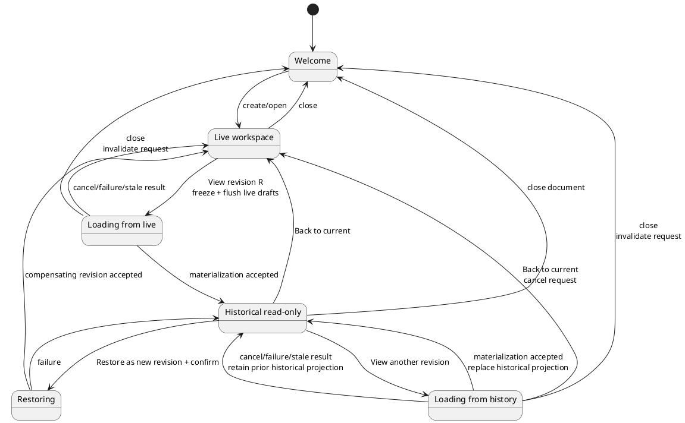
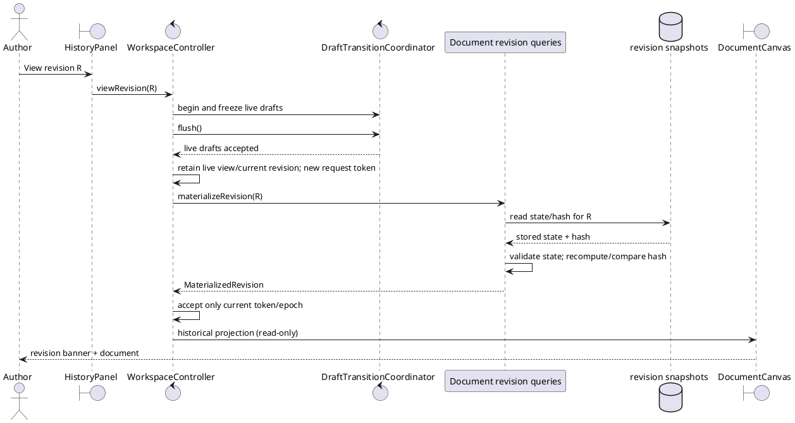
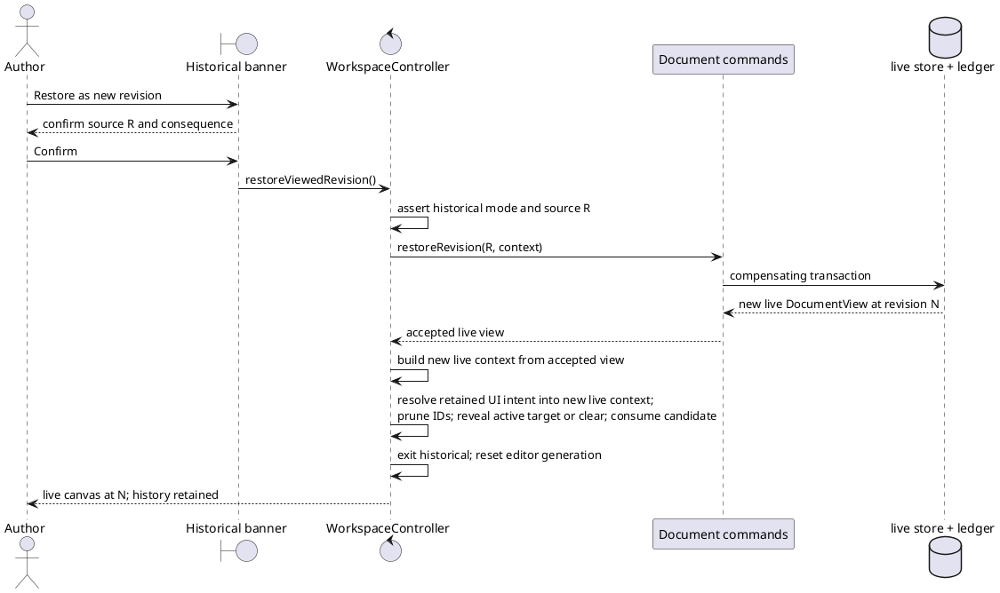

# Proposed query-first historical-view design

**Product decision:** Approved design direction.

**Implementation status:** Partial. WP-1 implements the query contracts, verified memory materialization, focused adapter tests, and explicit `available`/`host-deferred` composition wiring. Controller workspace modes, History View/Back UI, and native query parity remain proposed.

**Change package:** [Continuous workspace proposals](./README.md)

## Problem statement

The current History UI exposes `restoreRevision` as the way to materialize an older state. Restoration intentionally creates a new compensating revision, changes the live document, appends a contribution, and stores another snapshot. That behavior is correct for resuming work from an old state, but wrong for inspection.

Both adapters already retain materialized revisions:

- the memory adapter has an internal revision-to-hash-bearing-`DocumentState` map; and
- SQLite stores full `state_json` and `state_hash` rows in `snapshots`.

The standalone adapter now has a read-only query that returns one of those states without changing the live workspace or ledger. The remaining gap is to consume it through an explicit historical workspace mode and UI, then add native parity.

## Goals

1. Make **View** the primary action for a historical revision.
2. Guarantee that viewing and leaving a revision is non-mutating.
3. Render historical state through the same continuous canvas as live state.
4. Make historical mode visibly, behaviorally, and programmatically read-only.
5. Preserve restoration as an explicit compensating command.
6. Support rapid movement between revisions without stale query responses replacing newer choices.
7. Keep both standalone and Tauri adapters behind a common query contract.
8. Drive the optional navigation-only hierarchy from the same active live/historical projection as the canvas.

## Non-goals

- Editing a snapshot in place.
- Rewinding the revision counter or deleting later contributions.
- Reconstructing state through contribution replay.
- Comparing two revisions side by side in the first slice.
- Importing/exporting historical revisions in the first slice.
- Persisting historical-view canvas/navigator selection, expansion, scroll, or navigator visibility in the document file.

## Terminology

| Term | Meaning |
|---|---|
| Live state | The current accepted document state to which commands may be applied. |
| Historical materialization | An immutable clone of a stored snapshot for one prior revision. |
| View | Non-mutating query plus read-only projection. |
| Restore | Explicit command that copies historical material into a new current revision. |
| Current revision | Revision number of the live document, even while an older revision is displayed. |
| Viewed revision | Revision represented by the active historical projection. |

## Command/query separation

The gateway should distinguish reads from mutations. Exact naming can evolve, but semantic separation is mandatory.

```ts
// The first three shapes are implemented by WP-1; DocumentCommands remains design guidance.
interface MaterializedRevision {
  revision: number;
  state: DocumentState;
  stateHash: string;
  hashVerification: "verified";
}

interface DocumentRevisionQueries {
  materializeRevision(revision: number): Promise<MaterializedRevision>;
}

type RevisionQueryCapability =
  | { kind: "available"; queries: DocumentRevisionQueries }
  | { kind: "unavailable"; reason: "host-deferred" };

interface DocumentCommands {
  applyOperation(
    operation: DocumentOperation,
    context: ContributionContext,
  ): Promise<DocumentView>;

  restoreRevision(
    revision: number,
    context: ContributionContext,
  ): Promise<DocumentView>;
}
```

`materializeRevision` contract:

- accepts a nonnegative integer revision;
- rejects an unavailable revision with a specific not-found error;
- recomputes the host/schema-appropriate state hash, compares it with the stored snapshot hash, rejects a mismatch, and returns detached/immutable state only with `hashVerification: "verified"`;
- never changes the gateway's live current state;
- never increments document revision;
- never appends a contribution or snapshot;
- never changes current contributor/session attribution;
- applies the same structural/JSON/trust-boundary validation required when reading document state;
- may cache immutable results, but cache behavior is not observable.

For a staged standalone-first rollout, pass the concrete `RevisionQueryCapability` alongside the document gateway. The memory composition uses `kind: "available"`; until its native command exists, the Tauri composition uses `kind: "unavailable"` and the shared UI omits **View** while retaining its current restore behavior as a documented gap. Do not satisfy the interface with a method that only throws. The Tauri TypeScript composition must still compile, and native capability parity remains the final delivery slice.

Hash verification here detects snapshot/state inconsistency under the algorithm appropriate to that host/schema. It is not authentication, a signature, cross-adapter hash equality, or proof that an attacker did not replace both state and hash.

## Workspace state model

Do not encode this only as `DocumentView.readOnly`. A discriminated union makes command eligibility explicit.

```ts
// Proposed shape; not current source.
interface NavigatorContextState {
  navigatorSelectionId: string | null;
  navigatorExpandedIds: ReadonlySet<string>;
}

interface CanvasContextState {
  canvasContextNodeId: string | null;
  canvasExpandedIds: ReadonlySet<string>;
  scrollAnchor: string | null;
}

interface LiveWorkspaceContext {
  view: DocumentView;
  canvas: CanvasContextState;
  navigator: NavigatorContextState;
}

interface RetainedLiveWorkspaceContext {
  live: LiveWorkspaceContext;
  resumeEditorNodeId: string | null; // one-shot candidate; never mounted ownership
}

interface HistoricalWorkspaceContext {
  materialized: MaterializedRevision;
  canvas: CanvasContextState;
  navigator: NavigatorContextState;
}

type WorkspaceProjection =
  | {
      kind: "live";
      displayed: LiveWorkspaceContext;
      editorOwnerNodeId: string | null;
    }
  | {
      kind: "historical";
      displayed: HistoricalWorkspaceContext;
      retainedLive: RetainedLiveWorkspaceContext;
      currentRevision: number;
      editorOwnerNodeId: null;
    };

type RevisionRequestState =
  | { kind: "idle" }
  | {
      kind: "loading";
      requestedRevision: number;
      requestId: number;
      origin: WorkspaceProjection;
    };
```

Controller invariants:

1. Mutation commands require `kind === "live"`.
2. `currentRevision` always refers to the retained live view, not the viewed snapshot.
3. Entering historical mode does not overwrite the retained live view.
4. **Back to current** restores the retained live projection without a gateway mutation.
5. A successful restore replaces the retained live view with the returned compensating revision and exits historical mode.
6. Close clears both live and historical projections.
7. Open/create resets historical mode and any materialization cache/query epoch.
8. A loading request retains its exact origin projection. Failure/cancel returns to that origin unless a newer request/workspace epoch has superseded it.
9. Live and historical canvas/navigator contexts are distinct. The historical union member owns a `RetainedLiveWorkspaceContext`, so **Back to current** does not depend on a loading-only origin or reconstruct UI state from historical IDs.
10. `navigatorSelectionId`/`navigatorExpandedIds` are never aliases for `canvasContextNodeId`/`canvasExpandedIds`; actual DOM `focusRegion` is shell state outside the projection.
11. Preferred Navigator dock visibility plus transient `historyDockRequestedOpen`, `activeCompactAuxiliary`, and `lastExplicitAuxiliary` are shell state outside this union; changing them alone cannot change the active projection, call `materializeRevision`, or issue a document mutation. `historyVisible` is derived from dock capability plus requested/active state. Only becoming effectively visible may issue its ordinary contribution-list query, and only when no valid page is loaded or the hidden panel became stale.
12. Before historical mode, construct a fresh retained wrapper by pairing the live context with `resumeEditorNodeId` copied from actual `editorOwnerNodeId`, unmount the editor, and set actual ownership to `null`. **Back to current** or successful Restore validates and consumes that one-shot candidate, discards the wrapper, and returns to an ordinary `LiveWorkspaceContext` with no stored resume target. A later history entry derives a new candidate from then-current ownership.
13. A monotonic `historyDataGeneration` advances for every accepted change that can affect contribution rows. Every History page request captures the workspace epoch, filter epoch, request ID, and data generation; a response may replace rows or clear stale state only if all still match. Thus a response started before a hidden accepted change is ignored rather than making obsolete rows appear current.

All sets, IDs, and query-generation counters in this UI model are runtime projection/application state. They are excluded from `DocumentState`, snapshot hashes, `.coedit` persistence, recovery/Markdown/JSON exports, and contribution history. Only `navigatorDockPreferredOpen` may be retained separately as a versioned, validated, best-effort browser UI preference; it contains no document or node identity. `historyDockRequestedOpen`, `historyDataGeneration`, compact `activeCompactAuxiliary`, and `lastExplicitAuxiliary` are transient page-session state and never auto-restored.



## Entering historical mode

The query itself is non-mutating, but pending live drafts must have an unambiguous home.

Required sequence:

1. User requests **View** on revision R.
2. Controller begins the existing controlled transition and synchronously freezes live draft participants.
3. Pending title/tag/body changes are checkpointed and awaited. These saves may legitimately create live contributions because they predate the view request.
4. Controller records the now-current `LiveWorkspaceContext` and copies actual editor ownership into a fresh one-shot resume candidate.
5. Controller issues `materializeRevision(R)` as a query.
6. A request token plus workspace epoch guards against stale results.
7. On success, controller retains that wrapper, unmounts the editor, sets actual ownership to `null`, and enters historical mode with detached state.
8. On success, controller also initializes historical canvas/navigator state from compatible retained live IDs and prunes every ID missing from R.
9. On failure, controller restores the request's origin projection (live for this first request), including its exact navigator context, unfreezes drafts when appropriate, and reports the query error.
10. The materialization itself adds no contribution.



“Before viewing, save pending live edits” must be communicated in status behavior but must not be presented as the historical query modifying history.

## Adapter behavior

### Memory adapter

The existing internal revision map is the source.

- Look up exact revision.
- Clone through the JSON validation/detachment boundary.
- Recompute the browser canonical state hash and compare it with the hash recorded for that revision; reject mismatch.
- Return without assigning `current`, modifying `contributions`, or adding a revision-map entry.
- Tests must compare private state indirectly through subsequent live operations and history counts.

The current recovery export does not serialize the internal snapshot map, so only revisions available in the current runtime can be viewed after a standalone session starts. No importer is added by this proposal.

### Rust/SQLite adapter

Add a read-only store method and Tauri command, conceptually:

```text
materialize_revision(revision)
  SELECT state_json, state_hash
  FROM snapshots
  WHERE revision = ?
```

Requirements:

- use a shared/read-only connection path where practical;
- do not start a mutation transaction;
- deserialize and validate `DocumentState`;
- verify the state claims the requested revision;
- recompute the format-1 Rust state hash and compare it with `state_hash` before returning;
- do not change metadata, nodes, sessions, contributions, or snapshots;
- return a typed not-found/invalid-snapshot error.

### Tauri adapter

Map the shared query to a dedicated IPC command. Do not emulate viewing by calling `restore_revision`, exporting JSON, or temporarily replacing the open store.

## Historical UI

### History panel

- The primary row action becomes **View**.
- **Restore** is removed from ordinary row actions or demoted behind a menu; restoration is offered prominently after a revision is being viewed.
- The viewed row is highlighted and marked `Viewing`.
- Selecting another row updates the same historical canvas.
- Grouped body contributions default to viewing the group's final checkpoint; expanded checkpoints can each be viewed exactly.
- A group crossing the raw cursor-page boundary is labeled partial (`at least N`) until its exact `groupId` query has fetched all checkpoints; loaded contribution count and visible collapsed-row count remain distinct.
- Loading and failure states are independent of live mutation status.
- Where available container width preserves the canvas minimum, History is effectively visible when `historyDockRequestedOpen` is true. Otherwise it is visible only when `activeCompactAuxiliary === "history"` and uses that shared slot as a labeled `role="dialog"` with `aria-modal="true"`, traps focus, makes the workspace inert, supports `Escape`, and restores focus to the History invoker on ordinary dismissal.
- `activeCompactAuxiliary` permits only `none`, `navigator`, or `history`. The first slice requires closing one drawer before its background header toggle is reachable; keyboard/programmatic handoff closes the loser without focus-return and places focus in the winner. Breakpoint collision uses the deterministic focused-panel/`lastExplicitAuxiliary` rule in the continuous-workspace design.
- Initial contribution loading and accepted-change first-page refresh follow effective `historyVisible`, not `historyDockRequestedOpen` alone. A first reveal with no valid page queries once. Hidden History retains its page, becomes stale after relevant accepted changes, and refreshes exactly once when it next becomes visible. A hide/reveal with an already valid, non-stale page issues no query. Workspace/filter/request guards plus the captured `historyDataGeneration` reject an older in-flight response after a hidden change and prevent it from clearing stale state.

### Persistent banner

Historical mode must display a banner that cannot scroll out of awareness:

```text
Viewing revision 17 · read only · current revision is 43
[Back to current] [Restore as new revision…]
```

The banner:

- identifies both viewed and current revisions;
- uses text/iconography in addition to color;
- is announced when mode changes;
- exposes **Back to current** as the primary safe action;
- requires confirmation before restore;
- reports restore consequences: a new revision will be appended and later history retained.

### Optional navigator

When open, the navigation-only `NavigatorPanel` consumes the historical materialization currently shown by `DocumentCanvas`; it must never keep showing the retained live tree behind a historical canvas. Its title rows are plain text and its only behaviors are independent disclosure, selection/location, and focus of a read-only historical block.

- No editor, title/tag field, insertion affordance, structural menu, drag/drop, or live command is rendered.
- Opening, closing, browsing, revealing, and focusing a historical row are local UI actions and cannot call `materializeRevision` again unless the user separately chooses another revision in History.
- Navigator selection/expansion are temporary historical context. They are initialized from compatible live IDs, preserved where valid across historical revision queries, and discarded on **Back to current**.
- A docked row locate expands necessary historical canvas ancestors and scrolls without claiming canvas focus. **Focus in document** transfers focus to a read-only block handle/heading. Historical mode has no draft drain, but compact-drawer row activation still validates/reveals the target before closing the drawer and focusing it; a stale/invalid target leaves the drawer open on a valid fallback.
- Navigator and History may both dock only when their container leaves the canvas at or above its named readable minimum. Whenever either uses an overlay/drawer, they are mutually exclusive: opening either closes the other, no nested focus traps are allowed, and ordinary dismissal returns focus to that panel's own invoker. Atomic handoff suppresses the losing panel's return and moves focus directly into the winner.
- Historical mode retains the same docked/drawer, ARIA tree, focus-return, and storage-fallback behavior specified by [Optional navigator sidebar](./CONTINUOUS_BLOCK_OUTLINE.md#optional-navigator-sidebar).

### Command availability

Historical mode permits:

- scrolling, text selection, copy;
- collapse/expand as local view state;
- optional navigator disclosure, selection, locate, and read-only block focus;
- History search, paging, and viewing another revision;
- Back to current;
- explicit restore;
- close document.

Historical mode prohibits:

- title, tag, and body editing;
- create, move, reparent, reorder, delete, or direct node restore;
- document rename;
- checkpoint timers and draft participants;
- any command that implicitly targets the retained live document while the historical state is displayed.
- any navigator action that invokes title/tag/body editing or structural mutation.

Exporting the historical state is deferred unless explicitly added as a query-side use case. The first implementation should disable Export in historical mode rather than accidentally export the retained live document.

## Selection, expansion, and scroll

- Preserve the complete `LiveWorkspaceContext` (canvas context/expansion/scroll and navigator selection/expansion) inside a `RetainedLiveWorkspaceContext`, alongside a fresh one-shot `resumeEditorNodeId`. Actual `editorOwnerNodeId` becomes `null` before historical rendering.
- In historical mode, prefer the same canvas-context node ID if present and active at that revision; no editor owner exists there.
- Otherwise choose its nearest available ancestor if determinable, then the first visible root.
- Historical canvas expansion and navigator expansion are separate temporary sets, each initialized from its compatible live counterpart and pruned to the materialized state. Collapsing one never collapses the other.
- Historical `navigatorSelectionId` is independent of `canvasContextNodeId`. Tree arrowing updates only navigator selection; locate may reveal/scroll, and explicit focus updates `canvasContextNodeId` after the target exists.
- Moving among historical revisions retains the current historical `canvasContextNodeId` when possible.
- Moving among historical revisions also retains navigator selection/expansion where IDs remain active; missing IDs fall back by stable hierarchy (ancestor, next, previous, first root), never by array position.
- **Back to current** restores `retainedLive.live` after the live projection renders; the one-shot `resumeEditorNodeId` is validated against that authoritative live state before it may become actual editor ownership, then the wrapper and candidate are discarded. Shell `focusRegion` changes only when the chosen canvas focus target is ready.
- Preferred Navigator dock visibility and page-session `historyDockRequestedOpen` are not swapped with revisions. A visible dock stays mounted while its data source changes; History remains completely usable when the navigator is absent. Compact drawer visibility is transient and may close under the one-modal-panel rule when History opens.

## Restoration from historical mode

Restoration remains a command and uses the existing append-only semantics.



Exactly one restore command is issued. The controller must not first materialize by mutation, restore twice, or append a separate “viewed revision” contribution. Unlike **Back to current**, Restore does not reinstate the retained live context verbatim: it seeds a new context from `retainedLive.live` UI intent and resolves every canvas/navigator ID and scroll anchor against the accepted compensating view. A one-shot `resumeEditorNodeId` may become initial actual ownership only if it is active and visible in the rebuilt canvas projection. If its stable ID moved beneath different ancestry, expand every required canvas ancestor before mounting it; if that cannot produce a valid visible target, clear it and choose a visible fallback. Then discard the retained wrapper/candidate. Historical selection/expansion/scroll state is never copied into the new live context.

## Concurrency and stale responses

- Every materialization request carries the workspace epoch and monotonically increasing request ID.
- Viewing revision B supersedes a pending request for A.
- Closing/opening/creating a document invalidates all prior materialization requests.
- A response for a different document ID is rejected.
- Query cancellation is optional; ignoring stale results is mandatory.
- **Back to current** during a historical-origin request cancels/invalidates it and immediately restores the retained live projection; **Close** invalidates a request from either origin.
- Live commands are unavailable after historical mode is accepted. Before acceptance, the controlled transition freezes live drafts.
- If another external process changes the native file, existing single-process/locking policy applies; this proposal does not add live file watching.

## Error behavior

| Failure | Required result |
|---|---|
| Pending live draft cannot save | Remain live; do not issue historical query. |
| Revision unavailable | Restore the recorded origin projection (live or prior historical); show not-found error. |
| Snapshot invalid/hash mismatch | Restore the recorded origin projection; do not render partial state; show integrity error. |
| Stale response | Ignore silently except diagnostic logging. |
| Restore fails | Remain in historical view; retained live state stays unchanged. |
| Back to current | Cannot require a gateway mutation and should not fail after retained state exists. |
| Historical navigator target disappears between query/activation | Prune by stable ID, retain tree focus on a valid fallback, announce unavailable target, and issue no live command. |
| Navigator preference initial read is missing/malformed/denied | Default the dock preference closed; do not fail materialization or document opening. |
| Navigator preference write later fails | Retain the user's current in-memory dock choice for the session, report non-blockingly, and do not snap the UI closed. |

## Proposed tests

### Shared query contract

For every adapter that advertises `RevisionQueryCapability.kind === "available"` (memory at the standalone milestone; Tauri at package completion):

1. Materialize known revision and compare exact portable state.
2. Confirm live current revision/state is unchanged.
3. Confirm contribution and snapshot counts are unchanged.
4. Confirm returned state is detached from adapter storage.
5. Reject missing, negative, fractional, or malformed revision.
6. Reject a validly shaped snapshot whose recomputed hash differs from its stored hash.
7. Confirm later live edits still begin from the original current state.

### Controller

- flush live drafts before querying;
- no query when flush fails;
- enter historical/read-only mode on current response;
- ignore stale response after another revision/workspace request;
- failed/canceled live-origin query returns live; failed/canceled historical-origin query retains the prior historical projection;
- Back/Close during loading invalidate the request and cannot be overwritten by its eventual response;
- Back restores retained live projection without gateway call;
- Back validates and consumes the one-shot resume candidate; after any later live owner transfer, the next historical entry captures that new owner rather than reusing stale state;
- mutation commands rejected in historical mode;
- restore calls command exactly once and exits to returned live revision;
- restore failure retains historical mode;
- successful restore rebuilds live canvas/navigator/scroll context against the accepted compensating view, expands changed required ancestry for an active resume target or clears it for a visible fallback, consumes the candidate, and imports no historical UI context;
- restore fixture where the same stable resume ID has different ancestry at the target revision proves required-ancestor expansion before mount; absent/deleted target proves visible fallback and no hidden editor owner;
- canvas-context fallback and retained-live restoration, deterministic shell focus-region transitions, and zero editor owner in historical mode;
- separate live/historical navigator contexts survive success/failure/Back correctly and prune missing stable IDs;
- navigator visibility does not alter query epochs or the retained origin projection.
- effective History visibility controls initial/refresh contribution queries: first reveal without a valid page queries once; shrink/expand and Navigator handoff with a valid non-stale page issue none; hidden accepted changes advance `historyDataGeneration`, mark stale, invalidate older responses, and reappearance coalesces them into one current guarded refresh.

### UI/accessibility

- View is primary History action;
- persistent banner exposes viewed/current revision and read-only state;
- no editable surface or structural mutation control in historical mode;
- mode change announced;
- grouped row final revision and expanded checkpoint views;
- keyboard-only View, Back, and Restore confirmation;
- same canvas layout for live and historical projections;
- open and closed historical navigator paths render the displayed snapshot, never retained live nodes;
- navigator row browsing/reveal/focus remains read-only and tree selection stays distinct from canvas focus;
- docked and modal-drawer focus/keyboard behavior remains correct while switching revisions.

### Native integration

- reopen document, materialize multiple stored revisions, close without writes;
- file timestamp/size and ledger counts remain unchanged after view-only session where feasible to assert;
- malformed snapshot fails closed;
- IPC serialization matches TypeScript contract.

## Acceptance criteria

1. Viewing any available revision does not change live revision, live state, contribution count, snapshot count, or document file through the materialization query itself.
2. A returned snapshot is structurally valid, detached, and hash-verified against its stored host/schema hash before rendering; mismatch fails closed without implying authentication.
3. Historical mode is explicit and contains no reachable mutation path except confirmed compensating restoration.
4. Back to current returns to the retained live state without an adapter mutation.
5. Restore from historical mode appends exactly one new revision and retains all later history.
6. Rapid revision selection cannot display a stale result, and failure/cancel restores the exact live or historical origin projection.
7. Back/Close during loading invalidates the request and cannot be overwritten by its eventual response.
8. The continuous canvas renders live and historical states through the same node projection/components.
9. The standalone milestone passes the shared contract against memory; package completion additionally requires the Tauri adapter to pass the same contract.
10. Documentation and UI consistently use **View** for queries and **Restore** for mutation.
11. If the optional navigator is open, it renders only the active live or historical projection, exposes no mutation path, and restores the retained live navigator context on Back.
12. Navigator state changes do not mutate, query, hash, snapshot, export, or enter the document; historical navigator state is temporary and safely pruned by stable ID.
13. Restore builds a new live canvas/navigator/scroll context against the accepted compensating view, expands required changed ancestry before mounting an active editor-resume target or clears it for a visible fallback, and never copies historical UI context into live state.
14. Every historical entry derives a fresh one-shot editor-resume candidate from actual live ownership; Back and Restore validate, optionally apply, and discard it, and ordinary live state never retains it.
15. Initial and refresh contribution queries follow effective History visibility: first reveal without a valid page queries once, visibility-only transitions with a valid non-stale page issue no query, hidden accepted changes advance `historyDataGeneration` and mark the page stale, older in-flight responses cannot clear it, and the next reveal performs exactly one current guarded refresh.

## Implementation sequence

1. **Implemented (WP-1):** define verified `MaterializedRevision`, `DocumentRevisionQueries`, and the discriminated `RevisionQueryCapability`.
2. **Implemented (WP-1):** implement/test the memory query without UI changes.
3. Add `WorkspaceProjection` and command guard to the controller.
4. Add View/Back UI using the existing editor layout if necessary and qualify the standalone artifact.
5. **Implemented at the capability boundary (WP-1):** keep the Tauri composition compiling with the query capability explicitly unavailable and document that temporary host difference.
6. Add the Rust store query, IPC command, Tauri adapter, and shared contract fixtures/tests in the native parity slice.
7. Reuse the new `DocumentCanvas` when continuous outline work lands.
8. Add the optional navigator against the same `WorkspaceProjection`, with separate live/historical UI contexts and no command surface.
9. Demote direct restore and add explicit historical banner confirmation.
10. Add grouping/checkpoint expansion integration.
11. Update current architecture, persistence, sequence, RUP, traceability, testing, security, and limitations documents as each milestone becomes implemented.
