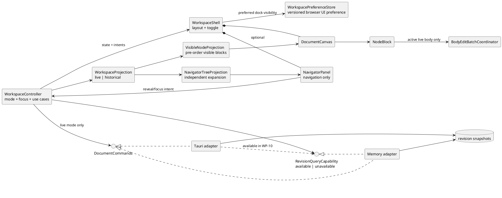
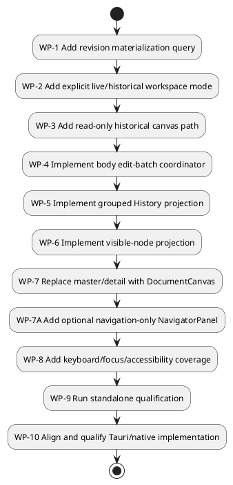

# Proposed continuous workspace change package

**Product decision:** Approved design direction.

**Implementation status:** Proposed; no part of this package is implemented.

**Purpose:** Preserve an implementation-ready design for three related UX and architecture changes so work can resume later without reconstructing product decisions from conversation history.

This package proposes:

1. replacing the current outline-plus-selected-editor master/detail workspace with a continuous block-outline canvas, with an optional navigation-only tree sidebar;
2. making historical inspection a non-mutating query, with restoration retained as a separate explicit command; and
3. replacing the fixed 1.2-second rich-text quiet-period rule with configurable, event-aware checkpoints and semantic edit groups.

The current implementation and the root engineering documents remain authoritative until this package is implemented. In particular:

- [`App`](../../src/App.tsx) still renders `Outline` beside one selected `NodeEditor`;
- [`HistoryPanel`](../../src/components/HistoryPanel.tsx) still offers restoration rather than read-only revision viewing; and
- [`RichTextEditor`](../../src/editor/RichTextEditor.tsx) still checkpoints after 1.2 seconds without a Yjs update.

## Documents in this package

| Document | Primary concern |
|---|---|
| [Continuous block-outline](./CONTINUOUS_BLOCK_OUTLINE.md) | Continuous document canvas, optional navigation-only sidebar, visible-node projections, focus, responsive/accessibility behavior, and incremental migration from master/detail |
| [Query-first historical views](./QUERY_FIRST_HISTORY.md) | CQRS-style revision materialization, explicit live/historical workspace modes, read-only UI, and restore separation |
| [Body checkpoint and commit strategy](./BODY_CHECKPOINT_STRATEGY.md) | Edit-batch state machine, configurable character/idle policies, Yjs checkpoint capture, semantic grouping, failures, and tests |

## Architectural thesis

The three changes share one principle: **the rendered workspace is a projection, not the mutable document itself**.

- The live document can be projected into a continuous list of visible blocks.
- A historical snapshot can be projected through the same canvas in read-only mode.
- Either projection can also feed an optional navigation-only tree without creating a second editor or display mode.
- Body edits can be accumulated into explicit batches before they become persisted revisions and history groups.

This remains compatible with the repository's layered React and ports/adapters architecture. It does not introduce classical MVC classes or require event sourcing.

## Patterns deliberately applied

| Pattern | Use in this package | Boundary/caution |
|---|---|---|
| Projection / Presentation Model | Convert the persisted tree into immutable visible block rows with depth/expansion metadata. | The projection never becomes the persisted hierarchy. |
| CQRS-style command/query separation | `materializeRevision` reads a snapshot; `restoreRevision` remains an attributed mutation. | This is a focused separation, not full CQRS infrastructure or event sourcing. |
| Memento | Existing full revision snapshots provide historical state for read-only inspection. | Snapshot content remains untrusted and must be validated/sanitized. |
| State pattern through discriminated unions | `WorkspaceProjection` makes live and historical command eligibility exhaustive. | A loose UI-only `readOnly` flag is insufficient. |
| Strategy | An injected `BodyCheckpointPolicy` owns threshold/timeout values. | Policy values do not belong in React components or persisted documents. |
| Explicit state machine | `BodyEditBatchCoordinator` classifies edit episodes and boundaries; a separate FIFO state tracks persistence/retry. | Capturing is synchronous, but ordinary persistence remains asynchronous. |
| Application Controller / Facade | One controller coordinates drafts, focus ownership, queries, commands, request epochs, and workspace transitions. | React blocks render/emit intent; adapters do not own UX policy. |
| Auxiliary View | `NavigatorPanel` projects the active hierarchy for location and orientation while `DocumentCanvas` remains the sole editing surface. | It is not the retired master/detail editor, must not own document commands, and may be absent without reducing core editing capability. |

## Adopted design decisions

| ID | Decision | Consequence |
|---|---|---|
| PW-01 | Render the hierarchy as a flattened pre-order projection while preserving `parentId` and `position` as the persisted structure. | Continuous layout does not require a document-format change. |
| PW-02 | Initially mount a full Tiptap/Yjs editor only for the active live block; render sanitized body previews for other blocks. | Avoids many simultaneous editors and preserves one Yjs document per node. True cross-node text selection is deferred. |
| PW-03 | Use the same `DocumentCanvas` for live and historical states. | Historical fidelity is high and a second read-only viewer cannot drift visually. |
| PW-04 | Represent live versus historical mode as a discriminated union, not only `readOnly: boolean`. | Mutation commands can be rejected structurally and by controller guards. |
| PW-05 | Materializing a historical revision is a query and must not append a contribution, increment a revision, replace live state, or write a snapshot. | History inspection becomes safe and repeatable. |
| PW-06 | Restoration remains a compensating command that creates a new live revision after explicit confirmation. | Append-only history semantics are preserved. |
| PW-07 | A body checkpoint is a persisted `updateBody` revision; an edit group is the human-visible semantic burst that may contain several checkpoints. | Recovery granularity and readable history are separated without first adding a mutable working-copy table. |
| PW-08 | Threshold checkpoints in one uninterrupted edit group share a `groupId`; semantic boundaries close the group. | History can collapse checkpoint noise while retaining exact revisions. |
| PW-09 | Body edit batching is controlled by one injectable policy object. `batchCharacterThreshold` and `idleTimeoutMs` are named values in one code location and are independently testable. | Neither value is hidden in component logic or duplicated across hosts. |
| PW-10 | Structural operations flush and await the active body batch before applying the tree command. | Operation ordering is deterministic and an editor is never removed before its pending body is captured. |
| PW-11 | Do not migrate to one document-wide ProseMirror/Yjs instance in this change package. | Scope remains incremental; document-wide selection/copy and one CRDT tree are future research. |
| PW-12 | Do not implement full event sourcing. Historical materialization reads existing per-revision snapshots. | The proposal uses data already retained by both adapters. |
| PW-13 | A collapsed body-edit group identifies its last checkpoint as the canonical viewed state and shows the exact revision range/count. | The summary is useful while expansion still exposes every physical revision. |
| PW-14 | Unmodified `Enter` inside a rich-text body remains paragraph editing; node creation uses title context, an insertion control, or a documented modified shortcut. | The block outline does not break ordinary prose editing or IME behavior. |
| PW-15 | Track canvas context, actual focus region, and editor-owner node separately; any action that would hide/remove the owner drains first and cancels on failure. | Off-canvas navigation and ancestor collapse cannot silently unmount dirty editor state or misreport DOM focus. |
| PW-16 | Materialization verifies the snapshot against its stored host/schema hash before returning it. | Historical content fails closed on mismatch, without claiming authentication or cross-adapter equality. |
| PW-17 | A loading revision request retains its exact live/historical origin projection. | Failure/cancel returns to the origin; Back/Close invalidate pending responses. |
| PW-18 | The checkpoint FIFO retains at most two detached checkpoints and freezes further body changes at the high-water mark. | Slow and failed persistence are memory-bounded and lossless. |
| PW-19 | Grouped History coalesces raw page boundaries, labels incomplete groups, and uses an exact paged group query for expansion. | A group longer than one page remains honest and fully inspectable. |
| PW-20 | Revision querying is a discriminated host capability during standalone-first rollout. | Tauri can compile with the capability unavailable; no throwing stub or false UI claim is needed. |
| PW-21 | The continuous `DocumentCanvas` is the sole editing surface; an optional `NavigatorPanel` is a navigation-only auxiliary view, not a selectable legacy master/detail mode. | There is one editor implementation and no duplicated title, tag, body, or structural-operation UI in the navigator. |
| PW-22 | Preferred dock visibility is a versioned, validated browser UI preference; compact drawer visibility and navigator selection/expansion are ephemeral workspace state. None are document state. | Toggling or browsing cannot change revision, hashes, history, exports, or `.coedit` data. Invalid initial preference reads default closed; later write failure retains the in-memory session choice. |
| PW-23 | Navigator selection is distinct from canvas context, actual focus region, and editor ownership. Browsing changes only `navigatorSelectionId`; reveal expands required canvas ancestors and scrolls, while explicit **Focus in document** uses the normal drain-before-transfer barrier. | Arrowing through the tree does not churn Tiptap instances or create checkpoint noise. |
| PW-24 | The navigator is docked when named available-width constraints are met and becomes an explicitly opened modal drawer on compact/touch layouts; `historyDockRequestedOpen`, one `activeCompactAuxiliary`, and `lastExplicitAuxiliary` make Navigator/History visibility and collision deterministic. Effective History visibility is derived from layout plus those states and alone governs its contribution queries. | A saved Navigator dock preference never auto-opens a modal; History's dock request is page-session state. Successful drawer activation validates/drains before close and target focus; failure keeps the drawer/row available. Breakpoint transitions choose the focused then last-explicit panel, capture once only if dirty-body focus actually leaves, preserve outside-app focus, and never rewrite requested visibility. First reveal without a page queries once; a valid non-stale reveal is silent; hidden changes advance a data generation, mark stale, reject older responses, and coalesce into one guarded refresh on reappearance. |
| PW-25 | The navigator consumes the active live or historical `WorkspaceProjection`; historical navigator state is temporary and read-only. Historical entry wraps the exact live UI context with a fresh one-shot editor-resume candidate; **Back to current** restores the context and consumes the candidate, while Restore derives and validates a new live context against the compensating view and also consumes it. | A historical tree cannot invoke live document commands, leak historical node IDs into live state, reuse a stale editor owner, or mount one in a hidden block; Restore expands changed required ancestry for a surviving target or chooses a visible fallback and never copies historical UI context. |

## Requirements

`FR-PW-*` is the canonical requirement namespace shared with the proposed section of the [RUP requirements artifact](../RUP_VISION_AND_USE_CASES.md#proposed-continuous-workspace-functional-requirements).

| ID | Requirement | Acceptance summary |
|---|---|---|
| FR-PW-01 | The live hierarchy shall be rendered as a pure, flattened, active-node pre-order projection with depth and expansion state. | Structure and bodies appear in document order without requiring a separate navigator or detail-editor context switch. |
| FR-PW-02 | At most one live block shall own an active Tiptap/Yjs editor in the first implementation. | Canvas context, actual focus region, and editor ownership are separate, and drain-before-unmount is proven for transfer/collapse/delete. |
| FR-PW-03 | The author shall be able to materialize any available revision through a query without mutating the live document or ledger. | Revision, hash, contribution count, snapshot count, and live state remain unchanged after View/Back. |
| FR-PW-04 | Historical mode shall be visibly and programmatically read-only. | Mutation paths are absent or disabled and controller guards reject indirect/stale commands. |
| FR-PW-05 | Restoring a viewed revision shall require an explicit action and create one compensating live revision. | View and Restore are distinct controls and use cases. |
| FR-PW-06 | Body changes shall be checkpointed at specified semantic boundaries and configured thresholds, not after a fixed 1.2-second quiet period. | State-machine tests prove every boundary and absence of per-keystroke commits. |
| FR-PW-07 | `batchCharacterThreshold` and `idleTimeoutMs` shall be easily modifiable in code. | Both live in one exported policy object/module, can be injected in tests, and have no duplicated production literals. |
| FR-PW-08 | Threshold checkpoints shall reuse one edit-group ID and History shall collapse/expand the group without hiding exact revisions, including across raw page boundaries. | Group projection, partial labeling, exact group query, and deduplication tests pass. |
| FR-PW-09 | Structural operations shall await a successfully captured pending body checkpoint before changing/removing blocks. | Ordered create/move/collapse/delete and failure-cancel tests pass. |
| FR-PW-10 | Slow or failed checkpoint persistence shall retain FIFO order and apply bounded visible backpressure. | At most two detached checkpoints are retained; retry/progress loses and reorders nothing. |
| FR-PW-11 | Adding, indenting, outdenting, reordering, selecting, collapsing, editing, and deleting nodes shall remain reachable by keyboard, pointer, and touch without hijacking normal body editing/focus navigation. | Contextual interaction and accessibility suites pass. |
| FR-PW-12 | The workspace shall offer a runtime-toggleable, default-closed navigator that renders a navigation-only tree over the active live or historical projection while the continuous canvas remains the sole editing surface. | Component tests prove there is still at most one Tiptap owner and that navigator browsing exposes no metadata/body editor, structural command, or document mutation. |
| FR-PW-13 | Navigator selection/expansion shall be modeled independently from canvas context/expansion, actual focus region, and editor ownership; layouts with enough available width shall dock it and compact/touch layouts shall present an explicitly opened accessible drawer with deterministic reveal, explicit focus transfer, focus return, and History coexistence. Its validated, versioned dock preference, page-session History dock request, and transient browsing/drawer state shall remain outside document state, hashes, snapshots, History, and exports. | State, preference, focus, resize-checkpoint, outside-focus, ARIA-tree, keyboard, mutually exclusive drawer, live/historical transition, malformed-storage, and non-persistence tests pass. |

## Work packages and dependency order

WP-1 through WP-3 can ship independently and provide immediate safe historical viewing. WP-4 should land before WP-7 so moving focus between inline blocks has a defined checkpoint boundary. WP-5 may land with WP-4 or later, but until it does History remains noisy even if persistence batching is correct. WP-7A follows the canvas/projection boundary: it must reuse controller intents and must not preserve the retired `Outline`/`NodeEditor` composition as another mode.

The first delivery milestone is standalone: memory-backed revision queries, checkpoint coordination/grouping, the continuous canvas, and its optional navigator pass their automated and double-click artifact checks. During that milestone the Tauri composition must continue to type-check/build at its frontend boundary, but it may omit the new query capability and retain documented stale behavior. WP-10 closes that intentional gap; adapters must not use throwing capability stubs merely to appear complete.

## Proposed source ownership

Names below are design targets, not files that currently exist.

| Proposed source | Responsibility |
|---|---|
| `src/application/workspaceProjection.ts` | `WorkspaceProjection` live/historical discriminated union and guards |
| `src/application/useWorkspaceController.ts` or a split of `useDocumentController.ts` | Workspace mode, revision-query capability, canvas context versus actual focus region versus editor owner, retained-live/loading origin, command eligibility, stale-query guards |
| `src/domain/visibleNodes.ts` | Pure active/collapsed pre-order projection and depth metadata |
| `src/domain/navigatorTree.ts` | Pure active-node hierarchy projection using navigator-specific expansion state; no commands or document mutation |
| `src/application/workspacePreferences.ts` | Versioned validation and best-effort browser storage for `navigatorDockPreferredOpen` only |
| `src/components/DocumentCanvas.tsx` | Continuous document surface and block collection semantics |
| `src/components/WorkspaceShell.tsx` | Responsive composition of the sole canvas and Navigator/History docks or mutually exclusive compact auxiliary dialog; Navigator dock preference, transient History dock request, toggles, deterministic breakpoint transition, focus/checkpoint handoff/return |
| `src/components/NavigatorPanel.tsx` | Navigation-only ARIA tree, selection/reveal/focus intents, live/historical labels; never mounts an editor |
| `src/components/NodeBlock.tsx` | Gutter, title, tags, body preview/editor ownership, insertion affordance |
| `src/editor/bodyCheckpointPolicy.ts` | Exported default `batchCharacterThreshold` and `idleTimeoutMs`; validation and injectable type |
| `src/editor/BodyEditBatchCoordinator.ts` | Pure/event-driven edit batching, group lifecycle, two-checkpoint FIFO/backpressure |
| `src/persistence/gateway.ts` | Discriminated revision-query capability for `materializeRevision`; exact edit-group query; command/query separation |
| `src/persistence/memoryGateway.ts` | Clone/verify a stored revision without changing `current`/history; page exact group members from the runtime ledger |
| `src-tauri/src/store.rs` | Later native parity: read-only verified snapshot lookup and indexed exact-group query without a mutating transaction |
| `src/components/HistoryPanel.tsx` | View-first action, grouped rows, exact checkpoint expansion |

These names may be adjusted during implementation, but responsibilities and dependency direction should remain.

## Delivery slices

### Slice A — safe historical viewing

- query capability and memory adapter for the standalone milestone; native adapter parity in WP-10 (capability absent, not throwing, until then);
- verified snapshot materialization, historical workspace discriminant, and origin-retaining loading state;
- History **View** action;
- read-only banner, **Back to current**, and explicit **Restore as new revision**;
- query/controller/component tests.

### Slice B — semantic checkpoints

- configurable policy module;
- transaction classifier and edit-batch state machine;
- synchronous checkpoint capture plus asynchronous serialized persistence;
- two-checkpoint backpressure, shared group IDs, page-aware grouped History projection, and exact group query;
- deterministic timer, IME, failure, and boundary tests.

### Slice C — continuous outline

- visible-node projection;
- canvas/block components;
- separate canvas-context/focus-region/editor-owner state and one-active-editor ownership;
- inline insertion and structural keyboard commands;
- live/historical reuse, accessibility, browser, and performance qualification;
- optional navigation-only hierarchy with independent selection/expansion, docked/drawer layouts, and no loss of canvas capability when closed.

## Explicit non-goals

- One global ProseMirror document spanning all nodes.
- Cross-node rich-text selection, drag-copy, or formatting in the first canvas version.
- Concurrent remote collaboration.
- Replay of the entire contribution ledger to reconstruct historical state.
- A mutable, silent working-copy database separate from the revision ledger.
- Schema migration or compatibility design solely for this proposal; assess schema impact when implementation choices are final.
- Historical editing in place. Editing an old state always begins with explicit restoration into a new live revision.
- A runtime switch back to the old outline-plus-detail editor, or any second title/tag/body editor inside the navigator.
- Structural create/move/delete commands, filtering, or full-text search in the first navigator slice; those require separate product decisions rather than silently growing a second workspace.

## Open product questions

These do not block the core architecture but must be resolved before final interaction polish:

1. Whether historical Markdown/JSON export is included in Slice A or deferred. The safe default is disabled in historical mode.
2. Which measured node/body-size and render-time budget should trigger a later virtualization design. Do not virtualize until accessibility, find, selection, and scroll behavior are specified.
3. Whether tags remain always visible or collapse to a compact line on inactive blocks.

## Resume checklist

When implementation resumes:

1. Re-read the current as-built [Architecture](../ARCHITECTURE.md), [Frontend design](../FRONTEND_DESIGN.md), [Persistence design](../PERSISTENCE_DESIGN.md), and [Known limitations](../KNOWN_LIMITATIONS.md).
2. Confirm that the executable interfaces named in this package have not changed.
3. Record any changed product decision in the decision table above before coding.
4. Implement one delivery slice at a time; do not combine the document-wide editor experiment with this package.
5. Keep current and proposed diagrams clearly labeled until each slice is actually reachable; do not present the optional navigator as a legacy editor mode.
6. Add tests listed in each detailed design before changing status from **Proposed**.
7. Update root traceability, RUP use cases, UI/UX, sequences, and the limitation register as each slice becomes implemented.

## Completion rule

This package is complete only when:

- all three detailed documents' acceptance criteria pass;
- current documentation no longer describes master/detail, restore-only history, or the 1.2-second timer as current behavior;
- standalone and native adapters pass the relevant shared query and checkpoint contracts;
- historical inspection is demonstrably non-mutating; and
- the generated standalone artifact passes keyboard, focus, navigator, responsive/touch, timer, history, and recovery smoke tests.
